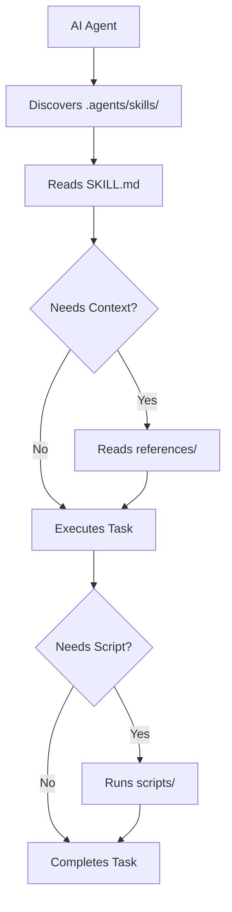
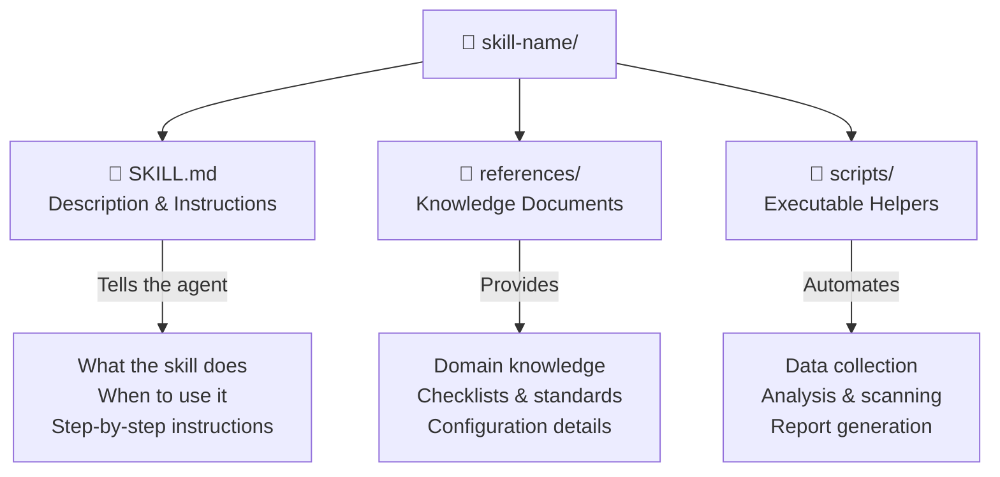

# `.agents/` — Vendor-Neutral Skill Library

This directory provides a **vendor-neutral skill library** following the [`.agents/` convention](https://github.com/anthropics/agent-skills-spec). Unlike `.claude/` (Claude-specific) or `.codex/` (Codex-specific), skills defined here work with **any AI coding tool** that supports the `.agents/` discovery protocol — including Claude Code, GitHub Copilot, OpenAI Codex, Google Gemini CLI, and others.

## Directory Structure

```
.agents/
└── skills/
    ├── generate-reports/
    │   ├── SKILL.md              — Skill description + instructions
    │   ├── references/
    │   │   └── report-types.md   — Knowledge: available report types
    │   └── scripts/
    │       └── generate_reports.py  — Executable: report generation
    ├── health-check/
    │   ├── SKILL.md
    │   ├── references/
    │   │   └── health-checks.md  — Knowledge: health check definitions
    │   └── scripts/
    │       └── health_check.py   — Executable: health check runner
    ├── run-tests/
    │   ├── SKILL.md
    │   ├── references/
    │   │   └── test-markers.md   — Knowledge: pytest markers & filters
    │   └── scripts/
    │       └── run_tests.sh      — Executable: test runner wrapper
    └── security-review/
        ├── SKILL.md
        ├── references/
        │   └── checklist.md      — Knowledge: security review checklist
        └── scripts/
            └── scan_secrets.sh   — Executable: secret scanner
```

## How It Works



## Skill Anatomy

Every skill follows the same three-part structure:



| Component | Purpose | Format |
|-----------|---------|--------|
| `SKILL.md` | Entry point — describes the skill, when to use it, and step-by-step instructions | Markdown with structured sections |
| `references/` | Supporting knowledge documents the agent reads for context | Markdown files |
| `scripts/` | Executable helpers the agent can run to perform actions | Python, Bash, or any executable |

### SKILL.md Structure

Each `SKILL.md` follows a consistent format:

```markdown
---
name: skill-name
description: One-line description
tags: [keyword1, keyword2]
---

# Skill Name

## Description
What this skill does and when to use it.

## Instructions
Step-by-step guide for the AI agent to follow.

## References
Pointers to files in references/ for additional context.
```

## Available Skills

| Skill | Directory | Description | Scripts |
|-------|-----------|-------------|---------|
| **Generate Reports** | `generate-reports/` | Generate execution summaries, agent performance analytics, workflow reports, and an HTML dashboard with charts | `generate_reports.py` |
| **Health Check** | `health-check/` | Run system health checks — verify agent availability, adapter connectivity, configuration validity, and service status | `health_check.py` |
| **Run Tests** | `run-tests/` | Execute the project test suite with optional filtering by pytest marker or file path | `run_tests.sh` |
| **Security Review** | `security-review/` | Review code for security vulnerabilities — hardcoded secrets, injection risks, authentication gaps, and unsafe patterns | `scan_secrets.sh` |

## Skill Discovery

AI agents discover skills through a standard protocol:

1. **Scan** — Agent checks for `.agents/skills/` in the project root
2. **Enumerate** — Each subdirectory is a skill; its name is the directory name
3. **Read** — Agent reads `SKILL.md` to understand the skill's purpose and instructions
4. **Load Context** — If the task requires deeper knowledge, the agent reads files in `references/`
5. **Execute** — If automation is needed, the agent runs scripts from `scripts/`

This discovery mechanism is automatic — agents that support the `.agents/` convention will find and use these skills without explicit configuration.

## Creating a New Skill

### Step 1: Create the Directory

```bash
mkdir -p .agents/skills/<skill-name>/{references,scripts}
```

### Step 2: Write SKILL.md

Create `.agents/skills/<skill-name>/SKILL.md` with:
- A YAML frontmatter block (`name`, `description`, `tags`)
- A **Description** section explaining what and when
- An **Instructions** section with step-by-step guidance
- A **References** section pointing to knowledge docs

### Step 3: Add Reference Documents

Place supporting knowledge in `references/`:
- Checklists, standards, configuration schemas
- Domain-specific guidelines the agent should follow
- Any context that helps the agent make better decisions

### Step 4: Add Scripts (Optional)

Place executable helpers in `scripts/`:
- Use `#!/usr/bin/env python3` or `#!/usr/bin/env bash` shebangs
- Make scripts executable: `chmod +x .agents/skills/<skill-name>/scripts/*.sh`
- Scripts should accept arguments and produce structured output (JSON preferred)
- Include error handling and meaningful exit codes

### Step 5: Test the Skill

Ask any supported AI agent to use the skill:
```
Run the <skill-name> skill
```

The agent should discover the skill, read `SKILL.md`, and execute accordingly.

## Relationship to `.claude/skills/`

The `.claude/skills/` directory contains Claude-specific skill templates (Markdown guides for patterns and best practices). The `.agents/skills/` directory contains **executable, vendor-neutral skills** with scripts and references.

The project-level skills (`generate-reports`, `health-check`, `run-tests`) exist in **both** locations:
- `.claude/skills/<skill>/SKILL.md` — Claude-specific entry point
- `.agents/skills/<skill>/` — Vendor-neutral version with full `references/` and `scripts/`

This dual presence ensures skills work whether the developer uses Claude Code or any other AI coding tool.

## Related Files

| Path | Purpose |
|------|---------|
| `.claude/skills/` | Claude-specific skill templates (Markdown patterns and best practices) |
| `.claude/agents/` | Claude-specific sub-agent definitions |
| `.codex/agents/` | Codex-specific agent configurations |
| `AGENTS.md` | Shared agent instructions (tool-agnostic, imported by CLAUDE.md) |
