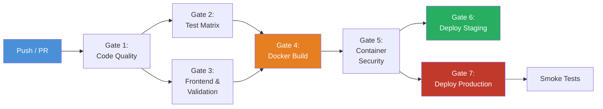
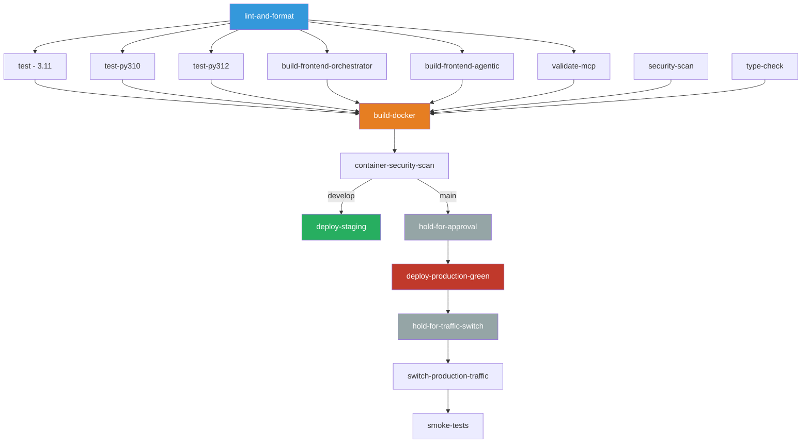

# `.circleci/` — CI/CD Pipeline Configuration

This directory contains the [CircleCI](https://circleci.com/) pipeline configuration for the AI Coding Tools Orchestrator project. The pipeline covers linting, testing across a Python version matrix, security scanning, Docker builds, and blue-green deployments to staging and production.

## Pipeline Overview

The `config.yml` (637 lines) defines a multi-gate pipeline that progresses from code quality checks through testing, building, and deployment. Every push and PR triggers the pipeline; deployments are branch-gated (`develop` → staging, `main` → production with manual approval).

### Pipeline Flow



### Job Dependency Graph



## Jobs

| Job | Executor | Gate | Description |
|-----|----------|------|-------------|
| `lint-and-format` | python 3.11 | 1 | Black format check, isort import order, Flake8 lint |
| `type-check` | python 3.11 | 1 | MyPy type checking across all modules |
| `security-scan` | python 3.11 | 1 | Bandit security lint + pip-audit dependency vulnerability scan |
| `test` | python 3.11 | 2 | Full pytest suite with coverage (XML + HTML), JUnit results |
| `test-py310` | python 3.10 | 2 | Pytest on Python 3.10 (compatibility) |
| `test-py312` | python 3.12 | 2 | Pytest on Python 3.12 (forward compatibility) |
| `build-frontend-orchestrator` | node 20.11 | 3 | Build Orchestrator UI frontend (npm) |
| `build-frontend-agentic` | node 20.11 | 3 | Build Agentic Team UI frontend (npm) |
| `validate-mcp` | python 3.11 | 3 | Validate MCP server imports, REPL, dashboard routes, context systems |
| `build-docker` | base (DinD) | 4 | Build + verify + push Docker image to registry |
| `container-security-scan` | base (DinD) | 5 | Trivy scan for HIGH/CRITICAL container vulnerabilities |
| `deploy-staging` | python 3.11 | 6 | Deploy all 4 services to staging via kubectl, run health checks |
| `deploy-production-green` | python 3.11 | 7 | Deploy green replicas to production (blue-green) |
| `switch-production-traffic` | python 3.11 | 7 | Patch Kubernetes services to route traffic to green, scale down blue |
| `smoke-tests` | python 3.11 | 7 | Post-deploy validation: import checks + context system verification |
| `hold-for-approval` | — | 7 | Manual approval gate before production deployment |
| `hold-for-traffic-switch` | — | 7 | Manual approval gate before switching production traffic |

## Service Deployment Matrix

All 4 services are deployed to both staging and production via Kubernetes:

| Service | Port | Staging Deployment | Production Deployment | Health Check |
|---------|------|--------------------|-----------------------|--------------|
| Orchestrator | 5001 | `ai-orchestrator-blue` | `ai-orchestrator-green` (blue-green) | `/health` |
| Agentic Team | 5002 | `agentic-team-blue` | `agentic-team-green` (blue-green) | `/health` |
| MCP Server | 8000 | `mcp-server` | `mcp-server-green` (blue-green) | import validation |
| Context Dashboard | 5003 | `context-dashboard` | `context-dashboard-green` (blue-green) | `/health` |

Production uses **blue-green deployment**: green replicas are scaled up, traffic is switched via Kubernetes service selector patches, then blue replicas are scaled to zero.

## Orbs & Executors

**Orbs** (pre-packaged integrations):
- `circleci/docker@2.2.0` — Docker build and push
- `circleci/kubernetes@1.3.1` — kubectl installation
- `circleci/python@2.1.1` — Python environment
- `circleci/node@5.2.0` — Node.js environment
- `circleci/slack@4.12.1` — Slack notifications (pass/fail)

**Executors**: `python-executor` (3.11), `python-310`, `python-312`, `node-executor` (20.11), `docker-executor` (base).

## Environment Variables

Required environment variables (set in CircleCI project settings):

| Variable | Purpose |
|----------|---------|
| `DOCKER_USERNAME` | Docker registry username for image push |
| `DOCKER_PASSWORD` | Docker registry password/token |
| `KUBE_CONFIG_STAGING` | Base64-encoded kubeconfig for staging cluster |
| `KUBE_CONFIG_PROD` | Base64-encoded kubeconfig for production cluster |
| `SLACK_ACCESS_TOKEN` | Slack bot token for pipeline notifications |
| `SLACK_DEFAULT_CHANNEL` | Slack channel for notifications |

Built-in CircleCI variables used: `CIRCLE_BRANCH`, `CIRCLE_SHA1`, `CIRCLE_BUILD_NUM`.

## Reusable Commands

The config defines 6 reusable commands to reduce duplication:

| Command | Purpose |
|---------|---------|
| `install-python-deps` | Install Python deps with pip cache (keyed on `requirements.txt` checksum) |
| `activate-venv` | Source the virtualenv into `$BASH_ENV` |
| `persist-workspace` | Persist workspace for downstream jobs |
| `attach-workspace` | Attach workspace + activate venv |
| `notify-slack-success` | Send ✅ Slack notification with branch/build/commit info |
| `notify-slack-failure` | Send ❌ Slack notification with branch/build/commit info |

## Customization Guide

### Adding a New Job

1. Define the job under the `jobs:` section with an executor and steps.
2. Add it to the `build-test-deploy` workflow with appropriate `requires:` dependencies.
3. Add branch `filters:` if the job should only run on specific branches.

### Changing the Python Test Matrix

Add a new executor and test job:

```yaml
executors:
  python-313:
    docker:
      - image: cimg/python:3.13
    resource_class: medium

jobs:
  test-py313:
    executor: python-313
    steps:
      - checkout
      - install-python-deps
      - activate-venv
      - run:
          name: "pytest — Python 3.13"
          command: |
            pytest tests/ \
              --override-ini="addopts=" \
              -q --timeout=30 \
              -m "not integration and not slow"
```

Then add `test-py313` to the workflow with `requires: [lint-and-format]` and add it to the `build-docker` requires list.

### Adding a New Deployment Target

1. Create a new deploy job following the `deploy-staging` pattern.
2. Add the corresponding `KUBE_CONFIG_<ENV>` environment variable.
3. Wire it into the workflow with the appropriate approval gates and branch filters.

## Related Documentation

- [DEPLOYMENT.md](../DEPLOYMENT.md) — Full deployment guide
- [ARCHITECTURE.md](../ARCHITECTURE.md) — System architecture
- [Dockerfile](../Dockerfile) — Container build definition
- [docker-compose.yml](../docker-compose.yml) — Local development setup
