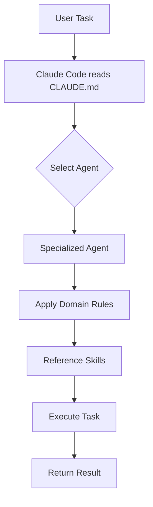
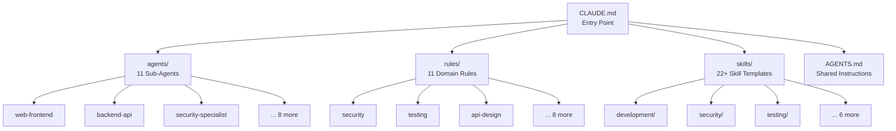

# `.claude/` — Claude Code Configuration

This directory configures [Claude Code](https://docs.anthropic.com/en/docs/claude-code) (Anthropic's AI coding assistant) for the AI Coding Tools Orchestrator project. It provides specialized agents, domain rules, and reusable skill templates that shape how Claude understands and works within this codebase.

## Directory Structure

```
.claude/
├── CLAUDE.md              — Entry-point instructions (imports AGENTS.md)
├── settings.json          — Project-level Claude settings
├── settings.local.json    — Local overrides (git-ignored)
├── agents/                — 11 specialized sub-agents
├── rules/                 — 11 domain-specific rules
└── skills/                — 22+ reusable skill templates (6+ categories)
```

## How It Works

**`CLAUDE.md`** is the entry point Claude Code reads when it opens this project. It defines:
- Build, test, lint, and format commands
- Architecture boundaries (`orchestrator/` and `agentic_team/` are fully independent)
- Key directories and file patterns
- Code style rules (Python 3.8+, Black, isort, type hints)

`CLAUDE.md` imports the root-level `AGENTS.md`, which provides the full agent catalog, skill library, MCP tool inventory, and graph context system documentation.





## Agents

Specialized sub-agents handle domain-specific tasks. Each agent is a Markdown file in `agents/` defining the agent's role, expertise, and instructions.

| Agent | File | Domain | Capabilities |
|-------|------|--------|-------------|
| AI/ML Engineer | `ai-ml-engineer.md` | AI/ML | ML pipelines, embeddings, LLM integration, model optimization |
| Backend API | `backend-api.md` | Backend | REST APIs, GraphQL, databases, Flask/FastAPI, microservices |
| Code Reviewer | `code-reviewer.md` | Quality | Code review, best practices, architecture feedback |
| Database Architect | `database-architect.md` | Data | Schema design, query optimization, migrations, data modeling |
| DevOps Infrastructure | `devops-infrastructure.md` | DevOps | Docker, Kubernetes, CI/CD, cloud infrastructure |
| Documentation Writer | `documentation-writer.md` | Docs | API docs, architecture docs, tutorials, READMEs |
| Mobile Developer | `mobile-developer.md` | Mobile | iOS, Android, React Native, Flutter, cross-platform |
| Performance Engineer | `performance-engineer.md` | Performance | Profiling, load testing, optimization, benchmarking |
| Security Specialist | `security-specialist.md` | Security | OWASP, vulnerability analysis, secure coding, audits |
| Test Runner | `test-runner.md` | Testing | Test execution, failure diagnosis, coverage analysis |
| Web Frontend | `web-frontend.md` | Frontend | React, Vue, CSS, accessibility, responsive design |

### Invoking Agents

Reference an agent by filename (without `.md`) using the `@` prefix:

```
@web-frontend Review this component for accessibility
@security-specialist Audit this authentication code
@backend-api Design REST endpoints for user management
@code-reviewer Review this PR for best practices
```

## Rules

Domain-specific rules in `rules/` enforce coding standards and best practices. Claude automatically applies relevant rules based on the task context.

| Rule | File | Enforces |
|------|------|----------|
| Adapters | `adapters.md` | Adapter pattern conventions, `BaseAdapter` interface compliance |
| AI/ML | `ai-ml.md` | ML pipeline standards, embedding practices, model versioning |
| API Design | `api-design.md` | REST conventions, endpoint naming, request/response patterns |
| CI/CD | `ci-cd.md` | Pipeline configuration, build/test/deploy stage standards |
| Config | `config.md` | Configuration management, YAML format, environment handling |
| Database | `database.md` | Schema design, query safety, migration patterns |
| Frontend | `frontend.md` | Component structure, accessibility, responsive design |
| Observability | `observability.md` | Logging, metrics, health checks, monitoring patterns |
| Performance | `performance.md` | Optimization guidelines, profiling, caching strategies |
| Security | `security.md` | Input validation, auth patterns, secret management, OWASP |
| Testing | `testing.md` | Test structure, markers, coverage requirements, fixtures |

## Skills

Reusable skill templates in `skills/` provide patterns and best practices. Skills are organized by category and referenced during task execution.

### Development Skills (6)

| Skill | File | Description |
|-------|------|-------------|
| React Components | `development/react-components.md` | Component patterns, hooks, state management |
| REST API Design | `development/rest-api-design.md` | Endpoint design, status codes, pagination |
| Python Async | `development/python-async.md` | async/await patterns, concurrency, event loops |
| Database Queries | `development/database-queries.md` | Query optimization, parameterized queries, ORMs |
| GraphQL | `development/graphql-development.md` | Schema design, resolvers, subscriptions |
| Error Handling | `development/error-handling.md` | Exception hierarchies, retry patterns, graceful degradation |

### Security Skills (4)

| Skill | File | Description |
|-------|------|-------------|
| Authentication | `security/authentication.md` | JWT, OAuth, session management, MFA |
| Input Validation | `security/input-validation.md` | Sanitization, Pydantic models, injection prevention |
| Secure Coding | `security/secure-coding.md` | OWASP Top 10, secret handling, dependency safety |
| Vulnerability Assessment | `security/vulnerability-assessment.md` | CVE scanning, threat modeling, risk analysis |

### Testing Skills (4)

| Skill | File | Description |
|-------|------|-------------|
| Unit Testing | `testing/unit-testing.md` | pytest patterns, fixtures, mocking, assertions |
| Integration Testing | `testing/integration-testing.md` | Cross-module tests, test databases, API testing |
| TDD | `testing/test-driven-development.md` | Red-green-refactor, test-first workflow |
| Performance Testing | `testing/performance-testing.md` | Load testing, benchmarking, profiling tests |

### AI/ML Skills (3)

| Skill | File | Description |
|-------|------|-------------|
| Embeddings & Retrieval | `ai-ml/embeddings-retrieval.md` | Vector search, similarity, embedding models |
| LLM Integration | `ai-ml/llm-integration.md` | API integration, prompt design, token management |
| RAG Pipelines | `ai-ml/rag-pipeline.md` | Retrieval-augmented generation, chunking, indexing |

### DevOps Skills (3)

| Skill | File | Description |
|-------|------|-------------|
| Docker | `devops/docker-containerization.md` | Dockerfile best practices, multi-stage builds |
| CI/CD Pipelines | `devops/ci-cd-pipelines.md` | GitHub Actions, Jenkins, automated deployments |
| Kubernetes | `devops/kubernetes-deployment.md` | Pod specs, services, Helm charts, scaling |

### Documentation Skills (3)

| Skill | File | Description |
|-------|------|-------------|
| API Documentation | `documentation/api-documentation.md` | OpenAPI specs, endpoint docs, code examples |
| Architecture Docs | `documentation/architecture-docs.md` | System design, diagrams, decision records |
| Code Documentation | `documentation/code-documentation.md` | Docstrings, inline comments, type annotations |

### Project Skills (3)

These are executable skills with `SKILL.md` descriptors, also mirrored in `.agents/skills/`:

| Skill | Directory | Description |
|-------|-----------|-------------|
| Generate Reports | `generate-reports/` | Generate execution summaries, dashboards, and analytics |
| Health Check | `health-check/` | Run system health checks and agent availability tests |
| Run Tests | `run-tests/` | Execute the test suite with optional filtering |

## Adding New Components

### Add a New Agent

1. Create `.claude/agents/<agent-name>.md`
2. Define the agent's role, domain expertise, and behavioral instructions
3. Reference applicable rules and skills within the agent definition
4. Update `AGENTS.md` to include the agent in the catalog table

### Add a New Rule

1. Create `.claude/rules/<domain>.md`
2. Define standards, patterns to enforce, and anti-patterns to flag
3. Rules are automatically applied by Claude based on file context

### Add a New Skill

1. Choose the appropriate category directory under `.claude/skills/`
2. Create `.claude/skills/<category>/<skill-name>.md`
3. Include: purpose, when to use, patterns/templates, examples, and anti-patterns
4. For executable skills, create a directory with `SKILL.md`, `references/`, and `scripts/`
5. Update `AGENTS.md` skill catalog

## Related Files

| File | Purpose |
|------|---------|
| `AGENTS.md` (project root) | Shared instructions imported by CLAUDE.md — agent catalog, MCP tools, context system |
| `.agents/skills/` | Vendor-neutral skill library (works with any AI coding tool) |
| `.codex/agents/` | Codex-specific agent configurations (`.toml` format) |
