# Agentic Infrastructure

> [!NOTE]
> **Enterprise-Grade AI Agent Support System**

This document describes the comprehensive agentic infrastructure that powers the AI Coding Tools platform. Beyond the core Orchestrator and Agentic Team engines, we provide a complete ecosystem of specialized agents, skills, MCP tools, and a graph-based context system that enables AI agents to learn and improve over time.

---

## Table of Contents

- [Overview](#overview)
- [Architecture](#architecture)
- [Specialized Agents](#specialized-agents)
- [Skills Library](#skills-library)
- [MCP Tools](#mcp-tools)
- [Graph Context System](#graph-context-system)
  - [Project-Scoped Context](#project-scoped-context)
  - [Portability and Multi-Project Support](#portability-and-multi-project-support)
- [Domain Rules](#domain-rules)
- [Integration](#integration)
- [Best Practices](#best-practices)
- [Production Readiness](#production-readiness)

---

## Overview

The AI Coding Tools platform provides not just orchestration capabilities, but a complete **agentic infrastructure** that empowers AI agents to accomplish any development task effectively. This infrastructure includes:

```mermaid
graph TB
    subgraph "🧠 Agentic Infrastructure"
        direction TB

        subgraph "Specialized Agents"
            WEB[Web Frontend]
            API[Backend API]
            SEC[Security]
            DEVOPS[DevOps]
            AIML[AI/ML]
            DB[Database]
            MOBILE[Mobile]
            PERF[Performance]
            DOCS[Documentation]
        end

        subgraph "Skills Library"
            DEV_SKILLS[Development Skills]
            TEST_SKILLS[Testing Skills]
            SEC_SKILLS[Security Skills]
            OPS_SKILLS[DevOps Skills]
            ML_SKILLS[AI/ML Skills]
            DOC_SKILLS[Documentation Skills]
        end

        subgraph "MCP Tools"
            CODE_TOOLS[Code Analysis]
            SEC_TOOLS[Security Scanning]
            TEST_TOOLS[Testing Utils]
            OPS_TOOLS[DevOps Tools]
            CTX_TOOLS[Context Memory]
        end

        subgraph "Graph Context System"
            GRAPH[(Graph Store)]
            EMBED[Embeddings]
            BM25[BM25 Index]
            HYBRID[Hybrid Search]
        end
    end

    subgraph "🤖 AI Agents"
        CLAUDE[Claude]
        CODEX[Codex]
        GEMINI[Gemini]
        COPILOT[Copilot]
        OLLAMA[Ollama]
        LLAMA[llama.cpp]
    end

    WEB & API & SEC --> CLAUDE & CODEX
    DEV_SKILLS & TEST_SKILLS --> GEMINI & COPILOT
    CODE_TOOLS & SEC_TOOLS --> OLLAMA & LLAMA
    GRAPH --> HYBRID
    HYBRID --> CTX_TOOLS
```

### Key Capabilities

| Capability | Description | Components |
|------------|-------------|------------|
| **Domain Expertise** | 9 specialized agents covering all development domains | `.claude/agents/`, `.codex/agents/` |
| **Reusable Skills** | 22 skills across 6 categories for common tasks | `.claude/skills/` |
| **MCP Integration** | 34+ tools for code analysis, security, testing, DevOps | `mcp_server/tools/` |
| **Persistent Memory** | Graph-based context with hybrid search | `orchestrator/context/` |
| **Domain Rules** | Best practices and coding standards | `.claude/rules/`, `.codex/rules/` |

---

## Architecture

### Component Overview

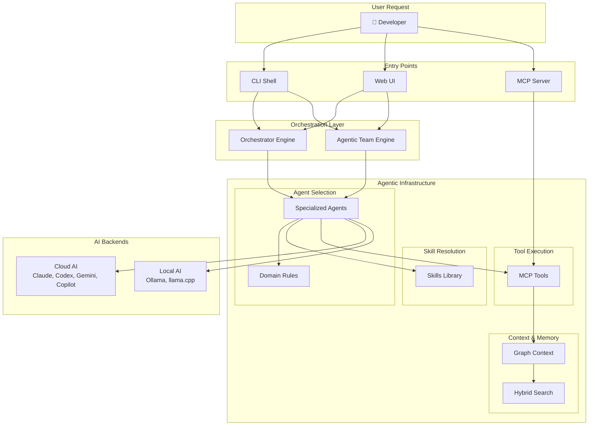

### Directory Structure

```
AI-Coding-Tools-Collaborative/
├── .claude/
│   ├── agents/              # 9 specialized Claude agents
│   │   ├── web-frontend.md
│   │   ├── backend-api.md
│   │   ├── security-specialist.md
│   │   ├── devops-infrastructure.md
│   │   ├── ai-ml-engineer.md
│   │   ├── database-architect.md
│   │   ├── mobile-developer.md
│   │   ├── performance-engineer.md
│   │   └── documentation-writer.md
│   ├── skills/              # 22 reusable skills
│   │   ├── development/     # 6 development skills
│   │   ├── testing/         # 4 testing skills
│   │   ├── security/        # 4 security skills
│   │   ├── devops/          # 3 DevOps skills
│   │   ├── ai-ml/           # 3 AI/ML skills
│   │   └── documentation/   # 3 documentation skills
│   └── rules/               # Domain-specific rules
│       ├── security.md
│       ├── database.md
│       ├── api-design.md
│       ├── performance.md
│       └── ai-ml.md
├── .codex/
│   ├── agents/              # 9 specialized Codex agents (TOML)
│   └── rules/               # Codex domain rules
├── orchestrator/
│   └── context/             # Graph context system
│       ├── schemas.py       # Node & edge types
│       ├── graph_store.py   # SQLite + FTS5
│       ├── embeddings.py    # Sentence transformers
│       ├── bm25_index.py    # BM25 keyword search
│       ├── hybrid_search.py # RRF fusion search
│       └── memory_manager.py# High-level API
└── mcp_server/
    └── tools/               # 5 MCP tool modules
        ├── code_analysis.py # 4 code analysis tools
        ├── security_tools.py# 4 security tools
        ├── testing_tools.py # 4 testing tools
        ├── devops_tools.py  # 5 DevOps tools
        └── context_tools.py # 7 context memory tools
```

---

## Specialized Agents

The platform provides 9 specialized agents, each with deep domain expertise:

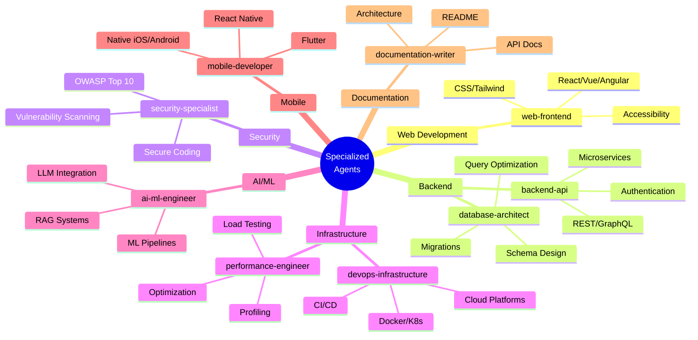

### Agent Capabilities Matrix

| Agent | Languages | Frameworks | Specializations |
|-------|-----------|------------|-----------------|
| **web-frontend** | JS/TS, CSS | React, Vue, Angular, Svelte | Components, State, A11y |
| **backend-api** | Python, Go, Node | FastAPI, Express, Django | REST, GraphQL, gRPC |
| **security-specialist** | All | All | OWASP, Pen Testing, Audits |
| **devops-infrastructure** | YAML, HCL | Docker, K8s, Terraform | CI/CD, Cloud, IaC |
| **ai-ml-engineer** | Python | PyTorch, LangChain, FAISS | ML Ops, RAG, Embeddings |
| **database-architect** | SQL | PostgreSQL, MySQL, MongoDB | Schema, Indexing, Scaling |
| **mobile-developer** | Dart, JS, Swift | Flutter, RN, SwiftUI | Cross-platform, Native |
| **performance-engineer** | All | k6, Locust, cProfile | Profiling, Caching, CDN |
| **documentation-writer** | Markdown | OpenAPI, Mermaid | API Docs, Diagrams |

### Usage Examples

```bash
# Claude with specialized agent
claude -a security-specialist "Review this authentication code"
claude -a backend-api "Design a REST API for user management"
claude -a ai-ml-engineer "Build a RAG pipeline with vector search"

# Codex with specialized agent
codex --agent devops-infrastructure "Create Kubernetes deployment"
codex --agent database-architect "Optimize this slow query"
```

---

## Skills Library

Skills are reusable templates that guide AI agents through specific tasks:

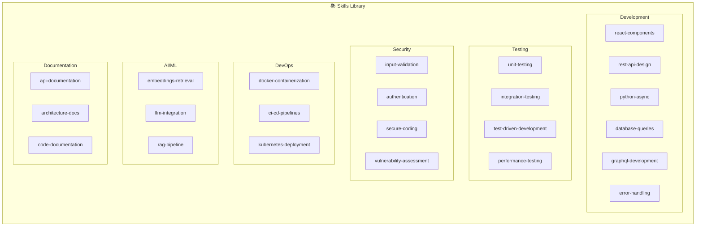

### Skill Structure

Each skill follows a consistent structure:

```markdown
# Skill Name

## Purpose
What this skill accomplishes.

## Triggers
Keywords that activate this skill.

## Steps
1. Step-by-step instructions
2. With concrete guidance
3. And verification steps

## Examples
Code examples and patterns.

## Best Practices
Guidelines for effective use.

## Related Skills
Links to complementary skills.
```

### Skills by Category

#### Development Skills (6)
| Skill | Description |
|-------|-------------|
| `react-components` | Build React components with hooks and best practices |
| `rest-api-design` | Design RESTful APIs following conventions |
| `python-async` | Write async Python code properly |
| `database-queries` | Write optimized SQL queries |
| `graphql-development` | Build GraphQL schemas and resolvers |
| `error-handling` | Implement proper error handling |

#### Testing Skills (4)
| Skill | Description |
|-------|-------------|
| `unit-testing` | Write comprehensive unit tests |
| `integration-testing` | Create integration tests for APIs |
| `test-driven-development` | Follow TDD methodology |
| `performance-testing` | Write load and performance tests |

#### Security Skills (4)
| Skill | Description |
|-------|-------------|
| `input-validation` | Validate and sanitize user inputs |
| `authentication` | Implement secure auth patterns |
| `secure-coding` | Follow secure coding practices |
| `vulnerability-assessment` | Assess and fix vulnerabilities |

#### DevOps Skills (3)
| Skill | Description |
|-------|-------------|
| `docker-containerization` | Create optimized Docker images |
| `ci-cd-pipelines` | Build CI/CD workflows |
| `kubernetes-deployment` | Deploy to Kubernetes clusters |

#### AI/ML Skills (3)
| Skill | Description |
|-------|-------------|
| `embeddings-retrieval` | Work with embeddings and vectors |
| `llm-integration` | Integrate LLMs into applications |
| `rag-pipeline` | Build RAG pipelines |

#### Documentation Skills (3)
| Skill | Description |
|-------|-------------|
| `api-documentation` | Generate OpenAPI/Swagger docs |
| `architecture-docs` | Create architecture documentation |
| `code-documentation` | Write code comments and docstrings |

---

## MCP Tools

The Model Context Protocol (MCP) server provides 34+ tools across 5 categories:

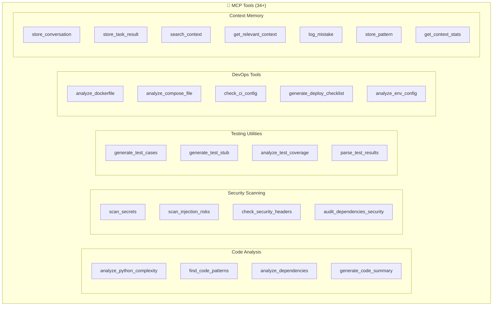

### Tool Categories

#### Code Analysis Tools
```yaml
analyze_python_complexity:
  description: "Analyze cyclomatic complexity and code metrics"
  inputs: [file_path]
  outputs: [complexity_score, functions, classes, metrics]

find_code_patterns:
  description: "Detect design patterns and anti-patterns"
  inputs: [directory, patterns_to_find]
  outputs: [patterns_found, locations, suggestions]

analyze_dependencies:
  description: "Analyze project dependencies and relationships"
  inputs: [project_path]
  outputs: [dependencies, versions, conflicts, updates]

generate_code_summary:
  description: "Generate natural language summary of code"
  inputs: [file_path]
  outputs: [summary, key_functions, dependencies]
```

#### Security Tools
```yaml
scan_secrets:
  description: "Scan code for hardcoded secrets and credentials"
  inputs: [directory, patterns]
  outputs: [secrets_found, severity, locations]

scan_injection_risks:
  description: "Detect SQL injection and XSS vulnerabilities"
  inputs: [file_path, language]
  outputs: [vulnerabilities, severity, remediation]

check_security_headers:
  description: "Verify HTTP security headers configuration"
  inputs: [url_or_config]
  outputs: [headers_present, headers_missing, recommendations]

audit_dependencies_security:
  description: "Audit dependencies for known vulnerabilities"
  inputs: [requirements_file]
  outputs: [vulnerabilities, severity, updates_available]
```

#### Testing Tools
```yaml
generate_test_cases:
  description: "Generate test cases for functions/classes"
  inputs: [code, framework]
  outputs: [test_cases, edge_cases, mocks]

generate_test_stub:
  description: "Generate test file skeleton"
  inputs: [source_file, test_framework]
  outputs: [test_file_content]

analyze_test_coverage:
  description: "Analyze and report test coverage"
  inputs: [coverage_file]
  outputs: [coverage_percent, uncovered_lines, recommendations]
```

#### DevOps Tools
```yaml
analyze_dockerfile:
  description: "Analyze Dockerfile for best practices"
  inputs: [dockerfile_path]
  outputs: [issues, optimizations, security_concerns]

check_ci_config:
  description: "Validate CI/CD configuration"
  inputs: [config_file, platform]
  outputs: [valid, errors, suggestions]

generate_deploy_checklist:
  description: "Generate deployment checklist"
  inputs: [environment, deployment_type]
  outputs: [checklist_items, pre_deploy, post_deploy]
```

#### Context Memory Tools
```yaml
store_conversation:
  description: "Store conversation in context memory"
  inputs: [content, metadata]
  outputs: [conversation_id]

search_context:
  description: "Search context using hybrid search"
  inputs: [query, limit]
  outputs: [results, scores]

log_mistake:
  description: "Log mistake for future learning"
  inputs: [error_description, context, correction]
  outputs: [mistake_id]
```

---

## Graph Context System

The Graph Context System provides persistent memory with intelligent retrieval:

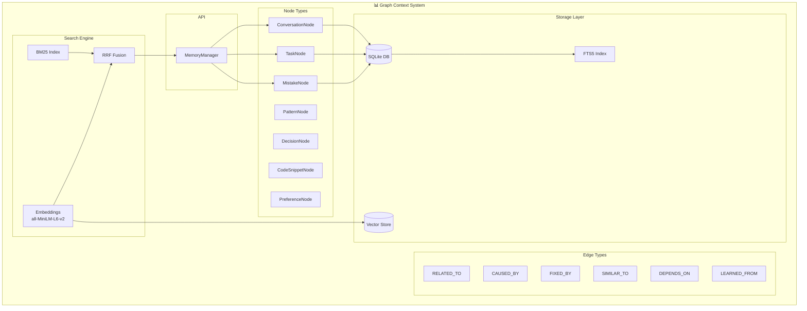

<p align="center">
  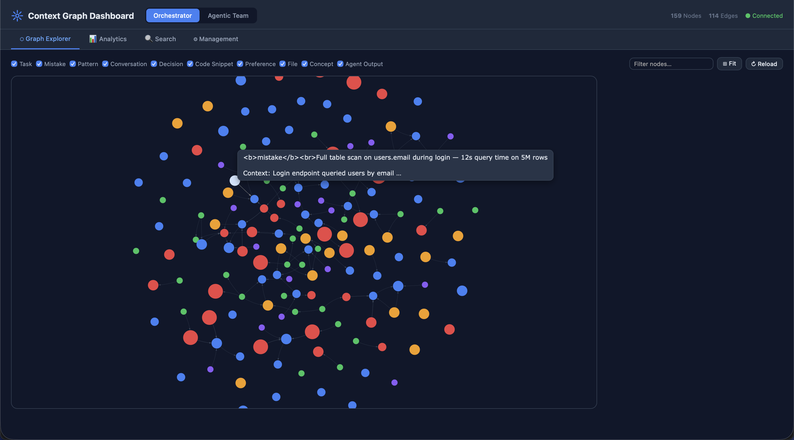
</p>

### Node Types

| Type | Purpose | Key Fields |
|------|---------|------------|
| `ConversationNode` | Store past conversations | content, metadata |
| `TaskNode` | Record completed tasks | task_description, outcome, success |
| `MistakeNode` | Log errors for learning | error_description, context, correction |
| `PatternNode` | Store recognized patterns | pattern_type, examples |
| `DecisionNode` | Record architectural decisions | decision, rationale |
| `CodeSnippetNode` | Store useful code snippets | language, code, purpose |
| `PreferenceNode` | Store user preferences | preference_type, value |
| **File** | `FILE` | Source file metadata (path, language, size, framework) |
| **Concept** | `CONCEPT` | Abstract concepts and domain knowledge |
| **Project** | `PROJECT` | Registered project roots with scan metadata and detected tech stack |

### Edge Types

| Type | Description | Example |
|------|-------------|---------|
| `RELATED_TO` | General relationship | Task ↔ Conversation |
| `CAUSED_BY` | Error causation | Mistake → Root Cause |
| `FIXED_BY` | Solution relationship | Mistake → Fix |
| `SIMILAR_TO` | Semantic similarity | Task ↔ Task |
| `DEPENDS_ON` | Dependency | Task → Prerequisite |
| `LEARNED_FROM` | Learning source | Pattern → Source |
| `PRECEDED_BY` | Temporal ordering | Event → Previous |
| `FOLLOWED_BY` | Temporal ordering | Event → Next |

### Hybrid Search

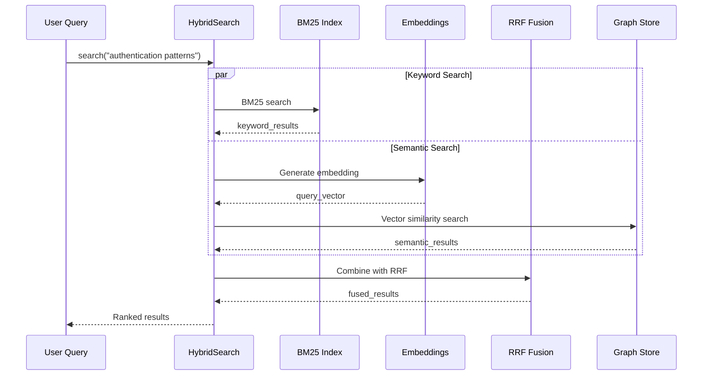

### Usage Example

```python
from orchestrator.context import MemoryManager

# Initialize
manager = MemoryManager()

# Store task result
task_id = manager.store_task(
    task_description="Implement JWT authentication",
    outcome="completed",
    success=True,
    metadata={"duration": 120}
)

# Log mistake for learning
manager.log_mistake(
    error_description="Used wrong endpoint format",
    context="REST API implementation",
    correction="Use /api/v1/resource instead of /resource"
)

# Search for relevant context
results = manager.search("authentication best practices", limit=5)

# Get formatted context for prompts
context = manager.get_relevant_context("how to implement login", limit=3)
```

### Project-Scoped Context

The context system supports project-scoped isolation, enabling multi-project operation without context bleed between different codebases.

**How it works:**

1. **Registration**: When `PROJECT_PATH` is set (env var or config), the engine calls `register_project(path)` at startup
2. **Scanning**: `ProjectScanner` walks the directory tree, detecting languages, frameworks, and structure
3. **ID Generation**: `project_id = SHA-256[:16](normalized_absolute_path)` — deterministic and idempotent
4. **Node Tagging**: All project-related nodes carry `project_id`; global knowledge uses `project_id=""`
5. **Query Filtering**: All queries can filter by `project_id` to scope results

```python
from orchestrator.context import MemoryManager

manager = MemoryManager()

# Register a project (idempotent — safe to call repeatedly)
pid = manager.register_project("/path/to/my-project")

# Get project-scoped context for a task
context = manager.get_project_context(pid, task="Add authentication")

# Rescan after major changes (atomic delete + rebuild)
manager.rescan_project("/path/to/my-project")

# Clean up a project's graph entirely
manager.delete_project_graph(pid)
```

### Portability and Multi-Project Support

The system is designed for full portability. When users clone the project and set it up locally:

1. **Configure project path**: Set `PROJECT_PATH=/path/to/their/project` or update `settings.project_path` in the config YAML
2. **Automatic scanning**: On first engine startup, the project is scanned and its context graph is built
3. **Multi-project support**: Each project path produces a unique `project_id`; graphs are fully isolated
4. **No project mode**: If no project path is configured, the system operates in task-only mode with global context

**Configuration examples:**

```bash
# Via environment variable (recommended for CI/CD and containers)
export PROJECT_PATH=/home/user/my-webapp
./ai-orchestrator shell

# Via config YAML
# orchestrator/config/agents.yaml
settings:
  project_path: "/home/user/my-webapp"
```

**Multi-project isolation guarantee:**
- Each project's nodes are tagged with its unique `project_id`
- Queries filter by `project_id` — no cross-project contamination
- Global knowledge (universal patterns, reference data) uses `project_id=""` and is shared across all projects
- `delete_project_graph(pid)` removes only that project's nodes in a single atomic transaction

---

## Domain Rules

Domain rules provide best practices and coding standards:

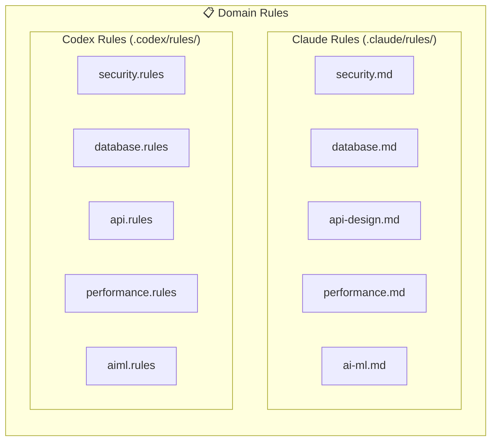

### Rule Categories

| Category | Topics Covered |
|----------|----------------|
| **Security** | Input validation, authentication, secrets management, secure coding |
| **Database** | Schema design, indexing, query optimization, migrations |
| **API Design** | REST conventions, versioning, error handling, documentation |
| **Performance** | Profiling, caching, async patterns, memory management |
| **AI/ML** | Data handling, model development, embeddings, RAG pipelines |

---

## Integration

### Automatic Context Storage

Both engines automatically store task results:

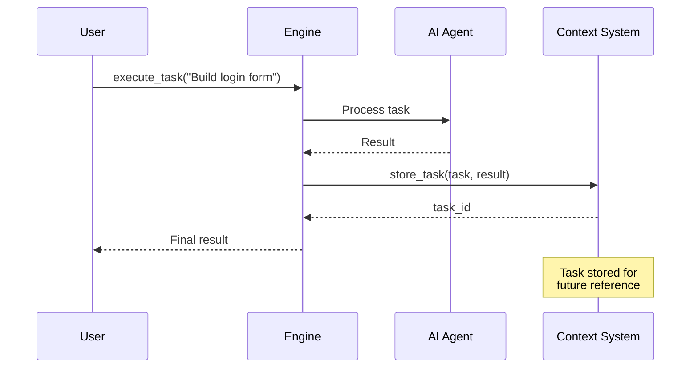

### Context-Aware Execution

Agents can retrieve relevant context:

```python
from orchestrator.core import OrchestratorEngine

engine = OrchestratorEngine()

# Get relevant context before executing
context = engine.get_relevant_context("authentication patterns")

# Execute with context awareness
result = engine.execute_task(
    f"Build login system. Previous context:\n{context}"
)
```

### MCP Configuration

Configure MCP servers in `.mcp.json`:

```json
{
  "mcpServers": {
    "ai-orchestrator": {
      "command": "python",
      "args": ["-m", "mcp_server.server"],
      "env": {
        "PYTHONPATH": "${workspaceFolder}",
        "ORCHESTRATOR_CONTEXT_DB": "${workspaceFolder}/.context/context.db"
      }
    }
  }
}
```

---

## Best Practices

### 1. Choose the Right Agent

Match agent expertise to the task:

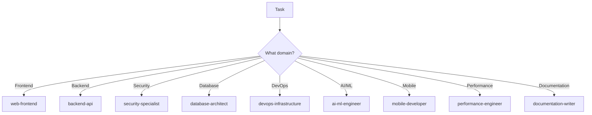

### 2. Leverage Skills

Invoke relevant skills for consistent results:

```bash
# Skills activate automatically based on context
claude "Create a React component with unit tests"
# → Uses: react-components, unit-testing

claude "Build secure REST API with authentication"
# → Uses: rest-api-design, authentication, input-validation
```

### 3. Use Context System

Store and retrieve context for learning:

```python
# Log mistakes to prevent repetition
manager.log_mistake(
    error_description="Forgot input validation",
    context="User registration endpoint",
    correction="Always validate with Pydantic models"
)

# Retrieve context before similar tasks
context = manager.search("user registration validation")
```

### 4. Apply Domain Rules

Rules are automatically applied based on file type and task:

- Security rules → Authentication, authorization, secrets
- Database rules → Schema changes, queries, migrations
- API rules → Endpoint design, versioning, errors
- Performance rules → Optimization tasks, profiling
- AI/ML rules → Model development, embeddings, RAG

### 5. Combine Capabilities

Use multiple components together:

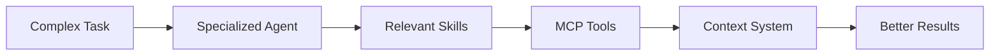

---

## Summary

The AI Coding Tools Agentic Infrastructure provides:

| Component | Count | Purpose |
|-----------|-------|---------|
| Specialized Agents | 9 | Domain expertise |
| Skills | 22 | Reusable task templates |
| MCP Tools | 34+ | Code analysis, security, testing, DevOps |
| Node Types | 7 | Context storage |
| Edge Types | 12 | Relationship tracking |
| Domain Rules | 10 | Best practices |

This comprehensive infrastructure enables AI agents to:

✅ Accomplish any development task effectively
✅ Learn from past mistakes and successes
✅ Apply domain-specific best practices
✅ Maintain context across sessions
✅ Provide consistent, high-quality results

---

## Production Readiness

The platform codebase has achieved production-grade quality through a comprehensive overhaul.

### Quality Standards

| Metric | Value |
|--------|-------|
| **Pylint Score** | 10.00 / 10 (perfect — zero warnings) |
| **Test Suite** | 386 tests passing |
| **Pre-commit Hooks** | 15/15 passing (black, isort, flake8, mypy, bandit, pyupgrade, …) |
| **Warnings Eliminated** | 520 across the entire codebase |

### Enforced Patterns

All production code enforces:

- **Lazy log formatting** — `logger.info("msg %s", val)` instead of f-strings in log calls
- **Explicit encoding** — every `open()` call uses `encoding="utf-8"`
- **No stray `print()`** — all output routed through `logging`
- **Docstring-only abstract methods** — no `pass` or `...` in abstract bodies
- **Annotated subprocess calls** — pylint disable comments where context managers aren't feasible
- **Pydantic compatibility** — `FieldInfo` false positives suppressed inline

### Pylint Configuration

The pylint config in `pyproject.toml` follows a strict philosophy: **suppress intentional design-pattern violations; fix everything else**. Suppressed codes include `R0801` (duplicate-code across independent systems), `R0902`/`R0917` (domain dataclass fields), `C0415` (lazy imports), `W0718` (broad error boundaries), `R0914` (complex algorithms), `W0613` (interface conformance), and `W0603` (singleton patterns). Similarity analysis requires 8+ matching lines and ignores imports, docstrings, and comments.

See [ARCHITECTURE.md](ARCHITECTURE.md#code-quality--production-readiness) for the full quality configuration reference.

---

*For detailed documentation, see:*
- [Specialized Agents](docs/specialized-agents.md)
- [Skills Library](docs/skills-library.md)
- [Context System](docs/context-system.md)
- [MCP Server](MCP.md)
