# Agentic Team Documentation

## Table of Contents

- [Overview](#overview)
- [Why It Exists](#why-it-exists)
- [Separation from Orchestrator](#separation-from-orchestrator)
- [Core Concepts](#core-concepts)
- [Role Model](#role-model)
- [Execution Lifecycle](#execution-lifecycle)
- [Communication Protocol](#communication-protocol)
- [Communication Examples](#communication-examples)
- [Configuration Model](#configuration-model)
- [UI: Agentic Team Studio](#ui-agentic-team-studio)
- [CLI: Agentic Team REPL](#cli-agentic-team-repl)
- [Local Model Integration and Limits](#local-model-integration-and-limits)
- [Validation and Failure Handling](#validation-and-failure-handling)
- [Observability](#observability)
- [Security and Safety](#security-and-safety)
- [Extension Guide](#extension-guide)
- [Operational Commands](#operational-commands)
- [Package Structure](#package-structure)
- [MCP Integration (Optional)](#mcp-integration-optional)
- [Context System](#context-system)
  - [Obsidian Vault Export](#obsidian-vault-export)

## Overview

`AGENTIC_TEAM` is a standalone runtime for true role-based multi-agent collaboration. It is not a workflow preset inside the orchestrator. The runtime simulates an autonomous software team where roles communicate by passing scoped messages and subtasks.

The default team includes:
- `project_manager` (team lead and final gatekeeper)
- `software_architect`
- `software_developer`
- `qa_engineer`
- `devops_engineer`

Each role is mapped to any enabled model adapter from `orchestrator/config/agents.yaml` and is intentionally model-agnostic.

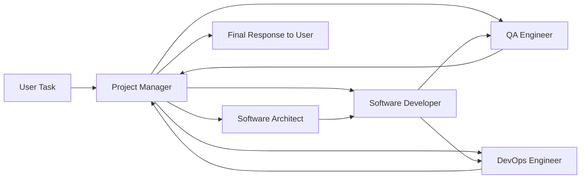
```mermaid
flowchart LR
    U[User Task] --> PM[Project Manager]
    PM --> A[Software Architect]
    PM --> D[Software Developer]
    PM --> Q[QA Engineer]
    PM --> O[DevOps Engineer]

    A --> D
    D --> Q
    Q --> PM
    O --> PM
    D --> O

    PM --> R[Final Response to User]
```

<p align="center">
  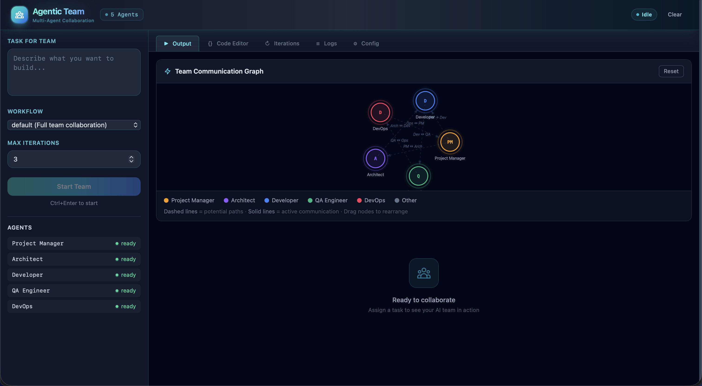
</p>

## Why It Exists

The orchestrator is optimized for predefined workflow execution. `AGENTIC_TEAM` is optimized for open-ended inter-role delegation where:
- routing is chosen by the AI role at runtime,
- inter-role communication is first-class,
- the team lead controls finalization,
- all role-to-model bindings are configurable.

## Separation from Orchestrator

The project keeps strict boundary lines between both systems.

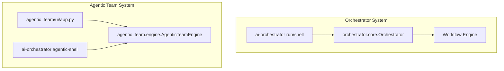
```mermaid
flowchart TB
    subgraph Orchestrator System
        OCLI[ai-orchestrator run/shell]
        OCore[orchestrator.core.Orchestrator]
        OWF[Workflow Engine]
    end

    subgraph Agentic Team System
        AUI[agentic_team/ui/app.py]
        ACore[agentic_team.engine.AgenticTeamEngine]
        AShell[ai-orchestrator agentic-shell]
    end

    OCLI --> OCore --> OWF
    AUI --> ACore
    AShell --> ACore
```

Separation guarantees:
- No agentic-team logic embedded into orchestrator workflow execution.
- No orchestrator workflow dependency for agentic team turns.
- Independent UI backend (`agentic_team/ui/app.py`) and independent CLI REPL (`agentic-shell`).

## Core Concepts

1. `Role`: domain responsibility (PM, architect, developer, QA, DevOps).
2. `Agent`: concrete model adapter backing a role (`claude`, `codex`, `gemini`, `copilot`, local adapters).
3. `Turn`: one role receives a message, reasons, and emits one decision.
4. `Decision`: either:
- `message` (handoff to another role)
- `finalize` (lead role only; emits user response)
5. `Team Transcript`: ordered list of role-to-role turns.

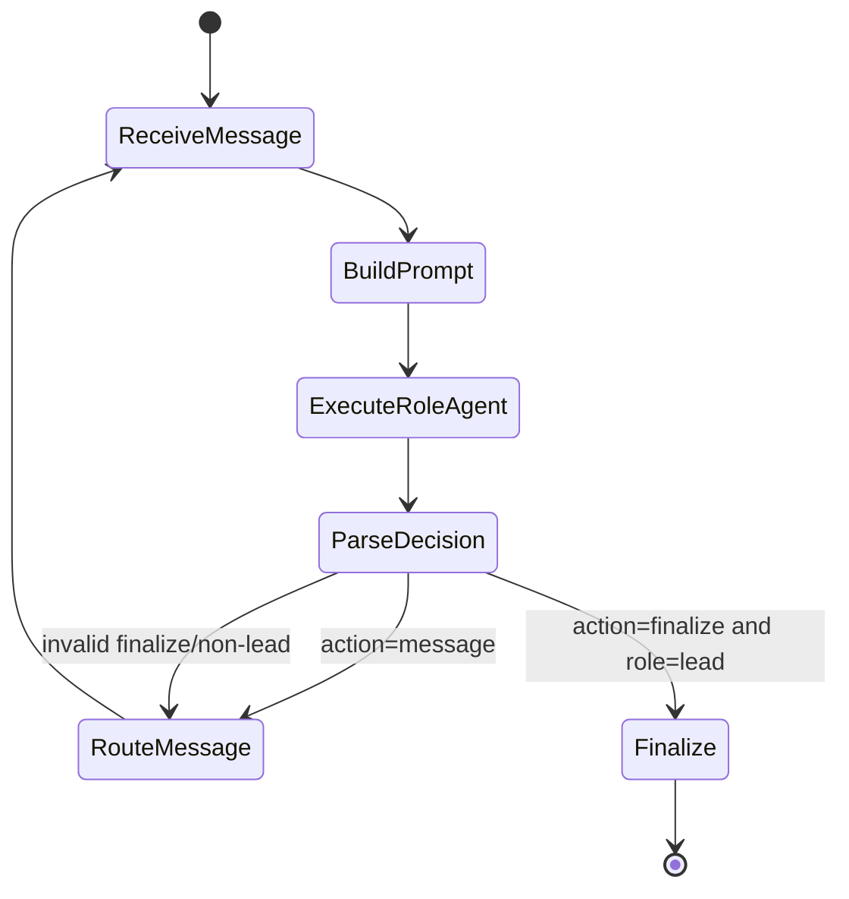
```mermaid
stateDiagram-v2
    [*] --> ReceiveMessage
    ReceiveMessage --> BuildPrompt
    BuildPrompt --> ExecuteRoleAgent
    ExecuteRoleAgent --> ParseDecision
    ParseDecision --> RouteMessage: action=message
    ParseDecision --> Finalize: action=finalize and role=lead
    ParseDecision --> RouteMessage: invalid finalize/non-lead
    RouteMessage --> ReceiveMessage
    Finalize --> [*]
```

## Role Model

The team is configurable but defaults are generated if mappings are absent.

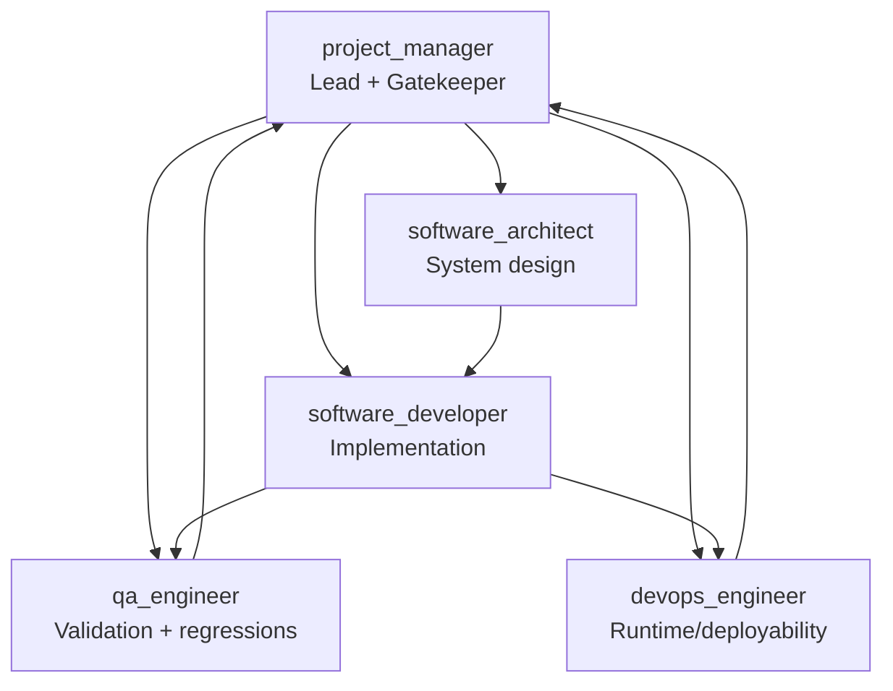
```mermaid
graph TD
    PM[project_manager\nLead + Gatekeeper]
    SA[software_architect\nSystem design]
    SD[software_developer\nImplementation]
    QA[qa_engineer\nValidation + regressions]
    DO[devops_engineer\nRuntime/deployability]

    PM --> SA
    PM --> SD
    PM --> QA
    PM --> DO

    SA --> SD
    SD --> QA
    QA --> PM
    SD --> DO
    DO --> PM
```

Role responsibilities matrix:

| Role | Main Responsibility | Typical Outgoing Messages |
|------|----------------------|---------------------------|
| `project_manager` | Initiation, prioritization, acceptance | Architecting, implementation, verification, finalization |
| `software_architect` | Design constraints, interfaces, decomposition | Implementation guidance to developer/PM |
| `software_developer` | Code generation and code changes | Validation request to QA, deployability request to DevOps |
| `qa_engineer` | Test strategy, defects, regressions | Bug report back to developer/PM, release signal to PM |
| `devops_engineer` | Runtime, environment, deployment concerns | Operability feedback to PM/developer |

## Execution Lifecycle

A task starts at `lead_role` and loops until finalization or max turns.

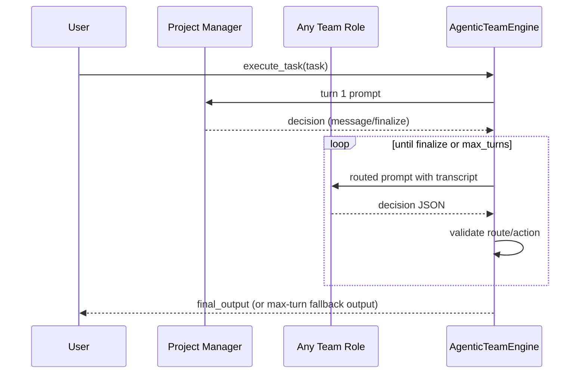
```mermaid
sequenceDiagram
    participant U as User
    participant PM as Project Manager
    participant R as Any Team Role
    participant E as AgenticTeamEngine

    U->>E: execute_task(task)
    E->>PM: turn 1 prompt
    PM-->>E: decision (message/finalize)

    loop until finalize or max_turns
        E->>R: routed prompt with transcript
        R-->>E: decision JSON
        E->>E: validate route/action
    end

    E-->>U: final_output (or max-turn fallback output)
```

Turn payload (normalized):

```yaml
turn: 3
action: message
from_role: software_developer
to_role: qa_engineer
from_agent: codex
to_agent: gemini
message: "Implementation complete. Validate edge cases and regressions."
communication_type: inter_role
success: true
```

## Communication Protocol

Each role receives:
- original user task,
- roster and role bindings,
- recent transcript window,
- incoming message from previous role.

Each role returns strict JSON:

```json
{
  "action": "message | finalize",
  "to_role": "<role name when action=message>",
  "message": "<handoff content>",
  "final_response": "<required when lead finalizes>"
}
```

Route semantics:

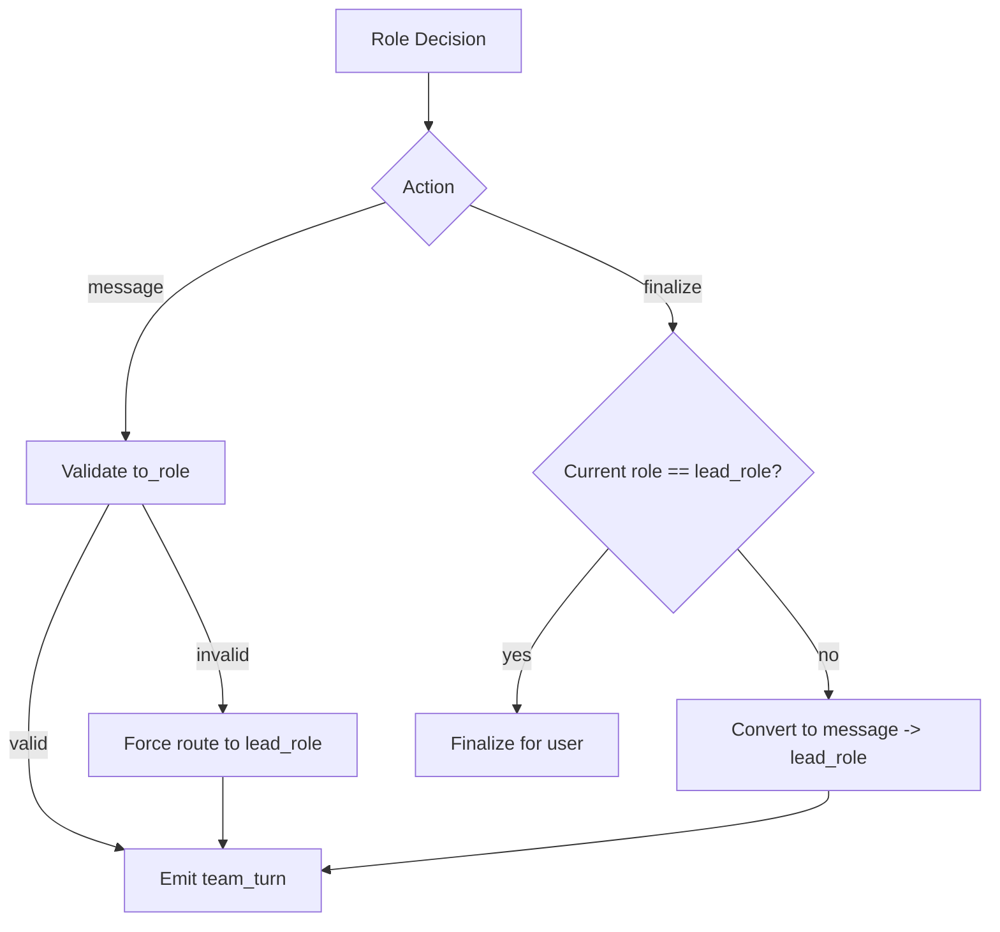
```mermaid
flowchart TD
    D[Role Decision] --> A{Action}
    A -->|message| B[Validate to_role]
    A -->|finalize| C{Current role == lead_role?}

    B -->|valid| E[Emit team_turn]
    B -->|invalid| F[Force route to lead_role]

    C -->|yes| G[Finalize for user]
    C -->|no| H[Convert to message -> lead_role]

    F --> E
    H --> E
```

## Communication Examples

The examples below mirror what the runtime emits through `team_turn`, `team_communication`, and logs.

### Example A: Normal Implementation Handoff

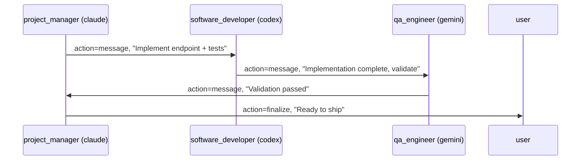
```mermaid
sequenceDiagram
    participant PM as project_manager (claude)
    participant DEV as software_developer (codex)
    participant QA as qa_engineer (gemini)
    participant USER as user

    PM->>DEV: action=message, "Implement endpoint + tests"
    DEV->>QA: action=message, "Implementation complete, validate"
    QA->>PM: action=message, "Validation passed"
    PM->>USER: action=finalize, "Ready to ship"
```

Example per-turn payloads:

```json
{
  "turn": 1,
  "action": "message",
  "from_role": "project_manager",
  "to_role": "software_developer",
  "from_agent": "claude",
  "to_agent": "codex",
  "message": "Implement endpoint + tests",
  "communication_type": "inter_role",
  "success": true
}
```

```json
{
  "turn": 4,
  "action": "finalize",
  "from_role": "project_manager",
  "to_role": "user",
  "from_agent": "claude",
  "to_agent": "user",
  "message": "Validation complete and approved",
  "success": true
}
```

### Example B: Invalid Non-Lead Finalize Is Auto-Corrected

If a non-lead role tries to finalize, runtime rewrites it to a lead-directed message.

Input decision from developer:

```json
{
  "action": "finalize",
  "final_response": "Done"
}
```

Normalized routing outcome:

```json
{
  "action": "message",
  "to_role": "project_manager",
  "message": "Done"
}
```

### Example C: UI Live Communication Event

Socket event emitted to UI:

```json
{
  "event": "team_communication",
  "timestamp": "2026-02-27T19:45:21.531Z",
  "turn": 2,
  "action": "message",
  "from_role": "software_developer",
  "to_role": "qa_engineer",
  "from_agent": "codex",
  "to_agent": "gemini",
  "message": "Please validate edge cases and regressions.",
  "success": true
}
```

How graph edges aggregate in UI:

```text
project_manager -> software_developer : 1x
software_developer -> qa_engineer     : 2x
qa_engineer -> project_manager        : 1x
project_manager -> user               : finalize
```

### Example D: Repetition Escalation Safety

When the same route+message pattern repeats over the configured threshold, the engine escalates to lead:

```json
{
  "action": "message",
  "from_role": "software_developer",
  "to_role": "project_manager",
  "message": "Still implementing.\n\n[System] Repetition detected in team routing. Escalating to lead for decision."
}
```

## Configuration Model

`AGENTIC_TEAM` lives under `agentic_team` in `orchestrator/config/agents.yaml`.

```yaml
agentic_team:
  lead_role: "project_manager"
  max_turns: 12
  roles:
    project_manager:
      title: "Project Manager (Team Lead)"
      agent: "claude"
      responsibilities: "Initiate work, route subtasks, and perform final approval."
    software_architect:
      title: "Software Architect"
      agent: "gemini"
      responsibilities: "Define architecture and technical design."
    software_developer:
      title: "Software Developer"
      agent: "codex"
      responsibilities: "Implement and update source code."
    qa_engineer:
      title: "QA Engineer"
      agent: "gemini"
      responsibilities: "Validate behavior and identify regressions."
    devops_engineer:
      title: "DevOps Engineer"
      agent: "claude"
      responsibilities: "Handle deployment, runtime, and operational concerns."
```

Config behavior:
- Missing `agentic_team` section: defaults are generated.
- Missing role mappings: defaults are merged.
- Invalid mappings (role -> unavailable agent): execution is blocked until corrected.

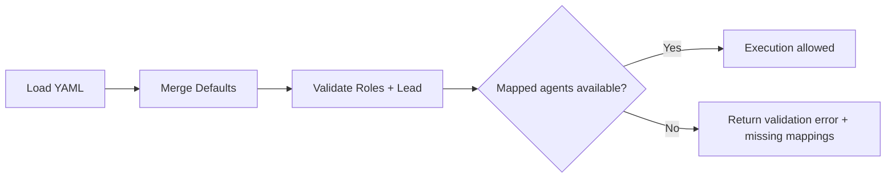
```mermaid
flowchart LR
    C[Load YAML] --> D[Merge Defaults]
    D --> V[Validate Roles + Lead]
    V --> A{Mapped agents available?}
    A -->|Yes| R[Execution allowed]
    A -->|No| B[Return validation error + missing mappings]
```

## UI: Agentic Team Studio

The standalone UI is served by `agentic_team/ui/app.py`.

Key capabilities:
- Live communication timeline
- Live communication graph with directed edges
- Guided config editor (form-based, no YAML editor)
- Runtime logs for each routed handoff
- Conversation memory with follow-up mode

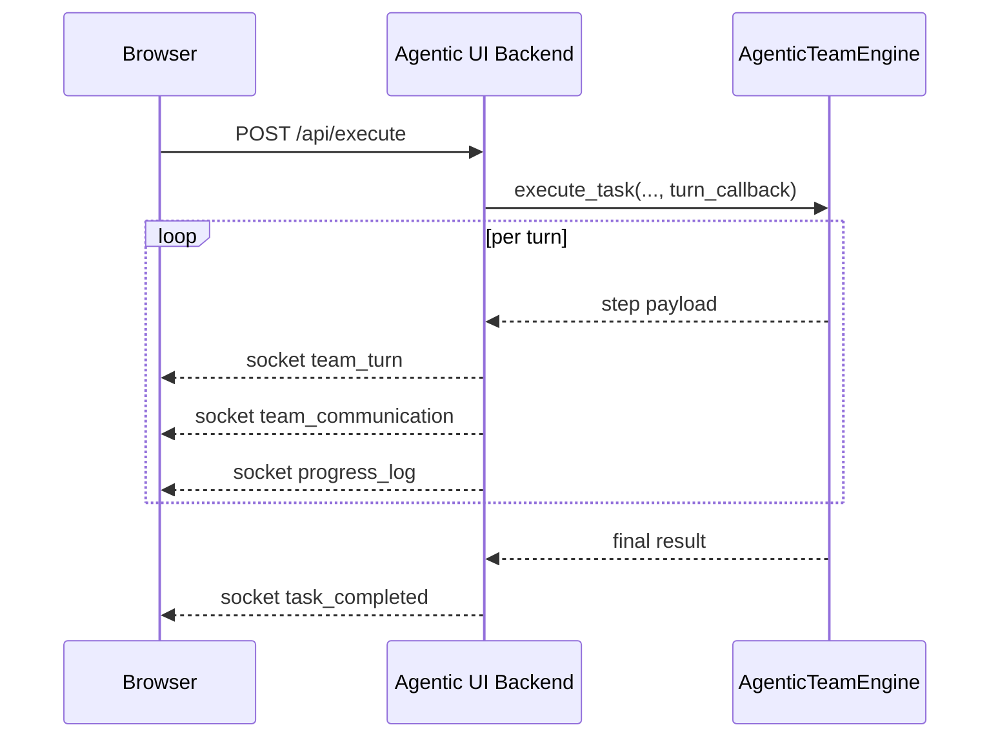
```mermaid
sequenceDiagram
    participant Browser
    participant API as Agentic UI Backend
    participant Engine as AgenticTeamEngine

    Browser->>API: POST /api/execute
    API->>Engine: execute_task(..., turn_callback)

    loop per turn
      Engine-->>API: step payload
      API-->>Browser: socket team_turn
      API-->>Browser: socket team_communication
      API-->>Browser: socket progress_log
    end

    Engine-->>API: final result
    API-->>Browser: socket task_completed
```

Live graph rendering model:

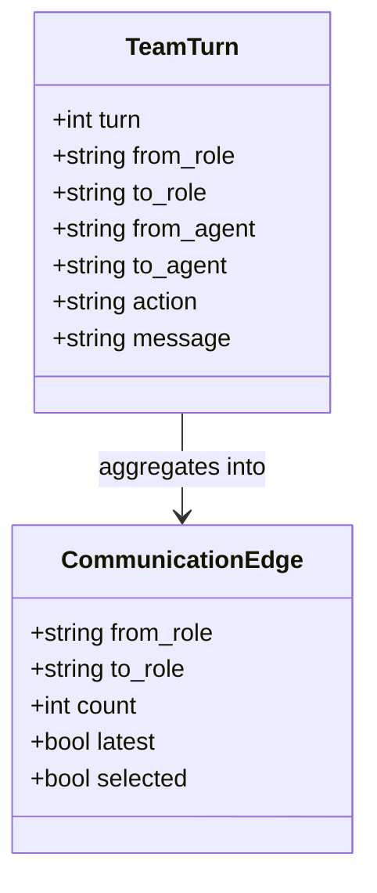
```mermaid
classDiagram
    class TeamTurn {
      +int turn
      +string from_role
      +string to_role
      +string from_agent
      +string to_agent
      +string action
      +string message
    }

    class CommunicationEdge {
      +string from_role
      +string to_role
      +int count
      +bool latest
      +bool selected
    }

    TeamTurn --> CommunicationEdge : aggregates into
```

## CLI: Agentic Team REPL

Standalone CLI command:

```bash
./ai-orchestrator agentic-shell
```

This REPL is independent from orchestrator workflow shell.

Supported commands:
- `/help`
- `/agents`
- `/team`
- `/maxturns <n>`
- `/followup <message>`
- `/history`
- `/save [file]`
- `/load <file>`
- `/reset`
- `/reload`
- `/validate`
- `/clear`
- `/info`
- `/exit`

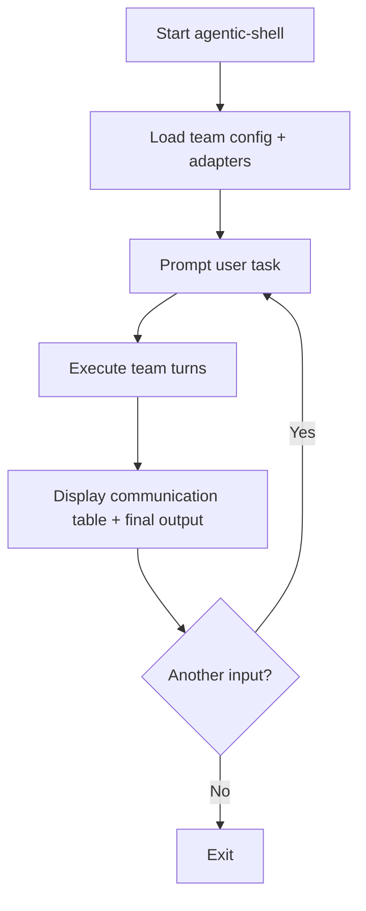
```mermaid
flowchart TD
    S[Start agentic-shell] --> I[Load team config + adapters]
    I --> P[Prompt user task]
    P --> E[Execute team turns]
    E --> D[Display communication table + final output]
    D --> Q{Another input?}
    Q -->|Yes| P
    Q -->|No| X[Exit]
```

## Local Model Integration and Limits

Agentic Team can map any role to local adapters (`ollama`, `llamacpp`, `localai`, `openai-compatible`) and those roles fully participate in turn routing, offline mode, and fallback.

Implementation behavior:

| Adapter type | Runtime transport | Direct file writes |
|---|---|---|
| CLI-backed agents | Local CLI execution path | Yes (tool-dependent) |
| Local model adapters | HTTP completion endpoints | No (text output only) |

Practical impact:
- A role mapped to a local model can still act as architect/developer/QA in team conversation, but it returns guidance/drafts as text.
- Local-model turns do not directly modify repository files by themselves.

Best use:
- offline role communication,
- generating implementation drafts for another agent to apply,
- review/critique and fallback continuity.

> [!IMPORTANT]
> While it is possible to make local LLMs directly edit files (e.g., via a `file-editor` tool), this approach is currently disabled to prevent unintended destructive changes. Local adapters are advisory — they provide text output that the Orchestrator can use to inform the next steps, but they do not have direct write access to the workspace. This design choice prioritizes safety and predictability while still leveraging local models for their strengths in drafting and feedback. The hard part is not feasibility, it’s safety and reliability: permissions, diff constraints, validation/tests before write, rollback, and preventing bad edits.

## Validation and Failure Handling

Pre-run checks:
- Task must be non-empty.
- At least one available agent must exist.
- Every configured role must map to an available agent.
- Lead role must exist in role map.

Runtime protections:
- Non-lead `finalize` is rewritten to `message -> lead_role`.
- Invalid `to_role` is rerouted to `lead_role`.
- Role execution failures route a failure message back to lead.
- If no finalize by `max_turns`, engine returns a bounded fallback result.

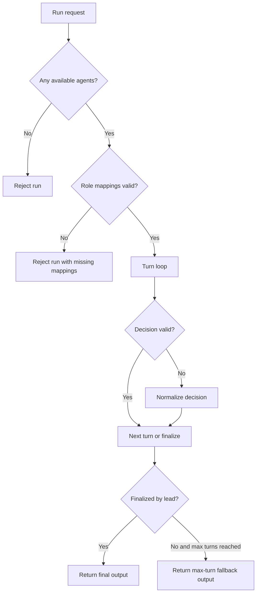
```mermaid
flowchart TD
    START[Run request] --> C1{Any available agents?}
    C1 -->|No| E1[Reject run]
    C1 -->|Yes| C2{Role mappings valid?}
    C2 -->|No| E2[Reject run with missing mappings]
    C2 -->|Yes| LOOP[Turn loop]

    LOOP --> D{Decision valid?}
    D -->|No| FIX[Normalize decision]
    D -->|Yes| NEXT[Next turn or finalize]
    FIX --> NEXT

    NEXT --> END{Finalized by lead?}
    END -->|Yes| OUT[Return final output]
    END -->|No and max turns reached| FOUT[Return max-turn fallback output]
```

Fallback behavior leverages existing adapter fallback mappings where configured.

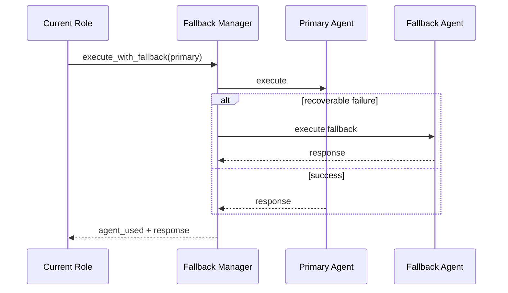
```mermaid
sequenceDiagram
    participant Role as Current Role
    participant FB as Fallback Manager
    participant P as Primary Agent
    participant F as Fallback Agent

    Role->>FB: execute_with_fallback(primary)
    FB->>P: execute
    alt recoverable failure
        FB->>F: execute fallback
        F-->>FB: response
    else success
        P-->>FB: response
    end
    FB-->>Role: agent_used + response
```

## Observability

Agentic team telemetry is surfaced through:
- `team_turn` socket events
- `team_communication` socket events
- `progress_log` socket events
- `/api/status` session snapshots

Session state stores:
- current status,
- turn history,
- logs,
- conversation history,
- last task/output for follow-up.

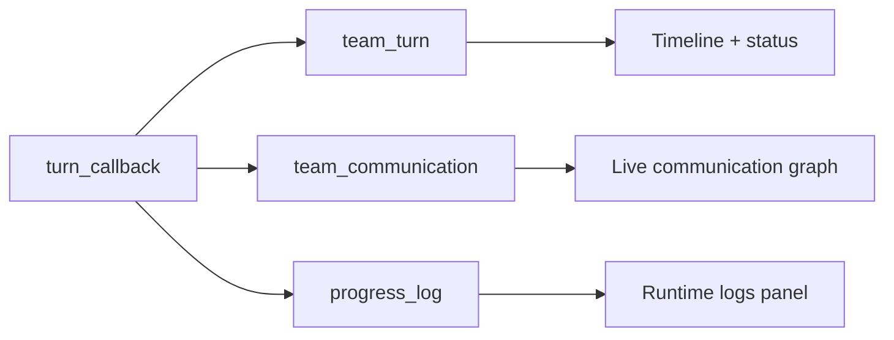
```mermaid
flowchart LR
    T[turn_callback] --> E1[team_turn]
    T --> E2[team_communication]
    T --> E3[progress_log]
    E1 --> UI[Timeline + status]
    E2 --> G[Live communication graph]
    E3 --> L[Runtime logs panel]
```

## Code Quality

| Metric | Value |
|--------|-------|
| **Pylint Score** | 10.00/10 (zero warnings) |
| **Tests** | 386 passing (pytest) |
| **Pre-commit Hooks** | 15 hooks passing (Black, isort, flake8, pylint, MyPy, etc.) |
| **Formatting** | Black (120-char line length) |
| **Logging** | Lazy `%s` formatting throughout; no stray `print()` in production code |
| **I/O** | Explicit UTF-8 encoding on all file operations |

## Security and Safety

- Config updates validate required top-level sections before write.
- Invalid role mappings are blocked before execution.
- Session data is isolated per client id.
- UI renders communication text escaped in HTML.

## Extension Guide

To add a new role:
1. Add role mapping in `orchestrator/config/agents.yaml` under `agentic_team.roles`.
2. Bind the role to any available agent.
3. Set role title and responsibilities.
4. Optionally set role-specific fallback via existing fallback mapping.

To add a new model for existing roles:
1. Add agent in `agents` section with correct adapter type.
2. Ensure `enabled: true` and runtime availability.
3. Rebind role `agent` value in `agentic_team.roles`.

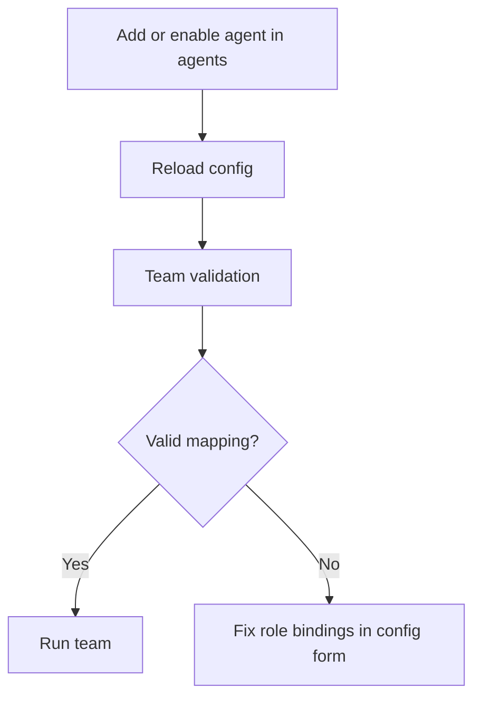
```mermaid
flowchart TB
    A[Add or enable agent in agents] --> B[Reload config]
    B --> C[Team validation]
    C --> D{Valid mapping?}
    D -->|Yes| E[Run team]
    D -->|No| F[Fix role bindings in config form]
```

## Operational Commands

Start standalone Agentic Team UI backend:

```bash
python agentic_team/ui/app.py
```

Start standalone Agentic Team UI helper script:

```bash
./start-agentic-ui.sh
```

Start standalone Agentic Team CLI:

```bash
./ai-orchestrator agentic-shell
./ai-orchestrator agentic-shell --max-turns 16
./ai-orchestrator agentic-shell --offline
```

Validate base config and agents:

```bash
./ai-orchestrator validate
./ai-orchestrator agents
```

## Package Structure

The full `agentic_team/` package layout and its relationship to the shared MCP server:

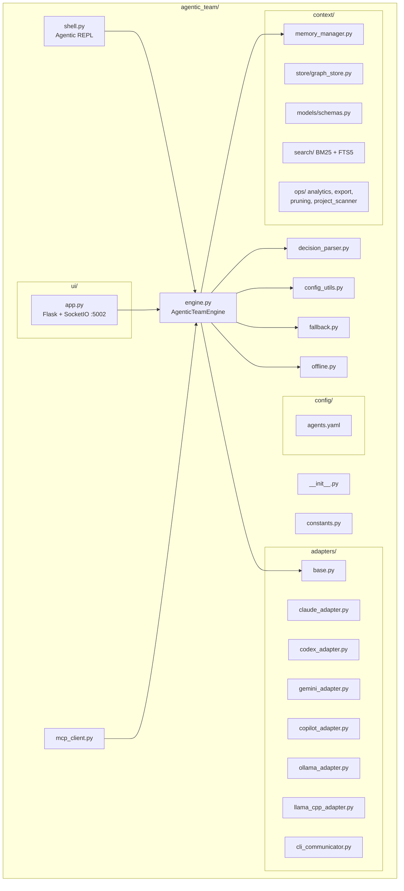
```mermaid
graph TD
    subgraph "agentic_team/"
        INIT[__init__.py]
        ENGINE[engine.py\nAgenticTeamEngine]
        DPARSER[decision_parser.py]
        CFGUTIL[config_utils.py]
        CONSTANTS[constants.py]
        FALLBACK[fallback.py]
        OFFLINE[offline.py]
        SHELL[shell.py\nAgentic REPL]
        MCPCLI[mcp_client.py]

        subgraph "adapters/"
            ABASE[base.py]
            ACLAUDE[claude_adapter.py]
            ACODEX[codex_adapter.py]
            AGEMINI[gemini_adapter.py]
            ACOPILOT[copilot_adapter.py]
            AOLLAMA[ollama_adapter.py]
            ALLAMA[llama_cpp_adapter.py]
            ACLI[cli_communicator.py]
        end

        subgraph "context/"
            CTX_MM[memory_manager.py]
            CTX_STORE[store/graph_store.py]
            CTX_MODELS[models/schemas.py]
            CTX_SEARCH[search/ BM25 + FTS5]
            CTX_OPS[ops/ analytics, export,\npruning, project_scanner]
        end

        subgraph "config/"
            AYAML[agents.yaml]
        end

        subgraph "ui/"
            UIAPP[app.py\nFlask + SocketIO :5002]
        end
    end

    ENGINE --> CTX_MM
    ENGINE --> ABASE
    ENGINE --> DPARSER
    ENGINE --> CFGUTIL
    ENGINE --> FALLBACK
    ENGINE --> OFFLINE
    SHELL --> ENGINE
    UIAPP --> ENGINE
    MCPCLI --> ENGINE
```

---

## MCP Integration (Optional)

> **Note:** The MCP server at `mcp_server/` is an optional integration layer. It is not required to use the agentic team. The team runs independently via its own CLI (`agentic-shell`) and UI (`agentic_team/ui/app.py`).

The agentic team is accessible via MCP through the shared FastMCP server:

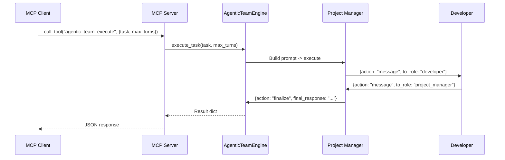
```mermaid
sequenceDiagram
    participant Client as MCP Client
    participant Server as MCP Server
    participant Engine as AgenticTeamEngine
    participant PM as Project Manager
    participant Dev as Developer

    Client->>Server: call_tool("agentic_team_execute", {task, max_turns})
    Server->>Engine: execute_task(task, max_turns)
    Engine->>PM: Build prompt -> execute
    PM->>Dev: {action: "message", to_role: "developer"}
    Dev->>PM: {action: "message", to_role: "project_manager"}
    PM->>Engine: {action: "finalize", final_response: "..."}
    Engine-->>Server: Result dict
    Server-->>Client: JSON response
```

### Agentic Team MCP Tools

| Tool | Read-Only | Description |
|------|-----------|-------------|
| `agentic_team_execute` | No | Run task with role-based team collaboration |
| `agentic_team_list_agents` | Yes | List available agents |
| `agentic_team_config` | Yes | Get team role configuration |
| `agentic_team_validate` | Yes | Validate role-to-agent bindings |
| `agentic_team_health` | Yes | Health check: team validity, agents, offline status |

### Python Client

```python
from agentic_team.mcp_client import AgenticTeamMCPClient

client = AgenticTeamMCPClient()  # in-memory
result = await client.execute_task("Design a microservice architecture")
```

## Context System

The Agentic Team maintains its own independent graph-based context database at `~/.agentic-team/context.db`. This is fully separate from the Orchestrator's context system — zero shared imports.

### Node Types

| Type | Purpose |
|------|---------|
| `CONVERSATION` | Past chat sessions with message history |
| `TASK` | Completed tasks with outcomes and duration |
| `MISTAKE` | Errors with corrections and prevention strategies |
| `PATTERN` | Reusable code patterns and best practices |
| `DECISION` | Architectural decisions with rationale |
| `CODE_SNIPPET` | Useful code fragments |
| `PREFERENCE` | Learned user preferences |
| `FILE` | Source file metadata from project scans |
| `PROJECT` | Registered project roots with detected tech stack |

### Project-Scoped Operation

When `PROJECT_PATH` is configured, the engine automatically registers the project at startup:

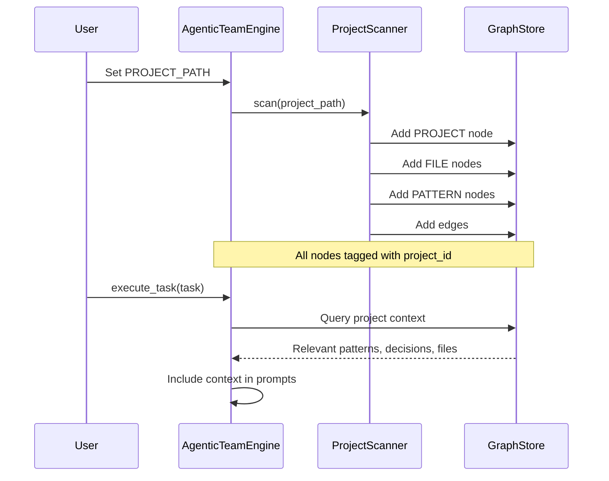
```mermaid
sequenceDiagram
    participant User
    participant Engine as AgenticTeamEngine
    participant Scanner as ProjectScanner
    participant Graph as GraphStore

    User->>Engine: Set PROJECT_PATH
    Engine->>Scanner: scan(project_path)
    Scanner->>Graph: Add PROJECT node
    Scanner->>Graph: Add FILE nodes
    Scanner->>Graph: Add PATTERN nodes
    Scanner->>Graph: Add edges

    Note over Engine,Graph: All nodes tagged with project_id

    User->>Engine: execute_task(task)
    Engine->>Graph: Query project context
    Graph-->>Engine: Relevant patterns, decisions, files
    Engine->>Engine: Include context in prompts
```

### Search

The Agentic Team context uses FTS5 (SQLite built-in) and BM25 for search — no external embedding dependency required. This keeps the system lightweight and fully self-contained.

### Independence Guarantee

The Agentic Team context system (`agentic_team/context/`) is a fully independent implementation:
- Own `models/schemas.py` — mirrored but independent from orchestrator schemas
- Own `store/graph_store.py` — independent SQLite graph store
- Own `ops/project_scanner.py` — independent copy of the project scanner
- **Zero imports from `orchestrator/`** — verified by CI

### Obsidian Vault Export

Export the Agentic Team's communication and context graph as an [Obsidian](https://obsidian.md) vault. Each node becomes a markdown note with YAML frontmatter, typed folder organization, and `[[wikilinks]]` connecting related nodes.

```python
from agentic_team.context.ops.export import ContextExporter
from agentic_team.context.graph_store import GraphStore

store = GraphStore("~/.agentic-team/context.db")
exporter = ContextExporter(store)

# Export full context graph
result = exporter.export_obsidian("./team-vault")
# → { notes_written: 89, edges_linked: 214, folders: [...] }

# Export only tasks and decisions
result = exporter.export_obsidian("./vault", node_types=["task", "decision"])
```

Open the generated vault in Obsidian and press **Ctrl/Cmd + G** to explore team interactions, role handoffs, and decisions as a visual graph.

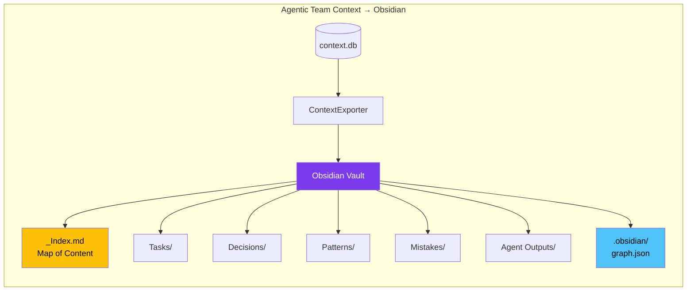
```mermaid
graph LR
    subgraph "Agentic Team Context → Obsidian"
        DB[(context.db)] --> EXP[ContextExporter]
        EXP --> VAULT[Obsidian Vault]
        VAULT --> IDX[_Index.md<br/>Map of Content]
        VAULT --> TASKS[Tasks/]
        VAULT --> DECS[Decisions/]
        VAULT --> PATS[Patterns/]
        VAULT --> MIST[Mistakes/]
        VAULT --> AGENTS[Agent Outputs/]
        VAULT --> OBS[.obsidian/<br/>graph.json]
    end

    style VAULT fill:#7C3AED,color:#fff
    style OBS fill:#4FC3F7,color:#000
    style IDX fill:#FFC107,color:#000
```

**Vault features:**
- **Typed folders** — Tasks/, Decisions/, Patterns/, Mistakes/, Conversations/, Agent Outputs/, etc.
- **YAML frontmatter** — type, tags, importance score, timestamps, project_id, metadata
- **`[[Wikilinks]]`** — Relationships grouped by edge type with → outgoing and ← incoming sections
- **`_Index.md`** — Map of Content with stats table and links to every category
- **`.obsidian/graph.json`** — Color groups per node type for the built-in graph view
- **Dark theme** — `.obsidian/appearance.json` pre-configured with Obsidian dark mode

> **Note:** This is a fully independent implementation from the orchestrator's Obsidian exporter — zero shared imports, consistent with the Agentic Team's independence guarantee.
