# Architecture Documentation

## Table of Contents

- [Overview](#overview)
- [Code Quality & Production Readiness](#code-quality--production-readiness)
- [System Architecture](#system-architecture)
- [Agentic Team Architecture](#agentic-team-architecture)
- [Component Design](#component-design)
- [Data Flow](#data-flow)
- [Adapter Pattern](#adapter-pattern)
- [Local Model Integration and Limitations](#local-model-integration-and-limitations)
- [Workflow Engine](#workflow-engine)
- [Security Architecture](#security-architecture)
- [Monitoring & Observability](#monitoring--observability)
- [Deployment Architecture](#deployment-architecture)
- [Design Patterns](#design-patterns)
- [Graph Context System](#graph-context-system)
  - [Project-Scoped Graphs](#project-scoped-graphs)
  - [Project Scanner](#project-scanner)
  - [Obsidian Vault Export](#obsidian-vault-export)
  - [Graphify — Code Knowledge Graph Engine](#graphify--code-knowledge-graph-engine)
- [Agentic Infrastructure](#agentic-infrastructure)
- [Performance Considerations](#performance-considerations)
- [Scalability](#scalability)
- [Optional: MCP Integration Layer](#optional-mcp-integration-layer)

## Overview

The AI Coding Tools Orchestrator is built on a modular, extensible architecture that enables multiple AI agents to collaborate effectively. The system follows enterprise design patterns and best practices for scalability, reliability, and maintainability.

### Core Principles

- **Modularity**: Clear separation of concerns between components
- **Extensibility**: Easy to add new agents and workflows
- **Reliability**: Robust error handling and retry logic
- **Performance**: Async execution and intelligent caching
- **Security**: Input validation, rate limiting, and audit logging
- **Observability**: Comprehensive metrics, structured logging, and automated report generation

## Code Quality & Production Readiness

The codebase has undergone a production-readiness overhaul achieving **Pylint 10.00/10** (up from 9.39/10) with 520 warnings eliminated, 386 tests passing, and all 15 pre-commit hooks green.

### Quality Metrics

| Metric | Value |
|--------|-------|
| **Pylint Score** | 10.00 / 10 (perfect — zero warnings) |
| **Test Suite** | 386 tests passing |
| **Pre-commit Hooks** | 15/15 passing (black, isort, flake8, mypy, bandit, pyupgrade, …) |
| **Warnings Eliminated** | 520 across the entire codebase |

### Pylint Configuration Philosophy

The `pyproject.toml` pylint configuration follows a strict philosophy: **suppress intentional design-pattern violations; fix everything else**.

**Line length** — `max-line-length = 120`. Black formats at 100 characters; pylint allows 120 to give slack for long strings, URLs, and generated code.

**Intentional suppressions (with documented rationale):**

| Code | Name | Rationale |
|------|------|-----------|
| R0801 | `duplicate-code` | `orchestrator/` and `agentic_team/` are independent by architectural design — parallel structure is intentional |
| R0902 | `too-many-instance-attributes` | Domain dataclasses legitimately carry many fields |
| R0917 | `too-many-positional-arguments` | Domain methods require multiple parameters |
| C0415 | `import-outside-toplevel` | Lazy imports for optional dependencies (Ollama, llama.cpp) |
| W0718 | `broad-exception-caught` | Error boundaries at adapter/CLI layer intentionally catch broadly |
| R0914 | `too-many-locals` | Complex algorithms (graph traversal, search ranking) |
| W0613 | `unused-argument` | Interface conformance — adapters implement `BaseAdapter` signatures |
| W0603 | `global-statement` | Singleton patterns for configuration and metrics |

**Similarity analysis** — minimum 8 similar lines, ignoring imports, docstrings, and comments to avoid false positives from boilerplate.

### Code Quality Patterns Enforced

- **Logging**: All logging uses lazy `%s` formatting — no f-string overhead in log calls
- **File I/O**: All file operations use explicit `encoding="utf-8"`
- **Abstract methods**: Use docstring-only body (no `pass` or `...`)
- **Subprocess calls**: Annotated with pylint disable comments where context manager usage isn't feasible
- **No stray `print()`**: All print statements in production code converted to `logger` calls
- **Pydantic compatibility**: `FieldInfo` false positives suppressed with inline comments

## System Architecture

### High-Level Architecture

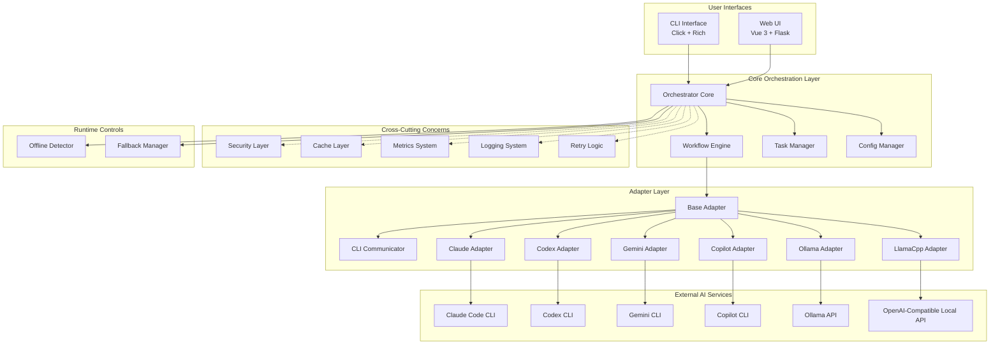

### Component Layers

1. **Interface Layer** - User-facing interfaces (CLI and Web UI)
2. **Orchestration Layer** - Core business logic and workflow management
3. **Cross-Cutting Layer** - Security, caching, metrics, logging
4. **Adapter Layer** - AI agent integrations
5. **Runtime Controls** - Offline detection and fallback routing
6. **External Services** - Third-party AI CLIs and local model APIs

## Agentic Team Architecture

`AGENTIC_TEAM` is a separate runtime path for role-based autonomous team communication. It does not execute through the orchestrator workflow engine.

### Runtime Boundary

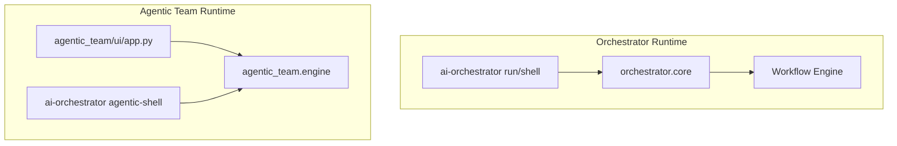

### Core Components

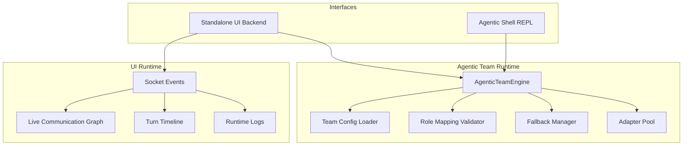

### Turn Loop and Decision Routing

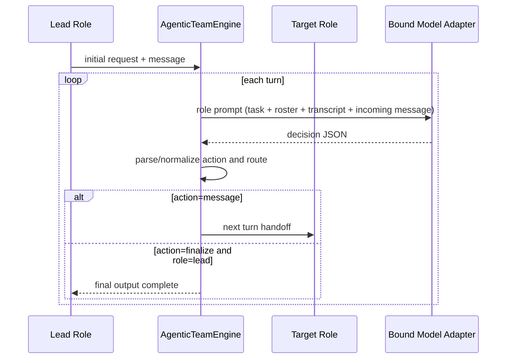

### Communication Event Pipeline

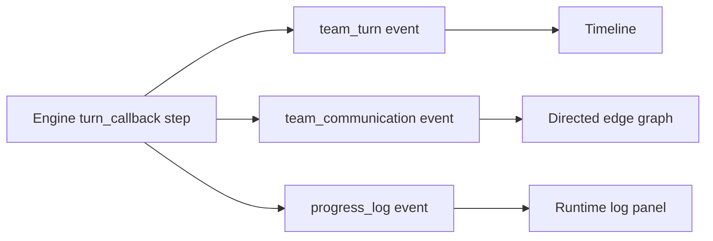

### Graph Aggregation Model

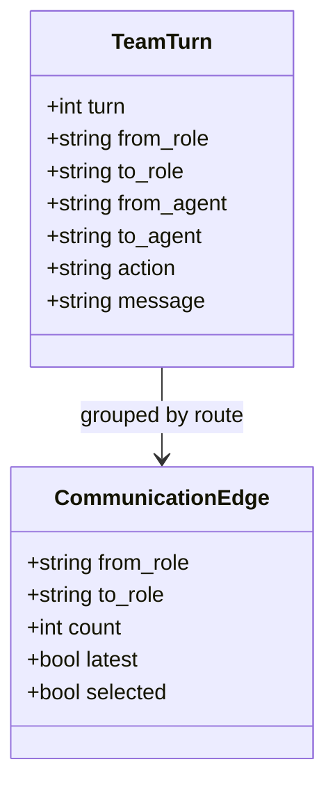

### Validation and Fallback Pipeline

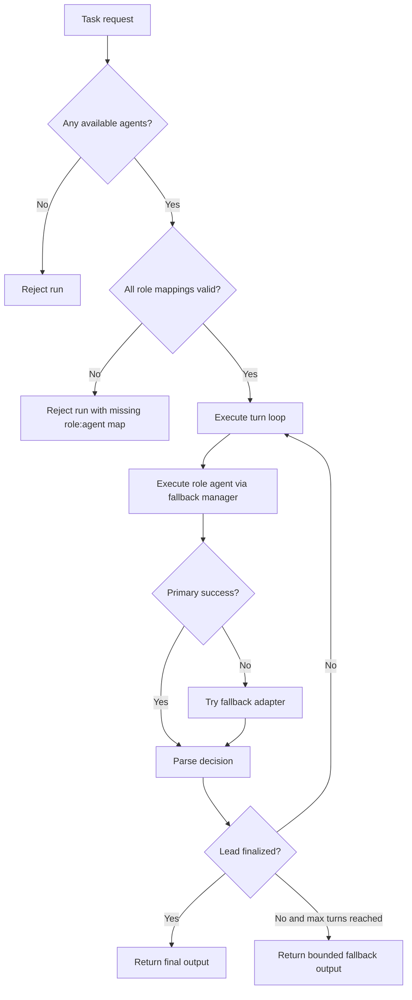

## Component Design

### Orchestrator Core

The central component that coordinates all operations.

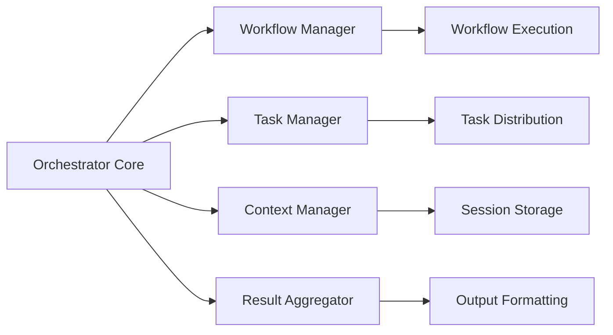

**Responsibilities:**
- Task reception and parsing
- Workflow selection and execution
- Agent coordination
- Result aggregation
- Session management

**Key Files:**
- `orchestrator/core.py` - Main orchestrator logic
- `orchestrator/workflow.py` - Workflow management
- `orchestrator/task_manager.py` - Task distribution

### Workflow Engine

Manages workflow definitions and execution.

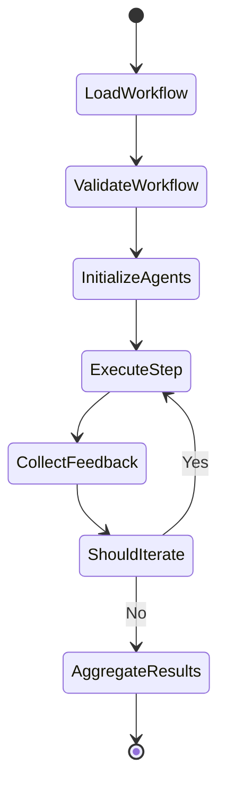

**Workflow Execution Characteristics:**

1. **Sequential Steps** - Agents execute one after another
2. **Iterative Refinement** - Workflow cycles until stop conditions are met
3. **Step-Level Fallback** - If a step fails due to recoverable connectivity/API issues, fallback agent can run
4. **Offline Filtering** - In offline mode, non-local agents are skipped at initialization

**Configuration (Supported Forms):**
```yaml
agents:
  codex:
    type: cli
    command: codex
    enabled: true

  my-custom-llama:
    type: llamacpp
    endpoint: http://localhost:9000
    offline: true
    enabled: true

workflows:
  default:
    - agent: "codex"
      task: "implement"
    - agent: "gemini"
      task: "review"
    - agent: "claude"
      task: "refine"

  offline-default:
    description: "Local-only workflow"
    steps:
      - agent: "local-code"
        role: "implementer"
      - agent: "local-instruct"
        role: "reviewer"
```

### Adapter Layer

Abstracts AI agent interactions through a common interface.

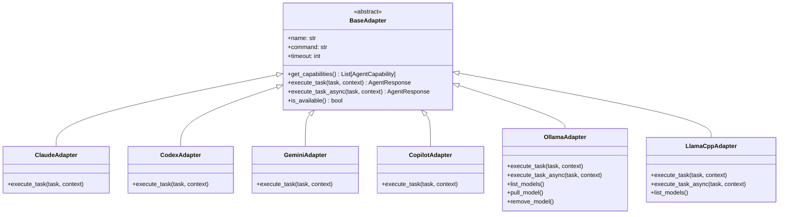

**Base Adapter Interface:**
```python
class BaseAdapter(ABC):
    @abstractmethod
    def get_capabilities(self) -> List[AgentCapability]:
        """Declare supported capability set."""
        pass

    @abstractmethod
    def execute_task(self, task: str, context: Dict[str, Any]) -> AgentResponse:
        """Execute task with the AI agent."""
        pass

    async def execute_task_async(self, task: str, context: Dict[str, Any]) -> AgentResponse:
        """Async execution hook (default delegates to sync)."""
        ...
```

### CLI Communicator

Handles robust communication with external CLI tools.

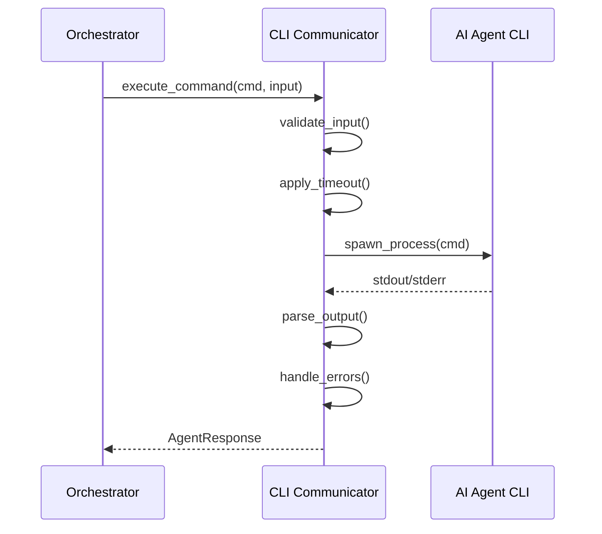

**Features:**
- Process management
- Timeout handling
- Error recovery
- Output parsing
- Retry logic

## Data Flow

### Task Execution Flow

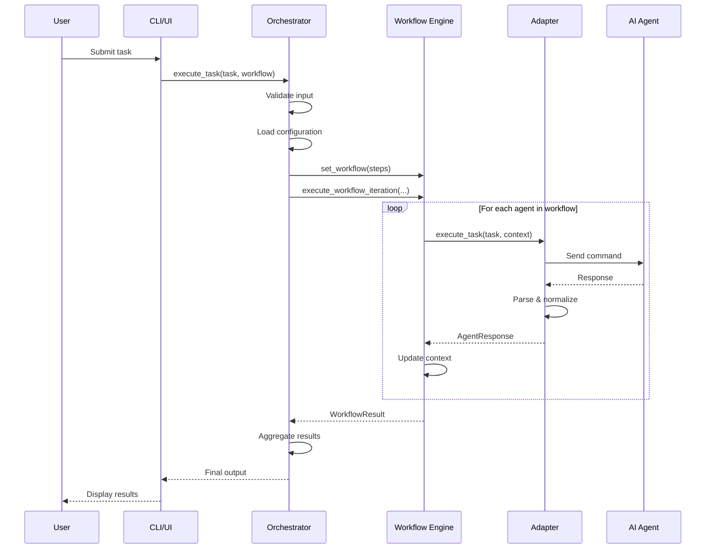

### Conversation Mode Flow

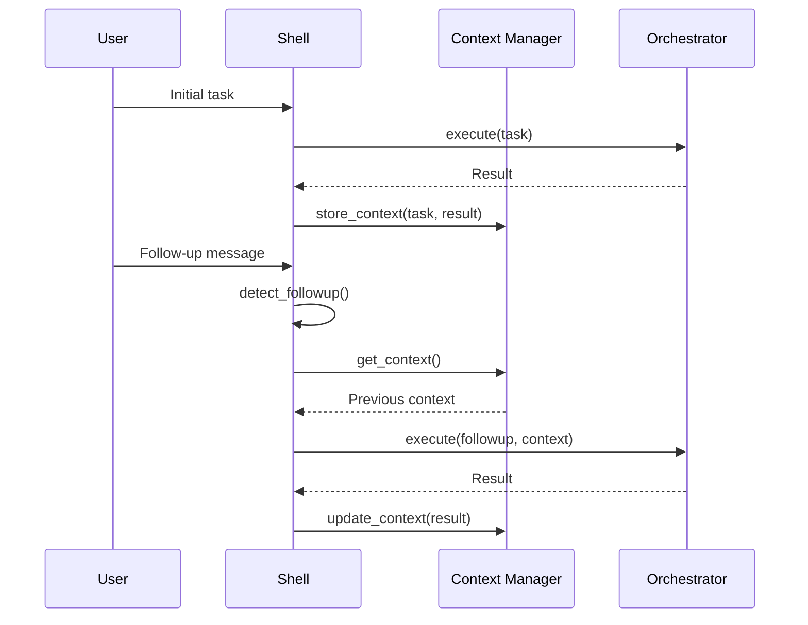

### File Generation Flow

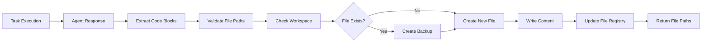

## Adapter Pattern

### Why Adapters?

Adapters provide a consistent interface to heterogeneous AI agent CLIs:

- **Abstraction**: Hide CLI-specific details
- **Consistency**: Uniform interface for all agents
- **Flexibility**: Easy to swap or add agents
- **Testability**: Mock adapters for testing
- **Resilience**: Isolated error handling

### Adapter Implementation

```python
class OllamaAdapter(BaseAdapter):
    def __init__(self, config: Dict[str, Any]):
        local_config = dict(config)
        local_config.setdefault("offline", True)
        super().__init__(local_config)
        self.model = local_config.get("model", "codellama:13b")
        self.endpoint = str(local_config.get("endpoint", "http://localhost:11434")).rstrip("/")
        self.timeout = int(local_config.get("timeout", 300))

    async def execute_task_async(self, task: str, context: Dict[str, Any]) -> AgentResponse:
        prompt = self._build_local_llm_prompt(task, context)
        async with httpx.AsyncClient(timeout=self.timeout) as client:
            resp = await client.post(
                f"{self.endpoint}/api/generate",
                json={"model": self.model, "prompt": prompt, "stream": False},
            )
            resp.raise_for_status()
            data = resp.json()
            return AgentResponse(success=True, output=data.get("response", ""))
```

## Local Model Integration and Limitations

Local backends (Ollama, llama.cpp, LocalAI, and other OpenAI-compatible servers) are integrated as standard adapters and participate in:
- workflow step execution,
- offline-only filtering,
- cloud-to-local fallback routing,
- local model health/model discovery endpoints.

Execution semantics differ from CLI adapters:

| Adapter family | Transport | Workspace edit path |
|---|---|---|
| CLI adapters (`codex`, `claude`, `gemini`, `copilot`) | Local CLI process | Can modify files when workspace execution is used |
| Local model adapters (`ollama`, `llamacpp`, `localai`, `openai-compatible`) | HTTP completion endpoints | Text output only; no direct file writes |

Design implication:
- Assigning a local model to an "implement" role is supported, but that step behaves as advisory text generation unless another editing-capable agent applies changes.

Best use:
- local drafting, critique/review, and resilience fallback in hybrid workflows.

> [!CAUTION]
> The local model itself doesn’t edit files, but you can  make it do so by adding an agent/tool layer around it (same idea as Claude/Codex/Copilot CLIs): give it tools like read_file, write_file, apply_patch, run_tests, then let an orchestrator execute those tool calls.
>
> In this project, that would mean extending local adapters from “text completion only” to a workspace-execution loop (or routing local models through an MCP/tool-calling  bridge). The hard part is not feasibility, it’s safety and reliability: permissions, diff constraints, validation/tests before write, rollback, and preventing bad edits.

## Workflow Engine

### Workflow Execution

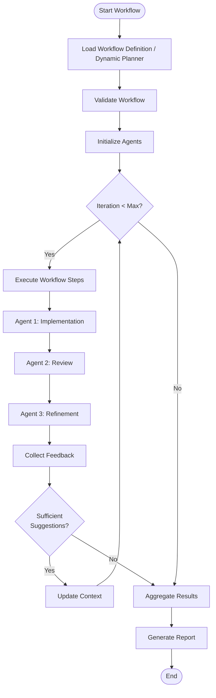

### Dynamic Planner Agent & Metrics-Based Routing

The Orchestrator features a **Dynamic Planner Agent** (`orchestrator/core/planner.py`) that replaces static YAML workflows. When a task is executed using the `dynamic` workflow (or if a requested workflow is missing), the Planner Agent:
1. **Reads Observability Metrics:** It fetches live success/failure rates from Prometheus metrics (`orchestrator_agent_calls_total`).
2. **Evaluates Routing Policy:** Any agent with a success rate below `0.6` is deprioritized to avoid cascading failures.
3. **Generates a Plan:** It uses a preferred LLM adapter to break the task down into sequential steps (e.g., `implement`, `review`, `refine`) and assigns healthy, available agents dynamically.

This metrics-based routing ensures the system automatically adapts to API outages, degraded model performance, or local backend unavailability without manual configuration changes.

### Workflow Configuration

Workflows can still be defined statically in YAML (if not using the dynamic planner):

```yaml
workflows:
  thorough:
    - agent: "codex"
      task: "implement"
      description: "Create initial implementation"
    - agent: "copilot"
      task: "suggestions"
      description: "Get alternative approaches"
    - agent: "gemini"
      task: "review"
      description: "Comprehensive code review"
    - agent: "claude"
      task: "refine"
      description: "Implement feedback"
    - agent: "gemini"
      task: "review"
      description: "Verify improvements"

  hybrid:
    description: "Local draft with cloud review + fallback"
    steps:
      - agent: "local-code"
        role: "implementer"
      - agent: "claude"
        role: "reviewer"
        fallback: "local-instruct"

settings:
  max_iterations: 5
  fallback:
    enabled: true
    map:
      claude: local-instruct
  offline:
    enabled: false
    auto_detect: true
```

### Offline and Fallback Runtime

`Orchestrator` resolves runtime mode and adapter availability before execution:

1. Determine offline mode from `--offline`, `settings.offline.enabled`, and cached connectivity auto-detection.
2. Initialize adapters dynamically from `agents.<name>.type`.
3. In offline mode, skip non-local agents.
4. For each step, try primary adapter.
5. On recoverable connection/API failure, execute mapped or step-level fallback adapter.

## Security Architecture

### Security Layers

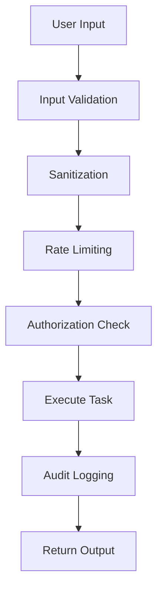

### Security Components

1. **Input Validation**
   - Command injection prevention
   - Path traversal protection
   - Malicious payload detection

2. **Rate Limiting**
   - Token bucket algorithm
   - Per-user limits
   - Global rate limits

3. **Secret Management**
   - Environment variables
   - Secure key storage
   - No hardcoded credentials

4. **Audit Logging**
   - All security events logged
   - Tamper-proof logs
   - Retention policies

**Implementation:**
```python
class SecurityManager:
    def validate_input(self, user_input: str) -> bool:
        # Check for command injection
        if self._contains_shell_metacharacters(user_input):
            raise SecurityError("Potential command injection")

        # Check for path traversal
        if self._contains_path_traversal(user_input):
            raise SecurityError("Path traversal detected")

        return True

    def rate_limit_check(self, user_id: str) -> bool:
        if not self.rate_limiter.allow_request(user_id):
            raise RateLimitError("Rate limit exceeded")
        return True
```

## Monitoring & Observability

### Metrics Architecture

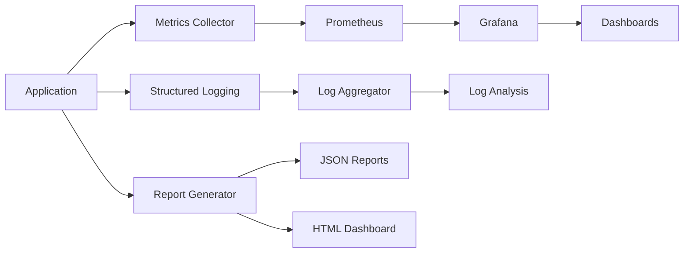

### Report Generation

The `ReportGenerator` (`orchestrator/observability/report_generator.py`) automatically produces reports after each task execution when `create_reports: true` is set in config. Reports are written as JSON files plus an interactive HTML dashboard.

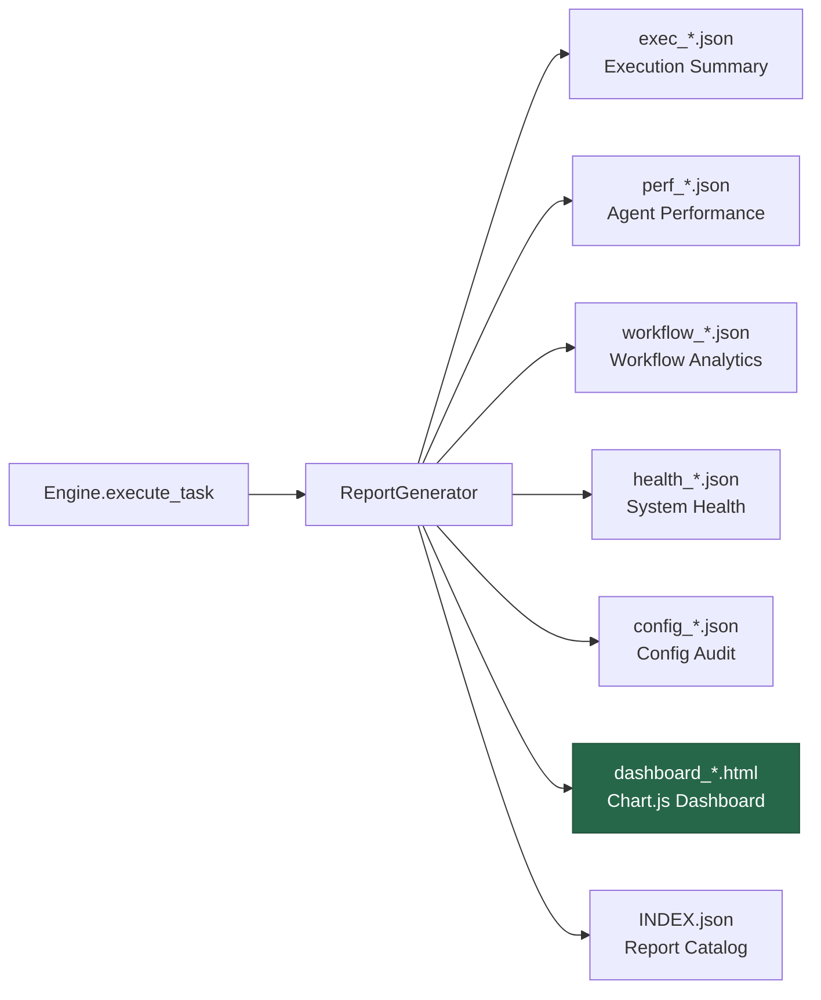

**Report types:**
- **Execution Summary** — Per-task results with steps, agents, fallbacks, suggestions, and duration
- **Agent Performance** — Aggregated success rates, call counts, and task type distribution
- **Workflow Analytics** — Per-workflow run counts, success rates, and average iterations
- **System Health** — Health check results with disk, memory, Python version, and platform info
- **Config Audit** — Agent availability, workflow structure, and settings snapshot
- **HTML Dashboard** — Interactive Chart.js dashboard with KPI cards, daily volume bar chart, agent success/failure stacked bar, duration trend line, and workflow distribution doughnut

### Key Metrics

**Task Metrics:**
- `orchestrator_tasks_total` - Counter
- `orchestrator_task_duration_seconds` - Histogram
- `orchestrator_task_failures_total` - Counter

**Agent Metrics:**
- `orchestrator_agent_calls_total` - Counter
- `orchestrator_agent_errors_total` - Counter
- `orchestrator_agent_response_time_seconds` - Histogram

**System Metrics:**
- `orchestrator_cache_hits_total` - Counter
- `orchestrator_cache_misses_total` - Counter
- `orchestrator_active_sessions` - Gauge

### Structured Logging

```python
import structlog

logger = structlog.get_logger()

logger.info(
    "task_executed",
    task_id="task-123",
    workflow="default",
    duration_ms=1234.56,
    agent="codex",
    success=True
)
```

## Deployment Architecture

### Container Architecture

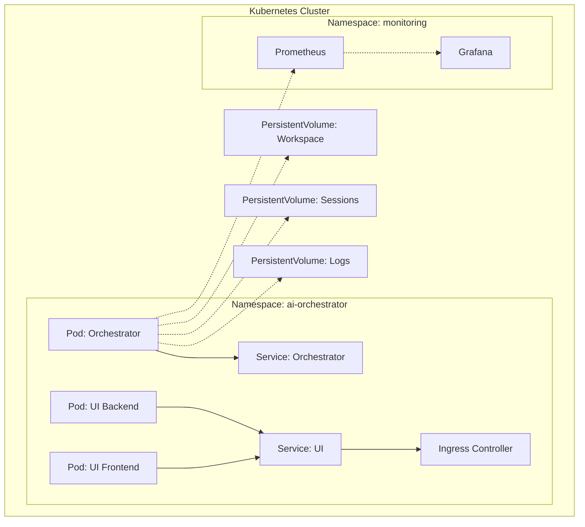

### Docker Compose Setup

```yaml
version: '3.8'

services:
  orchestrator:
    build: .
    volumes:
      - ./workspace:/app/workspace
      - ./sessions:/app/sessions
    ports:
      - "9090:9090"  # Metrics
    environment:
      - LOG_LEVEL=INFO
      - ENABLE_METRICS=true

  prometheus:
    image: prom/prometheus
    volumes:
      - ./monitoring/prometheus.yml:/etc/prometheus/prometheus.yml
    ports:
      - "9091:9090"

  grafana:
    image: grafana/grafana
    ports:
      - "3000:3000"
    environment:
      - GF_SECURITY_ADMIN_PASSWORD=admin
```

## Design Patterns

### Patterns Used

#### 1. Adapter Pattern
Provides a uniform interface to different AI agent CLIs.

#### 2. Strategy Pattern
Workflows implement different strategies for task execution.

#### 3. Chain of Responsibility
Request processing through validation, execution, and post-processing.

#### 4. Observer Pattern
Real-time updates in Web UI via Socket.IO.

#### 5. Factory Pattern
Agent and workflow creation.

#### 6. Singleton Pattern
Configuration manager, metrics collector.

#### 7. Decorator Pattern
Retry logic, caching, logging decorators.

### Example: Retry Decorator

```python
from functools import wraps
from tenacity import retry, stop_after_attempt, wait_exponential

def with_retry(max_attempts=3):
    def decorator(func):
        @wraps(func)
        @retry(
            stop=stop_after_attempt(max_attempts),
            wait=wait_exponential(multiplier=1, min=2, max=10)
        )
        def wrapper(*args, **kwargs):
            return func(*args, **kwargs)
        return wrapper
    return decorator

@with_retry(max_attempts=3)
def execute_agent_task(agent, task):
    return agent.execute_task(task, {"role": "implement"})
```

## Graph Context System

The Graph Context System provides persistent memory capabilities for AI agents, enabling learning from past conversations, tasks, and mistakes. The system follows the project's core architectural boundary: **two fully independent context implementations** — one for the Orchestrator and one for the Agentic Team — with zero shared imports between them.

### Dual Context Architecture

Both engines maintain isolated context databases with identical schemas but independent codebases:

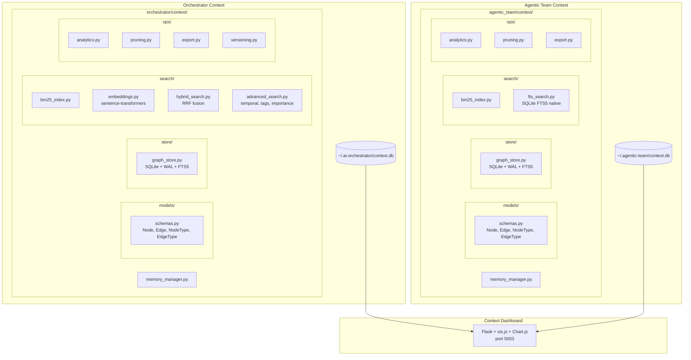

> **Key difference:** The Orchestrator context includes sentence-transformer embeddings for semantic search, a full hybrid search engine with RRF fusion, advanced search (temporal, tag, importance queries), and a versioning system. The Agentic Team context uses SQLite FTS5 natively for lighter-weight full-text search without embedding dependencies.

### Node Types

Both systems define 10 node types via `NodeType` enum in their respective `models/schemas.py`:

| Node Type | Description | Key Fields |
|-----------|-------------|------------|
| `conversation` | Past chat sessions with AI agents | messages, agent, timestamp |
| `task` | Completed tasks with outcomes | description, outcome, duration, agent |
| `mistake` | Errors with corrections and prevention | description, correction, prevention, category |
| `pattern` | Reusable code patterns and techniques | code, language, use_case, tags |
| `decision` | Architectural decisions with rationale | decision, rationale, alternatives, status |
| `code_snippet` | Useful code fragments for reuse | code, language, description, tags |
| `preference` | Learned user preferences | key, value, confidence |
| `file` | File references tracked in context | path, language, summary |
| `concept` | Domain concepts and definitions | name, definition, related_topics |
| `agent_output` | Raw AI agent outputs | agent, task, output, quality_score |

Each node carries: `id`, `node_type`, `content`, `title`, `metadata` (dict), `tags` (list), `created_at`, `updated_at`, `embedding` (optional float vector), and `importance_score` (float, default 1.0).

### Edge Types

12 semantic edge types via `EdgeType` enum for building the knowledge graph:

| Edge Type | Purpose | Example |
|-----------|---------|---------|
| `RELATED_TO` | General relationship | Task ↔ Conversation |
| `CAUSED_BY` | Error causation chain | Mistake → Root Cause Task |
| `FIXED_BY` | Solution mapping | Mistake → Fix Pattern |
| `SIMILAR_TO` | Semantic similarity | Task ↔ Similar Task |
| `DEPENDS_ON` | Task/concept dependencies | Task → Prerequisite Task |
| `PRECEDED_BY` | Temporal ordering (before) | Task → Earlier Task |
| `FOLLOWED_BY` | Temporal ordering (after) | Task → Later Task |
| `LEARNED_FROM` | Learning provenance | Pattern → Source Conversation |
| `REFERENCES` | Cross-referencing | Decision → Code Snippet |
| `CONTAINS` | Hierarchical containment | Conversation → Task |
| `PRODUCED_BY` | Output attribution | Code Snippet → Agent Output |
| `USED_IN` | Usage tracking | Pattern → Task |

Each edge carries: `id`, `source_id`, `target_id`, `edge_type`, `weight` (float), `metadata` (dict), and `created_at`.

### Search Architecture

The Orchestrator context implements a three-tier search system — keyword, semantic, and advanced — combined via Reciprocal Rank Fusion:

```mermaid
sequenceDiagram
    participant C as Caller
    participant MM as MemoryManager
    participant HS as HybridSearch
    participant BM as BM25 Index
    participant EM as Embeddings<br/>(all-MiniLM-L6-v2)
    participant RRF as RRF Fusion
    participant AS as AdvancedSearch

    C->>MM: search("auth patterns", mode="hybrid")
    MM->>HS: hybrid_search(query, top_k)

    par Parallel Execution
        HS->>BM: keyword_search(query)
        BM-->>HS: keyword_results (ranked by term frequency)
    and
        HS->>EM: generate_embedding(query)
        EM-->>HS: semantic_results (ranked by cosine similarity)
    end

    HS->>RRF: fuse(keyword_results, semantic_results, k=60)
    RRF-->>HS: merged_ranking
    HS-->>MM: top_k results

    Note over C,AS: Advanced queries bypass hybrid search
    C->>MM: search(mode="temporal")
    MM->>AS: search_temporal(start, end)
    AS-->>MM: time-filtered results
```

**Search modes:**

| Mode | Engine | Description |
|------|--------|-------------|
| BM25 keyword | `bm25_index.py` | Term frequency–inverse document frequency ranking |
| Semantic | `embeddings.py` | Sentence-transformer (`all-MiniLM-L6-v2`) cosine similarity |
| Hybrid | `hybrid_search.py` | Parallel BM25 + semantic merged via RRF (k=60) |
| FTS5 native | `fts_search.py` (Agentic Team) | SQLite FTS5 full-text search with `MATCH` syntax |
| Temporal | `advanced_search.py` | Filter nodes by `created_at` date ranges |
| Tag-based | `advanced_search.py` | Filter nodes by tag sets |
| Importance | `advanced_search.py` | Filter nodes above an importance threshold |

### Operations

Each context system provides operational tooling via its `ops/` sub-package:

**Analytics** (`ops/analytics.py`) — Comprehensive graph metrics:
- `get_node_distribution()` — Count of nodes grouped by type
- `get_edge_distribution()` — Count of edges grouped by relationship type
- `get_temporal_growth(days)` — Node creation timeline
- `get_success_rate_by_agent()` — Per-agent task success/failure rates
- `get_top_patterns(limit)` / `get_top_mistakes(limit)` — Most referenced patterns and most common mistakes
- `get_database_stats()` — DB size, table counts, index health
- `get_agent_activity_heatmap(days)` — Activity by agent over time
- `get_comprehensive_report()` — Full analytics summary

**Pruning** (`ops/pruning.py`) — Graph maintenance strategies:
- `prune_by_age(max_age_days)` — Remove nodes older than threshold
- `prune_duplicates()` — Detect and merge near-duplicate nodes
- `prune_low_importance(threshold)` — Remove nodes below importance score
- `prune_all()` — Run all strategies in sequence

**Export / Import** (`ops/export.py`) — Data portability:
- `export_json(output_path, node_types)` — Export graph to JSON (optional type filter)
- `import_json(input_path)` — Import graph from JSON
- `export_graphml(output_path)` — Export to GraphML for external graph tools
- `export_obsidian(output_path, node_types)` — Export as [Obsidian](https://obsidian.md) vault with `[[wikilinks]]` and graph-view colors
- `get_export_summary()` — Preview of export contents

**Versioning** (`ops/versioning.py`, Orchestrator only) — Node history tracking:
- `record_version(node_id, change_type)` — Snapshot node state on update
- `get_versions(node_id)` / `get_version(node_id, version)` — Retrieve version history
- `rollback(node_id, version)` — Restore a previous version
- `get_change_log(limit)` — Recent changes across all nodes
- `diff_versions(node_id, v1, v2)` — Compare two versions of a node

### Context Dashboard

The Context Dashboard (`context_dashboard/`) provides a web-based visualization and management UI at **port 5003**:

```mermaid
graph LR
    subgraph "Context Dashboard (Flask)"
        APP[app.py<br/>Flask + CORS]
        TPL[templates/dashboard.html]
    end

    subgraph "Frontend Libraries"
        VIS[vis-network 9.1.6<br/>Graph visualization]
        CHT[Chart.js 4.4.0<br/>Analytics charts]
    end

    subgraph "Data Sources"
        ODB[(Orchestrator<br/>context.db)]
        ADB[(Agentic Team<br/>context.db)]
    end

    ODB --> APP
    ADB --> APP
    APP --> TPL
    TPL --> VIS
    TPL --> CHT
```

The dashboard aggregates both context databases and provides:
- **Interactive graph explorer** — vis-network powered node/edge visualization with click-to-inspect
- **Analytics charts** — Node distribution, temporal growth, agent activity heatmaps via Chart.js
- **Search interface** — Query across both context systems
- **Export controls** — Download graph data as JSON, GraphML, or **Obsidian vault**

### Integration

Both engines automatically store task results and mistakes into their respective context graphs:

```python
# Automatic storage in execute_task()
result = engine.execute_task("Build login system")
# → Task node automatically stored with outcome, duration, agent metadata

# Log a mistake to prevent repetition
manager.log_mistake(
    description="Used string formatting in SQL query",
    correction="Changed to parameterized query",
    prevention="Always use ? placeholders",
    category="security"
)
# → Mistake node stored, edges link to related tasks/patterns

# Retrieve relevant context for a new task
context = engine.get_relevant_context("authentication patterns")
# → Hybrid search returns ranked results from past tasks, mistakes, patterns
```

### Auto-Seeding

The script `scripts/seed_context_graphs.py` pre-populates both context databases with sample data (conversations, tasks, mistakes, patterns, decisions) for development and testing. The Context Dashboard also calls `_auto_seed_if_empty()` on startup to ensure a non-empty graph for first-run exploration.

### Project-Scoped Graphs

Both systems support project-scoped context graphs that isolate knowledge per user project. This enables portable, multi-project operation without context bleed.

```mermaid
graph TB
    subgraph "Project-Scoped Architecture"
        direction TB

        ENV["PROJECT_PATH env var<br/>or settings.project_path"] --> ENGINE[Engine Startup]
        ENGINE --> REG[register_project]
        REG --> SCANNER[ProjectScanner]

        SCANNER --> PID["project_id = SHA-256[:16]<br/>of normalized absolute path"]

        subgraph "Graph Partitioning"
            direction LR
            G1["Project A<br/>All nodes tagged with pid_A"]
            G2["Project B<br/>All nodes tagged with pid_B"]
            G3["Global<br/>project_id='' (universal knowledge)"]
        end

        PID --> G1
        PID --> G2

        subgraph "Atomic Operations"
            UPSERT["add_node: INSERT ON CONFLICT UPDATE<br/>(preserves edges)"]
            BULK["delete_nodes_by_project<br/>(single transaction)"]
            RESCAN["rescan_project: delete + rebuild<br/>(atomic swap)"]
        end
    end

    style G1 fill:#2b6cb0,stroke:#2c5282,color:#fff
    style G2 fill:#276749,stroke:#22543d,color:#fff
    style G3 fill:#744210,stroke:#975a16,color:#fff
```

**Data Integrity Guarantees:**

| Operation | Guarantee | Implementation |
|-----------|-----------|----------------|
| Node upsert | Edge-preserving | `INSERT ... ON CONFLICT(id) DO UPDATE SET` (no cascade delete) |
| Project deletion | Atomic | Single-transaction `DELETE FROM nodes WHERE project_id = ?` |
| Project rescan | Atomic swap | `delete_nodes_by_project()` then `register_project()` |
| Schema migration | Race-safe | `ALTER TABLE` with catch on existing column |

**Configuration:**

```yaml
# In orchestrator/config/agents.yaml or agentic_team/config/agents.yaml
settings:
  project_path: "/path/to/user/project"  # or set PROJECT_PATH env var
```

### Project Scanner

The `ProjectScanner` module (`orchestrator/context/ops/project_scanner.py` and its independent copy at `agentic_team/context/ops/project_scanner.py`) analyzes a project directory and produces context graph nodes.

```mermaid
flowchart TD
    PATH[Project Root Path] --> WALK[os.walk with SKIP_DIRS filter]
    WALK --> FILES["File Metadata<br/>(path, size, language, extension)"]
    WALK --> DETECT["Language Detection<br/>(extension mapping)"]
    WALK --> FW["Framework Detection<br/>(indicator files)"]
    WALK --> STRUCT["Structure Analysis<br/>(top-level directories)"]

    FILES --> FN[File Nodes]
    DETECT --> PN[Pattern Nodes]
    FW --> DN[Decision Nodes]
    STRUCT --> PROJ[Project Node]

    FN & PN & DN & PROJ --> EDGES[Relationship Edges]
    EDGES --> GRAPH[(Context Graph)]

    style GRAPH fill:#2b6cb0,stroke:#2c5282,color:#fff
```

**Scanner capabilities:**
- Detects 30+ programming languages via file extension mapping
- Identifies 20+ frameworks from indicator files (package.json, requirements.txt, Cargo.toml, etc.)
- Respects `.gitignore`-style skip patterns (node_modules, __pycache__, .git, etc.)
- Safety limit of 5,000 files per scan to prevent runaway on monorepos
- Produces `ProjectNode`, `FileNode`, `PatternNode`, and `DecisionNode` objects with relationship edges

### Obsidian Vault Export

All three graph systems support exporting to [Obsidian](https://obsidian.md)-compatible vaults, enabling interactive visual exploration of code structure, context memory, and team interactions through Obsidian's native graph view.

```mermaid
flowchart TD
    subgraph Sources["Graph Data Sources"]
        GS[Graphify GraphStore<br/>Code structure: classes, functions, imports]
        OS[Orchestrator GraphStore<br/>Context memory: tasks, decisions, patterns]
        AS[Agentic Team GraphStore<br/>Team context: tasks, decisions, agent outputs]
    end

    subgraph Export["Export Pipeline"]
        GS --> GE["GraphExporter.to_obsidian()"]
        OS --> OE["ContextExporter.export_obsidian()"]
        AS --> AE["ContextExporter.export_obsidian()"]
    end

    subgraph Vault["Obsidian Vault Structure"]
        direction TB
        GE & OE & AE --> NOTES["Per-Node Markdown Notes<br/>YAML frontmatter + body + [[wikilinks]]"]
        GE & OE & AE --> FOLDERS["Typed Folders<br/>Classes/ Tasks/ Decisions/ ..."]
        GE & OE & AE --> INDEX["_Index.md<br/>Map of Content with stats"]
        GE & OE & AE --> CONFIG[".obsidian/ Config<br/>graph.json · appearance.json · core-plugins.json"]
    end

    subgraph Obsidian["Obsidian App"]
        CONFIG --> GRAPH["Graph View (Ctrl/Cmd+G)<br/>Color-coded node types<br/>Interactive exploration"]
        NOTES --> LINKS["Backlink Navigation<br/>Click [[wikilinks]] to traverse"]
        INDEX --> MOC["Map of Content<br/>Browse by category"]
    end

    style GS fill:#4CAF50,color:#fff
    style OS fill:#2196F3,color:#fff
    style AS fill:#FF9800,color:#fff
    style CONFIG fill:#7C3AED,color:#fff
    style GRAPH fill:#7C3AED,color:#fff
```

**Note format (per node):**

```markdown
---
type: "task"
tags: ["task", "auth", "security"]
importance: 0.85
created: "2025-06-15T10:30:00Z"
project_id: "a1b2c3d4"
---

# ✅ Implement JWT Authentication

Task content and description...

## Relationships

### → Related To
- [[Decisions/Use SQLite for storage|Use SQLite for storage]]

### ← Used In
- [[Patterns/Adapter pattern|Adapter pattern]]
```

**`.obsidian/graph.json` color configuration:**

Each exporter generates a `graph.json` with `colorGroups` that assign distinct colors to each node type using tag-based queries (`tag:#task`, `tag:#class`, etc.). This means the graph view immediately renders a color-coded relationship web with no manual configuration required.

| Component | Graphify Colors | Context System Colors |
|-----------|----------------|----------------------|
| Core nodes | 🟢 Classes, 🔵 Functions, 📄 Files | ✅ Tasks, ⚖️ Decisions, 🔁 Patterns |
| Structural | 📦 Modules, 📂 Directories | 💬 Conversations, ❌ Mistakes |
| References | 📥 Imports, 🧪 Tests | 💻 Code Snippets, 💡 Concepts |

### Graphify — Code Knowledge Graph Engine

`graphify/` is a standalone system (zero imports from orchestrator or agentic_team) that builds deep, queryable knowledge graphs from any project directory using AST parsing and pattern analysis.

```mermaid
graph TB
    subgraph "Graphify Pipeline"
        DIR[Project Directory] --> SCAN[Scanner]
        SCAN --> CACHE[SHA-256 Cache]
        SCAN --> PY[Python AST Analyzer]
        SCAN --> JS[JavaScript Analyzer]
        SCAN --> DOC[Doc Analyzer]
        SCAN --> CFG[Config Analyzer]
        SCAN --> GEN[Generic Analyzer<br/>Go/Rust/Java/C++]

        PY & JS & DOC & CFG & GEN --> STORE[GraphStore<br/>SQLite + FTS5]
        STORE --> SEARCH[FTS Search + Query Engine]
        STORE --> API[REST API]
        STORE --> EXPORT[JSON / DOT / GraphML / HTML / Obsidian]
        STORE --> METRICS[Scan Metrics]
        STORE --> SNAP[Snapshots & Diffs]
    end
```

**Key capabilities:**
- **6 analyzers**: Python (AST-based), JavaScript/TypeScript, Markdown/RST, YAML/JSON/TOML/Dockerfile, Go/Rust/Java/C++/etc. (generic)
- **15 node types**: PROJECT, DIRECTORY, FILE, MODULE, CLASS, FUNCTION, IMPORT, DEPENDENCY, CONFIG, DOCUMENTATION, TEST, PATTERN, VARIABLE, RATIONALE, COMMUNITY
- **11 edge types**: CONTAINS, IMPORTS, INHERITS, CALLS, DEPENDS_ON, TESTS, DOCUMENTS, CONFIGURED_BY, EXPORTS, SIBLING, MEMBER_OF
- **23 languages**: Python, JS, TS, Java, Go, Rust, Ruby, C++, C, C#, Swift, Kotlin, PHP, Shell, SQL, HTML, CSS, YAML, JSON, TOML, Markdown, Dockerfile
- **Schema migrations**: v1 → v2 (confidence/provenance) → v3 (metrics/snapshots tables)
- **Intelligence**: God node analysis, community detection, BFS path finding, complexity hotspots
- **Operations**: File watching (watchdog + polling), graph snapshots & diffing, scan metrics, SHA-256 content cache

See [GRAPHIFY.md](GRAPHIFY.md) for comprehensive documentation with Mermaid diagrams.

## Agentic Infrastructure

The platform provides comprehensive infrastructure to empower AI agents through specialized agents, a skills library, domain rules, and MCP tools. Configuration lives in `.claude/`, `.codex/`, and the project root (`AGENTS.md`).

### Specialized Agents

Agents are role-specific AI personas with deep domain expertise. Each agent file defines a system prompt, preferred tools, and references to relevant skills and rules.

```mermaid
mindmap
  root((Specialized<br/>Agents))
    Web Development
      web-frontend
    Backend
      backend-api
      database-architect
    Security
      security-specialist
      code-reviewer
    Infrastructure
      devops-infrastructure
      performance-engineer
    AI/ML
      ai-ml-engineer
    Mobile
      mobile-developer
    Quality
      test-runner
    Documentation
      documentation-writer
```

#### Claude Agents (11)

Defined as Markdown files in `.claude/agents/`. Invoked via `@agent-name` in Claude Code:

| Agent | File | Expertise |
|-------|------|-----------|
| web-frontend | `.claude/agents/web-frontend.md` | React, Vue, Angular, CSS, Accessibility |
| backend-api | `.claude/agents/backend-api.md` | REST, GraphQL, Microservices, Flask/FastAPI |
| security-specialist | `.claude/agents/security-specialist.md` | OWASP, Secure Coding, Audits |
| devops-infrastructure | `.claude/agents/devops-infrastructure.md` | Docker, K8s, CI/CD, Cloud |
| ai-ml-engineer | `.claude/agents/ai-ml-engineer.md` | ML Pipelines, LLMs, RAG, Embeddings |
| database-architect | `.claude/agents/database-architect.md` | Schema Design, Query Optimization, Migrations |
| mobile-developer | `.claude/agents/mobile-developer.md` | React Native, Flutter, Native iOS/Android |
| performance-engineer | `.claude/agents/performance-engineer.md` | Profiling, Caching, Load Testing |
| documentation-writer | `.claude/agents/documentation-writer.md` | API Docs, Architecture, READMEs, Tutorials |
| code-reviewer | `.claude/agents/code-reviewer.md` | Code Quality, Best Practices, PR Reviews |
| test-runner | `.claude/agents/test-runner.md` | Test Execution, Failure Diagnosis, Coverage |

#### Codex Agents (13)

Defined as TOML files in `.codex/agents/`. Invoked via Codex CLI agent selection:

| Agent | File | Expertise |
|-------|------|-----------|
| web-frontend | `.codex/agents/web-frontend.toml` | React, Vue, Angular, CSS |
| backend-api | `.codex/agents/backend-api.toml` | REST, GraphQL, Server Architecture |
| security-specialist | `.codex/agents/security-specialist.toml` | OWASP, Vulnerability Analysis |
| devops-infrastructure | `.codex/agents/devops-infrastructure.toml` | Docker, K8s, CI/CD |
| ai-ml-engineer | `.codex/agents/ai-ml-engineer.toml` | ML Pipelines, LLM Integration |
| database-architect | `.codex/agents/database-architect.toml` | Schema Design, Query Optimization |
| mobile-developer | `.codex/agents/mobile-developer.toml` | React Native, Flutter, Native |
| performance-engineer | `.codex/agents/performance-engineer.toml` | Profiling, Caching, Optimization |
| documentation-writer | `.codex/agents/documentation-writer.toml` | API Docs, Architecture Docs |
| code-reviewer | `.codex/agents/code-reviewer.toml` | Code Quality, PR Reviews |
| test-runner | `.codex/agents/test-runner.toml` | Test Execution, Failure Diagnosis |
| explorer | `.codex/agents/explorer.toml` | Codebase Navigation, Research |
| implementer | `.codex/agents/implementer.toml` | Feature Implementation, Refactoring |

### Skills Library (22 Skills)

Skills are reusable knowledge documents in `.claude/skills/` that provide patterns, best practices, and guidelines. They auto-activate based on task context — when an agent works on a task matching a skill's domain, the relevant skill content is injected into the prompt.

```mermaid
graph TB
    subgraph "Skills Library — .claude/skills/"
        subgraph "Development (6)"
            D1["react-components.md"]
            D2["rest-api-design.md"]
            D3["python-async.md"]
            D4["graphql-development.md"]
            D5["database-queries.md"]
            D6["error-handling.md"]
        end
        subgraph "Testing (4)"
            T1["unit-testing.md"]
            T2["integration-testing.md"]
            T3["test-driven-development.md"]
            T4["performance-testing.md"]
        end
        subgraph "Security (4)"
            S1["input-validation.md"]
            S2["authentication.md"]
            S3["secure-coding.md"]
            S4["vulnerability-assessment.md"]
        end
        subgraph "DevOps (3)"
            O1["docker-containerization.md"]
            O2["ci-cd-pipelines.md"]
            O3["kubernetes-deployment.md"]
        end
        subgraph "AI/ML (3)"
            M1["embeddings-retrieval.md"]
            M2["llm-integration.md"]
            M3["rag-pipeline.md"]
        end
        subgraph "Documentation (3)"
            C1["api-documentation.md"]
            C2["architecture-docs.md"]
            C3["code-documentation.md"]
        end
    end
```

| Category | Skill | File Path | Description |
|----------|-------|-----------|-------------|
| Development | react-components | `.claude/skills/development/react-components.md` | Component patterns, hooks, state management |
| Development | rest-api-design | `.claude/skills/development/rest-api-design.md` | RESTful endpoint design, status codes, pagination |
| Development | python-async | `.claude/skills/development/python-async.md` | asyncio, async/await, concurrency patterns |
| Development | graphql-development | `.claude/skills/development/graphql-development.md` | Schema design, resolvers, N+1 prevention |
| Development | database-queries | `.claude/skills/development/database-queries.md` | Query optimization, parameterized queries, ORMs |
| Development | error-handling | `.claude/skills/development/error-handling.md` | Exception hierarchies, retry logic, graceful degradation |
| Testing | unit-testing | `.claude/skills/testing/unit-testing.md` | pytest patterns, mocking, fixtures, assertions |
| Testing | integration-testing | `.claude/skills/testing/integration-testing.md` | Service integration, test databases, API testing |
| Testing | test-driven-development | `.claude/skills/testing/test-driven-development.md` | Red-green-refactor, test-first workflows |
| Testing | performance-testing | `.claude/skills/testing/performance-testing.md` | Load testing, benchmarking, profiling |
| Security | input-validation | `.claude/skills/security/input-validation.md` | Pydantic validation, sanitization, injection prevention |
| Security | authentication | `.claude/skills/security/authentication.md` | JWT, OAuth, session management, bcrypt |
| Security | secure-coding | `.claude/skills/security/secure-coding.md` | OWASP top 10, secure defaults, least privilege |
| Security | vulnerability-assessment | `.claude/skills/security/vulnerability-assessment.md` | CVE analysis, dependency auditing, threat modeling |
| DevOps | docker-containerization | `.claude/skills/devops/docker-containerization.md` | Multi-stage builds, layer optimization, security |
| DevOps | ci-cd-pipelines | `.claude/skills/devops/ci-cd-pipelines.md` | GitHub Actions, Jenkins, pipeline patterns |
| DevOps | kubernetes-deployment | `.claude/skills/devops/kubernetes-deployment.md` | Manifests, Helm charts, scaling strategies |
| AI/ML | embeddings-retrieval | `.claude/skills/ai-ml/embeddings-retrieval.md` | Vector stores, similarity search, indexing |
| AI/ML | llm-integration | `.claude/skills/ai-ml/llm-integration.md` | API integration, prompt engineering, token management |
| AI/ML | rag-pipeline | `.claude/skills/ai-ml/rag-pipeline.md` | Retrieval-augmented generation, chunking, re-ranking |
| Documentation | api-documentation | `.claude/skills/documentation/api-documentation.md` | OpenAPI specs, endpoint docs, examples |
| Documentation | architecture-docs | `.claude/skills/documentation/architecture-docs.md` | System diagrams, ADRs, component docs |
| Documentation | code-documentation | `.claude/skills/documentation/code-documentation.md` | Docstrings, type hints, inline comments |

Additionally, three operational skills live at the top level of `.claude/skills/`:
- `generate-reports/SKILL.md` — Generate orchestrator execution and analytics reports
- `run-tests/SKILL.md` — Run pytest suite with marker/file filtering
- `health-check/SKILL.md` — System health checks and status reports

### Domain Rules (11)

Rules in `.claude/rules/` define **mandatory coding standards** that Claude enforces across all tasks. Unlike skills (which provide guidance), rules are always active constraints:

| Rule | File | Enforces |
|------|------|----------|
| adapters | `.claude/rules/adapters.md` | BaseAdapter interface, adapter patterns |
| api-design | `.claude/rules/api-design.md` | RESTful conventions, status codes, versioning |
| testing | `.claude/rules/testing.md` | pytest standards, coverage thresholds, markers |
| performance | `.claude/rules/performance.md` | Caching, async patterns, profiling requirements |
| config | `.claude/rules/config.md` | YAML config, environment variables, no hardcoded secrets |
| ai-ml | `.claude/rules/ai-ml.md` | Model integration, embedding standards, fallback handling |
| observability | `.claude/rules/observability.md` | Logging, metrics, error reporting |
| frontend | `.claude/rules/frontend.md` | Component patterns, accessibility, styling |
| ci-cd | `.claude/rules/ci-cd.md` | Pipeline standards, deployment gates |
| security | `.claude/rules/security.md` | Input validation, parameterized queries, no shell=True |
| database | `.claude/rules/database.md` | Schema conventions, migration patterns, indexing |

### How It All Connects

```mermaid
flowchart LR
    USER[User Task] --> SELECT{Agent Selection}
    SELECT --> CLAUDE["Claude Agent<br/>(.claude/agents/*.md)"]
    SELECT --> CODEX["Codex Agent<br/>(.codex/agents/*.toml)"]

    CLAUDE --> RULES["Domain Rules<br/>(.claude/rules/*.md)<br/>Always active"]
    CLAUDE --> SKILLS["Skills Library<br/>(.claude/skills/**/*.md)<br/>Auto-activated by context"]
    CODEX --> SKILLS

    RULES --> EXEC[Task Execution]
    SKILLS --> EXEC

    EXEC --> MCP["MCP Tools (34+)<br/>Code Analysis · Security<br/>Testing · DevOps · Context"]
    MCP --> CTX["Context Memory<br/>Store task + mistakes"]
    CTX --> RESULT[Result + Learning]

    RESULT -.->|Future tasks| SELECT
```

### MCP Tools

34+ tools exposed via Model Context Protocol:

| Category | Tools | Purpose |
|----------|-------|---------|
| Code Analysis | 4 | Complexity, patterns, dependencies |
| Security | 4 | Secrets, injection, headers, audit |
| Testing | 4 | Test cases, stubs, coverage |
| DevOps | 5 | Docker, compose, CI, deploy |
| Context | 7 | Store, search, retrieve, learn |

### Configuration Files

| File | Purpose |
|------|---------|
| `AGENTS.md` | Shared instructions read by Codex, Gemini CLI, and other agentic tools |
| `.claude/CLAUDE.md` | Claude Code-specific instructions (imports AGENTS.md) |
| `.claude/settings.json` | Claude Code tool permissions and settings |
| `.codex/agents/*.toml` | Codex agent role definitions |

📚 **See [AGENTIC_INFRA.md](AGENTIC_INFRA.md) for complete documentation.**

## Performance Considerations

### Caching Strategy

```mermaid
graph LR
    A[Request] --> B{Cache Hit?}
    B -->|Yes| C[Return Cached]
    B -->|No| D[Execute Task]
    D --> E[Store in Cache]
    E --> F[Return Result]
```

**Cache Types:**
- **In-memory**: Fast, volatile (TTL: 5 minutes)
- **File-based**: Persistent, slower (TTL: 24 hours)
- **Distributed**: Redis/Memcached (optional)

### Async Execution

```python
import asyncio

async def execute_workflow_async(tasks: List[Task]):
    # Adapter-level async execution for HTTP-backed local agents
    results = await asyncio.gather(
        *[agent.execute_task_async(task.description, task.context) for task in tasks],
        return_exceptions=True
    )
    return results
```

## Scalability

### Horizontal Scaling

- **Stateless Design**: Sessions stored externally
- **Load Balancing**: Multiple orchestrator instances
- **Database**: Shared configuration and state
- **Message Queue**: Task distribution (future enhancement)

### Vertical Scaling

- **Connection Pooling**: Reuse connections to AI services
- **Worker Threads**: Parallel task processing
- **Memory Management**: Efficient caching strategies
- **Resource Limits**: CPU and memory constraints

## Optional: MCP Integration Layer

Both systems can optionally be exposed to external MCP-compatible clients via a FastMCP 3.x server (`mcp_server/`). This is a **separate, optional component** — neither system depends on it.

```mermaid
graph TD
    subgraph "MCP Clients (optional)"
        CD[Claude Desktop]
        CC[Claude Code]
        LA[LLM Agent]
    end

    subgraph "MCP Server (mcp_server/)"
        S[FastMCP 3.x]
        S --> OT[Orchestrator Tools ×4]
        S --> ATT[Agentic Team Tools ×5]
        S --> ST[Shared Tools ×1]
    end

    subgraph "Core Systems (independent)"
        ORCH[Orchestrator]
        ATE[Agentic Team]
    end

    CD & CC & LA -->|MCP Protocol| S
    OT --> ORCH
    ATT --> ATE
```

See [`MCP.md`](MCP.md) for the complete MCP documentation.

---

For more information:
- [Features Documentation](FEATURES.md)
- [Agentic Team Documentation](AGENTIC_TEAM.md)
- [Orchestrator Documentation](ORCHESTRATOR.md)
- [MCP Server Documentation](MCP.md)
- [Setup Guide](SETUP.md)
- [Adding Agents Guide](ADD_AGENTS.md)

> **Easter egg:** Go to our [wiki page](https://hoangsonww.github.io/AI-Agents-Orchestrator/) and enter Konami code (↑ ↑ ↓ ↓ ← → ← → B A) for a surprise!

---

## Extended AI Engineering OS Architecture (v2.0 Specification)

### 1. Local-First / Free-First Priority Hierarchy

```
LOCAL / SELF-HOSTED (Ollama, llama.cpp, Local LLMs)
        ↓
OPEN-SOURCE AGENTS (OpenHands, Open CLI Coding Agents)
        ↓
FREE TIER (Community / Non-metered API Tiers)
        ↓
PAID API (Requires explicit user confirmation)
```

The system strictly adheres to the principle:
`LOCAL / SELF-HOSTED > OPEN-SOURCE AGENTS > FREE TIER > PAID API`

- **Modes**:
  - `--free`: Strictly Local/Open-Source/Free APIs only.
  - `--local`: Local models only (Ollama/llama.cpp).
  - `--balanced`: Default mode. Local/Free first with fallback to paid models upon explicit confirmation.
  - `--premium`: Prefers high-capacity models for complex architectural tasks.

### 2. 3-Layer Routing Architecture (WHO? THINK WITH WHAT? DO WITH WHAT?)

```mermaid
graph TD
    User([User Prompt]) --> Manager[Local AI Manager]
    Manager --> TaskMgr[Task Manager]
    TaskMgr --> DepGraph[Task Queue & Dependency Graph]
    
    DepGraph --> AgentRouter[Layer 1: Agent Router<br/>WHO?]
    AgentRouter --> ModelRouter[Layer 2: Model Router<br/>THINK WITH WHAT?]
    ModelRouter --> ToolRouter[Layer 3: Tool Router<br/>DO WITH WHAT?]
    
    ToolRouter --> Sandbox[Security Sandbox & Approval Manager]
    Sandbox --> RealTests[Automated Verification Layer]
    RealTests -->|PASS| Reviewer[Code & Security Review]
    RealTests -->|FAIL| Debugger[Debugging Agent]
    Debugger --> AgentRouter
    
    Reviewer --> EventBus[Event Bus & Dashboard]
    EventBus --> Memory[RAG & Obsidian Knowledge Vault]
```

- **Layer 1: Agent Router (`orchestrator/routing/agent_router.py`)** — **WHO?**: Selects the target specialized agent (`Coding`, `Research`, `Testing`, `Code Review`, `Security Review`, `Documentation`, `Debugging`, `RAG`).
- **Layer 2: Model Router (`orchestrator/routing/model_router.py`)** — **THINK WITH WHAT?**: Evaluates task complexity, context size, model capabilities, rate limits, and cost tier to pick the LLM provider.
- **Layer 3: Tool Router (`orchestrator/routing/tool_router.py`)** — **DO WITH WHAT?**: Grants and routes authorized tool invocations (File System, Git, Shell, Test Runner, MCP, Obsidian).

### 3. Task Manager, Task Queue & DAG Dependency Graph

- **`task_queue.py`**: Manages subtask queues across pending, in-flight, and completed states.
- **`dependency_graph.py`**: Constructs Directed Acyclic Graphs (DAG) representing subtask parent-child dependencies and parallel execution groups.

### 4. Event Bus Architecture (`orchestrator/events/`)

- **`event_bus.py`**, **`events.py`**, **`event_store.py`**: Provides asynchronous event publishing and subscription for system lifecycle events (`TASK_CREATED`, `AGENT_ASSIGNED`, `AGENT_STARTED`, `TEST_STARTED`, `TEST_FAILED`, `DEBUG_STARTED`, `FIX_APPLIED`, `TEST_PASSED`, `REVIEW_APPROVED`, `TASK_COMPLETED`). Enables decoupled real-time monitoring and reporting dashboards.

### 5. Dedicated Security & Approval Manager (`orchestrator/security/`)

- **`sandbox.py`**: Isolated tool call execution wrapper.
- **`permission_policy.py`**: Classification rules (`ALLOWED`, `REQUIRES_APPROVAL`, `BLOCKED`).
- **`approval_manager.py`**: Interactive CLI prompt manager for high-risk operations (`rm -rf`, database resets, force push, deployment, secret changes).

### 6. Multi-Tiered Memory Architecture

1. **Short-Term Memory**: Real-time context, active subtask stack, current execution state.
2. **Project Memory**: Codebase structure, technical design decisions, bug resolution history.
3. **Long-Term Knowledge**: Obsidian Vault (ADRs, specs, conventions, glossaries) & Vector RAG DB.
4. **Agent Memory**: Historical success patterns, patch templates, agent feedback logs.

### 7. Self-Improvement & Routing Strategy Optimization (Phase 7)

- **`metrics_analyzer.py`**: Analyzes empirical task execution outcomes.
- Evaluates success rates per `(Agent, Model, Task Type)` tuple and dynamically adjusts router preference weights without mutating core orchestrator code.

---

## v3.0 AI Workforce Ecosystem Architecture (4-Layer Specification)

```
                      USER
                        │
                        ▼
┌─────────────────────────────────────────────────────────────┐
│ LAYER 1: AI OS CORE (KERNEL)                                │
│ Task Manager • Task DAG • Agent/Model/Tool Routers •        │
│ Event Bus • Security Sandbox • Approval Manager • Memory    │
└──────────────────────────┬──────────────────────────────────┘
                           │
┌──────────────────────────▼──────────────────────────────────┐
│ LAYER 4: AI WORKFORCE REGISTRY                              │
│ AI Employee Profiles • Skill Matching • Recruitment Engine  │
└──────────────────────────┬──────────────────────────────────┘
                           │
┌──────────────────────────▼──────────────────────────────────┐
│ LAYER 2: DOMAIN ECOSYSTEMS (domains/)                        │
│ Software Eng • Research • Data Analysis • Content Creation  │
│ Documentation • DevOps • Knowledge Management               │
└──────────────────────────┬──────────────────────────────────┘
                           │
┌──────────────────────────▼──────────────────────────────────┐
│ LAYER 3: SHARED KNOWLEDGE BRIDGE (shared_knowledge/)        │
│ Research Agent -> Obsidian -> RAG -> Memory -> Coding Agent │
└─────────────────────────────────────────────────────────────┘
```

### 1. Layer 1 — AI OS Core (Kernel)
The foundational operating system kernel providing task scheduling, 3-layer routing (`WHO?`, `THINK WITH WHAT?`, `DO WITH WHAT?`), pub-sub event bus, security sandbox isolation, interactive approval manager, and multi-tier memory.

### 2. Layer 2 — Domain Ecosystems (`domains/`)
Modular department structures handling specialized business domains:
- **`software_engineering/`**: Coding, debugging, testing, code review, security audits.
- **`research/`**: Web research, technology surveys, knowledge vault publishing.
- **`data_analysis/`**: Data transformations, pipeline processing, statistics.
- **`content_creation/`**: Blog drafting, copywriting, technical writing.
- **`documentation/`**: Architecture docs, ADR curation, API documentation.
- **`devops/`**: Docker containerization, Kubernetes, CI/CD pipelines.
- **`knowledge_management/`**: Obsidian vault curation, personal knowledge graph synthesis.

### 3. Layer 3 — Shared Knowledge Bridge (`shared_knowledge/`)
Cross-agent learning bridge connecting Research Agent findings -> Obsidian Vault -> RAG -> Memory -> Downstream Agents. When a Research Agent documents a technology today, Coding Agents automatically consume that knowledge when building software tomorrow.

---

## v4.0 Autonomous AI Organization Architecture Specification

```
                         USER
                           │
                           ▼
                    ┌─────────────┐
                    │   AI CEO    │
                    │ Strategy AI │
                    └──────┬──────┘
                           │
                           ▼
                    ┌─────────────┐
                    │   AI CTO    │
                    │ Execution   │
                    └──────┬──────┘
                           │
              ┌────────────┼────────────┐
              ▼            ▼            ▼
        Engineering     Research     Operations
          Manager        Manager        Manager
              │            │            │
        ┌─────┴─────┐      │       ┌────┴────┐
        ▼           ▼      ▼       ▼         ▼
      Coder       Tester Research DevOps   Security
        │           │      │       │         │
        └───────────┴──────┴───────┴─────────┘
                           │
                           ▼
                  ORGANIZATIONAL MEMORY
                  Obsidian + RAG + Graph
                           │
                           ▼
                  PERFORMANCE FEEDBACK
                           │
                           └───────────────┐
                                           ▼
                                   Better Workforce
```

### 1. Executive Board
- **`AICEOManager` (Strategy AI)**: Formulates strategic goals (`StrategicGoal`), sets key objectives, defines success metrics, and synthesizes executive progress reports. *Does NOT write low-level code directly.*
- **`AICTO` (Execution AI)**: Translates CEO strategic vision into a cross-department technical execution DAG (`DependencyGraph`).

### 2. Department Hierarchy (`v4_organization/department_managers.py`)
- **`EngineeringManager`**: Governs Coders, Testers, and Reviewers for software implementation and automated testing.
- **`ResearchManager`**: Governs Researchers and Knowledge Synthesizers for technology evaluation and web research.
- **`OperationsManager`**: Governs DevOps Engineers and Security Auditors for containerization, CI/CD, and vulnerability audits.

### 3. Organizational Memory (`v4_organization/organizational_memory.py`)
Centralized enterprise memory combining Obsidian Vault, vector RAG, and memory graphs. Retains strategic ADRs, technical documentation, and execution history across corporate initiatives.

### 4. Performance Feedback Engine
Evaluates real-time execution results (`pytest` outcomes, security audit findings, review approvals) and dynamically updates AI employee reliability ratings in the `AIWorkforceRegistry` to continuously optimize future recruitment loops.


