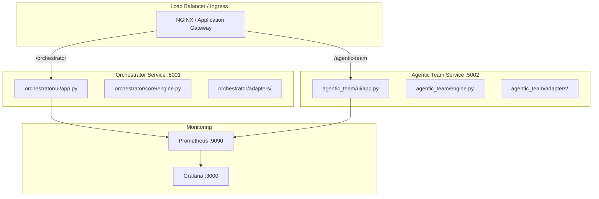
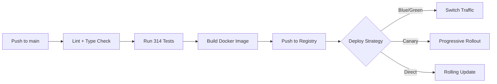
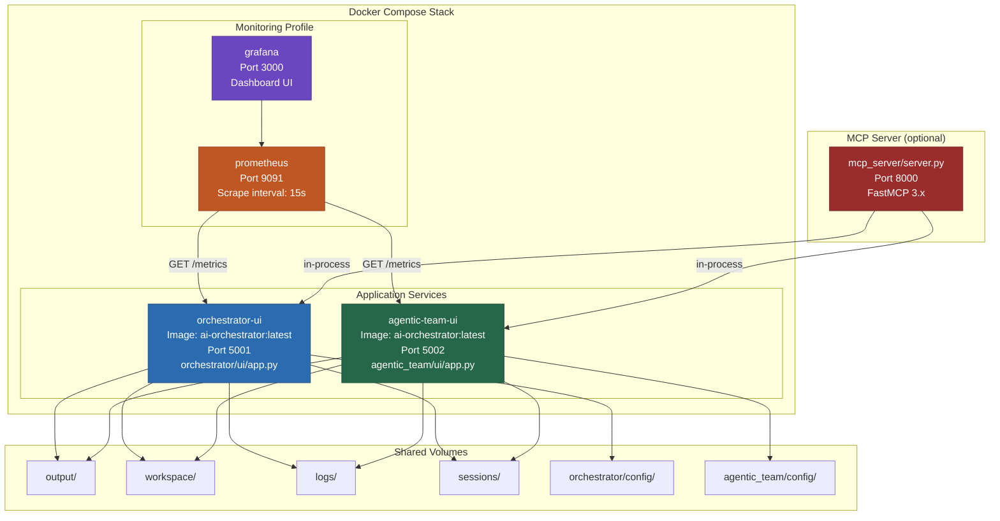
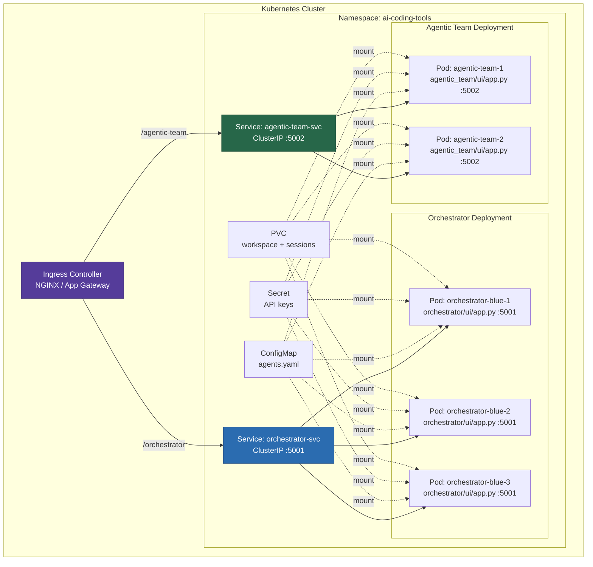
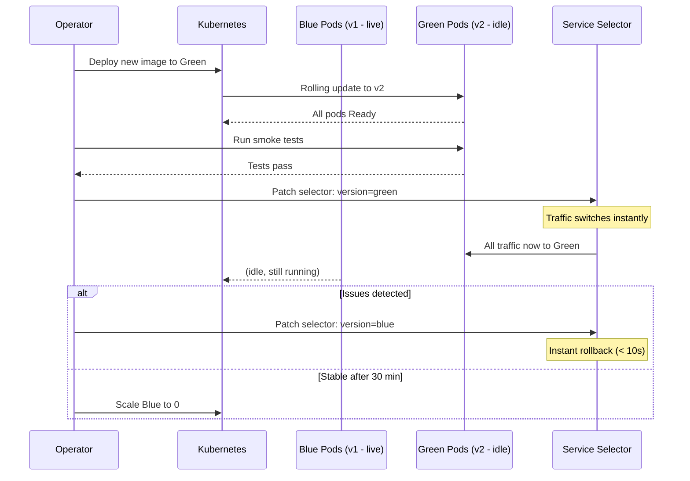
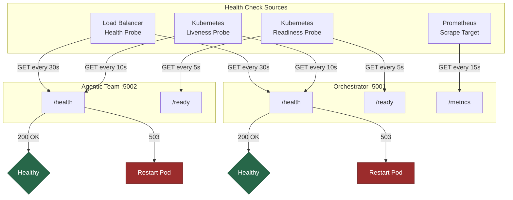
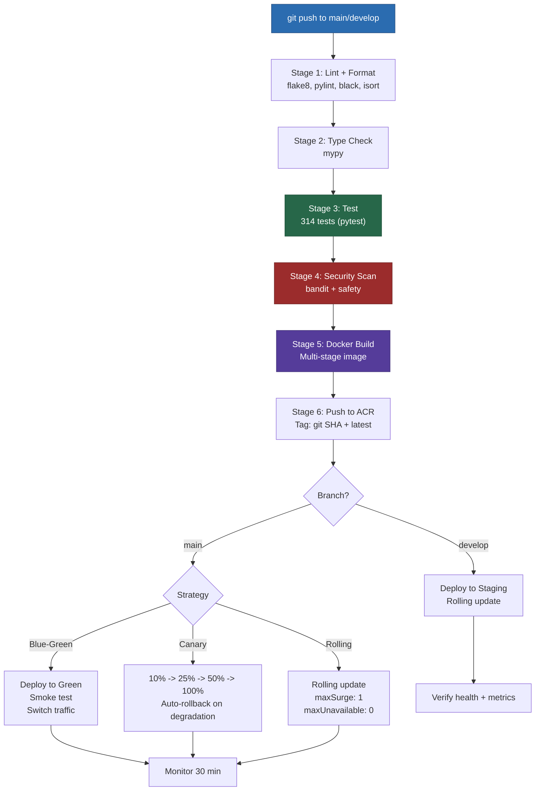
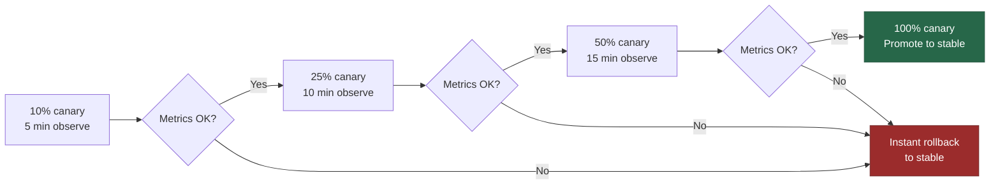

# Production Deployment Guide

Complete guide for deploying the AI Coding Tools — **two independent systems** that can be deployed together or separately.

> [!NOTE]
> **Key:** The Orchestrator (port 5001) and Agentic Team (port 5002) are independent services. Each has its own config, adapters, and UI. Deploy both or either one.

## Deployment Architecture



## CI/CD Pipeline



## Quick Start

```bash
# Docker Compose (both services)
docker compose up --build -d
# Orchestrator: http://localhost:5001
# Agentic Team: http://localhost:5002

# Kubernetes
kubectl apply -f deployment/kubernetes/deployment.yaml
kubectl apply -f deployment/kubernetes/service.yaml
```

## Docker Compose Service Topology

The `docker-compose.yml` defines the complete local/staging deployment. All services share volumes but run independently.



## Kubernetes Pod and Service Architecture

When deployed to Kubernetes, each system runs as a separate Deployment with its own Service, behind a shared Ingress.



## Azure Deployment

This deployment guide covers a complete production-ready Azure infrastructure stack featuring:

- ✅ **Azure Kubernetes Service (AKS)** - Managed Kubernetes with auto-scaling
- ✅ **Azure Container Registry (ACR)** - Private Docker registry with geo-replication
- ✅ **Azure Application Gateway** - Layer 7 load balancer with WAF
- ✅ **Azure Front Door** - Global load balancer with CDN
- ✅ **Azure Key Vault** - Secrets and certificate management
- ✅ **Azure Redis Cache** - Premium Redis for caching
- ✅ **Azure Monitor** - Comprehensive monitoring and alerting
- ✅ **Application Insights** - APM and distributed tracing
- ✅ **Azure Files** - Persistent storage for workspaces
- ✅ **Terraform** - Infrastructure as Code
- ✅ **Blue-Green & Canary Deployments** - Zero-downtime releases

## Architecture

### High-Level Architecture

```
                           Internet
                              |
                              v
                   ┌──────────────────────┐
                   │  Azure Front Door    │ ← Global Load Balancer + CDN
                   │  (Premium Tier)      │
                   └──────────────────────┘
                              |
                              v
                   ┌──────────────────────┐
                   │ Application Gateway  │ ← Regional Load Balancer + WAF
                   │  (WAF_v2)            │
                   └──────────────────────┘
                              |
          ┌───────────────────┴───────────────────┐
          v                                       v
┌─────────────────────┐               ┌─────────────────────┐
│   Primary Region    │               │  Secondary Region   │
│     (East US)       │               │    (West US 2)      │
│                     │               │                     │
│  ┌──────────────┐   │               │  ┌──────────────┐   │
│  │     AKS      │   │               │  │     AKS      │   │
│  │  (v1.28)     │   │               │  │  (Standby)   │   │
│  │              │   │               │  │              │   │
│  │  ┌────────┐  │   │               │  │  ┌────────┐  │   │
│  │  │ Blue   │  │   │               │  │  │ Blue   │  │   │
│  │  │ Pods   │  │   │               │  │  │ Pods   │  │   │
│  │  └────────┘  │   │               │  │  └────────┘  │   │
│  │  ┌────────┐  │   │               │  │              │   │
│  │  │ Green  │  │   │               │  └──────────────┘   │
│  │  │ Pods   │  │   │               │                     │
│  │  └────────┘  │   │               │  ┌──────────────┐   │
│  └──────────────┘   │               │  │     ACR      │   │
│                     │               │  │  (Replica)   │   │
│  ┌──────────────┐   │               │  └──────────────┘   │
│  │     ACR      │───┼─────────────────────────────────────┘
│  │  (Premium)   │   │ Geo-Replication
│  └──────────────┘   │
│                     │
│  ┌──────────────┐   │
│  │ Key Vault    │   │
│  │  (Premium)   │   │
│  └──────────────┘   │
│                     │
│  ┌──────────────┐   │
│  │ Redis Cache  │   │
│  │  (Premium)   │   │
│  └──────────────┘   │
│                     │
│  ┌──────────────┐   │
│  │ Azure Files  │   │
│  │  (Premium)   │   │
│  └──────────────┘   │
│                     │
│  ┌──────────────┐   │
│  │   Monitor    │   │
│  │ + App Insights│  │
│  └──────────────┘   │
└─────────────────────┘
```

### Network Architecture

```
Azure Virtual Network (10.0.0.0/16)
│
├── AKS Subnet (10.0.1.0/24)
│   ├── System Node Pool (3-20 nodes)
│   └── User Node Pool (3-20 nodes)
│
├── Application Gateway Subnet (10.0.2.0/24)
│   └── Application Gateway v2
│
└── Private Endpoints Subnet (10.0.3.0/24)
    ├── ACR Private Endpoint
    ├── Key Vault Private Endpoint
    └── Storage Private Endpoint
```

### Runtime Profiles

The orchestrator now supports three deployment/runtime profiles:

1. **Cloud-only**
   - Use CLI-backed cloud agents only (`type: cli`)
   - Keep local agents disabled
   - `settings.offline.enabled: false`

2. **Hybrid (recommended for resilience)**
   - Use cloud agents for primary steps
   - Configure local agents (`type: ollama` / `type: llamacpp`) as fallback
   - Enable fallback routing in `settings.fallback`

3. **Offline/local-only**
   - Enable local agents only
   - Run with `--offline` in CLI jobs or set `settings.offline.enabled: true`
   - Ensure local model endpoints are reachable from the runtime network namespace

### Local Backend Connectivity in Kubernetes

If using local model backends in cluster deployments, expose them as internal services:

- `ollama.<namespace>.svc.cluster.local:11434`
- `<llamacpp-service>.<namespace>.svc.cluster.local:8080`

Then set agent endpoints accordingly in `orchestrator/config/agents.yaml`.

## Azure Services

### 1. Azure Kubernetes Service (AKS)

**Configuration:**
- **Version**: 1.28 (latest stable)
- **Node Pools**:
  - System: 3-20 nodes (Standard_D4s_v3)
  - User: 3-20 nodes (Standard_D4s_v3)
- **Networking**: Azure CNI with Calico network policy
- **Auto-scaling**: Enabled (cluster and pod level)
- **Azure Policy**: Enabled for governance
- **Monitoring**: Azure Monitor + Container Insights
- **Security**: Managed identity, Azure RBAC, Key Vault integration

**Features:**
- Multi-zone deployment for high availability
- Automatic OS and security patching
- Built-in secrets management via Key Vault
- Network policies for micro-segmentation
- Pod security policies enforcement

### 2. Azure Container Registry (ACR)

**Configuration:**
- **SKU**: Premium
- **Features**:
  - Geo-replication (East US → West US 2)
  - Container scanning (Microsoft Defender)
  - Content trust (signed images)
  - Image retention policies (30 days)
  - Network restrictions (VNet integration)
  - Private endpoints

**Benefits:**
- Low-latency pulls from any region
- Automatic image replication
- Vulnerability scanning
- Immutable image tags

### 3. Azure Application Gateway

**Configuration:**
- **SKU**: WAF_v2
- **Features**:
  - Web Application Firewall (OWASP 3.1)
  - SSL/TLS termination
  - URL-based routing
  - Session affinity
  - Health probes
  - Auto-scaling (2-10 instances)

**Security:**
- DDoS protection
- Bot protection
- IP allow/deny lists
- Rate limiting
- Custom WAF rules

### 4. Azure Front Door

**Configuration:**
- **SKU**: Premium
- **Features**:
  - Global HTTP/HTTPS load balancing
  - CDN capabilities
  - SSL offloading
  - URL-based routing
  - Session affinity
  - Health probes
  - Private Link to backend

**Benefits:**
- Reduced latency (edge caching)
- Increased availability (multi-region)
- DDoS protection
- Bot protection
- Web Application Firewall

### 5. Azure Key Vault

**Configuration:**
- **SKU**: Premium (HSM-backed)
- **Features**:
  - Secrets management
  - Certificate management
  - Key management with HSM
  - Soft delete (90 days)
  - Purge protection
  - Network restrictions
  - Private endpoint
  - RBAC access control

**Integration:**
- AKS CSI driver for secrets
- Automatic rotation (2-minute interval)
- Audit logging to Azure Monitor

### 6. Azure Redis Cache

**Configuration:**
- **SKU**: Premium P1 (6 GB)
- **Features**:
  - Data persistence
  - Geo-replication
  - VNet integration
  - TLS 1.2 enforcement
  - Patch scheduling (Sunday 2 AM UTC)
  - Maxmemory policy: allkeys-lru

**Use Cases:**
- Session caching
- API response caching
- Task queue management
- Rate limiting

### 7. Azure Monitor + Application Insights

**Configuration:**
- **Log Analytics Workspace**: 30-day retention
- **Application Insights**: Transaction tracking
- **Container Insights**: Pod and node metrics
- **Metrics**:
  - CPU, memory, disk, network
  - Request rates, latency, errors
  - Custom application metrics
  - Kubernetes events

**Alerting:**
- High CPU/memory usage
- Pod crash loops
- Failed deployments
- Slow response times
- High error rates

### 8. Azure Files (Premium)

**Configuration:**
- **Tier**: Premium (SSD-backed)
- **Shares**:
  - `workspace`: 100 GB (AI agent workspaces)
  - `sessions`: 50 GB (user sessions)
- **Features**:
  - SMB 3.0 protocol
  - Encryption at rest and in transit
  - Snapshots for backup
  - Integration with AKS via CSI driver

## Prerequisites

### Tools Required

```bash
# Azure CLI (v2.54.0+)
curl -sL https://aka.ms/InstallAzureCLIDeb | sudo bash

# Terraform (v1.5.0+)
wget https://releases.hashicorp.com/terraform/1.6.0/terraform_1.6.0_linux_amd64.zip
unzip terraform_1.6.0_linux_amd64.zip
sudo mv terraform /usr/local/bin/

# kubectl (v1.28+)
curl -LO "https://dl.k8s.io/release/$(curl -L -s https://dl.k8s.io/release/stable.txt)/bin/linux/amd64/kubectl"
sudo install -o root -g root -m 0755 kubectl /usr/local/bin/kubectl

# Helm (v3.12+)
curl https://raw.githubusercontent.com/helm/helm/main/scripts/get-helm-3 | bash
```

### Azure Subscription Requirements

- **Subscription Type**: Pay-As-You-Go or Enterprise Agreement
- **Required Permissions**:
  - Owner or Contributor role on subscription
  - Ability to create service principals
  - Ability to create resources in East US and West US 2

- **Resource Quotas** (verify with `az vm list-usage`):
  - vCPU quota: 64+ cores per region
  - Public IP addresses: 10+ per region
  - Standard Load Balancers: 5+ per region
  - Network Interfaces: 100+ per region

### Cost Estimate

**Monthly cost breakdown (USD):**

| Service | Configuration | Est. Cost |
|---------|--------------|-----------|
| AKS (compute) | 6x D4s_v3 nodes | $~750 |
| AKS (management) | Free | $0 |
| ACR Premium | With geo-replication | $250 |
| Application Gateway | WAF_v2, 2 instances | $250 |
| Azure Front Door | Premium tier | $300 |
| Key Vault Premium | + operations | $50 |
| Redis Cache P1 | 6 GB Premium | $300 |
| Azure Files Premium | 150 GB | $200 |
| Log Analytics | 30-day retention | $150 |
| Bandwidth | Outbound transfer | $100 |
| **Total** | | **~$2,350/month** |

*Costs vary based on usage. Use Azure Pricing Calculator for accurate estimates.*

## Quick Start

### One-Command Deployment

```bash
# Clone repository
git clone https://github.com/hoangsonww/AI-Agents-Orchestrator.git
cd AI-Agents-Orchestrator

# Run deployment script
chmod +x deployment/azure/scripts/deploy.sh
./deployment/azure/scripts/deploy.sh
```

The script will:
1. ✅ Verify prerequisites
2. ✅ Login to Azure
3. ✅ Create Terraform backend
4. ✅ Deploy infrastructure with Terraform
5. ✅ Configure kubectl for AKS
6. ✅ Install NGINX Ingress Controller
7. ✅ Install cert-manager for TLS
8. ✅ Install Prometheus + Grafana
9. ✅ Apply Kubernetes manifests
10. ✅ Verify deployment

**Duration**: ~30 minutes

## Detailed Setup

### Step 1: Azure Login

```bash
# Login to Azure
az login

# Set subscription
az account set --subscription "YOUR_SUBSCRIPTION_ID"

# Verify
az account show
```

### Step 2: Create Service Principal (for CI/CD)

```bash
# Create service principal
az ad sp create-for-rbac \
  --name "ai-orchestrator-sp" \
  --role Contributor \
  --scopes /subscriptions/YOUR_SUBSCRIPTION_ID \
  --sdk-auth

# Save output (contains clientId, clientSecret, tenantId, subscriptionId)
```

### Step 3: Deploy Infrastructure with Terraform

```bash
cd deployment/azure/terraform

# Initialize Terraform
terraform init

# Review plan
terraform plan \
  -var="environment=production" \
  -var="location=eastus" \
  -out=tfplan

# Apply
terraform apply tfplan

# Save outputs
terraform output -json > ../outputs.json
```

### Step 4: Configure kubectl

```bash
# Get AKS credentials
az aks get-credentials \
  --resource-group ai-orchestrator-production-rg \
  --name ai-orchestrator-production-aks \
  --overwrite-existing

# Verify
kubectl cluster-info
kubectl get nodes
```

### Step 5: Install Core Components

```bash
# Install NGINX Ingress
helm repo add ingress-nginx https://kubernetes.github.io/ingress-nginx
helm repo update
helm upgrade --install ingress-nginx ingress-nginx/ingress-nginx \
  --namespace ingress-nginx \
  --create-namespace \
  --set controller.service.annotations."service\.beta\.kubernetes\.io/azure-load-balancer-health-probe-request-path"=/healthz

# Install cert-manager
helm repo add jetstack https://charts.jetstack.io
helm upgrade --install cert-manager jetstack/cert-manager \
  --namespace cert-manager \
  --create-namespace \
  --set installCRDs=true

# Install Prometheus stack
helm repo add prometheus-community https://prometheus-community.github.io/helm-charts
helm upgrade --install kube-prometheus-stack prometheus-community/kube-prometheus-stack \
  --namespace monitoring \
  --create-namespace \
  --set prometheus.prometheusSpec.retention=30d \
  --set grafana.enabled=true
```

### Step 6: Deploy Application

```bash
# Create namespace
kubectl create namespace ai-orchestrator

# Apply manifests
kubectl apply -f deployment/kubernetes/ -n ai-orchestrator

# Wait for deployment
kubectl rollout status deployment/ai-orchestrator-blue -n ai-orchestrator
```

### Step 6.1: Configure Agent Runtime Mode

After deploying manifests, ensure `orchestrator/config/agents.yaml` (or ConfigMap-mounted equivalent) matches your runtime profile.

**Hybrid example (cloud primary + local fallback):**

```yaml
agents:
  claude:
    type: cli
    command: claude
    enabled: true

  local-instruct:
    type: ollama
    endpoint: http://ollama.ai-orchestrator.svc.cluster.local:11434
    model: mistral:7b-instruct
    offline: true
    enabled: true

workflows:
  hybrid:
    steps:
      - agent: claude
        role: reviewer
        fallback: local-instruct

settings:
  fallback:
    enabled: true
    map:
      claude: local-instruct
```

Apply config and restart pods after changes:

```bash
kubectl apply -f deployment/kubernetes/configmap.yaml -n ai-orchestrator
kubectl rollout restart deployment/ai-orchestrator-blue -n ai-orchestrator
```

### Step 7: Build and Push Docker Image

```bash
# Login to ACR
az acr login --name aiorchestrator productionacr

# Build and push
az acr build \
  --registry aiorchestrator productionacr \
  --image ai-orchestrator:latest \
  --image ai-orchestrator:$(git rev-parse --short HEAD) \
  .
```

### Step 8: Configure DNS

```bash
# Get Application Gateway public IP
az network public-ip show \
  --resource-group ai-orchestrator-production-rg \
  --name ai-orchestrator-production-appgw-pip \
  --query ipAddress -o tsv

# Create A record in your DNS provider pointing to this IP
# Example: ai-orchestrator.yourdomain.com -> 20.85.123.45
```

### Step 9: Configure TLS

```bash
# Create ClusterIssuer for Let's Encrypt
kubectl apply -f - <<EOF
apiVersion: cert-manager.io/v1
kind: ClusterIssuer
metadata:
  name: letsencrypt-prod
spec:
  acme:
    server: https://acme-v02.api.letsencrypt.org/directory
    email: admin@yourdomain.com
    privateKeySecretRef:
      name: letsencrypt-prod
    solvers:
    - http01:
        ingress:
          class: nginx
EOF

# Certificate will be automatically issued when Ingress is created
```

## Deployment Strategies

### Blue-Green Deployment

The blue-green strategy maintains two identical environments. Only one receives live traffic at a time. Switching is instantaneous via a Kubernetes Service selector update.



**Process:**

1. **Deploy to Green environment**:
```bash
# Update green deployment
kubectl set image deployment/ai-orchestrator-green \
  ai-orchestrator=aiorchestrator productionacr.azurecr.io/ai-orchestrator:v2.0.0 \
  -n ai-orchestrator

# Scale up green
kubectl scale deployment/ai-orchestrator-green --replicas=3 -n ai-orchestrator

# Wait for readiness
kubectl rollout status deployment/ai-orchestrator-green -n ai-orchestrator
```

2. **Run smoke tests**:
```bash
# Test green pods directly
GREEN_POD=$(kubectl get pod -n ai-orchestrator -l version=green -o jsonpath='{.items[0].metadata.name}')
kubectl exec -n ai-orchestrator $GREEN_POD -- curl http://localhost:5001/health
```

3. **Switch traffic**:
```bash
# Option 1: Automated script
./deployment/scripts/blue-green-switch.sh blue green

# Option 2: Manual
kubectl patch service ai-orchestrator-service -n ai-orchestrator \
  -p '{"spec":{"selector":{"version":"green"}}}'
```

4. **Monitor and verify**:
```bash
# Watch metrics in Azure Monitor
# Check logs
kubectl logs -n ai-orchestrator -l version=green --tail=100 -f

# If issues, instant rollback:
kubectl patch service ai-orchestrator-service -n ai-orchestrator \
  -p '{"spec":{"selector":{"version":"blue"}}}'
```

5. **Scale down blue**:
```bash
# After 30 minutes of stable operation
kubectl scale deployment/ai-orchestrator-blue --replicas=0 -n ai-orchestrator
```

**Rollback Time**: < 10 seconds

### Canary Deployment

**Progressive Rollout Stages:**

1. **10% Traffic** (5 minutes):
```bash
kubectl scale deployment/ai-orchestrator-stable --replicas=5 -n ai-orchestrator
kubectl scale deployment/ai-orchestrator-canary --replicas=1 -n ai-orchestrator
```

2. **25% Traffic** (10 minutes):
```bash
kubectl scale deployment/ai-orchestrator-stable --replicas=3 -n ai-orchestrator
kubectl scale deployment/ai-orchestrator-canary --replicas=1 -n ai-orchestrator
```

3. **50% Traffic** (15 minutes):
```bash
kubectl scale deployment/ai-orchestrator-stable --replicas=1 -n ai-orchestrator
kubectl scale deployment/ai-orchestrator-canary --replicas=1 -n ai-orchestrator
```

4. **100% Traffic** (10 minutes):
```bash
kubectl scale deployment/ai-orchestrator-stable --replicas=0 -n ai-orchestrator
kubectl scale deployment/ai-orchestrator-canary --replicas=3 -n ai-orchestrator
```

**Automated with script**:
```bash
./deployment/scripts/canary-rollout.sh
```

**Rollback Time**: < 30 seconds (automatic on metrics degradation)

### Rolling Update

Standard Kubernetes rolling update:

```bash
# Update image
kubectl set image deployment/ai-orchestrator \
  ai-orchestrator=aiorchestrator productionacr.azurecr.io/ai-orchestrator:v2.0.0 \
  -n ai-orchestrator

# Monitor
kubectl rollout status deployment/ai-orchestrator -n ai-orchestrator

# Rollback if needed
kubectl rollout undo deployment/ai-orchestrator -n ai-orchestrator
```

## Monitoring & Observability

### Health Check Flow

Both services expose `/health` and `/ready` endpoints. Kubernetes liveness and readiness probes, load balancers, and monitoring stacks all rely on these endpoints.



### Azure Monitor

**Access Azure Monitor**:
```bash
# Open in browser
az monitor metrics list \
  --resource $(az aks show -g ai-orchestrator-production-rg -n ai-orchestrator-production-aks --query id -o tsv) \
  --metric-names "node_cpu_usage_percentage"
```

**Key Metrics**:
- CPU usage (nodes and pods)
- Memory usage
- Disk I/O
- Network traffic
- Request rates
- Error rates
- Latency (p50, p95, p99)

### Application Insights

**View in Azure Portal**:
1. Navigate to Application Insights resource
2. View Application Map (service dependencies)
3. Check Performance blade (slow requests)
4. Review Failures blade (exceptions)
5. Analyze Live Metrics (real-time telemetry)

**Query with KQL**:
```kusto
// Top 10 slowest requests
requests
| where timestamp > ago(1h)
| summarize avg(duration) by operation_Name
| top 10 by avg_duration desc

// Error rate by hour
requests
| where timestamp > ago(24h)
| summarize
    total = count(),
    errors = countif(success == false)
    by bin(timestamp, 1h)
| project timestamp, error_rate = (errors * 100.0) / total
```

### Grafana Dashboards

**Access Grafana**:
```bash
# Port-forward to Grafana
kubectl port-forward -n monitoring svc/kube-prometheus-stack-grafana 3000:80

# Open http://localhost:3000
# Username: admin, Password: admin123
```

**Import Dashboards**:
- Kubernetes Cluster Monitoring (ID: 7249)
- Node Exporter Full (ID: 1860)
- Kubernetes Pod Monitoring (ID: 6417)
- NGINX Ingress Controller (ID: 9614)

### Log Analytics

**Query Logs**:
```kusto
// Container logs
ContainerLog
| where Namespace == "ai-orchestrator"
| where TimeGenerated > ago(1h)
| project TimeGenerated, Computer, ContainerID, LogEntry
| order by TimeGenerated desc

// Performance metrics
Perf
| where TimeGenerated > ago(1h)
| where ObjectName == "K8SContainer"
| summarize avg(CounterValue) by CounterName, bin(TimeGenerated, 5m)
```

### Alerts

**Configure Alerts**:

1. **High CPU Alert**:
```bash
az monitor metrics alert create \
  --name "aks-high-cpu" \
  --resource-group ai-orchestrator-production-rg \
  --scopes $(az aks show -g ai-orchestrator-production-rg -n ai-orchestrator-production-aks --query id -o tsv) \
  --condition "avg node_cpu_usage_percentage > 80" \
  --window-size 5m \
  --evaluation-frequency 1m \
  --action-group-id /subscriptions/.../actionGroups/...
```

2. **Pod Crash Alert**:
```bash
az monitor metrics alert create \
  --name "pod-crash-loop" \
  --resource-group ai-orchestrator-production-rg \
  --scopes $(az aks show -g ai-orchestrator-production-rg -n ai-orchestrator-production-aks --query id -o tsv) \
  --condition "avg kube_pod_container_status_restarts_total > 5" \
  --window-size 15m \
  --evaluation-frequency 5m
```

## Security

### Network Security

**Network Security Groups (NSGs)**:
```bash
# AKS subnet - restrict inbound
az network nsg rule create \
  --resource-group ai-orchestrator-production-rg \
  --nsg-name aks-nsg \
  --name allow-https \
  --priority 100 \
  --source-address-prefixes Internet \
  --destination-port-ranges 443 \
  --access Allow \
  --protocol Tcp
```

**Azure Firewall** (optional for advanced scenarios):
```bash
# Create Azure Firewall for egress filtering
az network firewall create \
  --name ai-orchestrator-firewall \
  --resource-group ai-orchestrator-production-rg \
  --location eastus
```

### Identity & Access Management

**Azure AD Integration**:
```bash
# Enable Azure AD integration for AKS
az aks update \
  --resource-group ai-orchestrator-production-rg \
  --name ai-orchestrator-production-aks \
  --enable-azure-rbac \
  --enable-aad
```

**Managed Identity**:
```bash
# AKS uses system-assigned managed identity by default
# Grant permissions to managed identity
az role assignment create \
  --assignee $(az aks show -g ai-orchestrator-production-rg -n ai-orchestrator-production-aks --query identityProfile.kubeletidentity.objectId -o tsv) \
  --role "Key Vault Secrets User" \
  --scope $(az keyvault show -n aiorchestrator productionkv --query id -o tsv)
```

### Secrets Management

**Key Vault Integration**:
```bash
# Create secret in Key Vault
az keyvault secret set \
  --vault-name aiorchestrator productionkv \
  --name openai-api-key \
  --value "sk-..."

# Use secret in pod via CSI driver
kubectl apply -f - <<EOF
apiVersion: v1
kind: Pod
metadata:
  name: test-pod
spec:
  containers:
  - name: app
    image: nginx
    volumeMounts:
    - name: secrets
      mountPath: "/mnt/secrets"
      readOnly: true
  volumes:
  - name: secrets
    csi:
      driver: secrets-store.csi.k8s.io
      readOnly: true
      volumeAttributes:
        secretProviderClass: "azure-kv-provider"
EOF
```

### Container Security

**Image Scanning with Microsoft Defender**:
```bash
# Enable Defender for Container Registry
az security pricing create \
  --name ContainerRegistry \
  --tier Standard

# View scan results
az security assessment list \
  --resource-id $(az acr show -n aiorchestrator productionacr --query id -o tsv)
```

**Pod Security Standards**:
```yaml
apiVersion: policy.kubernetes.io/v1beta1
kind: PodSecurityPolicy
metadata:
  name: restricted
spec:
  privileged: false
  allowPrivilegeEscalation: false
  requiredDropCapabilities:
    - ALL
  runAsUser:
    rule: MustRunAsNonRoot
  seLinux:
    rule: RunAsAny
  fsGroup:
    rule: RunAsAny
  volumes:
    - 'configMap'
    - 'emptyDir'
    - 'projected'
    - 'secret'
    - 'downwardAPI'
    - 'persistentVolumeClaim'
```

### Compliance

**Azure Policy for AKS**:
```bash
# Assign built-in policy initiative
az policy assignment create \
  --name "aks-baseline" \
  --display-name "AKS Baseline Security" \
  --scope $(az aks show -g ai-orchestrator-production-rg -n ai-orchestrator-production-aks --query id -o tsv) \
  --policy-set-definition /providers/Microsoft.Authorization/policySetDefinitions/a8640138-9b0a-4a28-b8cb-1666c838647d
```

**Supported Compliance Frameworks**:
- SOC 2 Type II
- ISO 27001
- PCI DSS
- HIPAA
- FedRAMP

## Disaster Recovery

### Backup Strategy

**AKS Backup with Velero**:
```bash
# Install Velero
helm repo add vmware-tanzu https://vmware-tanzu.github.io/helm-charts
helm upgrade --install velero vmware-tanzu/velero \
  --namespace velero \
  --create-namespace \
  --set-file credentials.secretContents.cloud=./azure-credentials \
  --set configuration.provider=azure \
  --set configuration.backupStorageLocation.bucket=velero-backups \
  --set configuration.backupStorageLocation.config.resourceGroup=ai-orchestrator-production-rg \
  --set configuration.backupStorageLocation.config.storageAccount=aiorchestrator productionbackups \
  --set snapshotsEnabled=true

# Create backup schedule
velero schedule create daily-backup --schedule="0 2 * * *"

# Manual backup
velero backup create manual-backup-$(date +%Y%m%d)
```

**Database Backup** (if using Azure Database):
```bash
# Automated backups enabled by default
# Restore from backup
az postgres flexible-server restore \
  --resource-group ai-orchestrator-production-rg \
  --name ai-orchestrator-db-restored \
  --source-server ai-orchestrator-db \
  --restore-time "2024-01-15T10:00:00Z"
```

### Multi-Region Setup

**Secondary Region Deployment**:
```bash
# Deploy to secondary region (West US 2)
terraform apply \
  -var="location=westus2" \
  -var="environment=production-dr" \
  -target=azurerm_kubernetes_cluster.secondary

# Configure Traffic Manager for failover
az network traffic-manager profile create \
  --name ai-orchestrator-tm \
  --resource-group ai-orchestrator-production-rg \
  --routing-method Priority \
  --unique-dns-name ai-orchestrator-global

# Add endpoints
az network traffic-manager endpoint create \
  --name primary \
  --profile-name ai-orchestrator-tm \
  --resource-group ai-orchestrator-production-rg \
  --type azureEndpoints \
  --target-resource-id $(az network public-ip show -g ai-orchestrator-production-rg -n ai-orchestrator-production-appgw-pip --query id -o tsv) \
  --priority 1

az network traffic-manager endpoint create \
  --name secondary \
  --profile-name ai-orchestrator-tm \
  --resource-group ai-orchestrator-production-rg \
  --type azureEndpoints \
  --target-resource-id $(az network public-ip show -g ai-orchestrator-production-rg-dr -n ai-orchestrator-production-dr-appgw-pip --query id -o tsv) \
  --priority 2
```

### Recovery Time Objectives

- **RTO (Recovery Time Objective)**: < 15 minutes
- **RPO (Recovery Point Objective)**: < 5 minutes
- **Backup Frequency**: Every 6 hours
- **Backup Retention**: 30 days

### Failover Procedures

**Manual Failover**:
```bash
# 1. Verify secondary region health
kubectl --context=secondary get nodes
kubectl --context=secondary get pods -n ai-orchestrator

# 2. Update DNS to point to secondary
az network traffic-manager endpoint update \
  --name primary \
  --profile-name ai-orchestrator-tm \
  --resource-group ai-orchestrator-production-rg \
  --type azureEndpoints \
  --endpoint-status Disabled

# 3. Verify traffic flow
curl https://ai-orchestrator-global.trafficmanager.net/health
```

**Automated Failover**:
- Azure Traffic Manager automatically routes to secondary on health probe failure
- Failover time: 30-60 seconds
- No manual intervention required

## Cost Optimization

### Azure Cost Management

**View Costs**:
```bash
# Cost analysis
az consumption usage list \
  --start-date 2024-01-01 \
  --end-date 2024-01-31 \
  --query "[?contains(instanceName, 'ai-orchestrator')]"

# Set budget alerts
az consumption budget create \
  --budget-name ai-orchestrator-monthly \
  --amount 3000 \
  --time-grain Monthly \
  --start-date 2024-01-01 \
  --end-date 2024-12-31 \
  --resource-group ai-orchestrator-production-rg \
  --notifications threshold=80 contactEmails="admin@example.com"
```

### Optimization Strategies

1. **Use Azure Reserved Instances** (40-60% savings):
```bash
# Purchase 1-year or 3-year reservations for VMs
az reservations reservation-order purchase \
  --reservation-order-id ... \
  --sku Standard_D4s_v3 \
  --location eastus \
  --quantity 6 \
  --term P1Y
```

2. **Enable AKS Node Auto-scaling** (already configured):
- Scales down during low-traffic periods
- Scales up during peak loads
- Saves ~30-40% on compute costs

3. **Use Spot Instances for Dev/Test**:
```bash
# Add spot node pool
az aks nodepool add \
  --resource-group ai-orchestrator-production-rg \
  --cluster-name ai-orchestrator-production-aks \
  --name spot \
  --priority Spot \
  --eviction-policy Delete \
  --spot-max-price -1 \
  --enable-cluster-autoscaler \
  --min-count 0 \
  --max-count 10 \
  --node-vm-size Standard_D4s_v3
```

4. **Optimize Storage Tiers**:
- Hot: Frequently accessed data
- Cool: 30+ days retention (50% cheaper)
- Archive: 180+ days retention (90% cheaper)

5. **Right-size Resources**:
```bash
# View resource utilization
kubectl top nodes
kubectl top pods -n ai-orchestrator

# Adjust based on actual usage
```

### Cost Breakdown Optimized

| Service | Configuration | Original | Optimized | Savings |
|---------|--------------|----------|-----------|---------|
| AKS (compute) | 6x D4s_v3 nodes | $750 | $450 (w/ RI) | 40% |
| ACR Premium | Geo-replication | $250 | $250 | 0% |
| App Gateway | WAF_v2 | $250 | $250 | 0% |
| Azure Front Door | Premium | $300 | $300 | 0% |
| Key Vault | Premium | $50 | $50 | 0% |
| Redis Cache | P1 | $300 | $300 | 0% |
| Azure Files | 150 GB Premium | $200 | $150 (cool tier) | 25% |
| Monitoring | 30-day retention | $150 | $100 (optimized) | 33% |
| Bandwidth | Outbound | $100 | $80 (CDN) | 20% |
| **Total** | | **$2,350** | **$1,930** | **18%** |

## Troubleshooting

### Common Issues

#### 1. Pods Not Starting

**Symptoms**:
- Pods stuck in `Pending` or `CrashLoopBackOff`

**Diagnosis**:
```bash
# Check pod status
kubectl describe pod <pod-name> -n ai-orchestrator

# Check events
kubectl get events -n ai-orchestrator --sort-by='.lastTimestamp'

# Check logs
kubectl logs <pod-name> -n ai-orchestrator --previous
```

**Common Causes**:
- Insufficient node resources → Scale up node pool
- Image pull errors → Check ACR authentication
- Config errors → Verify ConfigMap and Secrets
- Health check failures → Adjust probe settings

#### 2. High Latency

**Diagnosis**:
```bash
# Check Application Insights
az monitor app-insights query \
  --app ai-orchestrator-production-ai \
  --analytics-query "requests | summarize avg(duration) by bin(timestamp, 5m)"

# Check HPA status
kubectl get hpa -n ai-orchestrator

# Check resource usage
kubectl top pods -n ai-orchestrator
```

**Solutions**:
- Scale up pods: `kubectl scale deployment/ai-orchestrator-blue --replicas=10`
- Enable Redis caching
- Optimize database queries
- Enable CDN caching

#### 3. Certificate Issues

**Symptoms**:
- HTTPS not working
- Browser certificate warnings

**Diagnosis**:
```bash
# Check cert-manager logs
kubectl logs -n cert-manager deployment/cert-manager

# Check certificate status
kubectl describe certificate -n ai-orchestrator

# Check certificate-request
kubectl get certificaterequest -n ai-orchestrator
```

**Solutions**:
```bash
# Delete and recreate certificate
kubectl delete certificate ai-orchestrator-tls -n ai-orchestrator
kubectl apply -f ingress.yaml

# Check Let's Encrypt rate limits
# Wait 1 hour if rate limited
```

#### 4. Local Model Fallback Not Triggering

**Symptoms**:
- Cloud step fails, but no fallback agent executes
- Workflow logs show primary agent errors only

**Diagnosis**:
```bash
# Confirm fallback settings are present in running config
kubectl exec -n ai-orchestrator deploy/ai-orchestrator-blue -- \
  sh -lc "grep -n \"fallback\" -n /app/orchestrator/config/agents.yaml || true"

# Verify local endpoint connectivity from pod
kubectl exec -n ai-orchestrator deploy/ai-orchestrator-blue -- \
  sh -lc "curl -sf http://ollama.ai-orchestrator.svc.cluster.local:11434/api/tags | head"

# Check orchestrator logs for fallback decisions
kubectl logs -n ai-orchestrator -l app=ai-orchestrator | grep -i fallback
```

**Common Causes**:
- `settings.fallback.enabled` is false
- No mapping for the primary agent in `settings.fallback.map`
- Step-level `fallback` points to a disabled/unavailable agent
- Local endpoint DNS/service not reachable from orchestrator pod

**Solutions**:
```bash
# Enable local agent(s) and fallback in config, then roll deployment
kubectl apply -f deployment/kubernetes/configmap.yaml -n ai-orchestrator
kubectl rollout restart deployment/ai-orchestrator-blue -n ai-orchestrator

# Verify local endpoint from pod after restart
kubectl exec -n ai-orchestrator deploy/ai-orchestrator-blue -- \
  sh -lc "curl -sf http://ollama.ai-orchestrator.svc.cluster.local:11434/api/tags | head"
```

#### 5. Node Pool Issues

**Diagnosis**:
```bash
# Check node status
kubectl get nodes

# Check node conditions
kubectl describe node <node-name>

# Check cluster autoscaler logs
kubectl logs -n kube-system deployment/cluster-autoscaler
```

**Solutions**:
```bash
# Manually scale node pool
az aks nodepool scale \
  --resource-group ai-orchestrator-production-rg \
  --cluster-name ai-orchestrator-production-aks \
  --name user \
  --node-count 5

# Restart node (drain + delete)
kubectl drain <node-name> --ignore-daemonsets --delete-emptydir-data
kubectl delete node <node-name>
```

### Debugging Commands

```bash
# Get all resources
kubectl get all -n ai-orchestrator

# Describe deployment
kubectl describe deployment ai-orchestrator-blue -n ai-orchestrator

# Check rollout history
kubectl rollout history deployment/ai-orchestrator-blue -n ai-orchestrator

# Get pod logs
kubectl logs -f deployment/ai-orchestrator-blue -n ai-orchestrator

# Execute command in pod
kubectl exec -it <pod-name> -n ai-orchestrator -- /bin/bash

# Port-forward for debugging
kubectl port-forward svc/ai-orchestrator-service 5001:5001 -n ai-orchestrator

# Check network policies
kubectl get networkpolicies -n ai-orchestrator

# View events
kubectl get events --sort-by='.lastTimestamp' -n ai-orchestrator
```

### Azure Support

**Create Support Ticket**:
```bash
az support tickets create \
  --ticket-name "AKS-Issue-$(date +%Y%m%d)" \
  --title "AKS cluster issues" \
  --description "Pods not starting in AKS cluster" \
  --severity moderate \
  --problem-classification-id "/subscriptions/.../providers/Microsoft.Support/services/..."
```

## CI/CD Integration

### Pipeline Stages

The following diagram shows the complete CI/CD pipeline from code push through production deployment.



### Canary Rollout Stages



### Azure DevOps Pipeline

Create `.azure-pipelines.yml`:

```yaml
trigger:
  branches:
    include:
    - main
    - develop

variables:
  azureSubscription: 'your-service-connection'
  resourceGroup: 'ai-orchestrator-production-rg'
  aksCluster: 'ai-orchestrator-production-aks'
  acrName: 'aiorchestrator productionacr'
  imageRepository: 'ai-orchestrator'
  imageTag: '$(Build.BuildId)'

stages:
- stage: Build
  jobs:
  - job: BuildAndPush
    pool:
      vmImage: 'ubuntu-latest'
    steps:
    - task: Docker@2
      displayName: Build and push image
      inputs:
        containerRegistry: '$(acrName)'
        repository: '$(imageRepository)'
        command: 'buildAndPush'
        Dockerfile: '**/Dockerfile'
        tags: |
          $(imageTag)
          latest

- stage: DeployStaging
  condition: eq(variables['Build.SourceBranch'], 'refs/heads/develop')
  jobs:
  - deployment: DeployToStaging
    environment: 'staging'
    pool:
      vmImage: 'ubuntu-latest'
    strategy:
      runOnce:
        deploy:
          steps:
          - task: AzureCLI@2
            inputs:
              azureSubscription: '$(azureSubscription)'
              scriptType: 'bash'
              scriptLocation: 'inlineScript'
              inlineScript: |
                az aks get-credentials -g $(resourceGroup) -n $(aksCluster)
                kubectl set image deployment/ai-orchestrator-blue \
                  ai-orchestrator=$(acrName).azurecr.io/$(imageRepository):$(imageTag) \
                  -n ai-orchestrator

- stage: DeployProduction
  condition: eq(variables['Build.SourceBranch'], 'refs/heads/main')
  jobs:
  - deployment: DeployToProduction
    environment: 'production'
    pool:
      vmImage: 'ubuntu-latest'
    strategy:
      runOnce:
        deploy:
          steps:
          - task: AzureCLI@2
            displayName: Deploy to Green
            inputs:
              azureSubscription: '$(azureSubscription)'
              scriptType: 'bash'
              scriptLocation: 'inlineScript'
              inlineScript: |
                az aks get-credentials -g $(resourceGroup) -n $(aksCluster)
                kubectl set image deployment/ai-orchestrator-green \
                  ai-orchestrator=$(acrName).azurecr.io/$(imageRepository):$(imageTag) \
                  -n ai-orchestrator
                kubectl scale deployment/ai-orchestrator-green --replicas=3

          - task: ManualValidation@0
            displayName: 'Approve traffic switch'
            inputs:
              notifyUsers: 'admin@example.com'
              instructions: 'Verify green environment and approve traffic switch'

          - task: AzureCLI@2
            displayName: Switch Traffic
            inputs:
              azureSubscription: '$(azureSubscription)'
              scriptType: 'bash'
              scriptLocation: 'inlineScript'
              inlineScript: |
                kubectl patch service ai-orchestrator-service \
                  -n ai-orchestrator \
                  -p '{"spec":{"selector":{"version":"green"}}}'
                sleep 30
                kubectl scale deployment/ai-orchestrator-blue --replicas=0
```

### GitHub Actions

Already configured in `Jenkinsfile`, `.gitlab-ci.yml`, and `.circleci/config.yml`.

For Azure-specific GitHub Actions, add `.github/workflows/azure-deploy.yml`:

```yaml
name: Azure Deploy

on:
  push:
    branches: [ main, develop ]

env:
  AZURE_RESOURCE_GROUP: ai-orchestrator-production-rg
  AKS_CLUSTER: ai-orchestrator-production-aks
  ACR_NAME: aiorchestrator productionacr

jobs:
  build-and-deploy:
    runs-on: ubuntu-latest
    steps:
    - uses: actions/checkout@v3

    - name: Azure Login
      uses: azure/login@v1
      with:
        creds: ${{ secrets.AZURE_CREDENTIALS }}

    - name: ACR Login
      run: az acr login --name ${{ env.ACR_NAME }}

    - name: Build and Push
      run: |
        az acr build \
          --registry ${{ env.ACR_NAME }} \
          --image ai-orchestrator:${{ github.sha }} \
          --image ai-orchestrator:latest \
          .

    - name: Get AKS Credentials
      run: |
        az aks get-credentials \
          --resource-group ${{ env.AZURE_RESOURCE_GROUP }} \
          --name ${{ env.AKS_CLUSTER }}

    - name: Deploy to AKS
      run: |
        kubectl set image deployment/ai-orchestrator-blue \
          ai-orchestrator=${{ env.ACR_NAME }}.azurecr.io/ai-orchestrator:${{ github.sha }} \
          -n ai-orchestrator
        kubectl rollout status deployment/ai-orchestrator-blue -n ai-orchestrator
```

---

## Additional Resources

- [Azure Kubernetes Service Documentation](https://docs.microsoft.com/azure/aks/)
- [Azure Container Registry Documentation](https://docs.microsoft.com/azure/container-registry/)
- [Azure Monitor Documentation](https://docs.microsoft.com/azure/azure-monitor/)
- [Terraform Azure Provider](https://registry.terraform.io/providers/hashicorp/azurerm/latest/docs)
- [Project Architecture](./ARCHITECTURE.md)
- [Offline Mode Guide](./docs/OFFLINE_MODE.md)
- [General Deployment Guide](./deployment/DEPLOYMENT.md)

## Support

For Azure-specific issues:
1. Check [Azure Status](https://status.azure.com/)
2. Review [Azure Service Health](https://portal.azure.com/#blade/Microsoft_Azure_Health/AzureHealthBrowseBlade/serviceIssues)
3. Check logs in Azure Monitor
4. Open support ticket: `az support tickets create`

For application issues:
1. Check application logs: `kubectl logs -n ai-orchestrator -l app=ai-orchestrator`
2. Review metrics in Grafana
3. Check Application Insights
4. Open GitHub issue

---
