# Features Documentation

## Table of Contents

- [Core Features](#core-features)
- [Local LLM Support and Limits](#local-llm-support-and-limits)
- [Agentic Infrastructure](#agentic-infrastructure)
- [Agentic Team Features](#agentic-team-features)
- [CLI Features](#cli-features)
- [Web UI Features](#web-ui-features)
- [Conversation Mode](#conversation-mode)
- [Workflow System](#workflow-system)
- [AI Agent Integration](#ai-agent-integration)
- [Session Management](#session-management)
- [File Management](#file-management)
- [Security Features](#security-features)
- [Monitoring & Metrics](#monitoring--metrics)
- [Project-Scoped Context Graphs](#project-scoped-context-graphs)
- [Graphify — Code Knowledge Graph Engine](#graphify--code-knowledge-graph-engine)
  - [Obsidian Vault Export](#obsidian-vault-export)
- [Advanced Features](#advanced-features)
- [Production Readiness](#production-readiness)

## Core Features

### Multi-Agent Collaboration

The orchestrator coordinates multiple AI coding assistants to work together on complex tasks.

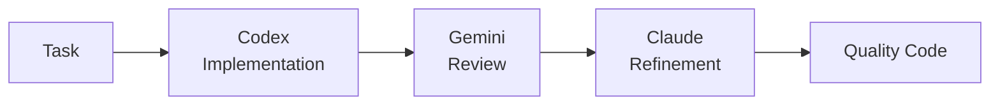

**Benefits:**
- **Diverse Perspectives**: Each AI has unique strengths
- **Quality Assurance**: Multiple review cycles
- **Best Practices**: Automated code review
- **Efficiency**: Parallel execution where possible

**Supported AI Agents:**
- **Claude Code** (Anthropic) - Refinement and documentation
- **OpenAI Codex** - Code implementation
- **Google Gemini** - Code review and analysis
- **GitHub Copilot** - Suggestions and alternatives

### Configurable Workflows

Define how agents collaborate for different scenarios.

| Workflow | Agents | Iterations | Use Case |
|----------|--------|------------|----------|
| **default** | Codex → Gemini → Claude | 3 | Production code with quality assurance |
| **quick** | Codex only | 1 | Fast prototyping |
| **thorough** | Codex → Copilot → Gemini → Claude → Gemini | 5 | Mission-critical code |
| **review-only** | Gemini → Claude | 2 | Existing code improvement |
| **document** | Claude → Gemini | 2 | Documentation generation |

**Custom Workflows:**
```yaml
workflows:
  custom:
    max_iterations: 4
    min_suggestions_threshold: 5
    steps:
      - agent: "codex"
        task: "implement"
      - agent: "gemini"
        task: "security_review"
      - agent: "claude"
        task: "refine"
```

### Local LLM Support and Limits

The platform supports local model adapters alongside Claude, Codex, Gemini, and Copilot. Local adapters participate in workflow routing, offline execution, and cloud-to-local fallback.

**Supported local adapter types:**
- `ollama`
- `llamacpp`
- `localai`
- `text-generation-webui`

| Adapter Family | Execution Path | Direct Workspace File Edits |
|----------|----------|----------|
| CLI adapters (`claude`, `codex`, `gemini`, `copilot`) | CLI process with workspace execution | ✅ Yes |
| Local adapters (`ollama`, `llamacpp`, `localai`, `text-generation-webui`) | HTTP completion APIs (`/api/generate`, `/v1/completions`) | ❌ No (text output only) |

**Best use for local models:**
- Offline drafting and analysis
- Review/support roles in hybrid workflows
- Continuity fallback when cloud agents are unavailable

**Operational support:**
- `./ai-orchestrator shell --offline`
- `./ai-orchestrator models status|list|pull|remove`

> [!IMPORTANT]
> While it is possible to make local LLMs directly edit files (e.g., via a `file-editor` tool), this approach is currently disabled to prevent unintended destructive changes. Local adapters are advisory — they provide text output that the Orchestrator can use to inform the next steps, but they do not have direct write access to the workspace. This design choice prioritizes safety and predictability while still leveraging local models for their strengths in drafting and feedback. The hard part is not feasibility, it’s safety and reliability: permissions, diff constraints, validation/tests before write, rollback, and preventing bad edits.

## Agentic Infrastructure

Beyond the core engines, the platform provides comprehensive infrastructure to empower AI agents:

### Specialized Agents

9 domain-expert agents available for both Claude and Codex:

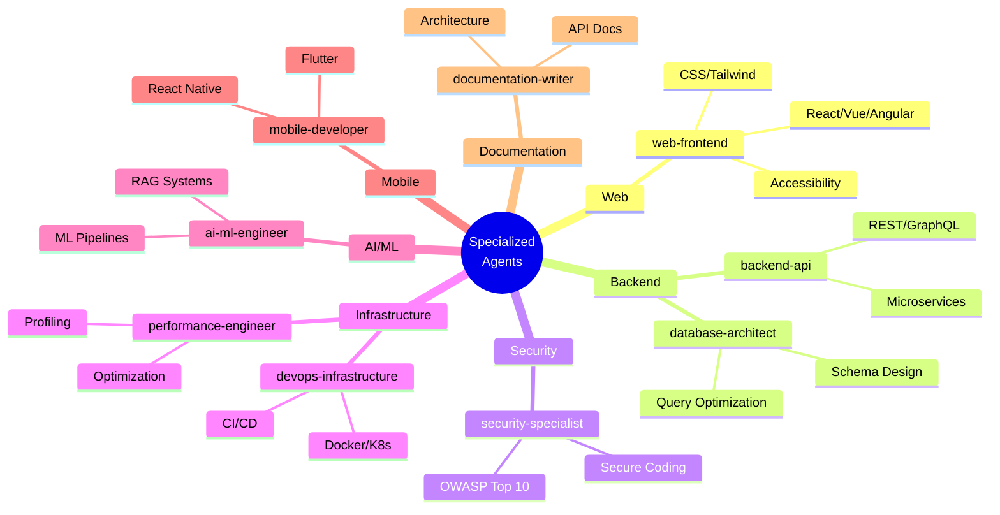

**Usage:**
```bash
# Claude with specialized agent
claude -a security-specialist "Review this authentication code"
claude -a backend-api "Design REST API for user management"

# Codex with specialized agent
codex --agent ai-ml-engineer "Build RAG pipeline"
```

### Skills Library

22 reusable skills across 6 categories:

| Category | Skills | Examples |
|----------|--------|----------|
| **Development** | 6 | react-components, rest-api-design, python-async |
| **Testing** | 4 | unit-testing, integration-testing, tdd |
| **Security** | 4 | input-validation, authentication, secure-coding |
| **DevOps** | 3 | docker-containerization, ci-cd-pipelines, kubernetes |
| **AI/ML** | 3 | embeddings-retrieval, llm-integration, rag-pipeline |
| **Documentation** | 3 | api-documentation, architecture-docs |

Skills activate automatically based on task context:
```bash
claude "Create a React component with unit tests"
# → Automatically uses: react-components, unit-testing skills
```

### MCP Tools

34+ tools exposed via Model Context Protocol:

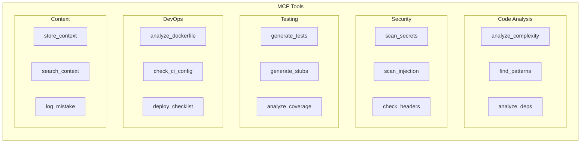

### Graph Context System

Persistent memory with hybrid search for learning from past tasks:

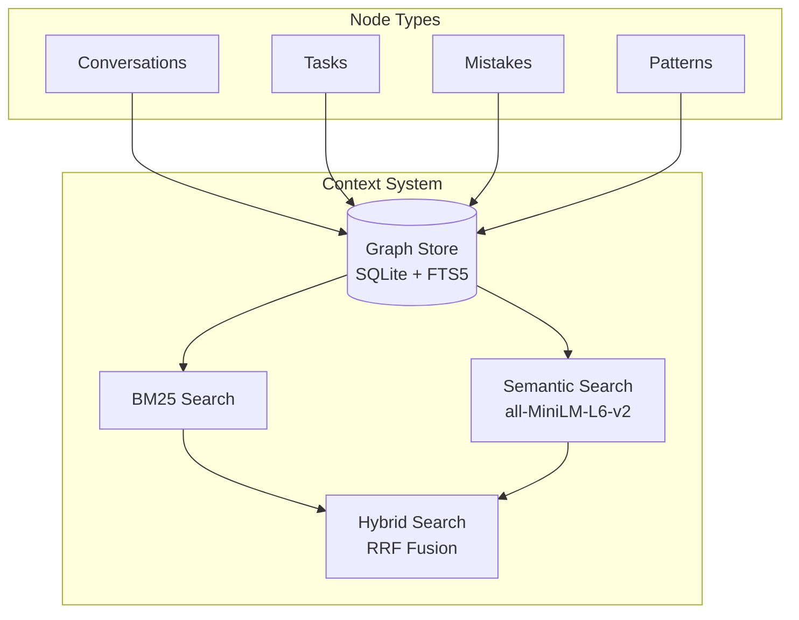

**Key Features:**
- 7 node types (Conversation, Task, Mistake, Pattern, Decision, CodeSnippet, Preference)
- 12 edge types for semantic relationships
- Hybrid search combining BM25 + semantic embeddings
- Automatic storage of completed tasks
- Mistake logging for learning
- **Obsidian vault export** — visualize context graphs in [Obsidian](https://obsidian.md)'s graph view with color-coded node types

**Usage:**
```python
from orchestrator.context import MemoryManager

manager = MemoryManager()

# Store task result
manager.store_task("Implement auth", outcome="completed", success=True)

# Log mistake for learning
manager.log_mistake(
    error_description="Forgot input validation",
    context="User registration",
    correction="Always validate with Pydantic"
)

# Search relevant context
results = manager.search("authentication patterns", limit=5)
```

### Domain Rules

Best practices encoded as rules:

| Category | Topics |
|----------|--------|
| **Security** | Input validation, authentication, secrets management |
| **Database** | Schema design, indexing, query optimization |
| **API Design** | REST conventions, versioning, error handling |
| **Performance** | Profiling, caching, async patterns |
| **AI/ML** | Data handling, embeddings, RAG pipelines |

📚 **[Full Agentic Infrastructure Documentation →](AGENTIC_INFRA.md)**

## Agentic Team Features

`AGENTIC_TEAM` is a standalone runtime that is separate from predefined orchestrator workflows. It models a true role-based software team with open routing between roles.

### True Inter-Role Communication

Roles pass messages and subtasks to each other dynamically on every turn.

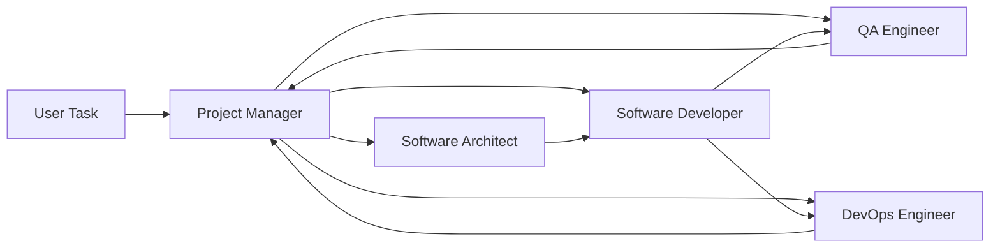

What this enables:
- Runtime routing decisions instead of fixed step chains.
- Cross-functional handoffs (for example developer -> QA -> PM).
- Role-level context accumulation through transcript history.

### Team Lead Gatekeeping

Only the lead role can finalize and return output to the user.

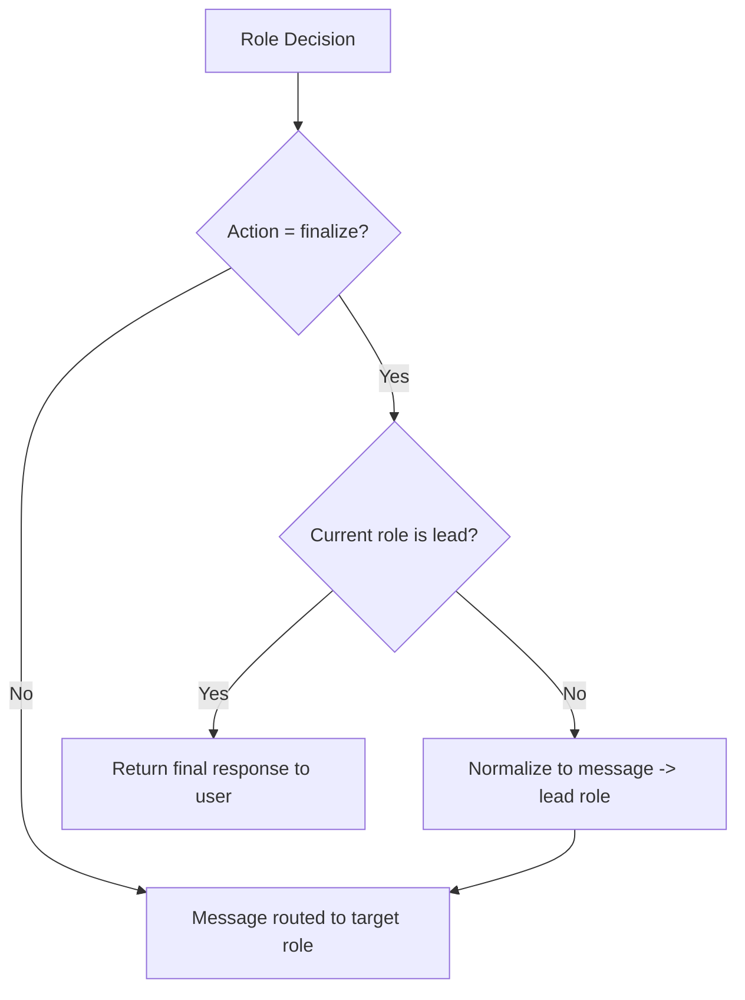

Behavioral guarantees:
- Non-lead finalize requests are rewritten to lead-directed messages.
- Invalid `to_role` routes are normalized to lead role.
- Team can run until lead finalization or max-turn cap.

### Model-Agnostic Role Mapping

Every role can be bound to any available model adapter (cloud or local).

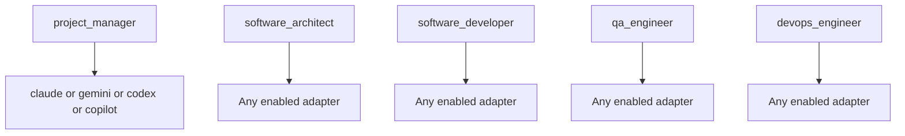

Validation rules:
- Run is blocked if any role maps to an unavailable agent.
- Defaults are auto-populated when mappings are missing.
- Guided config forms in UI keep values constrained.

### Live Communication Graph and Timeline

Standalone Agentic Team UI streams communication events in real time.

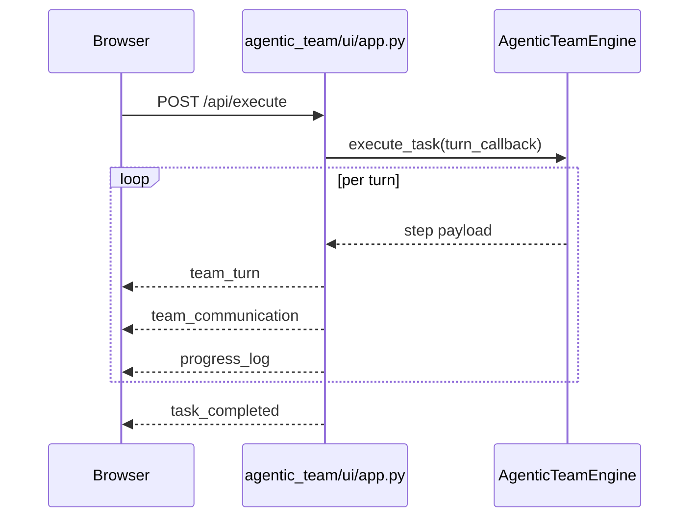

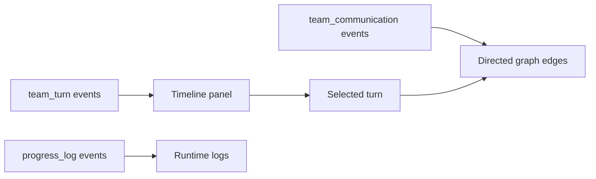

UI capabilities:
- Directed edge visualization for inter-role communication.
- Edge aggregation counts for repeated routes.
- Highlighting of latest and selected communication paths.
- Guided config editor for `agents`, `workflows`, `settings`, and `agentic_team`.

### Standalone Agentic CLI REPL

Agentic team mode is available in dedicated CLI mode:

```bash
./ai-orchestrator agentic-shell
./ai-orchestrator agentic-shell --max-turns 16
./ai-orchestrator agentic-shell --offline
```

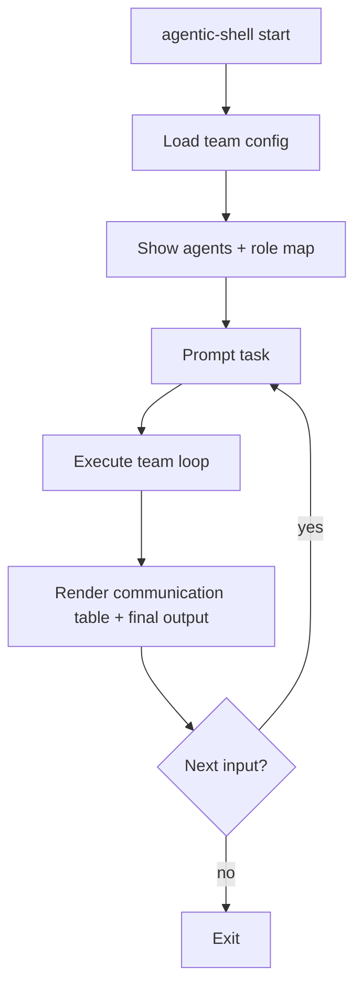

## MCP Server (Model Context Protocol)

Both systems are exposed as MCP tools via a FastMCP 3.x server, enabling integration with Claude Desktop, LLM agents, and any MCP-compatible client.

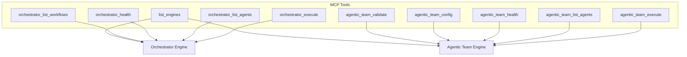

### Key MCP Features

- **10 tools** covering both engines: execute, list, health, config, validate
- **2 resources** serving live YAML configurations
- **Input validation** via `Annotated[T, Field()]` with automatic JSON schema
- **Dual transport**: stdio (Claude Desktop) and streamable HTTP (remote)
- **In-memory client** for fast testing without subprocess overhead
- **Python client wrappers**: `OrchestratorMCPClient` and `AgenticTeamMCPClient`
- **Lifespan management**: engines initialised once at server startup

## CLI Features

### Interactive Shell

<p align="center">
  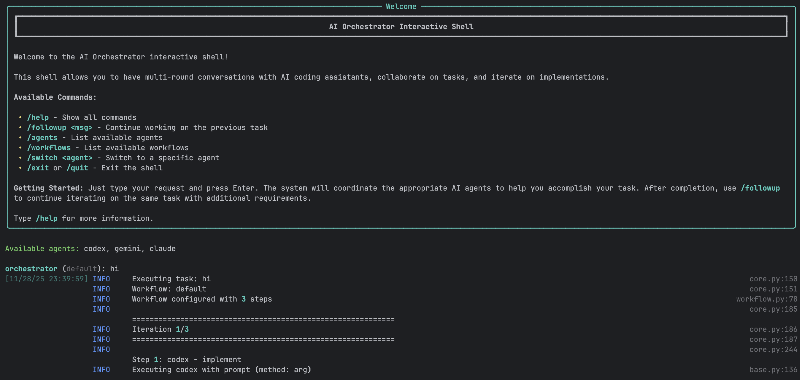
</p>

A powerful REPL-style interface for natural conversations with AI agents.

**Features:**
- ✅ Multi-round conversations with context preservation
- ✅ Smart follow-up detection
- ✅ Full readline support (arrow keys, history, tab completion)
- ✅ Session save/load
- ✅ Real-time progress indicators
- ✅ Colored output with Rich library
- ✅ Command history across sessions
- ✅ Auto-completion for commands and workflows

**Example Session:**

```bash
$ ./ai-orchestrator shell

orchestrator (default) > create a REST API for blog posts

✓ Task completed successfully!
📁 Generated Files:
  📄 api/blog.py
  📄 api/models.py
  📄 api/routes.py

Workspace: ./workspace

orchestrator (default) > add authentication with JWT

💡 Detected as follow-up to previous task
✓ Authentication added!
📁 Generated Files:
  📄 api/auth.py
  📄 api/middleware.py

orchestrator (default) > also add rate limiting

💡 Detected as follow-up to previous task
✓ Rate limiting implemented!

orchestrator (default) > /save blog-api-project
✓ Session saved to: sessions/blog-api-project.json

orchestrator (default) > /exit
Goodbye!
```

### CLI Commands

| Command | Description | Example |
|---------|-------------|---------|
| `/help` | Show all available commands | `/help` |
| `/followup <msg>` | Explicit follow-up to previous task | `/followup add tests` |
| `/agents` | List all available agents and status | `/agents` |
| `/workflows` | List all available workflows | `/workflows` |
| `/switch <agent>` | Switch to specific agent | `/switch claude` |
| `/workflow <name>` | Change current workflow | `/workflow thorough` |
| `/history` | Show conversation history | `/history` |
| `/context` | Show current context | `/context` |
| `/save [name]` | Save current session | `/save my-project` |
| `/load <name>` | Load saved session | `/load my-project` |
| `/reset` | Clear all context | `/reset` |
| `/info` | Show system information | `/info` |
| `/clear` | Clear screen | `/clear` |
| `/exit`, `/quit` | Exit the shell | `/exit` |

### One-Shot Mode

Execute single tasks without interactive shell:

```bash
# Basic usage
./ai-orchestrator run "Create a Python calculator"

# With workflow selection
./ai-orchestrator run "Build authentication system" --workflow default

# With options
./ai-orchestrator run "Refactor database layer" \
  --workflow thorough \
  --max-iterations 5 \
  --verbose

# Dry run to see execution plan
./ai-orchestrator run "Add error handling" --dry-run

# Custom output directory
./ai-orchestrator run "Generate CLI tool" --output ./my-output
```

### Smart Follow-Up Detection

The CLI automatically detects when messages should continue from previous tasks.

**Auto-Detected Keywords:**
- Action words: `add`, `also`, `now`, `then`, `next`, `improve`, `fix`, `change`, `update`
- Request words: `can you`, `please`, `try`, `would you`

**Behavior:**

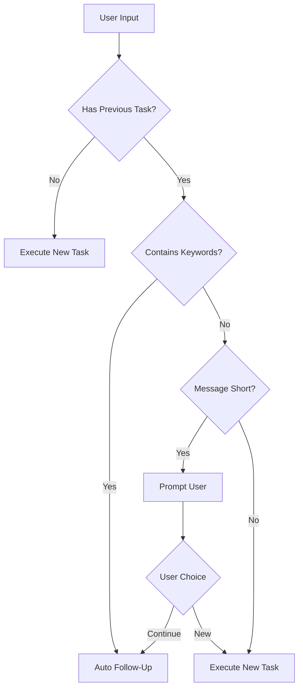

## Web UI Features

<p align="center">
  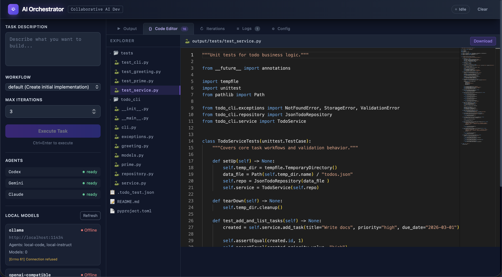
</p>

### Modern Interface

Built with Vue 3, the Web UI provides a rich visual experience:

**Technology Stack:**
- **Frontend**: Vue 3 (Composition API), Vite, TailwindCSS
- **State**: Pinia for reactive state management
- **Editor**: Monaco Editor (VS Code engine)
- **Real-time**: Socket.IO for live updates
- **Backend**: Flask with Flask-SocketIO

### Main Interface Components

**Left Sidebar:**
- Task input (multi-line textarea)
- Workflow selector dropdown
- Max iterations slider (1-10)
- Execute/Send Message button
- Agent status indicators (live)
- Generated files list (clickable)

**Main Content Area:**
- **Output Tab**: Full AI response with syntax highlighting
- **Code Editor Tab**: Monaco editor with VS Code features
- **Iterations Tab**: Detailed progress tracking

**Header:**
- Status badge (Idle/Running/Completed/Error)
- Conversation mode toggle
- Clear button

### Real-Time Features

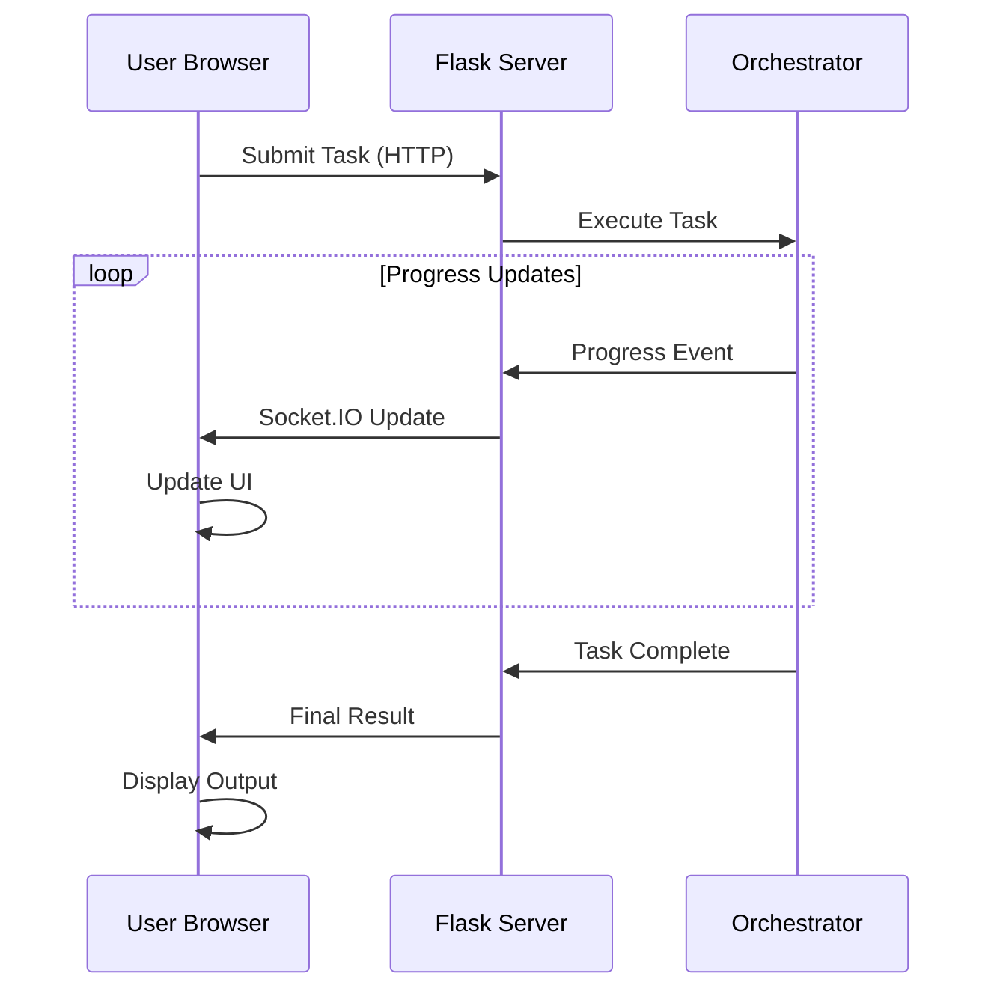

**Real-time Updates:**
- Agent status changes
- Progress indicators
- File creation notifications
- Error alerts
- Completion notifications

### Monaco Code Editor

Full-featured code editor integrated into the UI:

**Features:**
- Syntax highlighting for 100+ languages
- Line numbers and minimap
- Search and replace
- Multiple themes
- Keyboard shortcuts
- IntelliSense-style completion
- Error highlighting
- Code folding

**File Operations:**
- Open generated files with click
- Edit code in-place
- Download files individually
- Syntax-aware highlighting
- Auto-detection of language

### Conversation Mode Toggle

Enable ChatGPT-like continuous conversations:

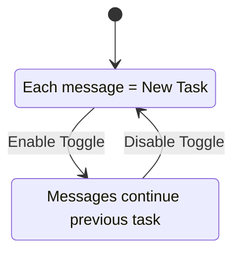

**When Enabled:**
- All messages automatically continue from previous task
- Button changes to "Send Message"
- Green indicator shows conversation is active
- Full context preserved across messages
- Visual hints show what you're continuing

**When Disabled:**
- Each message starts fresh task
- Button shows "Execute Task"
- No automatic context carryover

### Follow-Up Section

Separate green section for quick additions after task completion:

**Features:**
- Appears after any successful task
- Input box for follow-up message
- "Go" button to execute
- Works independently of conversation mode
- Shows previous task context

**Use Cases:**
- "add tests"
- "add error handling"
- "improve performance"
- "add documentation"

## Conversation Mode

### How It Works

**CLI Implementation:**
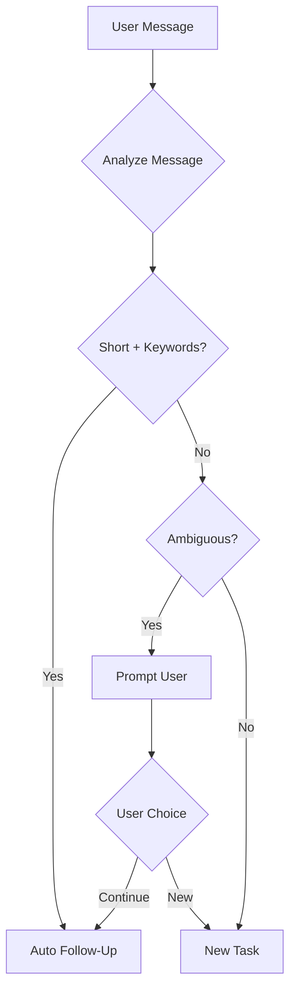

**UI Implementation:**
- Toggle checkbox controls mode
- Visual indicators show status
- Separate follow-up section
- Context preservation automatic

### Context Preservation

What gets preserved in conversation mode:

```yaml
context:
  previous_task: "create a REST API"
  previous_output: "Full AI response..."
  generated_files:
    - "api/routes.py"
    - "api/models.py"
  workspace: "./workspace"
  workflow: "default"
  timestamp: "2024-01-15T10:30:00Z"
```

### Best Practices

**Use Conversation Mode For:**
- ✅ Iterative feature development
- ✅ Multi-step refactoring
- ✅ Progressive enhancement
- ✅ Debug-and-fix cycles
- ✅ Building complex features

**Don't Use For:**
- ❌ Completely unrelated tasks
- ❌ Switching between projects
- ❌ One-off questions
- ❌ Starting fresh implementations

## Workflow System

### Workflow Execution Flow

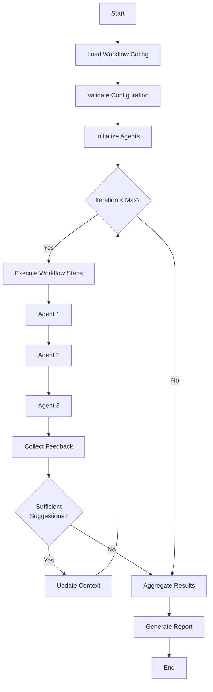

### Iteration Control

Workflows can iterate until quality thresholds are met:

**Iteration Triggers:**
- Review produces significant suggestions
- Code quality metrics below threshold
- Manual iteration request
- Maximum iterations not reached

**Stop Conditions:**
- Fewer than `min_suggestions_threshold` suggestions
- Maximum iterations reached
- All quality checks pass
- Manual stop requested

**Example:**
```yaml
settings:
  max_iterations: 3
  min_suggestions_threshold: 5
  quality_threshold: 0.8
```

## AI Agent Integration

### Agent Status Monitoring

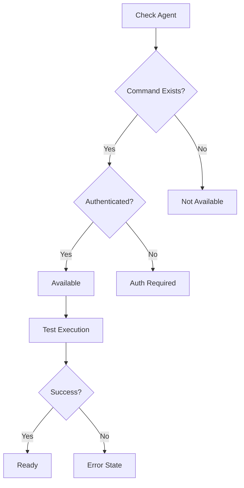

**Status Indicators:**
- ✅ **Available** - Ready to use
- ⚠️ **Auth Required** - Needs authentication
- ❌ **Not Found** - CLI not installed
- 🔴 **Error** - Configuration or execution error

### Agent Capabilities

**Codex (OpenAI):**
- Primary implementation agent
- Excellent at code generation
- Pattern recognition
- Quick iterations
- Best for: Initial implementations, boilerplate

**Gemini (Google):**
- Code review specialist
- SOLID principles analysis
- Security vulnerability detection
- Performance optimization
- Best for: Code review, architecture analysis

**Claude (Anthropic):**
- Refinement and improvement
- Documentation generation
- Code explanation
- Context-aware modifications
- Best for: Refinement, documentation

**Copilot (GitHub):**
- Alternative suggestions
- Multiple implementation options
- Pattern-based recommendations
- Best for: Ideation, alternatives

**Local adapters (Ollama/OpenAI-compatible):**
- Execute through local HTTP completion endpoints
- Work in offline and fallback routing paths
- Best for: Offline drafting, review, and continuity support
- **Limitation**: return text responses and do not directly edit workspace files

## Session Management

### Save and Load Sessions

Persist entire conversation contexts for later:

**What Gets Saved:**
- Complete conversation history
- All generated files
- Workspace state
- Active workflow
- Agent configurations
- Timestamps and metadata

**CLI Usage:**
```bash
# Save session
orchestrator > /save my-project

# Load session
./ai-orchestrator shell --load my-project

# Or within shell
orchestrator > /load my-project

# List saved sessions
./ai-orchestrator sessions
```

**File Format (JSON):**
```json
{
  "session_id": "uuid-here",
  "created_at": "2024-01-15T10:00:00Z",
  "workflow": "default",
  "conversation_history": [
    {
      "role": "user",
      "content": "create a REST API",
      "timestamp": "2024-01-15T10:00:00Z"
    },
    {
      "role": "assistant",
      "content": "API created...",
      "files": ["api.py", "models.py"],
      "timestamp": "2024-01-15T10:01:30Z"
    }
  ],
  "workspace": "./workspace",
  "metadata": {}
}
```

## File Management

### Workspace Organization

```
workspace/
├── session-uuid/
│   ├── api/
│   │   ├── routes.py
│   │   ├── models.py
│   │   └── __init__.py
│   ├── tests/
│   │   └── test_api.py
│   └── docs/
│       └── README.md
```

### File Tracking

The orchestrator tracks all generated files:

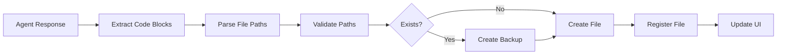

**Features:**
- Automatic file extraction from AI responses
- Backup of existing files
- Path validation and sanitization
- File registry for tracking
- Click-to-open in UI

### File Operations

**CLI:**
```bash
# Files listed after task completion
📁 Generated Files:
  📄 api/routes.py
  📄 api/models.py
  📄 tests/test_api.py

Workspace: ./workspace/session-abc123
```

**UI:**
- Click file to view in Monaco editor
- Edit and save changes
- Download individual files
- Syntax highlighting based on extension
- Line-by-line diff view

## Security Features

### Input Validation

All user inputs are validated and sanitized:

```python
class SecurityValidator:
    def validate_task(self, task: str) -> bool:
        # Command injection prevention
        if self._contains_shell_metacharacters(task):
            raise SecurityError("Potential command injection")

        # Path traversal prevention
        if self._contains_path_traversal(task):
            raise SecurityError("Path traversal detected")

        # Length validation
        if len(task) > MAX_TASK_LENGTH:
            raise ValidationError("Task too long")

        return True
```

**Protected Against:**
- Command injection
- Path traversal attacks
- SQL injection (if using database)
- XSS attacks in UI
- Malicious code execution

### Rate Limiting

Token bucket algorithm prevents abuse:

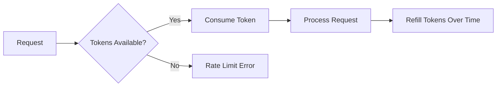

**Configuration:**
```yaml
rate_limiting:
  enabled: true
  requests_per_minute: 10
  burst_size: 20
  per_user: true
```

### Audit Logging

All security-relevant events are logged:

```python
logger.info(
    "security_event",
    event_type="task_execution",
    user_id="user-123",
    task_hash="abc...",
    timestamp="2024-01-15T10:00:00Z",
    success=True
)
```

**Logged Events:**
- Authentication attempts
- Authorization failures
- Rate limit violations
- Input validation failures
- Suspicious activities

## Reports & Analytics

### Automated Report Generation

The orchestrator generates reports automatically after each task execution (when `create_reports: true` in config). Reports are written to `reports/` as JSON files and an interactive HTML dashboard.

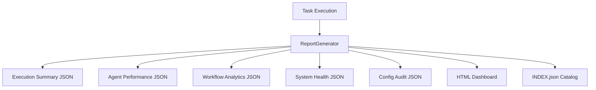

**Report Types:**

| Type | File Pattern | Contents |
|---|---|---|
| **Execution Summary** | `exec_*.json` | Per-task steps, agents, fallbacks, suggestions, duration |
| **Agent Performance** | `perf_*.json` | Aggregated success rates, call counts, task type distribution |
| **Workflow Analytics** | `workflow_*.json` | Per-workflow runs, success rates, average iterations |
| **System Health** | `health_*.json` | Health checks, disk/memory, Python version, platform |
| **Config Audit** | `config_*.json` | Agent availability, workflow structure, settings snapshot |
| **HTML Dashboard** | `dashboard_*.html` | Interactive Chart.js dashboard with 4 charts and KPI cards |

**HTML Dashboard Charts:**
- Daily Task Volume & Success (bar chart)
- Agent Success vs Failure (stacked bar chart)
- Average Duration trend (line chart)
- Workflow Distribution (doughnut chart)

**Programmatic Usage:**
```python
from orchestrator.observability import ReportGenerator
gen = ReportGenerator(reports_dir="./reports")

# Generate all report types with sample data
gen.seed_reports(config=config)

# Generate individual reports
gen.generate_execution_report(task, workflow, results, duration, agents)
gen.generate_health_report()
gen.generate_config_audit(config)
gen.generate_agent_performance_report(execution_history)
gen.generate_workflow_analytics(execution_history)
gen.generate_html_dashboard()
```

## Monitoring & Metrics

### Prometheus Metrics

Comprehensive metrics for production monitoring:

**Task Metrics:**
```python
orchestrator_tasks_total
orchestrator_task_duration_seconds
orchestrator_task_failures_total
orchestrator_task_success_rate
```

**Agent Metrics:**
```python
orchestrator_agent_calls_total
orchestrator_agent_errors_total
orchestrator_agent_response_time_seconds
orchestrator_agent_availability
```

**System Metrics:**
```python
orchestrator_cache_hits_total
orchestrator_cache_misses_total
orchestrator_active_sessions
orchestrator_memory_usage_bytes
```

### Health Checks

**Endpoints:**
- `/health` - Overall system health
- `/ready` - Readiness for traffic
- `/metrics` - Prometheus metrics

**Health Check Response:**
```json
{
  "status": "healthy",
  "version": "1.0.0",
  "agents": {
    "claude": "available",
    "codex": "available",
    "gemini": "available"
  },
  "uptime_seconds": 3600,
  "active_sessions": 5
}
```

## Project-Scoped Context Graphs

Both the Orchestrator and Agentic Team support project-scoped context graphs, enabling agents to build and leverage deep understanding of the user's codebase.

### Project Registration and Scanning

When users point the system at their project directory, a `ProjectScanner` automatically analyzes the codebase:

| Capability | Description |
|-----------|-------------|
| **Language Detection** | 30+ languages via file extension mapping |
| **Framework Detection** | 20+ frameworks via indicator files (package.json, Cargo.toml, etc.) |
| **Structure Analysis** | Top-level directory categorization and project topology |
| **File Cataloging** | Source file metadata including path, size, language, and framework |
| **Safety Limits** | Max 5,000 files per scan to handle large repositories |

### Multi-Project Isolation

Each registered project gets a unique, deterministic `project_id` (SHA-256 prefix of the path). All project nodes are tagged with this ID, guaranteeing:

- **Zero cross-contamination** between different projects' knowledge
- **Global knowledge sharing** — universal patterns (project_id="") are accessible from any project context
- **Clean removal** — `delete_project_graph()` atomically removes only that project's data

### Portability

The system is fully portable. Configure via:

```bash
# Environment variable
export PROJECT_PATH=/path/to/project

# Or YAML config
settings:
  project_path: "/path/to/project"
```

### Context Graph Builder Skill

A dedicated skill (`.claude/skills/context-graph-builder/SKILL.md`) guides agents to automatically build and maintain context graphs as they work. Agents can:

- Register new projects and trigger scans
- Store patterns, decisions, and mistakes learned during task execution
- Link related nodes with typed edges
- Query project-scoped context before starting new tasks
- Rescan projects after significant changes

### Generic Seed Data

The seed script (`scripts/seed_context_graphs.py`) populates both context databases with generic reference knowledge only — patterns, common mistakes, and architectural decisions that are universally applicable regardless of the user's project. No fake tasks or conversations are seeded, preventing agent hallucination about non-existent prior work.

## Graphify — Code Knowledge Graph Engine

The `graphify/` system turns any project directory into a deep, queryable knowledge graph:

| Feature | Description |
|---------|-------------|
| **6 Language Analyzers** | Python (AST), JS/TS, Markdown, YAML/JSON/TOML, Go/Rust/Java/C++ |
| **16 Node Types** | FILE, CLASS, FUNCTION, METHOD, IMPORT, VARIABLE, MODULE, PACKAGE, TEST, DECORATOR, etc. |
| **14 Edge Types** | CONTAINS, IMPORTS, CALLS, INHERITS, IMPLEMENTS, DEPENDS_ON, TESTS, etc. |
| **FTS5 Search** | Fast full-text search across all node metadata |
| **Intelligence** | God node analysis, community detection, BFS path finding, complexity hotspots |
| **SHA-256 Cache** | Content-addressable cache for incremental scans |
| **File Watching** | watchdog + polling fallback with debounced change aggregation |
| **Snapshots & Diffs** | Track graph evolution over time |
| **Scan Metrics** | Duration, cache rates, per-analyzer timing, historical trends |
| **REST API** | 25+ endpoints with CORS, structured errors, metrics/diff support |
| **Export** | JSON, DOT (Graphviz), Markdown, GraphML, interactive HTML (vis.js), **Obsidian vault** |
| **Schema Migrations** | v1 → v2 (confidence) → v3 (metrics/snapshots), decorator-based registry |
| **Security** | Path traversal protection, input sanitization, bounded parameters |

```mermaid
graph LR
    PROJECT[Your Project] --> GRAPHIFY[Graphify Scanner]
    GRAPHIFY --> GRAPH[(SQLite + FTS5)]
    GRAPH --> CLI[CLI: 10 commands]
    GRAPH --> API[REST API: 25+ endpoints]
    GRAPH --> VIZ[Interactive HTML]
    GRAPH --> EXPORT[JSON / DOT / GraphML / Obsidian]
```

With `graphify`, agents can query deep structural information about the user's codebase, enabling informed decision-making, pattern recognition, and context-aware modifications.

### Obsidian Vault Export

All three graph systems — **Graphify**, **Orchestrator Context**, and **Agentic Team Context** — can export their data as [Obsidian](https://obsidian.md)-compatible vaults. Open the generated directory in Obsidian and use the built-in graph view (**Ctrl/Cmd + G**) to explore relationships visually.

```mermaid
graph TB
    subgraph "Three Graph Systems → Obsidian"
        G[Graphify<br/>Code Structure] --> GV[Code Vault]
        O[Orchestrator<br/>Context Memory] --> OV[Context Vault]
        A[Agentic Team<br/>Context Memory] --> AV[Team Vault]
    end

    subgraph "Obsidian Vault Contents"
        GV & OV & AV --> FM[YAML Frontmatter<br/>type, tags, metadata]
        GV & OV & AV --> WL["[[Wikilinks]]<br/>→ outgoing / ← incoming"]
        GV & OV & AV --> IDX[_Index.md<br/>Map of Content]
        GV & OV & AV --> CFG[.obsidian/<br/>graph.json colors]
    end

    style GV fill:#4CAF50,color:#fff
    style OV fill:#2196F3,color:#fff
    style AV fill:#FF9800,color:#fff
    style CFG fill:#7C3AED,color:#fff
```

| System | Exporter | Node Types Visualized | CLI |
|--------|----------|-----------------------|-----|
| **Graphify** | `GraphExporter.to_obsidian()` | Classes, Functions, Files, Tests, Imports, Dependencies | `graphify export obsidian` |
| **Orchestrator** | `ContextExporter.export_obsidian()` | Tasks, Decisions, Patterns, Mistakes, Conversations | Python API |
| **Agentic Team** | `ContextExporter.export_obsidian()` | Tasks, Decisions, Patterns, Agent Outputs, Conversations | Python API |

**Each vault includes:**
- **Folder-per-type layout** — `Classes/`, `Tasks/`, `Decisions/`, etc.
- **YAML frontmatter** — type, tags, importance, timestamps, language, project_id
- **`[[Wikilinks]]`** — relationships grouped by edge type (Contains, Calls, Caused By, etc.)
- **`_Index.md`** — Map of Content with stats table and category links
- **`.obsidian/graph.json`** — Color groups per node type, pre-configured for graph view
- **Dark theme** — `.obsidian/appearance.json` with Obsidian dark mode

## Advanced Features

### Caching System

Multi-layer caching for performance:

**Cache Layers:**
1. **In-Memory** - Fast, 5-minute TTL
2. **File-Based** - Persistent, 24-hour TTL
3. **Distributed** - Redis (optional)

**Cache Strategy:**
```mermaid
graph TD
    A[Request] --> B{Memory Cache?}
    B -->|Hit| C[Return Result]
    B -->|Miss| D{File Cache?}
    D -->|Hit| E[Load to Memory]
    E --> C
    D -->|Miss| F[Execute Task]
    F --> G[Cache Result]
    G --> C
```

### Async Execution

Parallel execution where possible:

```python
async def execute_parallel_agents(agents, task):
    results = await asyncio.gather(
        *[agent.execute_async(task) for agent in agents],
        return_exceptions=True
    )
    return [r for r in results if not isinstance(r, Exception)]
```

### Retry Logic

Automatic retry with exponential backoff:

```python
@retry(
    stop=stop_after_attempt(3),
    wait=wait_exponential(multiplier=1, min=2, max=10),
    retry=retry_if_exception_type(TransientError)
)
def execute_with_retry(agent, task):
    return agent.execute(task)
```

### Circuit Breaker

Prevent cascading failures:

```mermaid
stateDiagram-v2
    [*] --> Closed
    Closed --> Open: Failure Threshold
    Open --> HalfOpen: Timeout
    HalfOpen --> Closed: Success
    HalfOpen --> Open: Failure

    Closed: Normal Operation
    Open: Reject Requests
    HalfOpen: Test Recovery
```

## Production Readiness

The codebase underwent a comprehensive production-readiness overhaul, achieving a **perfect 10.00/10 pylint score** with zero warnings — up from 9.39/10 with 520 warnings.

### Code Quality Metrics

| Metric | Before | After |
|--------|--------|-------|
| **Pylint Score** | 9.39 / 10 | **10.00 / 10** |
| **Total Warnings** | 520 | **0** |
| **Pre-commit Hooks** | — | **15 / 15 passing** |
| **Tests Passing** | — | **386** |

### Production Hardening

- **Lazy Logging** — All logging uses `%s` formatting (no f-string overhead unless the log level is enabled)
- **Explicit Encoding** — Every `open()` call specifies `encoding="utf-8"` for cross-platform consistency
- **Idiomatic Abstract Methods** — Docstring-only bodies instead of unnecessary `pass` statements
- **No Stray Output** — All `print()` calls in library code replaced with proper `logger` calls
- **Subprocess Safety** — All `subprocess.Popen` calls documented with context manager considerations
- **Clean Imports** — No unused imports, no redundant reimports
- **Optimized Patterns** — Dictionary iteration, string splits, and comparisons use idiomatic Python

### Pylint Configuration

Enterprise-ready pylint configuration with intentional suppressions for legitimate design patterns:
- `R0801` (duplicate-code) — Suppressed across architecturally independent subsystems (`orchestrator/` and `agentic_team/`)
- `R0902` (too-many-instance-attributes) — Suppressed for dataclass-style configuration objects
- `max-line-length` set to 120 to accommodate strings that black cannot break

### Enforced Pre-commit Hooks (15)

black · isort · flake8 · pylint · mypy · bandit · pyupgrade · trailing-whitespace · end-of-file-fixer · check-yaml · check-json · check-toml · check-merge-conflict · debug-statements · detect-private-key

---

For more information:
- [Architecture Documentation](ARCHITECTURE.md)
- [Agentic Team Documentation](AGENTIC_TEAM.md)
- [Setup Guide](SETUP.md)
- [Adding Agents Guide](ADD_AGENTS.md)

> **Easter egg:** Go to our [wiki page](https://hoangsonww.github.io/AI-Agents-Orchestrator/) and enter Konami code (↑ ↑ ↓ ↓ ← → ← → B A) for a surprise!
