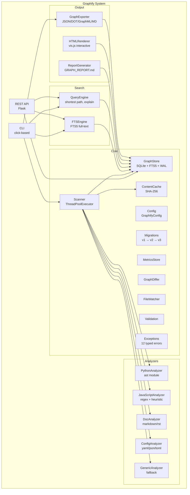
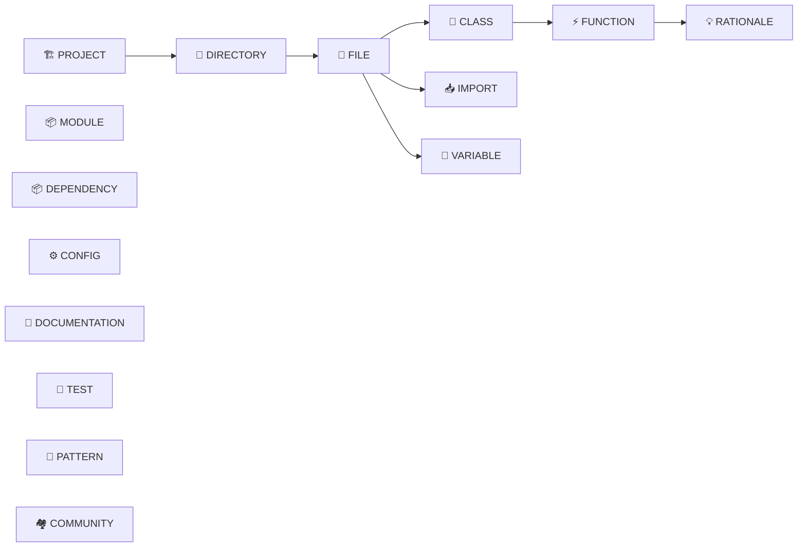
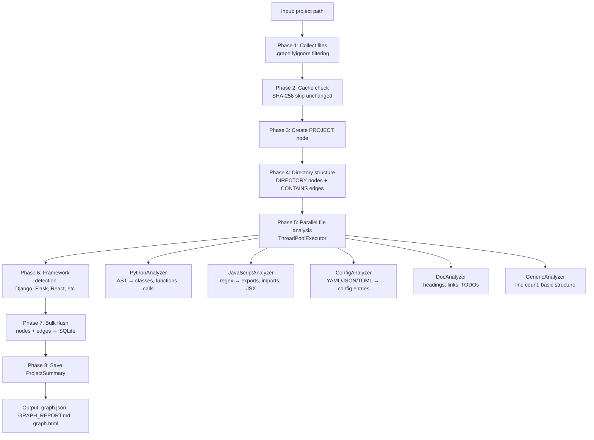
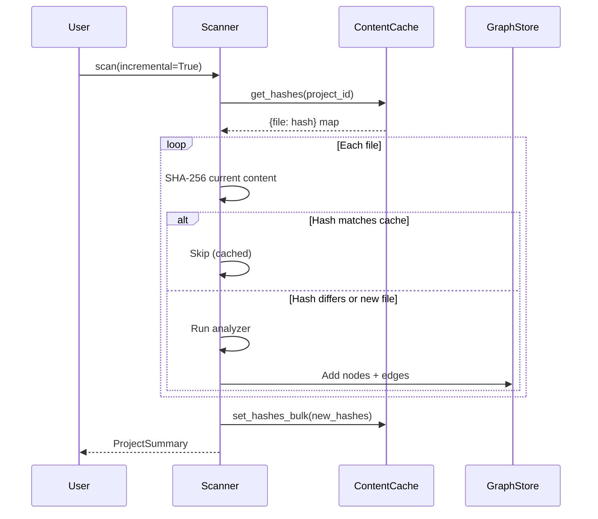
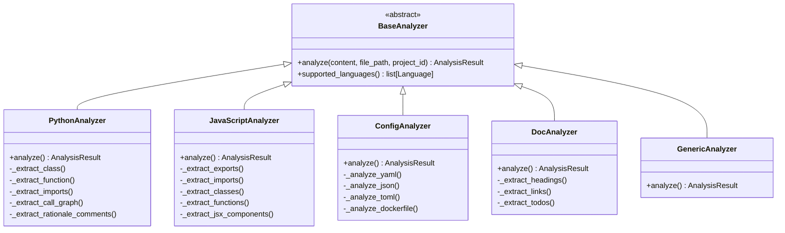
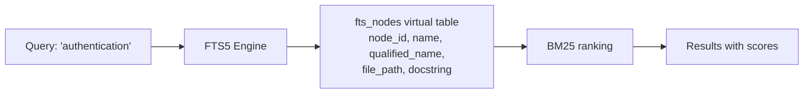
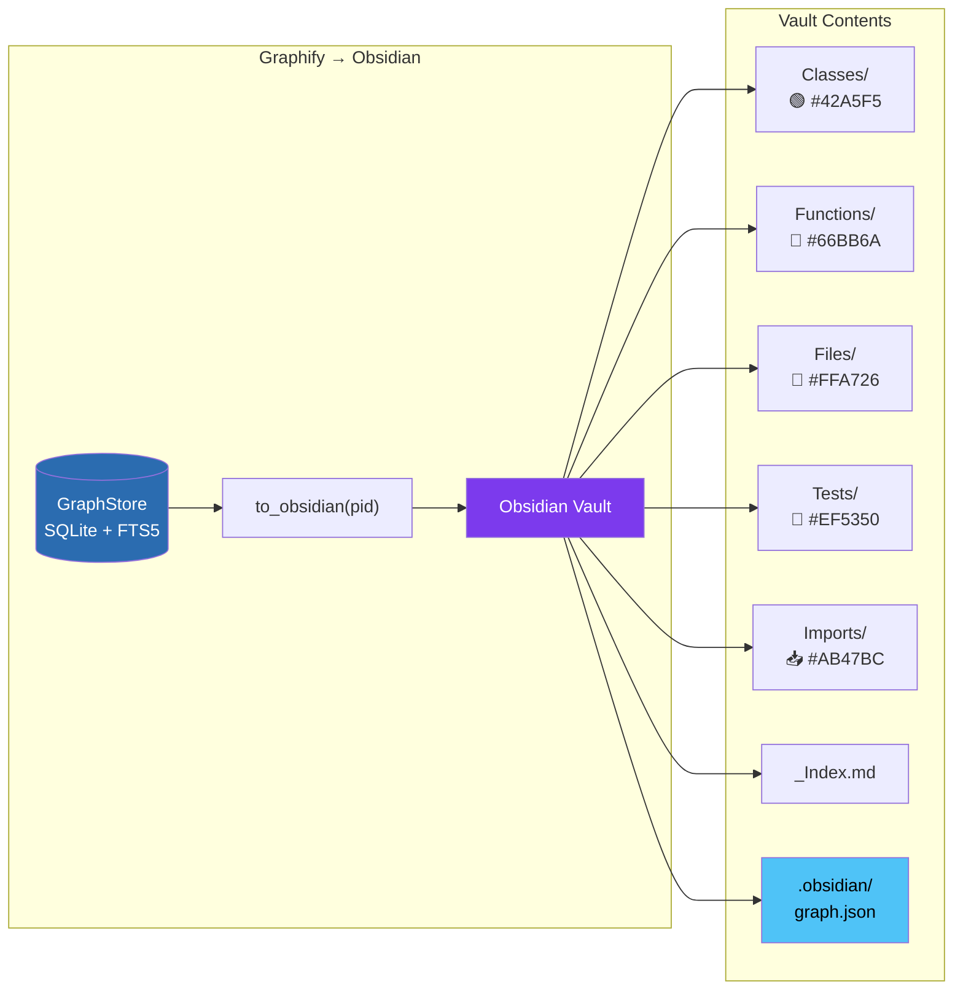
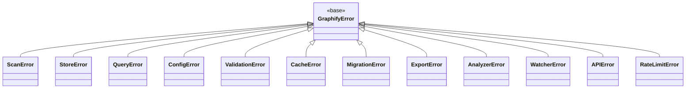
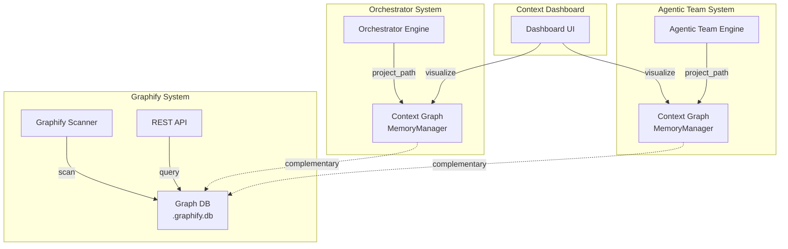

# Graphify — Project-to-Graph Intelligence Engine

> Turn any project directory into a queryable, persistent context graph.

Graphify is the 5th standalone system in the AI Coding Tools Orchestrator.
It scans a codebase, extracts structure (classes, functions, imports, call graphs,
configs, docs, tests), and persists everything in a SQLite-backed graph that
agents, CLIs, and REST APIs can query instantly.

---

## Table of Contents

- [Why Graphify](#why-graphify)
- [Architecture](#architecture)
- [Data Model](#data-model)
- [Pipeline](#pipeline)
- [CLI Reference](#cli-reference)
- [REST API](#rest-api)
- [Configuration](#configuration)
- [Analyzers](#analyzers)
- [Search Engines](#search-engines)
- [Export Formats](#export-formats)
  - [Obsidian Vault Export](#obsidian-vault-export)
- [Production Features](#production-features)
- [Integration with Orchestrator & Agentic Team](#integration-with-orchestrator--agentic-team)
- [Testing](#testing)

---

## Why Graphify

| Problem | Solution |
|---------|----------|
| Agents re-read the entire codebase every session | Persistent graph stores structure once, queried on demand |
| No cross-file relationship awareness | Import chains, call graphs, inheritance trees as first-class edges |
| Incremental changes invalidate context | SHA-256 content cache — re-scans only changed files |
| Multiple projects contaminate each other | Deterministic `project_id` (SHA-256 prefix) isolates every graph |
| Raw file dumps waste tokens | Structured graph queries return only what's relevant |

---

## Architecture



---

## Data Model

### Node Types (15)



| Node Type | Description |
|-----------|-------------|
| `PROJECT` | Root node — one per scanned project |
| `DIRECTORY` | Folder in the project tree |
| `FILE` | Source file with language, line count, hash |
| `MODULE` | Python/JS module abstraction |
| `CLASS` | Class definition with docstring, decorators |
| `FUNCTION` | Function/method with signature, complexity |
| `IMPORT` | Import statement linking to modules |
| `DEPENDENCY` | External package dependency |
| `CONFIG` | Configuration entry (YAML/JSON/TOML key) |
| `DOCUMENTATION` | Markdown/RST heading or section |
| `TEST` | Test function or test class |
| `PATTERN` | Detected code pattern (singleton, factory, etc.) |
| `VARIABLE` | Module-level constant or variable |
| `RATIONALE` | WHY/TODO/HACK/NOTE/FIXME comment |
| `COMMUNITY` | Leiden-detected cluster of related nodes |

### Edge Types (11)

| Edge Type | Meaning |
|-----------|---------|
| `CONTAINS` | Parent → child (project → dir → file → class → method) |
| `IMPORTS` | File/module imports another |
| `INHERITS` | Class extends another class |
| `CALLS` | Function calls another function |
| `DEPENDS_ON` | Project depends on external package |
| `TESTS` | Test function tests a class/function |
| `DOCUMENTS` | Documentation describes a code entity |
| `CONFIGURED_BY` | Code entity configured by a config entry |
| `EXPORTS` | Module exports a symbol |
| `SIBLING` | Same-level entities in the same parent |
| `MEMBER_OF` | Node belongs to a community cluster |

### Languages (23)

Python, JavaScript, TypeScript, Java, Go, Rust, Ruby, C++, C, C#, Swift,
Kotlin, PHP, Shell, SQL, HTML, CSS, YAML, JSON, TOML, Markdown, Dockerfile,
and a generic `unknown` fallback.

---

## Pipeline



### Incremental Updates



---

## CLI Reference

```bash
# Scan a project
graphify scan /path/to/project
graphify scan . --update                     # Incremental update
graphify scan . --no-html --no-report        # Skip output files
graphify scan . --max-files 50000 --workers 8

# Search the graph
graphify search "authentication" --path .
graphify search "UserModel" --type CLASS --limit 5

# Explore a node
graphify explain "UserModel" --path .

# Find paths between nodes
graphify path "AuthController" "DatabasePool" --path .

# View statistics
graphify stats .

# Generate report
graphify report .

# Export
graphify export json . --output graph.json
graphify export dot . --output graph.dot
graphify export graphml . --output graph.graphml
graphify export markdown . --output graph.md

# Start REST API server
graphify serve --db .graphify.db --host 0.0.0.0 --port 5004
```

---

## REST API

Base URL: `http://localhost:5004`

| Method | Endpoint | Description |
|--------|----------|-------------|
| `GET` | `/health` | Health check |
| `GET` | `/api/projects` | List all scanned projects |
| `GET` | `/api/projects/{id}` | Get project metadata |
| `GET` | `/api/nodes` | List nodes (`?project_id=&type=&limit=`) |
| `GET` | `/api/nodes/{id}` | Get node by ID |
| `GET` | `/api/edges` | List edges (`?project_id=&type=`) |
| `GET` | `/api/search` | Full-text search (`?q=&project_id=&type=&limit=`) |
| `GET` | `/api/explain/{name}` | Explain a node with connections |
| `GET` | `/api/path/{start}/{end}` | Find shortest path |
| `GET` | `/api/stats` | Graph statistics (`?project_id=`) |

### Security

- CORS origins configurable via `allowed_origins` parameter
- No internal error details in API responses
- Binds to `127.0.0.1` by default (no external access)
- Debug mode disabled in production

---

## Configuration

`GraphifyConfig` supports both constructor arguments and environment variables:

| Parameter | Env Var | Default | Description |
|-----------|---------|---------|-------------|
| `db_path` | `GRAPHIFY_DB` | `<project>/.graphify.db` | SQLite database path |
| `max_files` | `GRAPHIFY_MAX_FILES` | `10000` | Maximum files to scan |
| `worker_threads` | `GRAPHIFY_WORKERS` | `4` | Parallel analysis threads |
| `use_cache` | `GRAPHIFY_CACHE` | `True` | Enable SHA-256 content cache |
| `generate_report` | — | `True` | Generate GRAPH_REPORT.md |
| `generate_html` | — | `True` | Generate interactive graph.html |
| `skip_dirs` | — | See below | Directories to skip |

Default skip directories: `node_modules`, `.git`, `__pycache__`, `.venv`, `venv`,
`dist`, `build`, `.tox`, `.mypy_cache`, `.pytest_cache`, `htmlcov`, `.eggs`

### `.graphifyignore`

Place a `.graphifyignore` file in the project root to exclude paths:

```gitignore
vendor/
node_modules/
*.generated.py
tests/fixtures/
```

Same syntax as `.gitignore`.

---

## Analyzers



### Python Analyzer Features

- Full AST parsing via `ast` module
- Class extraction with inheritance chains
- Function extraction with decorators, parameters, return types
- Call graph construction (inter-function edges)
- Import resolution (relative and absolute)
- Docstring extraction
- Rationale comment extraction (WHY, TODO, HACK, NOTE, FIXME)
- Test detection (pytest conventions)
- Complexity metrics (function length, parameter count)

### JavaScript/TypeScript Analyzer Features

- ES6 import/export extraction
- Class and function detection
- JSX component detection
- CommonJS `require()` support
- Arrow function and named export handling

---

## Search Engines

### FTS5 Full-Text Search



- Backed by SQLite FTS5 (no external dependencies)
- Indexes: node name, qualified name, file path, docstring
- BM25 ranking for relevance scoring
- Filters: `project_id`, `node_type`, `limit`
- Double-quote sanitization for safe queries

### Query Engine

- **`explain_node(name)`** — Node details + in/out connections with degree
- **`find_path(start, end)`** — BFS shortest path between named nodes
- **`summary(project_id)`** — Aggregate statistics (node/edge counts by type)
- O(1) name resolution via SQL lookup (not O(n) scan)

---

## Export Formats

| Format | Extension | Use Case |
|--------|-----------|----------|
| JSON | `.json` | Machine-readable, LLM context blocks |
| DOT | `.dot` | Graphviz visualization |
| GraphML | `.graphml` | Gephi, yEd graph editors |
| Markdown | `.md` | Human-readable summaries |
| **Obsidian** | **vault/** | Interactive graph exploration in [Obsidian](https://obsidian.md) |

### Obsidian Vault Export

Export your code graph as an [Obsidian](https://obsidian.md) vault for interactive exploration with the built-in graph view.

```bash
# Export via CLI
graphify export obsidian /path/to/project --output ./my-vault

# Then open ./my-vault in Obsidian → press Ctrl/Cmd + G for graph view
```



**Vault structure:**

```
my-vault/
├── _Index.md              # Map of Content — links to all categories
├── Classes/               # One note per class
│   └── GraphStore.md      #   → frontmatter + [[wikilinks]]
├── Functions/
├── Files/
├── Tests/
├── Imports/
├── ...
└── .obsidian/
    ├── graph.json          # Color groups per node type
    ├── appearance.json     # Dark theme
    └── core-plugins.json   # Graph view enabled
```

**Note format example:**

```markdown
---
type: "class"
tags: ["class", "python"]
language: "python"
file: "graphify/core/graph.py"
line_start: 45
line_end: 280
---

# 🏛️ GraphStore

SQLite-backed graph store with FTS5 search...

## Relationships

### → Contains
- [[Functions/add_node|add_node]]
- [[Functions/get_node|get_node]]

### ← Contained By
- [[Files/graph.py|graph.py]]
```

Each note contains YAML frontmatter (type, language, tags, line range) and `[[wikilinks]]` to related nodes grouped by relationship type (Contains, Calls, Imports, Inherits, etc.).

The `.obsidian/graph.json` configures distinct colors for each node type — classes, functions, files, tests, imports — so the graph view renders a color-coded relationship web out of the box.

**Node type color mapping:**

| Node Type | Color | Emoji | Graph Query |
|-----------|-------|-------|-------------|
| Class | `#42A5F5` Blue | 🏛️ | `tag:#class` |
| Function | `#66BB6A` Green | ⚡ | `tag:#function` |
| File | `#FFA726` Orange | 📄 | `tag:#file` |
| Module | `#AB47BC` Purple | 📦 | `tag:#module` |
| Import | `#78909C` Grey | 📥 | `tag:#import` |
| Test | `#EF5350` Red | 🧪 | `tag:#test` |
| Pattern | `#FFCA28` Amber | 🔁 | `tag:#pattern` |
| Documentation | `#26C6DA` Cyan | 📚 | `tag:#documentation` |

> **Tip:** The Obsidian export is also available on the **orchestrator** and **agentic team** context graphs via `ContextExporter.export_obsidian()`, visualizing tasks, decisions, patterns, mistakes, and conversations. See [ORCHESTRATOR.md](ORCHESTRATOR.md#obsidian-vault-export) and [AGENTIC_TEAM.md](AGENTIC_TEAM.md#obsidian-vault-export) for details.

---

## Production Features

### Exception Hierarchy



### Schema Migrations

Automatic schema upgrades (v1 → v2 → v3) on database open. Migrations are
idempotent and version-tracked.

### Content Cache

SHA-256 hashing of file contents. Incremental re-scans skip unchanged files,
making `--update` runs near-instant for small changes.

### Scan Metrics

`ScanMetrics` dataclass tracks per-scan performance: files processed, nodes
created, edges created, duration, errors. `MetricsStore` persists history for
trend analysis.

### Graph Differ

`GraphDiffer` compares two scan snapshots and produces a `GraphDiff` showing
added/removed/modified nodes and edges.

### File Watcher

`FileWatcher` monitors a project directory for changes and triggers incremental
re-scans. Supports both `watchdog` (native OS events) and polling fallback.

### Input Validation

`validation.py` provides path sanitization, SQL injection prevention, and
argument validation for all public APIs.

### Connection Management

- WAL mode for concurrent reads
- Thread-local connections via `threading.local()`
- All connections tracked in `_all_conns` list with lock
- `close()` reliably closes every connection
- Context manager support (`with GraphStore(...) as store:`)

### HTML Visualization Security

JSON payloads escaped (`</` → `<\/`) to prevent XSS via `</script>` injection
in node names.

---

## Integration with Orchestrator & Agentic Team



Graphify operates independently but complements the orchestrator and agentic team
context graphs. While those systems build graphs incrementally from agent
interactions (tasks, decisions, patterns, mistakes), Graphify builds a complete
structural graph from the codebase itself — classes, functions, imports, call
chains, and config relationships.

---

## Testing

```bash
# Run all graphify tests
python -m pytest tests/test_graphify.py tests/test_graphify_v2.py tests/test_graphify_v3.py -q

# Run with coverage
python -m pytest tests/test_graphify*.py --cov=graphify --cov-report=term-missing

# Lint
python -m pylint graphify/ --rcfile=pyproject.toml
```

**Test coverage**: 176 tests across 3 test files covering core graph operations,
scanning, search, export, caching, migrations, config, validation, metrics,
diffing, and the full CLI surface.
