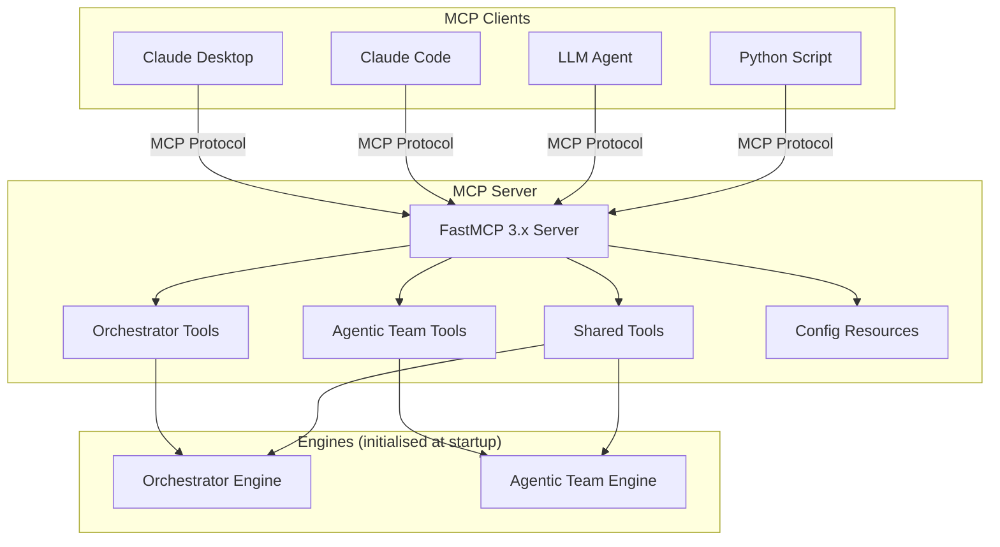
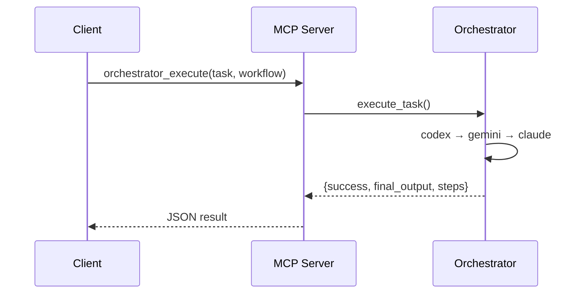
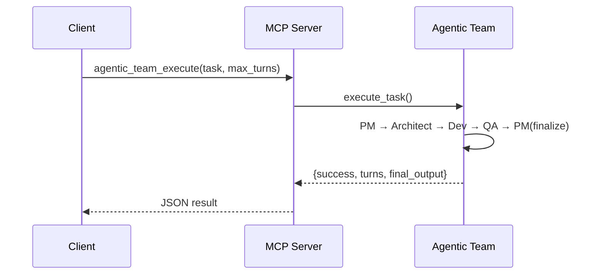
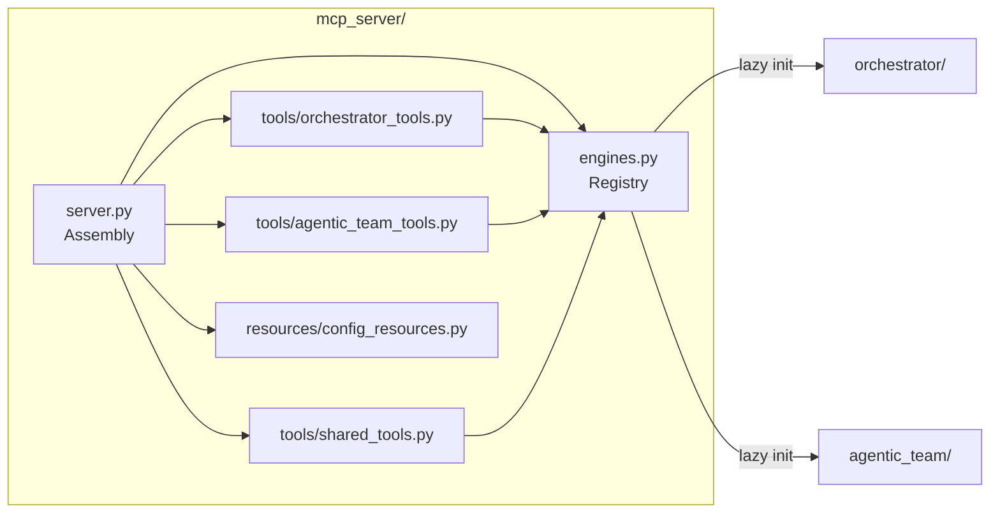

# MCP Server (Model Context Protocol)

Optional integration layer that exposes both the Orchestrator and Agentic Team as MCP tools. Any MCP-compatible client — Claude Desktop, Claude Code, other LLM agents — can drive task execution without writing Python or using the web UI.

> [!NOTE]
> **The MCP server is fully optional.** Both systems run independently without it. Neither the Orchestrator nor Agentic Team imports `fastmcp` at any point.

## How It Works



## Package Structure

```
mcp_server/
├── server.py                    Assembly — creates FastMCP, registers tools
├── engines.py                   Engine registry and lifecycle
├── tools/
│   ├── orchestrator_tools.py    4 orchestrator tools
│   ├── agentic_team_tools.py    5 agentic team tools
│   └── shared_tools.py          1 shared tool (list_engines)
├── resources/
│   └── config_resources.py      2 config resources
├── __init__.py
└── __main__.py                  python -m mcp_server support
```

## Tools

### Orchestrator Tools



| Tool | Description | Read-Only |
|------|-------------|-----------|
| `orchestrator_execute` | Run task through a workflow | No |
| `orchestrator_list_agents` | List available agents | Yes |
| `orchestrator_list_workflows` | List workflows with steps | Yes |
| `orchestrator_health` | Health check | Yes |

### Agentic Team Tools



| Tool | Description | Read-Only |
|------|-------------|-----------|
| `agentic_team_execute` | Run task with role-based team | No |
| `agentic_team_list_agents` | List available agents | Yes |
| `agentic_team_config` | Get team role configuration | Yes |
| `agentic_team_validate` | Validate role-to-agent bindings | Yes |
| `agentic_team_health` | Health check | Yes |

### Shared Tools

| Tool | Description |
|------|-------------|
| `list_engines` | Status of both engines |

### Resources

| URI | Description |
|-----|-------------|
| `config://orchestrator` | Live orchestrator YAML config |
| `config://agentic-team` | Live agentic team YAML config |

## Running

```bash
# stdio transport (Claude Desktop, local agents)
python -m mcp_server.server

# HTTP transport (remote clients, port 8000)
python -m mcp_server.server --transport http --port 8000

# Dev mode with MCP Inspector UI
fastmcp dev mcp_server/server.py:mcp
```

## Claude Desktop Integration

Add to `~/.config/claude/claude_desktop_config.json`:

```json
{
  "mcpServers": {
    "ai-coding-tools": {
      "command": "python",
      "args": ["-m", "mcp_server.server"],
      "cwd": "/path/to/AI-Coding-Tools-Collaborative"
    }
  }
}
```

## Python Clients

Both systems include high-level MCP client wrappers:

```python
# Orchestrator client
from orchestrator.mcp_client import OrchestratorMCPClient

client = OrchestratorMCPClient()                          # in-memory
client = OrchestratorMCPClient("http://localhost:8000/mcp")  # remote
result = await client.execute_task("Build a REST API")

# Agentic team client
from agentic_team.mcp_client import AgenticTeamMCPClient

client = AgenticTeamMCPClient()
result = await client.execute_task("Design microservice architecture")
```

## Architecture



## Deployment

The MCP server is included in all deployment targets:

| Platform | Config |
|----------|--------|
| Docker | `Dockerfile` — port 8000 exposed |
| Docker Compose | `mcp-server` service |
| Kubernetes | `mcp-server` Deployment + Service |
| systemd | `mcp-server.service` |
| Makefile | `make run-mcp`, `make run-mcp-http` |
