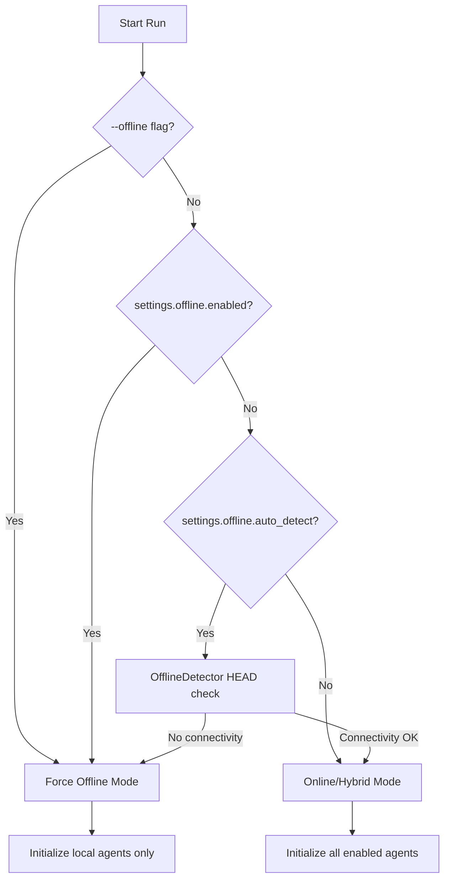
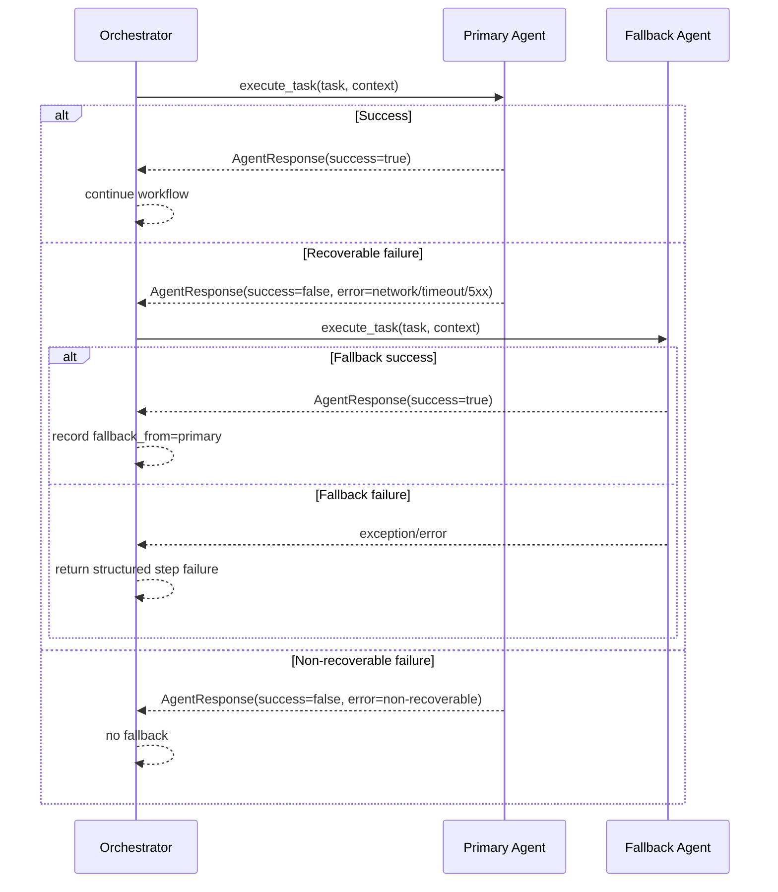
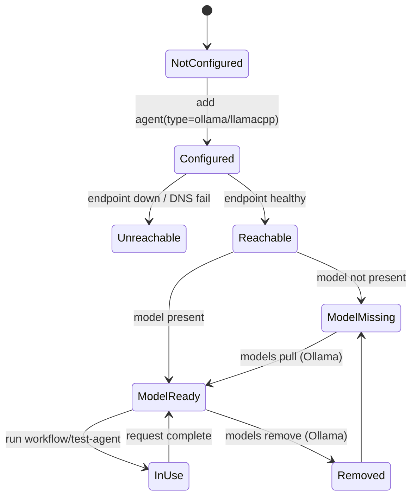
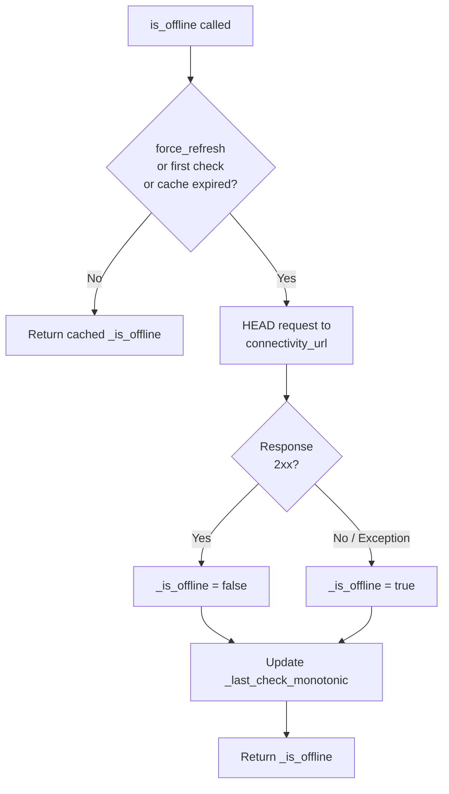
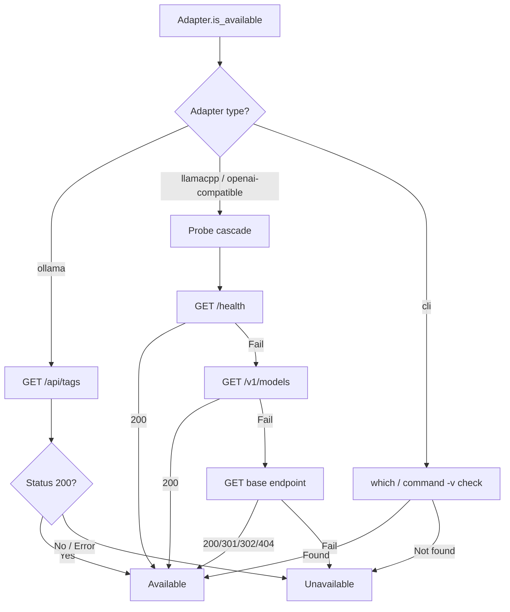
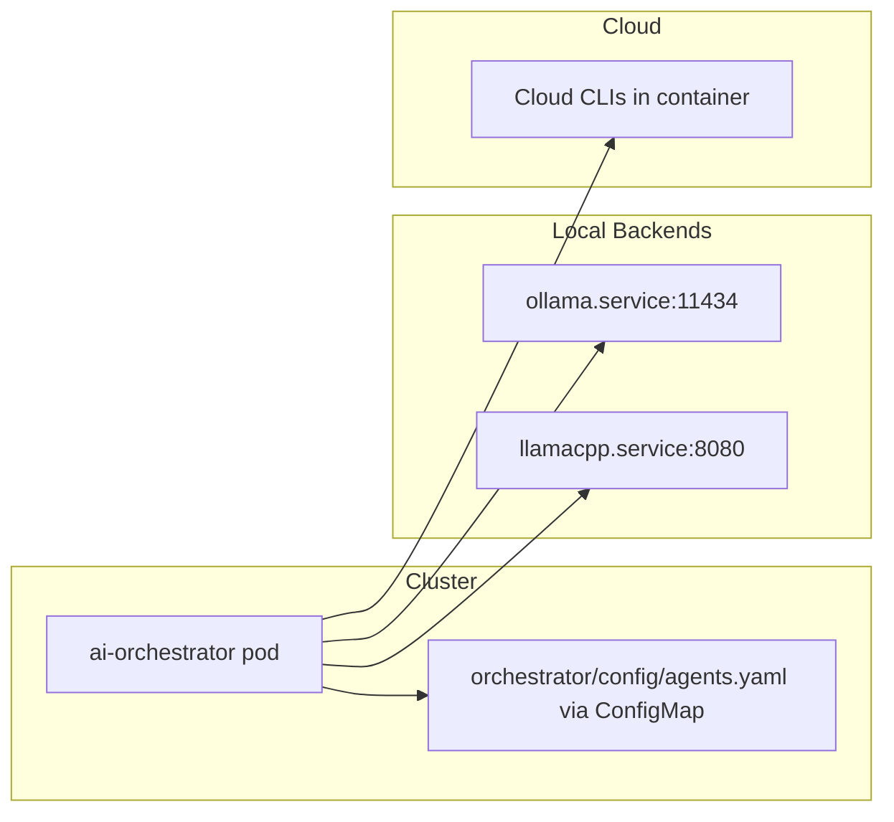
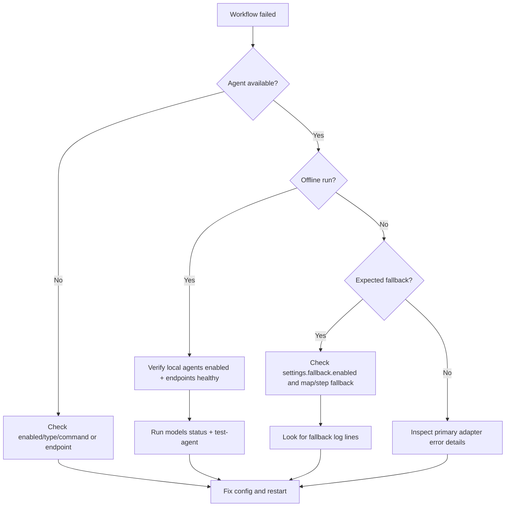

# Offline Mode Guide

This guide explains how to run the orchestrator with local models, how fallback works, and how to operate cloud/hybrid/offline profiles safely in development and production.

## Table of Contents
- [1. What Offline Mode Provides](#1-what-offline-mode-provides)
- [2. Runtime Decision Model](#2-runtime-decision-model)
- [3. Supported Backends](#3-supported-backends)
- [4. Dynamic Agent Naming](#4-dynamic-agent-naming)
- [5. Configuration Patterns](#5-configuration-patterns)
- [6. Workflow Format Support](#6-workflow-format-support)
- [7. Fallback Behavior](#7-fallback-behavior)
- [8. Local Model Lifecycle](#8-local-model-lifecycle)
- [9. CLI Operations](#9-cli-operations)
- [10. Health Checks and Availability](#10-health-checks-and-availability)
- [11. Kubernetes / Container Topology](#11-kubernetes--container-topology)
- [12. Performance and Capacity Guidance](#12-performance-and-capacity-guidance)
- [13. Security and Compliance Notes](#13-security-and-compliance-notes)
- [14. Troubleshooting](#14-troubleshooting)
- [15. Related Docs](#15-related-docs)

## 1. What Offline Mode Provides

- Run workflows without cloud API access (`--offline` or config-driven offline mode)
- Use local backends such as Ollama and OpenAI-compatible local servers
- Configure automatic fallback from cloud agents to local agents on recoverable failures
- Manage local Ollama models from the CLI (`models status|list|pull|remove`)

## 2. Runtime Decision Model



## 3. Supported Backends

| Backend | `type` | Protocol | Notes |
| --- | --- | --- | --- |
| Cloud CLI agents | `cli` | Local CLI process | Codex/Gemini/Claude/Copilot adapters |
| Ollama | `ollama` | `POST /api/generate` | Supports `models pull/remove` via Ollama API |
| llama.cpp server | `llamacpp` | `POST /v1/completions` | OpenAI-compatible completion endpoint |
| LocalAI | `localai` | `POST /v1/completions` | Routed through `LlamaCppAdapter` |
| text-generation-webui | `text-generation-webui` | `POST /v1/completions` | Routed through `LlamaCppAdapter` |
| Generic OpenAI-compatible local endpoint | `openai-compatible` | `POST /v1/completions` | Routed through `LlamaCppAdapter` |

### Local model implementation details and limits

Local adapters are integrated as first-class workflow agents, but their transport differs from cloud CLI agents:

| Agent class | Transport | Can directly edit files? | Typical output |
| --- | --- | --- | --- |
| CLI adapters (`codex`, `claude`, `gemini`, `copilot`) | Local CLI process + workspace execution path | Yes (tool-dependent) | File edits + text |
| `OllamaAdapter` | `POST /api/generate` | No | Text response + eval metadata |
| `LlamaCppAdapter` (and `localai` / `openai-compatible`) | `POST /v1/completions` | No | Text completion |

Practical implication:
- A local model can be assigned to an implementer/editor step, but it behaves as an implementation advisor (text plan/draft), not a direct filesystem editor.
- `files_modified` is typically empty for local-adapter steps unless another agent actually writes files.

Best-use pattern:
- Use local models for offline drafting, review, and fallback continuity.
- Use CLI-backed agents when you need autonomous file edits in the workspace.

> [!IMPORTANT]
> While it is possible to make local LLMs directly edit files (e.g., via a `file-editor` tool), this approach is currently disabled to prevent unintended destructive changes. Local adapters are advisory — they provide text output that the Orchestrator can use to inform the next steps, but they do not have direct write access to the workspace. This design choice prioritizes safety and predictability while still leveraging local models for their strengths in drafting and feedback. The hard part is not feasibility, it’s safety and reliability: permissions, diff constraints, validation/tests before write, rollback, and preventing bad edits.

## 4. Dynamic Agent Naming

Agent keys are dynamic. Adapter selection is based on `type`, not the agent name.

```yaml
agents:
  my-custom-llama:
    type: llamacpp
    endpoint: http://localhost:9000
    offline: true
    enabled: true
```

## 5. Configuration Patterns

### 5.1 Cloud + Local Hybrid (Recommended)

```yaml
agents:
  codex:
    type: cli
    command: codex
    enabled: true

  claude:
    type: cli
    command: claude
    enabled: true

  local-code:
    type: ollama
    endpoint: http://localhost:11434
    model: codellama:13b
    offline: true
    enabled: true

  local-instruct:
    type: ollama
    endpoint: http://localhost:11434
    model: mistral:7b-instruct
    offline: true
    enabled: true

workflows:
  hybrid:
    description: "Local draft, cloud review, local fallback"
    steps:
      - agent: local-code
        role: implementer
      - agent: claude
        role: reviewer
        fallback: local-instruct

settings:
  fallback:
    enabled: true
    map:
      claude: local-instruct
      codex: local-code
  offline:
    enabled: false
    auto_detect: true
```

### 5.2 Strict Offline Profile

```yaml
agents:
  local-code:
    type: ollama
    endpoint: http://localhost:11434
    model: codellama:13b
    offline: true
    enabled: true

  local-instruct:
    type: llamacpp
    endpoint: http://localhost:8080
    offline: true
    enabled: true

workflows:
  offline-default:
    steps:
      - agent: local-code
        role: implementer
      - agent: local-instruct
        role: reviewer

settings:
  offline:
    enabled: true
    auto_detect: false
```

## 6. Workflow Format Support

Both workflow formats are supported:

### Legacy list format

```yaml
workflows:
  default:
    - agent: codex
      task: implement
    - agent: gemini
      task: review
```

### Structured steps format

```yaml
workflows:
  hybrid:
    description: "Hybrid workflow"
    steps:
      - agent: local-code
        role: implementer
      - agent: claude
        role: reviewer
        fallback: local-instruct
```

Role aliases are normalized internally:

- `implementer` -> `implement`
- `reviewer` -> `review`
- `refiner` -> `refine`
- `writer` -> `document`
- `tester` -> `test`

## 7. Fallback Behavior

Fallback is evaluated per workflow step.

- Primary step runs first.
- On recoverable connectivity/API failure, fallback agent is executed.
- Fallback source is recorded in step output as `fallback_from`.
- If fallback also fails, a structured error is returned for that step.

Recoverable indicators include:

- connection/network errors
- timeouts
- transient upstream API failures (for example 5xx)



## 8. Local Model Lifecycle



## 9. CLI Operations

### 9.1 Validate and inspect

```bash
./ai-orchestrator validate
./ai-orchestrator agents
./ai-orchestrator workflows
```

### 9.2 Local model management

```bash
./ai-orchestrator models status
./ai-orchestrator models list
./ai-orchestrator models pull codellama:13b
./ai-orchestrator models remove codellama:13b
```

Notes:

- `pull`/`remove` are Ollama-focused operations.
- `list` works for Ollama and OpenAI-compatible endpoints if `/v1/models` is implemented.

### 9.3 Execute

```bash
# Auto mode (may use cloud and/or local based on config)
./ai-orchestrator run "Create a REST API" -w hybrid

# Force local-only mode
./ai-orchestrator run "Create a REST API" --offline

# Test a single configured agent directly
./ai-orchestrator test-agent local-code "Write hello world in Python"
```

## 10. Health Checks and Availability

On startup, each enabled adapter runs availability checks:

- `cli` adapters: command presence check
- `ollama`: `GET /api/tags`
- `llamacpp`/openai-compatible: checks `/health`, `/v1/models`, and base endpoint

Unavailable agents are not added to active adapter set and workflow steps targeting them are skipped.

### Connectivity Check Flow (OfflineDetector)

The `OfflineDetector` in `orchestrator/resilience/offline.py` uses a cached HEAD request to determine network availability. Results are cached for `check_interval` seconds (default 60) to avoid repeated probes.



The default connectivity URL is `https://httpbin.org/status/200`. Override it via the `CONNECTIVITY_CHECK_URL` environment variable or the `connectivity_url` constructor parameter.

### Model Availability Probe Flow

Each local-model adapter performs its own health check before being added to the active adapter set.



## 11. Kubernetes / Container Topology



Recommended:

- Use internal service DNS names in `endpoint` fields.
- Apply config changes via ConfigMap update + rollout restart.

## 12. Performance and Capacity Guidance

### Typical behavior

| Mode | First-token latency | Throughput |
| --- | --- | --- |
| Cloud API/CLI | 0.4s - 2s | 30 - 120 tokens/s |
| Local GPU (7B-13B) | 0.15s - 1s | 20 - 90 tokens/s |
| Local CPU (7B-13B) | 0.8s - 5s | 3 - 20 tokens/s |

Actual results depend on model size, quantization, prompt length, backend config, and hardware.

### Benchmark recipe

```bash
# 1) Warm endpoint
./ai-orchestrator test-agent local-code "Print warm-up message"

# 2) Timed run
/usr/bin/time -l ./ai-orchestrator run "Implement a paginated REST endpoint" --offline

# 3) Compare to cloud/hybrid
/usr/bin/time -l ./ai-orchestrator run "Implement a paginated REST endpoint" -w default
```

## 13. Security and Compliance Notes

- Local/offline mode reduces external data egress but does not eliminate internal risk.
- Apply the same input validation, RBAC, audit logging, and secret hygiene practices.
- For regulated workloads, pin model versions and keep signed model artifacts where possible.

## 14. Troubleshooting



Quick checks:

```bash
./ai-orchestrator validate
./ai-orchestrator models status
./ai-orchestrator test-agent local-code "Sanity check"
```

## 15. Related Docs

- [README.md](README.md)
- [ARCHITECTURE.md](ARCHITECTURE.md)
- [DEPLOYMENT.md](DEPLOYMENT.md)
- [`orchestrator/config/agents.yaml`](orchestrator/config/agents.yaml)
- [`agentic_team/config/agents.yaml`](agentic_team/config/agents.yaml)
