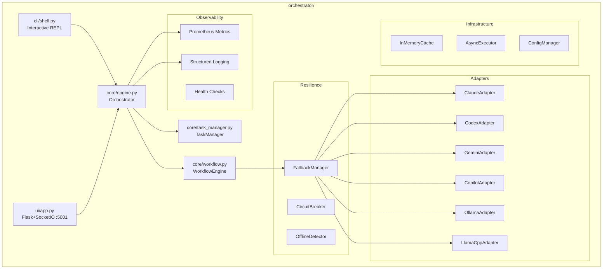
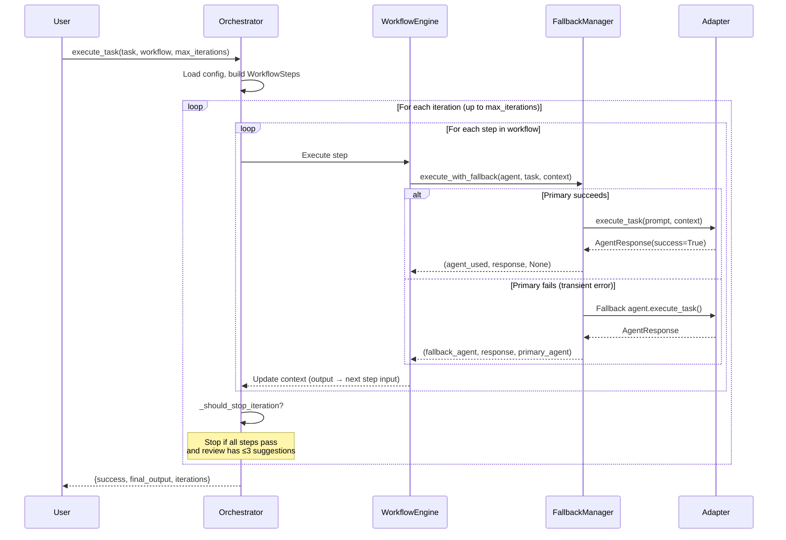
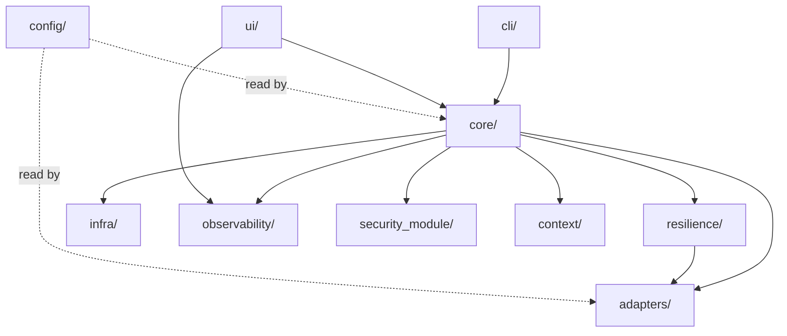
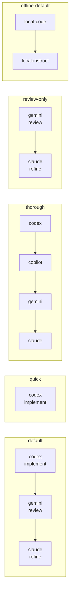
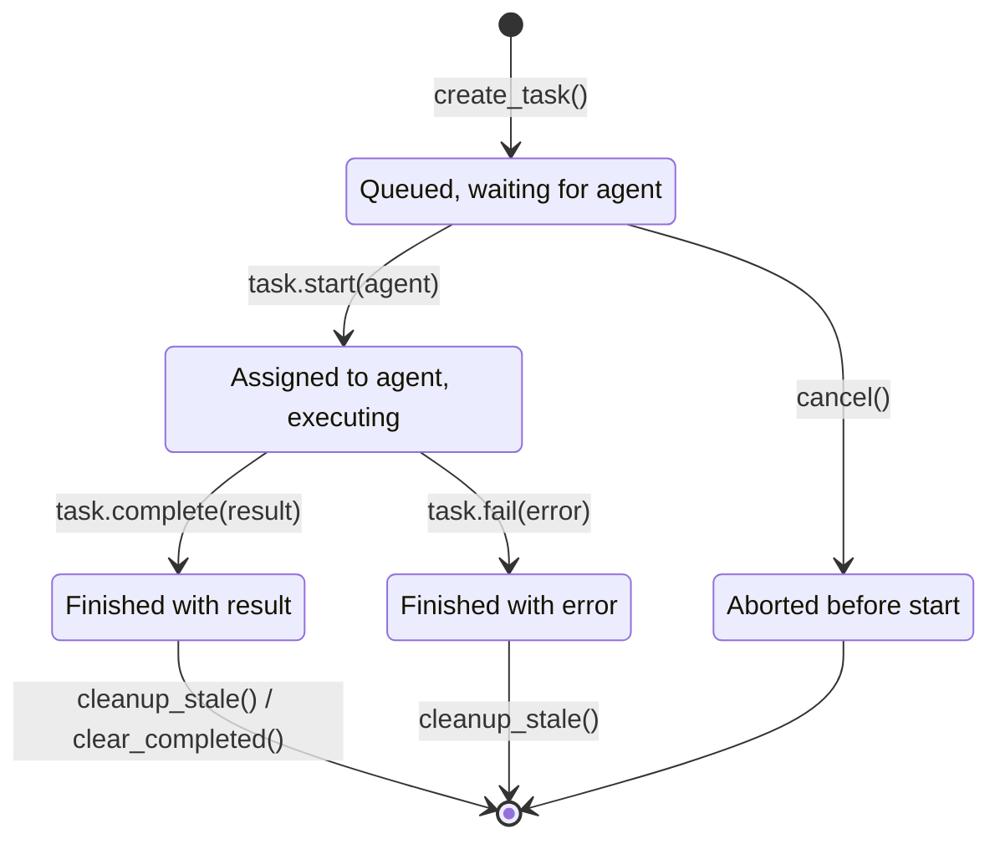
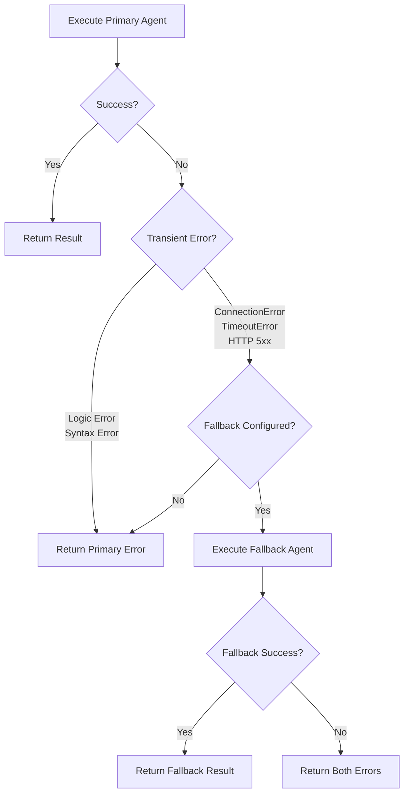
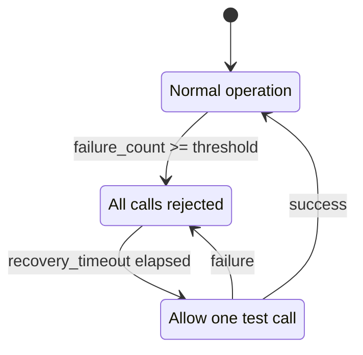
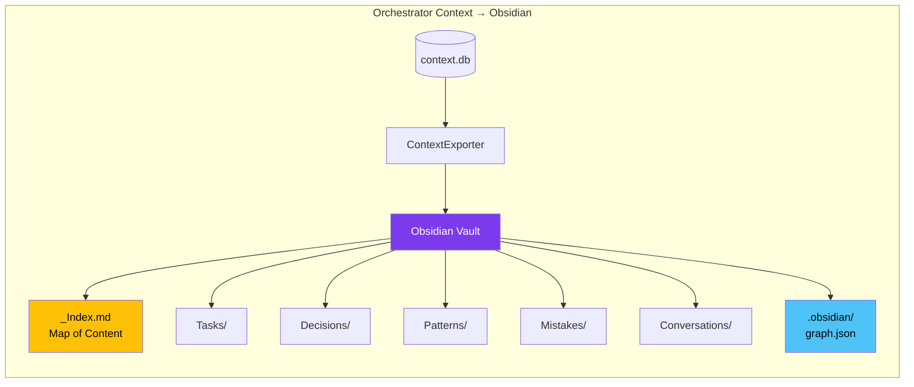
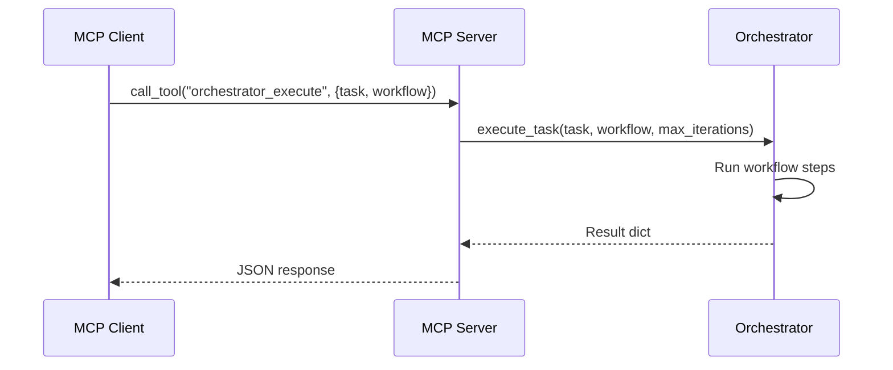

# Orchestrator System

The Orchestrator coordinates multiple AI coding assistants through predefined, iterative workflows. It is a fully self-contained Python package at `orchestrator/`.

## Table of Contents
- [Architecture](#architecture)
- [Execution Flow](#execution-flow)
- [Subpackages](#subpackages)
- [Workflows](#workflows)
- [Task Lifecycle](#task-lifecycle)
- [Fallback Routing](#fallback-routing)
- [Circuit Breaker](#circuit-breaker)
- [Web UI API](#web-ui-api)
- [CLI Commands](#cli-commands)
- [Context System](#context-system)
- [MCP Integration (Optional)](#mcp-integration-optional)

## Architecture



## Execution Flow



## Subpackages

| Package | Purpose | Key Classes |
|---------|---------|-------------|
| `adapters/` | AI agent integration layer | `BaseAdapter`, `ClaudeAdapter`, `CodexAdapter`, `GeminiAdapter`, `CopilotAdapter`, `OllamaAdapter`, `LlamaCppAdapter`, `CLICommunicator` |
| `core/` | Engine and workflow management | `Orchestrator`, `WorkflowEngine`, `WorkflowStep`, `PlannerAgent`, `TaskManager`, `OrchestratorError` |
| `resilience/` | Fault tolerance | `FallbackManager`, `CircuitBreaker`, `CircuitState`, `OfflineDetector`, `RateLimiter` |
| `observability/` | Monitoring and logging | `MetricsCollector`, `HealthChecker`, `configure_logging`, `get_logger` |
| `security_module/` | Input validation and security | `InputValidator`, `TokenBucketRateLimiter`, `SecretManager`, `AuditLogger` |
| `context/` | Graph-based context memory | `MemoryManager`, `GraphStore`, `ProjectScanner`, `BM25Index`, `HybridSearch` |
| `infra/` | Caching and config | `InMemoryCache`, `FileCache`, `AsyncExecutor`, `ConfigManager` |
| `cli/` | Interactive shell | `InteractiveShell`, `ConversationHistory` |
| `config/` | YAML configuration | `agents.yaml` |
| `ui/` | Web backend | Flask + Socket.IO app |

### Subpackage Dependency Graph

The diagram below shows the internal dependency relationships between orchestrator subpackages. Arrows point from the dependent to the dependency.



## Workflows

### Dynamic Planner Agent

The Orchestrator features a **Dynamic Planner Agent** (`orchestrator/core/planner.py`) that acts as an intelligent router and dynamic workflow generator. When a task is executed using the `dynamic` workflow (or if no matching static YAML workflow is found), the Planner Agent:
1. **Reads Observability Metrics:** It accesses Prometheus metrics (`orchestrator_agent_calls_total`) to determine the real-time success and failure rates of all available agents.
2. **Evaluates Routing Policy:** Any agent with a success rate below `0.6` is deprioritized, removing it from the pool of candidates.
3. **Generates a Plan:** It uses a healthy LLM adapter (e.g., Claude, Gemini, Codex, or local-instruct) to break the task down into sequential steps (e.g., `implement`, `review`, `refine`) and assign the best available agents to each step.

This ensures the system automatically adapts to API outages or degraded local backend performance without requiring manual YAML edits.

### Static YAML Workflows

You can also explicitly define static workflows in `agents.yaml`:



| Workflow | Agents | Use Case |
|----------|--------|----------|
| `default` | codex → gemini → claude | Standard implement → review → refine |
| `quick` | codex | Fast single-agent |
| `thorough` | codex → copilot → gemini → claude | Multi-agent deep |
| `review-only` | gemini → claude | Review existing code |
| `document` | claude → gemini | Documentation |
| `offline-default` | local-code → local-instruct | Fully offline |
| `hybrid` | local-code → claude (fallback: local) | Mixed cloud/local |

## Task Lifecycle

The `TaskManager` in `orchestrator/core/task_manager.py` tracks individual tasks through a well-defined state machine. Each task transitions through these states:



Key `TaskManager` operations:

| Method | Description |
|--------|-------------|
| `create_task(description, metadata)` | Create a new task in PENDING state |
| `get_task(task_id)` | Retrieve a task by its ID |
| `get_tasks_by_status(status)` | Filter tasks by their current status |
| `get_statistics()` | Aggregate counts and average duration |
| `cleanup_stale(max_age_seconds)` | Remove old COMPLETED/FAILED tasks |
| `clear_all()` | Remove all tasks and reset counter |

## Fallback Routing



## Circuit Breaker



## Web UI API

| Method | Path | Description |
|--------|------|-------------|
| GET | `/health` | Liveness probe |
| GET | `/ready` | Readiness probe |
| GET | `/api/agents` | List agents |
| GET | `/api/workflows` | List workflows |
| POST | `/api/execute` | Start task |
| GET | `/api/status` | Session status |
| GET | `/api/config` | Get config |
| PUT | `/api/config` | Update config |
| GET | `/api/models/status` | Local backend/model readiness summary |
| GET | `/metrics` | Prometheus |

## CLI Commands

### Task Execution

```bash
# Run a task with the default workflow (codex -> gemini -> claude)
./ai-orchestrator run "Implement a REST API for user management" --workflow default

# Run with a specific workflow and iteration limit
./ai-orchestrator run "Add pagination to the users endpoint" --workflow thorough --max-iterations 5

# Force offline mode (only local agents)
./ai-orchestrator run "Write unit tests for auth module" --offline

# Quick single-agent execution
./ai-orchestrator run "Fix the null pointer in parser.py" --workflow quick
```

### Interactive Shell (REPL)

```bash
# Start the interactive REPL session
./ai-orchestrator shell
```

Inside the shell, you can submit tasks conversationally. The shell maintains context between prompts, so follow-up tasks inherit prior output.

Local model note in REPL: local adapters (Ollama/llama.cpp) return text output and are best used for offline drafting, review, and fallback. Direct file edits come from CLI-backed agents.

### Inspection and Validation

```bash
# List all configured and available agents with their roles and types
./ai-orchestrator agents

# List all configured workflows and their step sequences
./ai-orchestrator workflows

# Validate configuration (checks YAML syntax, agent availability, workflow references)
./ai-orchestrator validate
```

### Local Model Management

```bash
# Check status of all local model endpoints (Ollama, llama.cpp)
./ai-orchestrator models status

# List models available on local endpoints
./ai-orchestrator models list

# Pull a model into the local Ollama cache
./ai-orchestrator models pull codellama:13b

# Remove a model from the local Ollama cache
./ai-orchestrator models remove codellama:13b
```

### Local Model Integration and Limits

Local models are first-class workflow agents for offline/hybrid execution, but they use completion APIs (not workspace-editing CLIs).

| Adapter family | Transport | Direct file edits |
|----------|----------|----------|
| CLI adapters (`codex`, `claude`, `gemini`, `copilot`) | Local CLI process + workspace execution | Yes (tool-dependent) |
| Local adapters (`ollama`, `llamacpp`, `localai`, `openai-compatible`) | HTTP completion endpoints | No (text output only) |

Best use for local models:
- offline drafts and review responses,
- cloud-to-local fallback continuity,
- role-specific guidance in hybrid workflows.

> [!IMPORTANT]
> While it is possible to make local LLMs directly edit files (e.g., via a `file-editor` tool), this approach is currently disabled to prevent unintended destructive changes. Local adapters are advisory — they provide text output that the Orchestrator can use to inform the next steps, but they do not have direct write access to the workspace. This design choice prioritizes safety and predictability while still leveraging local models for their strengths in drafting and feedback. The hard part is not feasibility, it’s safety and reliability: permissions, diff constraints, validation/tests before write, rollback, and preventing bad edits.

### Single-Agent Testing

```bash
# Test a single agent directly (bypasses workflow engine)
./ai-orchestrator test-agent codex "Write a hello world in Python"
./ai-orchestrator test-agent local-code "Explain quicksort"
```

## Context System

The orchestrator maintains a graph-based context database at `~/.ai-orchestrator/context.db` for persistent memory and cross-session learning.

### Features

| Feature | Description |
|---------|-------------|
| **Hybrid Search** | BM25 keyword + semantic embedding + Reciprocal Rank Fusion |
| **10 Node Types** | Conversation, Task, Mistake, Pattern, Decision, CodeSnippet, Preference, File, Concept, Project |
| **12 Edge Types** | RELATED_TO, CAUSED_BY, FIXED_BY, SIMILAR_TO, DEPENDS_ON, and more |
| **Project Scanning** | Automatic codebase analysis detecting languages, frameworks, and structure |
| **Multi-Project** | Isolated per-project graphs with deterministic SHA-256 project IDs |
| **Atomic Operations** | UPSERT nodes (edge-preserving), single-transaction bulk delete |

### Project-Scoped Operation

Configure via `PROJECT_PATH` environment variable or `settings.project_path` in `orchestrator/config/agents.yaml`. On startup, the engine:

1. Resolves the project path from env var or config
2. Generates a deterministic `project_id` (SHA-256 prefix)
3. Scans the directory with `ProjectScanner` if not already registered
4. Tags all subsequent task outputs with the `project_id`
5. Includes project context in agent prompts via `get_relevant_context()`

### Key APIs

```python
from orchestrator.context import MemoryManager

manager = MemoryManager()

# Register and scan a project
pid = manager.register_project("/path/to/project")

# Store task results scoped to the project
manager.store_task("Implement auth", "JWT auth added", success=True, project_id=pid)

# Get project-scoped context
context = manager.get_project_context(pid, task="Add user roles")

# Search with hybrid BM25 + semantic
results = manager.search("authentication patterns", limit=10)
```

### Obsidian Vault Export

Export the orchestrator's context graph as an [Obsidian](https://obsidian.md) vault for interactive exploration. Each node (task, decision, pattern, mistake, conversation) becomes a markdown note with YAML frontmatter and `[[wikilinks]]` to related nodes.

```python
from orchestrator.context.ops.export import ContextExporter
from orchestrator.context.graph_store import GraphStore

store = GraphStore("~/.ai-orchestrator/context.db")
exporter = ContextExporter(store)

# Export full graph
result = exporter.export_obsidian("./orchestrator-vault")
# → { notes_written: 142, edges_linked: 387, folders: [...] }

# Export only decisions and patterns
result = exporter.export_obsidian("./vault", node_types=["decision", "pattern"])
```

Open the vault in Obsidian and press **Ctrl/Cmd + G** to visualize task dependencies, decision chains, and learned patterns as an interactive color-coded graph.



**Generated vault structure:**

| Folder | Contents | Color in Graph View |
|--------|----------|-------------------|
| `Tasks/` | Completed tasks with outcomes | 🟢 Green |
| `Decisions/` | Architectural decisions with rationale | 🟣 Purple |
| `Patterns/` | Reusable code patterns | 🟠 Orange |
| `Mistakes/` | Errors with corrections and prevention | 🔴 Red |
| `Conversations/` | Past chat sessions | 🔵 Light Blue |
| `Code Snippets/` | Useful code fragments | ⚫ Grey |
| `Concepts/` | Domain knowledge | 🟡 Lime |
| `Projects/` | Registered project roots | 🟡 Amber |

## MCP Integration (Optional)

The orchestrator is optionally accessible via MCP (Model Context Protocol) through the shared MCP server at `mcp_server/`. The MCP server is not required to use the orchestrator; it provides an additional integration surface for LLM clients that support the MCP protocol.

### MCP Architecture



### Orchestrator MCP Tools

| Tool | Read-Only | Description |
|------|-----------|-------------|
| `orchestrator_execute` | No | Run a task through a named workflow |
| `orchestrator_list_agents` | Yes | List available agents with roles and types |
| `orchestrator_list_workflows` | Yes | List workflows with their step sequences |
| `orchestrator_health` | Yes | Health check: agent count, offline mode, timestamps |

### Starting the MCP Server

```bash
# stdio transport (default, used by Claude Desktop and similar clients)
python -m mcp_server.server

# HTTP transport on port 8000
python -m mcp_server.server --transport http --port 8000

# FastMCP Inspector for debugging
fastmcp dev mcp_server/server.py:mcp
```

### Example Tool Calls

**Execute a task through the default workflow:**

```json
{
  "method": "tools/call",
  "params": {
    "name": "orchestrator_execute",
    "arguments": {
      "task": "Implement a paginated REST endpoint for /api/users",
      "workflow": "default",
      "max_iterations": 3
    }
  }
}
```

Response:

```json
{
  "success": true,
  "workflow": "default",
  "iterations": 2,
  "steps": [
    "  [OK] codex (implement)",
    "  [OK] gemini (review)",
    "  [OK] claude (refine)"
  ],
  "final_output": "..."
}
```

**List available agents:**

```json
{
  "method": "tools/call",
  "params": {
    "name": "orchestrator_list_agents",
    "arguments": {}
  }
}
```

Response:

```json
{
  "agents": [
    {"name": "codex", "role": "implementation", "type": "cli", "available": true},
    {"name": "gemini", "role": "review", "type": "cli", "available": true},
    {"name": "claude", "role": "refinement", "type": "cli", "available": true}
  ],
  "count": 3
}
```

**Health check:**

```json
{
  "method": "tools/call",
  "params": {
    "name": "orchestrator_health",
    "arguments": {}
  }
}
```

Response:

```json
{
  "status": "healthy",
  "agents": 3,
  "agent_names": ["codex", "gemini", "claude"],
  "workflows": ["default", "quick", "thorough", "review-only", "document", "offline-default", "hybrid"],
  "offline_mode": false,
  "timestamp": "2026-04-02T12:00:00+00:00"
}
```

### Python Client

```python
from orchestrator.mcp_client import OrchestratorMCPClient

# In-memory client (same process, no network)
client = OrchestratorMCPClient()

# Remote client (connects to HTTP MCP server)
# client = OrchestratorMCPClient("http://localhost:8000/mcp")

result = await client.execute_task("Build a REST API", workflow="default")
```

## Code Quality

| Metric | Value |
|--------|-------|
| **Pylint Score** | 10.00/10 (zero warnings) |
| **Tests** | 386 passing (pytest) |
| **Pre-commit Hooks** | 15 hooks passing (Black, isort, flake8, pylint, MyPy, etc.) |
| **Formatting** | Black (120-char line length) |
| **Logging** | Lazy `%s` formatting throughout; no stray `print()` in production code |
| **I/O** | Explicit UTF-8 encoding on all file operations |

## Configuration

See [`orchestrator/config/agents.yaml`](orchestrator/config/agents.yaml) and [`docs/configuration-guide.md`](docs/configuration-guide.md).

## Detailed Documentation

- [Architecture Deep-Dive](docs/orchestrator-architecture.md)
- [API Reference](docs/orchestrator-api-reference.md)
- [Configuration Guide](docs/configuration-guide.md)
- [Adding Agents](docs/adding-agents.md)
- [MCP Server](mcp_server/server.py)
