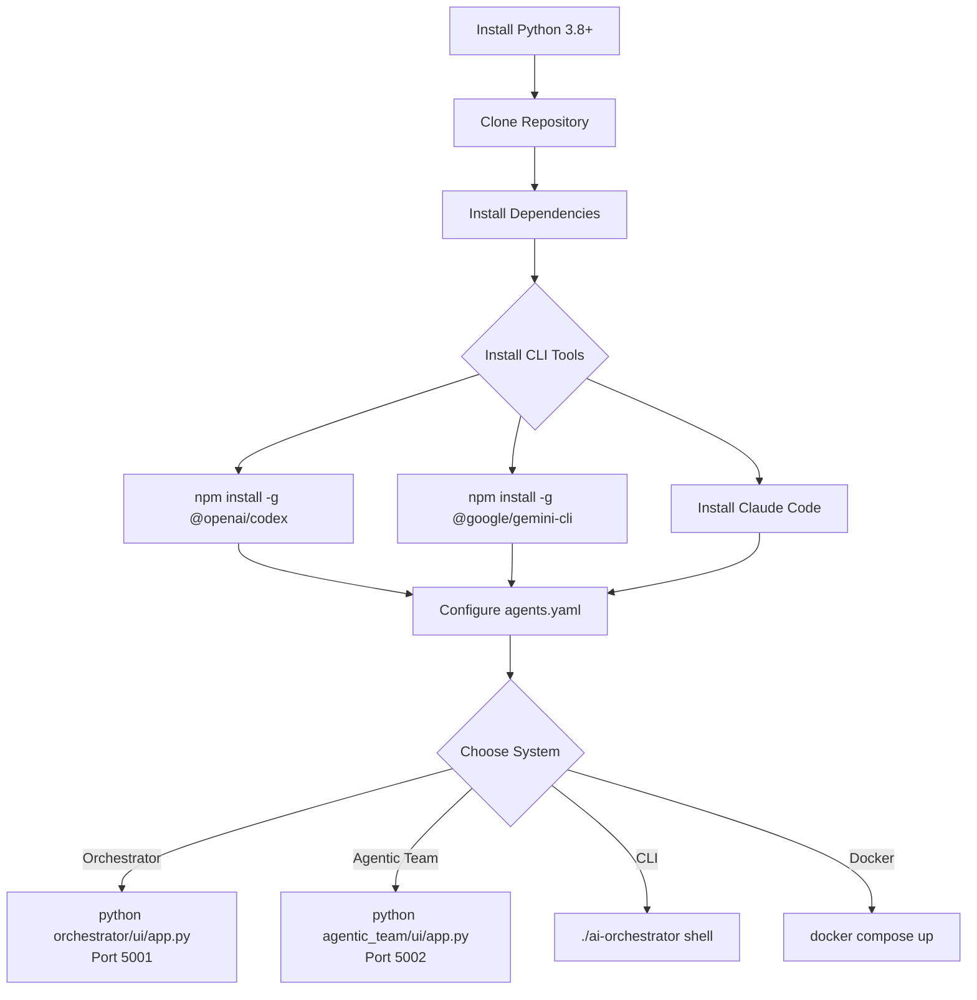
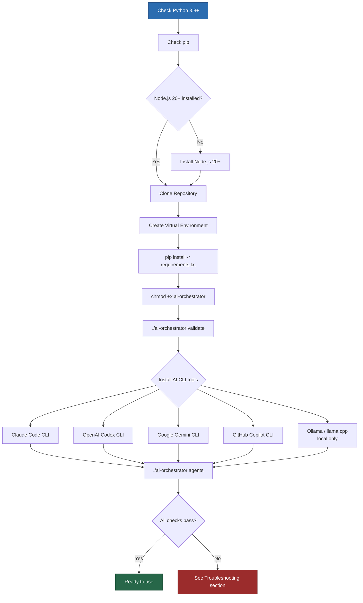
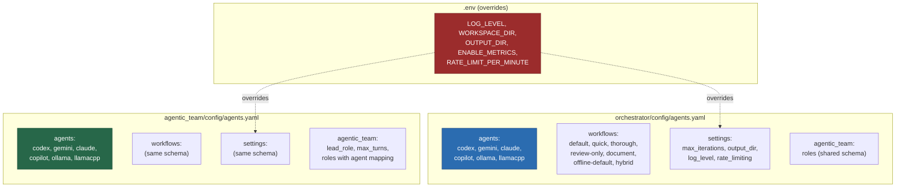
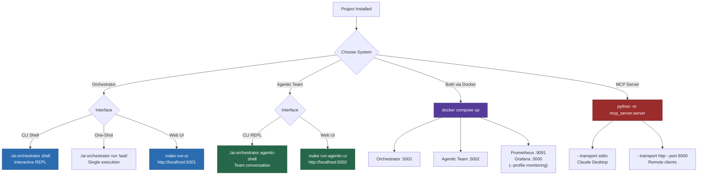
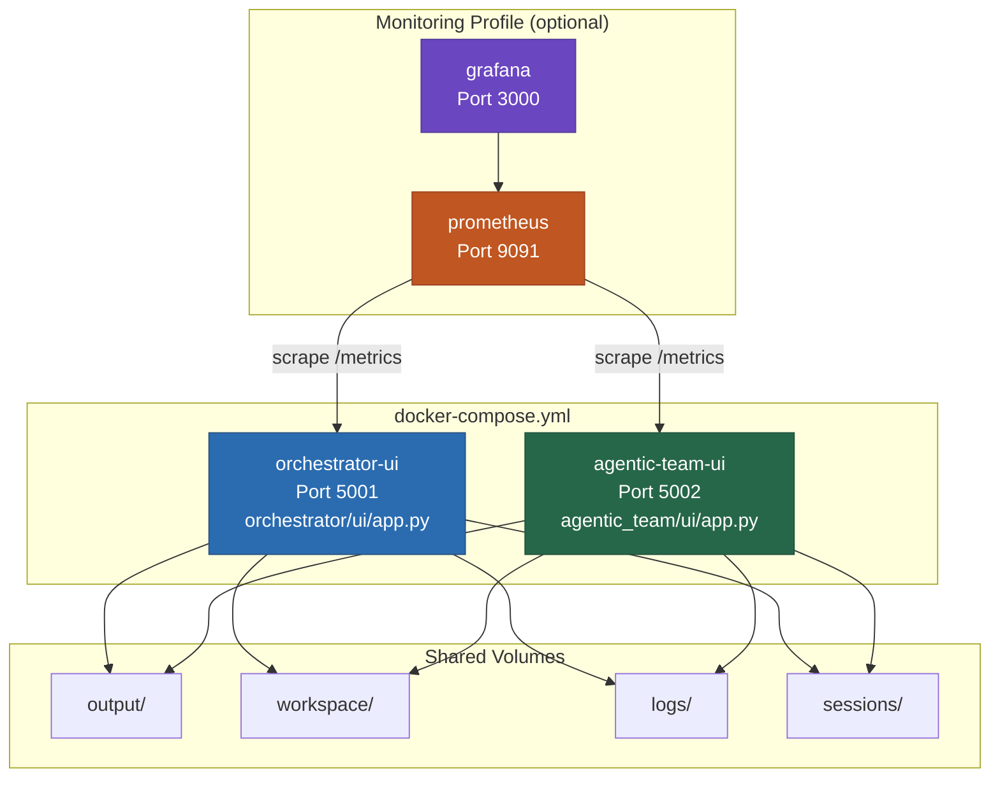
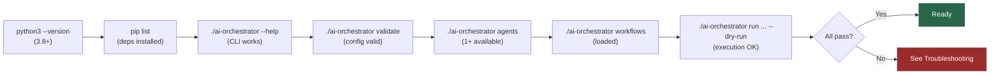

# Setup Guide

> [!NOTE]
> **Project Structure Note:** This project has two independent systems:
> - **Orchestrator** (`orchestrator/`) — workflow-based multi-agent coordination
> - **Agentic Team** (`agentic_team/`) — role-based team collaboration
>
> Each is self-contained with its own adapters, config, and UI. They share nothing.

## Table of Contents
- [Setup Flow](#setup-flow)
- [Prerequisites](#prerequisites)
- [Installation Flow](#installation-flow)
- [Quick Start](#quick-start)
- [Detailed Installation](#detailed-installation)
- [AI CLI Tools Setup](#ai-cli-tools-setup)
- [Configuration](#configuration)
- [System Startup Options](#system-startup-options)
- [Web UI Setup](#web-ui-setup)
- [Standalone Agentic Team Setup](#standalone-agentic-team-setup)
- [Context System Setup](#context-system-setup)
- [Skills, Agents & Rules Setup](#skills-agents--rules-setup)
- [MCP Server Setup](#mcp-server-setup)
- [Docker Setup](#docker-setup)
- [Troubleshooting](#troubleshooting)
- [Verification](#verification)
- [Additional Resources](#additional-resources)

---

## Setup Flow



---

## Prerequisites

### System Requirements

- **Operating System**: Linux, macOS, or Windows (WSL recommended)
- **Python**: 3.8 or higher
- **Node.js**: 20+ (for Web UI)
- **Memory**: Minimum 4GB RAM
- **Disk Space**: 1GB for installation + workspace
- **Network**: Required for AI CLI tools and updates
- **Claude Code**: Installed, setup, and signed in on your machine (Required for any workflows using Claude Code - if you run `claude` in terminal and it works, you're good)
- **OpenAI Codex**: Installed and authenticated (if using Codex agent, try running `codex` and see if it responds)
- **Google Gemini CLI**: Installed and authenticated (if using Gemini agent, try `gemini --version` to verify)
- **GitHub Copilot CLI**: Installed and authenticated (if using Copilot agent, try `copilot --version` to verify)
- **Ollama or OpenAI-compatible local backend** (llama.cpp, LocalAI, text-generation-webui): If using local LLM agents, ensure the backend is running and reachable (try `ollama list` or `curl http://localhost:8080/v1/models`)
- **Optional**: Docker and Docker Compose for containerized setup

### Required Tools

```bash
# Check Python version
python3 --version  # Should be 3.8+

# Check pip
pip3 --version

# Check Node.js (for UI)
node --version  # Should be 20+

# Check npm
npm --version
```

### AI CLI Tools

You need **at least one** of these AI CLI tools installed:

- ✅ Claude Code (Anthropic)
- ✅ OpenAI Codex
- ✅ Google Gemini CLI
- ✅ GitHub Copilot CLI

---

## Installation Flow

The following diagram shows the complete installation path from prerequisites to a running system.



---

## Quick Start

### 5-Minute Setup

```bash
# 1. Clone repository
git clone https://github.com/hoangsonww/AI-Agents-Orchestrator.git
cd AI-Coding-Tools-Collaborative

# 2. Install Python dependencies
pip3 install -r requirements.txt

# 3. Make CLI executable
chmod +x ai-orchestrator

# 4. Verify installation
./ai-orchestrator --help

# 5. Check available agents
./ai-orchestrator agents

# 6. Start interactive shell
./ai-orchestrator shell

# 7. (Optional) Start standalone Agentic Team REPL
./ai-orchestrator agentic-shell

# 8. (Optional) Start standalone Agentic Team UI
./start-agentic-ui.sh
```

---

## Detailed Installation

### Step 1: Clone Repository

```bash
git clone https://github.com/hoangsonww/AI-Agents-Orchestrator.git
cd AI-Coding-Tools-Collaborative
```

### Step 2: Create Virtual Environment (Recommended)

```bash
# Create virtual environment
python3 -m venv venv

# Activate it
# On Linux/macOS:
source venv/bin/activate

# On Windows:
venv\Scripts\activate

# Your prompt should now show (venv)
```

### Step 3: Install Python Dependencies

```bash
# Install production dependencies
pip install -r requirements.txt

# Or install in development mode
pip install -e ".[dev]"
```

**Dependencies Installed:**
- `click` - CLI framework
- `pyyaml` - Configuration parsing
- `rich` - Terminal formatting
- `pydantic` - Data validation
- `tenacity` - Retry logic
- `prometheus-client` - Metrics
- `structlog` - Structured logging
- `python-dotenv` - Environment variables

### Step 4: Make CLI Executable

```bash
# Linux/macOS
chmod +x ai-orchestrator

# Verify
./ai-orchestrator --help
```

**Windows Users:**
```powershell
# Run with Python directly
python ai-orchestrator --help
```

### Step 5: Configure Environment

```bash
# Copy example environment file
cp .env.example .env

# Edit with your settings
nano .env  # or vim, code, etc.
```

**Example `.env` file:**
```bash
# Logging
LOG_LEVEL=INFO
LOG_FILE=ai-orchestrator.log

# Metrics
ENABLE_METRICS=true
METRICS_PORT=9090

# Workspace
WORKSPACE_DIR=./workspace
OUTPUT_DIR=./output
SESSIONS_DIR=./sessions

# Agent Configuration
AGENTS_CONFIG=orchestrator/config/agents.yaml

# Rate Limiting
RATE_LIMIT_ENABLED=true
RATE_LIMIT_PER_MINUTE=10
```

### Step 6: Validate Installation

```bash
# Check configuration
./ai-orchestrator validate

# List available agents
./ai-orchestrator agents

# List workflows
./ai-orchestrator workflows

# Show system info
./ai-orchestrator info
```

---

## AI CLI Tools Setup

### Claude Code CLI

**Installation:**

Follow official Claude Code installation from Anthropic:
```bash
# Visit: https://docs.anthropic.com/claude-code
# Follow installation instructions for your OS
```

**Authentication:**
```bash
# Login to Claude
claude auth login

# Follow the prompts to authenticate
```

**Verification:**
```bash
# Check version
claude --version

# Test command
claude --message "Hello, Claude!"
```

**Configuration in `orchestrator/config/agents.yaml`:**
```yaml
agents:
  claude:
    enabled: true
    command: "claude"
    role: "refinement"
    timeout: 300
```

### OpenAI Codex CLI

**Installation:**

```bash
# Install via pip (if available)
pip install openai-codex

# Or follow OpenAI's official instructions
```

**Authentication:**
```bash
# Set API key
export OPENAI_API_KEY="your-api-key-here"

# Or add to .env file
echo "OPENAI_API_KEY=your-api-key" >> .env

# Or use auth command if available
codex auth login
```

**Verification:**
```bash
# Check version
codex --version

# Test command
echo "Write a hello world function" | codex
```

**Configuration:**
```yaml
agents:
  codex:
    enabled: true
    command: "codex"
    role: "implementation"
    timeout: 300
```

### Google Gemini CLI

**Installation:**

```bash
# Install Gemini CLI
pip install google-generativeai

# Or follow Google's installation instructions
```

**Authentication:**
```bash
# Login with Google account
gemini auth login

# Or set API key
export GOOGLE_API_KEY="your-api-key"
echo "GOOGLE_API_KEY=your-key" >> .env
```

**Verification:**
```bash
# Check version
gemini --version

# Test command
gemini --prompt "Hello, Gemini!"
```

**Configuration:**
```yaml
agents:
  gemini:
    enabled: true
    command: "gemini"
    role: "review"
    timeout: 180
```

### GitHub Copilot CLI

**Installation:**

```bash
# Install via npm
npm install -g @githubnext/github-copilot-cli

# Or follow GitHub's official instructions
```

**Authentication:**
```bash
# Login to GitHub
gh auth login

# Authenticate Copilot
copilot auth login
```

**Verification:**
```bash
# Check version
copilot --version

# Test command
copilot "write a function"
```

**Configuration:**
```yaml
agents:
  copilot:
    enabled: true  # Set to true to enable
    command: "copilot"
    role: "suggestions"
    timeout: 120
```

### Local LLM Backends (Ollama + OpenAI-Compatible)

Local adapters are first-class in workflows and role mappings. They can be used in orchestrator workflows, Agentic Team roles, offline mode, and cloud-to-local fallback.

Supported local adapter `type` values:
- `ollama`
- `llamacpp`
- `localai`
- `text-generation-webui`

**Backend Verification:**
```bash
# Ollama
ollama serve
ollama list

# OpenAI-compatible backend (llama.cpp / LocalAI / text-generation-webui)
curl http://localhost:8080/health
curl http://localhost:8080/v1/models
```

**Configuration Example (`agents.yaml`):**
```yaml
agents:
  local-code:
    type: ollama
    endpoint: http://localhost:11434
    model: codellama:13b
    offline: true
    enabled: true

  local-review:
    type: llamacpp
    endpoint: http://localhost:8080
    offline: true
    enabled: true
```

**Local Model Management (Orchestrator CLI):**
```bash
./ai-orchestrator models status
./ai-orchestrator models list
./ai-orchestrator models pull codellama:13b
./ai-orchestrator models remove codellama:13b
```

> [!IMPORTANT]
> Local adapters currently return text outputs and do not directly edit workspace files.
> Use local models for offline drafting, review, and fallback continuity.
> Use CLI-backed agents (`claude`, `codex`, `gemini`, `copilot`) when you need direct file edits.

### Verification Script

Save this as `check-tools.sh`:

```bash
#!/bin/bash

echo "=== AI CLI Tools Check ==="
echo ""

# Claude
if command -v claude &> /dev/null; then
    echo "✓ Claude Code CLI: INSTALLED"
    claude --version 2>&1 | head -1
else
    echo "✗ Claude Code CLI: NOT FOUND"
fi
echo ""

# Codex
if command -v codex &> /dev/null; then
    echo "✓ Codex CLI: INSTALLED"
    codex --version 2>&1 | head -1
else
    echo "✗ Codex CLI: NOT FOUND"
fi
echo ""

# Gemini
if command -v gemini &> /dev/null; then
    echo "✓ Gemini CLI: INSTALLED"
    gemini --version 2>&1 | head -1
else
    echo "✗ Gemini CLI: NOT FOUND"
fi
echo ""

# Copilot
if command -v copilot &> /dev/null; then
    echo "✓ Copilot CLI: INSTALLED"
    copilot --version 2>&1 | head -1
else
    echo "✗ Copilot CLI: NOT FOUND"
fi
echo ""

echo "=== AI Orchestrator ==="
if [ -x "./ai-orchestrator" ]; then
    echo "✓ AI Orchestrator: READY"
    ./ai-orchestrator agents
else
    echo "✗ AI Orchestrator: Not executable"
    echo "  Run: chmod +x ai-orchestrator"
fi
```

Run it:
```bash
chmod +x check-tools.sh
./check-tools.sh
```

---

## Configuration

Each system reads its own independent configuration file. They follow the same YAML schema but are separate files with separate values.



### Basic Configuration

Edit `orchestrator/config/agents.yaml` to configure agents and workflows:

```yaml
# Agent Configuration
agents:
  codex:
    enabled: true          # Enable/disable agent
    command: "codex"       # CLI command name
    role: "implementation" # Agent role
    timeout: 300          # Timeout in seconds

  gemini:
    enabled: true
    command: "gemini"
    role: "review"
    timeout: 180

  claude:
    enabled: true
    command: "claude"
    role: "refinement"
    timeout: 300

# Workflow Configuration
workflows:
  default:
    - agent: "codex"
      task: "implement"
    - agent: "gemini"
      task: "review"
    - agent: "claude"
      task: "refine"

  quick:
    - agent: "codex"
      task: "implement"

# Global Settings
settings:
  max_iterations: 3
  min_suggestions_threshold: 3
  output_dir: "./output"
  workspace_dir: "./workspace"
  log_level: "INFO"
  colored_output: true
```

### Advanced Configuration

**Custom Workflow Example:**
```yaml
workflows:
  security_focused:
    max_iterations: 5
    min_suggestions_threshold: 10
    steps:
      - agent: "codex"
        task: "implement"
        description: "Initial implementation"

      - agent: "gemini"
        task: "security_review"
        description: "Security vulnerability scan"

      - agent: "gemini"
        task: "performance_review"
        description: "Performance analysis"

      - agent: "claude"
        task: "refine"
        description: "Implement all fixes"

      - agent: "gemini"
        task: "final_review"
        description: "Verify all issues resolved"
```

### Environment Variables

All settings can be overridden via environment variables:

```bash
# Agent configuration
export AI_ORCHESTRATOR_CONFIG="./config/custom-agents.yaml"

# Logging
export LOG_LEVEL="DEBUG"
export LOG_FILE="./logs/orchestrator.log"

# Workspace
export WORKSPACE_DIR="./my-workspace"
export OUTPUT_DIR="./my-output"

# Metrics
export ENABLE_METRICS="true"
export METRICS_PORT="9090"

# Rate limiting
export RATE_LIMIT_PER_MINUTE="20"
```

---

## System Startup Options

After installation, you have multiple ways to interact with the two systems. The following diagram shows all entry points.



---

## Web UI Setup

### Orchestrator UI

### Prerequisites

```bash
# Check Node.js version (need 20+)
node --version

# Check npm
npm --version
```

### Step 1: Install UI Dependencies

```bash
# Navigate to Orchestrator UI directory
cd orchestrator/ui

# Install Python dependencies for backend
pip install -r requirements.txt

# Navigate to frontend
cd frontend

# Install Node dependencies
npm install
```

### Step 2: Start Backend

```bash
# From orchestrator/ui/ directory
cd orchestrator/ui

# Start Flask backend
python app.py

# Backend runs on http://localhost:5001
```

**Backend provides:**
- REST API endpoints
- Socket.IO for real-time updates
- File serving
- Session management

### Step 3: Start Frontend

```bash
# From orchestrator/ui/frontend/ directory
cd orchestrator/ui/frontend

# Start development server
npm run dev

# Frontend runs on http://localhost:3000 (proxies to :5001)
```

**Frontend features:**
- Vue 3 with Composition API
- Real-time updates via Socket.IO
- Monaco code editor
- Responsive design

### Step 4: Access UI

Open browser to: **http://localhost:5001** (production) or **http://localhost:3000** (dev)

### Production Build

```bash
# Build for production
cd orchestrator/ui/frontend
npm run build

# Dist files in: orchestrator/ui/frontend/dist/

# Serve with backend
cd orchestrator/ui
python app.py --production
```

### One-Command Startup

Use the provided startup script:

```bash
# Make executable
chmod +x start-ui.sh

# Start both backend and frontend
./start-ui.sh
```

**What it does:**
1. Checks dependencies
2. Starts backend in background
3. Starts frontend in foreground
4. Serves orchestrator UI at `http://localhost:3000` and API at `http://localhost:5000`

---

## Standalone Agentic Team Setup

This mode is separate from orchestrator workflows. It has its own backend/UI runtime and communication graph.

### Option A: One-Command Startup (Recommended)

```bash
# From project root
chmod +x start-agentic-ui.sh
./start-agentic-ui.sh
```

Agentic Team UI URL: `http://localhost:5002`

### Option B: Manual Startup

```bash
# From project root
cd agentic_team/ui
python3 -m venv venv
source venv/bin/activate
pip install -r ../../requirements.txt
pip install httpx

# Run dedicated backend/UI
python app.py
```

### Agentic Team CLI REPL

```bash
# From project root
./ai-orchestrator agentic-shell

# Optional controls
./ai-orchestrator agentic-shell --max-turns 16
./ai-orchestrator agentic-shell --offline
```

### Agentic Team Config Notes

- Agentic team role mappings are loaded from `orchestrator/config/agents.yaml` under `agentic_team.roles`.
- Each role must map to an available agent name in `agents`.
- The dedicated UI includes a guided config editor (no YAML editor required).

---

## Context System Setup

The project includes a graph-based context memory system for both engines. Each maintains an independent SQLite database that stores past conversations, tasks, mistakes, patterns, and decisions as a knowledge graph.

### Automatic Setup

The context databases are created automatically on first use — no manual setup required.

| System | Database Path | Environment Variable |
|--------|--------------|---------------------|
| Orchestrator | `~/.ai-orchestrator/context.db` | `ORCHESTRATOR_CONTEXT_DB` |
| Agentic Team | `~/.agentic-team/context.db` | `AGENTIC_TEAM_CONTEXT_DB` |

> [!NOTE]
> You can override the default database paths by setting the environment variables above to a custom path.

### Seed Sample Data

Pre-populate both graphs with realistic development data:

```bash
# Seed both systems
python scripts/seed_context_graphs.py

# Seed only one system
python scripts/seed_context_graphs.py --system orchestrator
python scripts/seed_context_graphs.py --system agentic_team

# Re-seed (overwrite existing data)
python scripts/seed_context_graphs.py --force
```

### Optional: Semantic Search

For semantic embedding search (in addition to BM25 keyword search):

```bash
pip install sentence-transformers
# Downloads all-MiniLM-L6-v2 model (~80MB) on first use
```

### Context Dashboard

The Context Dashboard provides a web UI for visualizing and managing both context graphs.

```bash
# Start the dashboard
python -m context_dashboard

# Dashboard runs on http://localhost:5003
```

Features:
- Interactive network graph visualization (vis.js)
- Analytics with Chart.js charts
- Full-text search across all context nodes
- Pruning, export/import management
- Combined view aggregating both systems

See [`context_dashboard/README.md`](context_dashboard/README.md) for full documentation.

---

## Skills, Agents & Rules Setup

The project includes pre-configured specialized agents, reusable skills, and domain rules that empower AI coding assistants.

### For Claude Code Users

Claude Code automatically reads from the `.claude/` directory:

| Directory | Contents | Count |
|-----------|----------|-------|
| `.claude/agents/` | Specialized agent definitions (`.md`) | 11 |
| `.claude/skills/` | Reusable task templates (`.md`) | 26 |
| `.claude/rules/` | Domain-specific coding rules (`.md`) | 11 |
| `.claude/CLAUDE.md` | Main project instructions | 1 |
| `.claude/settings.json` | Project settings | 1 |

Agents are invoked with `@agent-name` syntax in Claude Code:
```bash
@web-frontend Review this React component for accessibility
@security-specialist Audit this authentication code
@database-architect Optimize this SQL query
```

Skills activate automatically based on task context — no manual invocation needed.

### For OpenAI Codex Users

Codex reads from `.codex/agents/`:

| File | Agent Role |
|------|-----------|
| `implementer.toml` | General implementation |
| `code-reviewer.toml` | Code review |
| `explorer.toml` | Codebase exploration |
| `test-runner.toml` | Test execution |
| `web-frontend.toml` | Frontend development |
| `backend-api.toml` | Backend API development |
| `security-specialist.toml` | Security auditing |
| `devops-infrastructure.toml` | DevOps tasks |
| `database-architect.toml` | Database work |
| `performance-engineer.toml` | Performance optimization |
| `ai-ml-engineer.toml` | AI/ML engineering |
| `documentation-writer.toml` | Documentation |
| `mobile-developer.toml` | Mobile development |

### For All AI Agents

`AGENTS.md` at the repository root contains shared instructions read by all supported AI coding tools (Claude Code, Codex, Gemini CLI). It defines:
- Project overview and architecture boundaries
- Build & test commands
- Code style requirements
- File patterns and conventions
- Available specialized agents and skills
- MCP tool catalog
- Graph context system usage

---

## MCP Server Setup

The project includes a FastMCP server that exposes both engines to MCP-compatible clients.

### Install

```bash
pip install fastmcp>=3.0.0   # Already in requirements.txt
```

### Run (stdio — for Claude Desktop)

```bash
python -m mcp_server.server
```

### Run (HTTP — for remote clients)

```bash
python -m mcp_server.server --transport http --port 8000
```

### Claude Desktop Integration

Add to your `claude_desktop_config.json`:

```json
{
  "mcpServers": {
    "ai-coding-tools": {
      "command": "python",
      "args": ["-m", "mcp_server.server"],
      "cwd": "/path/to/AI-Coding-Tools-Collaborative"
    }
  }
}
```

### Python Client Usage

```python
from orchestrator.mcp_client import OrchestratorMCPClient
from agentic_team.mcp_client import AgenticTeamMCPClient

# In-memory (same process)
orch_client = OrchestratorMCPClient()
result = await orch_client.execute_task("Build a REST API")

# Remote HTTP
at_client = AgenticTeamMCPClient("http://localhost:8000/mcp")
result = await at_client.execute_task("Design architecture")
```

---

## Docker Setup

The Docker Compose stack runs both systems as separate services with optional monitoring.



### Basic Docker

```bash
# Build image
docker build -t ai-orchestrator:latest .

# Run container
docker run -it --rm \
  -v $(pwd)/config:/app/config \
  -v $(pwd)/workspace:/app/workspace \
  -v $(pwd)/output:/app/output \
  ai-orchestrator:latest shell
```

### Docker Compose

```bash
# Start orchestrator
docker-compose up -d

# Start with monitoring stack
docker-compose --profile monitoring up -d

# View logs
docker-compose logs -f

# Stop services
docker-compose down
```

**Services included:**
- `ai-orchestrator` - Main application
- `prometheus` - Metrics collection (optional)
- `grafana` - Metrics visualization (optional)

### Custom Docker Configuration

Create `docker-compose.override.yml`:

```yaml
version: '3.8'

services:
  ai-orchestrator:
    environment:
      - LOG_LEVEL=DEBUG
      - ENABLE_METRICS=true
    volumes:
      - ./my-custom-config:/app/config
```

---

## Production Deployment

### Systemd Service (Linux)

```bash
# Copy service file
sudo cp deployment/systemd/ai-orchestrator.service /etc/systemd/system/

# Edit service file if needed
sudo vim /etc/systemd/system/ai-orchestrator.service

# Create configuration directory
sudo mkdir -p /etc/ai-orchestrator
sudo cp .env /etc/ai-orchestrator/environment

# Reload systemd
sudo systemctl daemon-reload

# Enable service
sudo systemctl enable ai-orchestrator

# Start service
sudo systemctl start ai-orchestrator

# Check status
sudo systemctl status ai-orchestrator

# View logs
sudo journalctl -u ai-orchestrator -f
```

### Kubernetes Deployment

```bash
# Create namespace
kubectl create namespace ai-orchestrator

# Apply configuration
kubectl apply -f deployment/kubernetes/

# Check deployment
kubectl get pods -n ai-orchestrator

# View logs
kubectl logs -f deployment/ai-orchestrator -n ai-orchestrator

# Port forward for access
kubectl port-forward svc/ai-orchestrator 8080:8080 -n ai-orchestrator
```

**Kubernetes resources created:**
- Deployment
- Service
- ConfigMap
- PersistentVolumeClaim
- Ingress (optional)

### Environment-Specific Configurations

**Development:**
```yaml
# config/dev.yaml
settings:
  log_level: "DEBUG"
  enable_metrics: false
  max_iterations: 2
```

**Staging:**
```yaml
# config/staging.yaml
settings:
  log_level: "INFO"
  enable_metrics: true
  max_iterations: 3
```

**Production:**
```yaml
# config/production.yaml
settings:
  log_level: "WARNING"
  enable_metrics: true
  max_iterations: 5
  rate_limiting: true
```

---

## Troubleshooting

### Common Issues

#### Issue: "Command not found: ai-orchestrator"

**Solution:**
```bash
# Make it executable
chmod +x ai-orchestrator

# Or run with Python
python3 ./ai-orchestrator --help

# Add to PATH (optional)
export PATH=$PATH:$(pwd)
```

#### Issue: "Agent not available"

**Solution:**
```bash
# Check if CLI is installed
which claude
which codex
which gemini

# If not found, install it
# See AI CLI Tools Setup section

# Check authentication
claude auth status
codex auth status

# Re-authenticate if needed
claude auth login
```

#### Issue: "Import Error: No module named 'click'"

**Solution:**
```bash
# Install dependencies
pip install -r requirements.txt

# Or install individually
pip install click pyyaml rich pydantic

# Verify installation
python3 -c "import click; print(click.__version__)"
```

#### Issue: "Permission denied" when executing

**Solution:**
```bash
# Fix permissions
chmod +x ai-orchestrator

# Or use Python directly
python3 ai-orchestrator --help
```

#### Issue: Orchestrator Web UI won't start

**Solution:**
```bash
# Check Node.js version
node --version  # Must be 20+

# Update if needed
nvm install 20
nvm use 20

# Clear node_modules and reinstall
cd orchestrator/ui/frontend
rm -rf node_modules package-lock.json
npm install

# Check backend is running
curl http://localhost:5001/health
```

#### Issue: Agentic Team UI won't start

**Solution:**
```bash
# Run from project root (relative path, no leading slash)
./start-agentic-ui.sh

# If script is not executable
chmod +x start-agentic-ui.sh
./start-agentic-ui.sh

# Or run directly
source ui/venv/bin/activate
python agentic_team/ui/app.py

# Verify dedicated UI backend
curl http://localhost:5002/health
```

#### Issue: "zsh: no such file or directory: /start-agentic-ui.sh"

**Solution:**
```bash
# Wrong:
/start-agentic-ui.sh

# Correct (run from repo root):
./start-agentic-ui.sh
```

#### Issue: "Port already in use"

**Solution:**
```bash
# Find process using port
lsof -i :5000  # Backend
lsof -i :3000  # Frontend
lsof -i :5002  # Agentic Team UI backend

# Kill process
kill -9 <PID>

# Or use different ports
export BACKEND_PORT=5001
export FRONTEND_PORT=3001
export AGENTIC_UI_BACKEND_PORT=5003
```

#### Issue: Agentic Team role mappings unavailable

**Symptom examples:**
- `Unavailable mappings: project_manager:null, ...`
- `roles mapped to unavailable agents`

**Solution:**
```bash
# 1) Ensure at least one agent is enabled and available
./ai-orchestrator agents

# 2) Open config and map agentic_team.roles.*.agent to valid agent names
#    (names must match keys under agents:)
python -c "import yaml; d=yaml.safe_load(open('orchestrator/config/agents.yaml')); print(sorted((d.get('agents') or {}).keys()))"

# 3) Validate config
./ai-orchestrator validate
```

#### Issue: Configuration validation fails

**Solution:**
```bash
# Check YAML syntax
python3 -c "import yaml; yaml.safe_load(open('orchestrator/config/agents.yaml'))"

# Validate against schema
./ai-orchestrator validate --verbose

# Check for common issues
yamllint orchestrator/config/agents.yaml
```

### Debug Mode

Enable debug logging for troubleshooting:

```bash
# Via environment variable
export LOG_LEVEL=DEBUG
./ai-orchestrator shell

# Via command line flag
./ai-orchestrator run "task" --verbose --debug

# Check logs
tail -f ai-orchestrator.log
```

### Health Checks

```bash
# Check system health
./ai-orchestrator info

# Check agent availability
./ai-orchestrator agents

# Validate configuration
./ai-orchestrator validate

# Test with dry run
./ai-orchestrator run "test task" --dry-run

# Check agentic team UI health/readiness (if running)
curl http://localhost:5002/health
curl http://localhost:5002/ready
```

### Getting Help

```bash
# Show help
./ai-orchestrator --help

# Command-specific help
./ai-orchestrator run --help
./ai-orchestrator shell --help

# Show version
./ai-orchestrator version
```

---

## Verification

The following diagram shows the verification sequence after setup.



### Complete Verification Checklist

```bash
# ✓ Python version
python3 --version  # 3.8+

# ✓ Dependencies installed
pip list | grep -E "click|pyyaml|rich|pydantic"

# ✓ CLI executable
./ai-orchestrator --help

# ✓ Configuration valid
./ai-orchestrator validate

# ✓ At least one agent available
./ai-orchestrator agents | grep "Available"

# ✓ Workflows loaded
./ai-orchestrator workflows

# ✓ Can execute task
./ai-orchestrator run "Create a hello function" --dry-run

# ✓ Interactive shell works
echo "/exit" | ./ai-orchestrator shell

# ✓ Agentic team REPL starts
echo "/exit" | ./ai-orchestrator agentic-shell

# ✓ Agentic team backend health (if running)
curl http://localhost:5002/health

# ✓ Metrics enabled (optional)
curl http://localhost:9090/metrics

# ✓ Health check passes
curl http://localhost:9090/health
```

### Success Indicators

You should see:
- ✅ CLI responds to commands
- ✅ At least one agent shows "Available"
- ✅ Workflows are loaded
- ✅ Configuration validation passes
- ✅ Test task executes (dry-run)

### Next Steps After Setup

1. **Try Interactive Shell**
   ```bash
   ./ai-orchestrator shell
   ```

2. **Run a Simple Task**
   ```bash
   ./ai-orchestrator run "Create a Python function to add two numbers"
   ```

3. **Save a Session**
   ```bash
   ./ai-orchestrator shell
   > /save my-first-session
   ```

4. **Explore Web UI** (if installed)
   ```bash
   ./start-ui.sh
   ```

5. **Try Standalone Agentic Team**
   ```bash
   ./ai-orchestrator agentic-shell
   # or
   ./start-agentic-ui.sh
   ```

6. **Read Documentation**
   - [Features Guide](FEATURES.md)
   - [Architecture](ARCHITECTURE.md)
   - [Add Agents Guide](ADD_AGENTS.md)

7. **Seed Context Graphs** — pre-populate the knowledge graph with sample data:
   ```bash
   python scripts/seed_context_graphs.py
   ```

8. **Start Context Dashboard** — visualize both context graphs:
   ```bash
   python -m context_dashboard
   # Open http://localhost:5003
   ```

9. **Explore Agentic Infrastructure** — read [AGENTIC_INFRA.md](AGENTIC_INFRA.md) for the full architecture overview of both orchestration engines.

---

## Additional Resources

### Documentation
- [README.md](README.md) - Project overview
- [ARCHITECTURE.md](ARCHITECTURE.md) - System architecture
- [FEATURES.md](FEATURES.md) - Feature documentation
- [ADD_AGENTS.md](ADD_AGENTS.md) - Adding custom agents
- [AGENTIC_INFRA.md](AGENTIC_INFRA.md) - Agentic infrastructure documentation
- [context_dashboard/README.md](context_dashboard/README.md) - Context Dashboard documentation
- [CONTRIBUTING.md](.github/CONTRIBUTING.md) - Contribution guidelines

### Support
- **Issues**: GitHub Issues
- **Discussions**: GitHub Discussions
- **Documentation**: `docs/` directory

---

**Congratulations! You're ready to use AI Coding Tools Orchestrator!** 🎉
