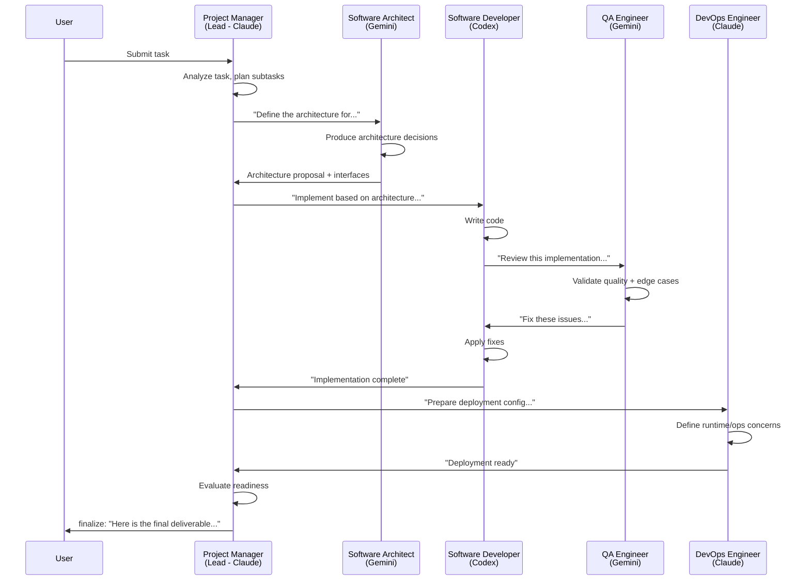
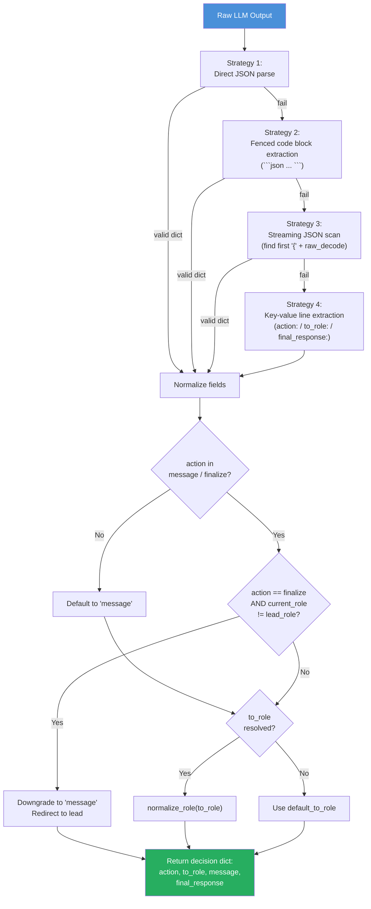
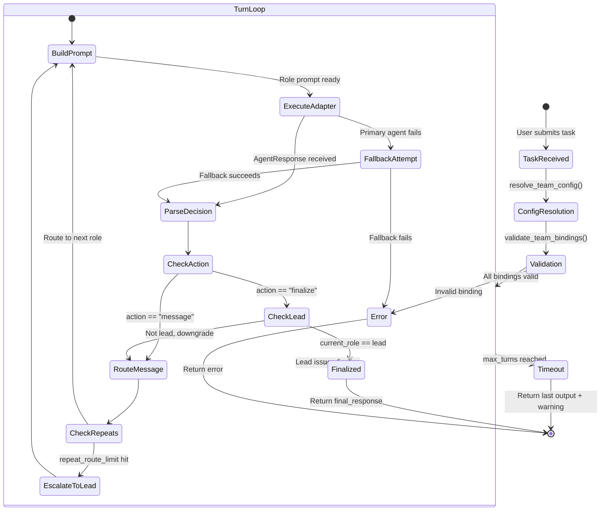

# Agentic Team Engine

Standalone multi-agent collaboration engine that implements true role-based team execution with free inter-role communication. Each agent assumes a software team role, communicates with any other role on every turn, and only the designated team lead can deliver a final response to the user.

## How It Differs from the Orchestrator

| Aspect | Orchestrator | Agentic Team |
|---|---|---|
| Execution model | Sequential workflow steps | Turn-by-turn free routing between roles |
| Communication | Agent A output piped to Agent B input | Any role can message any other role |
| Decision authority | Workflow definition controls flow | LLM-generated JSON routing decisions |
| Termination | All workflow steps complete | Lead role issues `finalize` action |
| Fallback scope | Per-workflow-step | Per-turn with the same cloud-to-local manager |
| Package boundary | `orchestrator/` | `agentic_team/` (fully independent) |

The orchestrator processes a predefined chain of steps. The agentic team lets agents reason about who to talk to next, enabling emergent collaboration patterns that are not hard-coded in advance.

## Architecture

```
agentic_team/
├── adapters/            # Own copy of AI agent adapters (Claude, Codex, Gemini, Copilot, Ollama, LlamaCpp)
│   ├── base.py          # BaseAdapter ABC + AgentResponse dataclass
│   ├── claude_adapter.py
│   ├── codex_adapter.py
│   ├── copilot_adapter.py
│   ├── gemini_adapter.py
│   ├── ollama_adapter.py
│   └── llama_cpp_adapter.py
├── context/             # Independent graph-based context memory (zero orchestrator imports)
│   ├── memory_manager.py    # High-level memory API (project-scoped)
│   ├── models/schemas.py    # Node and edge type definitions (10 node types)
│   ├── store/graph_store.py # SQLite-backed graph persistence with UPSERT
│   ├── search/              # BM25 + FTS5 hybrid search (no external deps)
│   └── ops/                 # Analytics, export, pruning, project_scanner
├── config/
│   └── agents.yaml      # Agent definitions, workflows, settings, and agentic_team role mappings
├── ui/
│   └── app.py           # Flask + SocketIO web backend
├── engine.py            # AgenticTeamEngine - core execution loop
├── decision_parser.py   # LLM output parser (JSON, fenced blocks, KV lines)
├── config_utils.py      # Role normalization, config resolution, validation
├── constants.py         # Default limits and canonical role names
├── fallback.py          # Cloud-to-local fallback manager
├── offline.py           # Offline/connectivity detection
└── shell.py             # Interactive REPL (AgenticInteractiveShell)
```

```
                         +-----------+
                         |   User    |
                         +-----+-----+
                               |
                  task / follow-up message
                               |
              +----------------v-----------------+
              |       AgenticTeamEngine          |
              |  ┌─────────────────────────────┐ |
              |  │  Turn Loop (1..max_turns)    │ |
              |  │  ┌───────────────────────┐   │ |
              |  │  │ Build role prompt      │   │ |
              |  │  │ Execute via adapter    │   │ |
              |  │  │ Parse decision (JSON)  │   │ |
              |  │  │ Route to next role     │   │ |
              |  │  └───────────────────────┘   │ |
              |  └─────────────────────────────┘ |
              +----------------------------------+
                               |
              finalize (lead only) or max_turns
                               |
                         +-----v-----+
                         |  Result   |
                         +-----------+
```

### Team Communication Flow



### Package Structure Graph

```mermaid
graph TB
    subgraph adapters_pkg["adapters/"]
        a_base["base.py<br/>BaseAdapter ABC"]
        a_claude["claude_adapter.py"]
        a_codex["codex_adapter.py"]
        a_gemini["gemini_adapter.py"]
        a_copilot["copilot_adapter.py"]
        a_ollama["ollama_adapter.py"]
        a_llama["llama_cpp_adapter.py"]
    end

    subgraph config_pkg["config/"]
        cfg_yaml["agents.yaml"]
    end

    subgraph context_pkg["context/"]
        ctx_mm["memory_manager.py<br/>Project-scoped API"]
        ctx_store["store/graph_store.py<br/>SQLite + UPSERT"]
        ctx_models["models/schemas.py<br/>10 node types"]
        ctx_search["search/<br/>BM25 + FTS5"]
        ctx_ops["ops/<br/>Analytics, export,<br/>pruning, scanner"]
    end

    subgraph ui_pkg["ui/"]
        ui_app["app.py<br/>Flask + SocketIO"]
    end

    engine["engine.py<br/>AgenticTeamEngine"]
    parser["decision_parser.py<br/>DecisionParser"]
    cfg_utils["config_utils.py<br/>resolve_team_config"]
    constants["constants.py<br/>Defaults + limits"]
    fb["fallback.py<br/>FallbackManager"]
    off["offline.py<br/>OfflineDetector"]
    shell["shell.py<br/>AgenticInteractiveShell"]

    shell --> engine
    ui_app --> engine
    engine --> parser
    engine --> cfg_utils
    engine --> constants
    engine --> fb
    engine --> off
    engine --> a_base
    engine --> ctx_mm
    cfg_utils --> cfg_yaml
    a_claude --> a_base
    a_codex --> a_base
    a_gemini --> a_base
    a_copilot --> a_base
    a_ollama --> a_base
    a_llama --> a_base

    style engine fill:#4a90d9,color:#fff
    style adapters_pkg fill:#7b68ee,color:#fff
    style parser fill:#e67e22,color:#fff
    style fb fill:#e74c3c,color:#fff
```



## Team Roles

Five default roles map to AI agent backends defined in `config/agents.yaml`:

| Role | Default Agent | Responsibility |
|---|---|---|
| `project_manager` (lead) | `claude` | Initiate work, route subtasks dynamically, decide final readiness |
| `software_architect` | `gemini` | Define architecture, interfaces, and technical constraints |
| `software_developer` | `codex` | Implement required code changes |
| `qa_engineer` | `gemini` | Validate quality, edge cases, and regressions |
| `devops_engineer` | `claude` | Handle deployment, runtime, and operational readiness |

Roles are fully configurable. Any role can be reassigned to any enabled agent. Custom roles can be added in the `agentic_team.roles` section of `agents.yaml`.

## Execution Flow

1. **Task submission** -- User provides a task string via CLI, REPL, or REST API.
2. **Config resolution** -- `resolve_team_config()` merges default roles with YAML overrides and picks preferred agents.
3. **Validation** -- `validate_team_bindings()` confirms every role maps to an available adapter.
4. **Turn loop** -- Starting with the lead role receiving the user task:
   - A role-specific prompt is built containing the task, team roster, last 8 transcript entries, and routing instructions.
   - The assigned agent executes the prompt via its adapter (with fallback if the primary fails).
   - `DecisionParser` extracts a JSON routing decision from the output.
   - Messages exceeding `max_message_chars` (default 5000) are truncated.
   - If a non-lead role attempts `finalize`, the action is downgraded to `message` and redirected to the lead.
   - Repeated identical routes are detected; after `repeat_route_limit` (default 3) hits, the message is escalated to the lead.
5. **Finalization** -- When the lead role returns `action: "finalize"`, the `final_response` field is extracted and execution stops.
6. **Timeout** -- If `max_turns` (default 12) is reached without finalization, the last output is returned with a warning.

### Decision Parsing Pipeline

The `DecisionParser` extracts structured routing decisions from free-form LLM output using a multi-strategy approach:



### Execution Lifecycle State Diagram



## Configuration

All configuration lives in `agentic_team/config/agents.yaml`. The `agentic_team` section controls team behavior:

```yaml
agentic_team:
  lead_role: "project_manager"
  max_turns: 12
  roles:
    project_manager:
      title: "Project Manager (Team Lead)"
      agent: "claude"
      responsibilities: "Initiate work, route subtasks dynamically, and decide final readiness."
    software_architect:
      title: "Software Architect"
      agent: "gemini"
      responsibilities: "Define architecture, interfaces, and technical constraints."
    software_developer:
      title: "Software Developer"
      agent: "codex"
      responsibilities: "Implement required code changes."
    qa_engineer:
      title: "QA Engineer"
      agent: "gemini"
      responsibilities: "Validate quality, edge cases, and regressions."
    devops_engineer:
      title: "DevOps Engineer"
      agent: "claude"
      responsibilities: "Handle deployment/runtime concerns and operational readiness."
```

Runtime settings under `settings.agentic_team`:

| Setting | Default | Description |
|---|---|---|
| `max_message_chars` | 5000 | Maximum characters per inter-role message before truncation |
| `repeat_route_limit` | 3 | Identical route repetitions before automatic lead escalation |

Fallback routing is configured under `settings.fallback`:

```yaml
settings:
  fallback:
    enabled: true
    map:
      codex: local-code
      claude: local-instruct
      gemini: local-instruct
```

## CLI Usage

### Interactive REPL

```bash
python -m agentic_team.shell
```

Or with options:

```bash
python -m agentic_team.shell --config /path/to/agents.yaml --max-turns 20 --offline
```

#### Shell Commands

| Command | Description |
|---|---|
| `/help` | Show command reference |
| `/agents` | List available mapped agents |
| `/team` | Show current role-to-agent mappings |
| `/maxturns <n>` | Set max communication turns |
| `/followup <msg>` | Force follow-up on previous task |
| `/history` | Show conversation history |
| `/save [file]` | Save session to disk |
| `/load <file>` | Load a saved session |
| `/reset` | Clear history and context |
| `/reload` | Reload config and reinitialize adapters |
| `/validate` | Validate role-to-agent bindings |
| `/clear` | Clear terminal |
| `/info` | Show shell/runtime summary |
| `/exit` | Exit the shell |

Free-text input is interpreted as a task and routed through the team. Follow-up detection is automatic for short messages containing keywords like "add", "fix", "change", "improve", or "update".

### Programmatic Usage

```python
from agentic_team import AgenticTeamEngine

engine = AgenticTeamEngine(config_path="agentic_team/config/agents.yaml")

result = engine.execute_task(
    task="Implement a rate limiter middleware for the Flask API",
    max_turns=15,
    turn_callback=lambda step: print(f"Turn {step['turn']}: {step['from_role']} -> {step['to_role']}"),
)

print(result["final_output"])
print(f"Success: {result['success']}")
print(f"Turns: {result['stats']['turns_executed']}")
```

## Web UI Backend

A standalone Flask + SocketIO server at `agentic_team/ui/app.py` provides a real-time web interface.

### Starting the Server

```bash
python -m agentic_team.ui.app
```

Environment variables:

| Variable | Default | Description |
|---|---|---|
| `AGENTIC_UI_BACKEND_PORT` / `PORT` | `5002` | Server listen port |
| `FLASK_SECRET_KEY_AGENTIC` | Random | Flask session secret |
| `CORS_ALLOWED_ORIGINS` | `*` | Comma-separated allowed origins |
| `AGENTIC_TEAM_CONFIG_PATH` | `agentic_team/config/agents.yaml` | Config file override |
| `FLASK_DEBUG` | `false` | Enable Flask debug mode |

### REST Endpoints

| Method | Path | Description |
|---|---|---|
| `GET` | `/health` | Health probe |
| `GET` | `/ready` | Readiness probe (checks agent availability) |
| `GET` | `/api/team/config` | Effective team config, validation, and runtime status |
| `GET` | `/api/config` | Raw and parsed YAML configuration |
| `PUT` | `/api/config` | Update YAML config and reload engine |
| `POST` | `/api/execute` | Start async team execution |
| `GET` | `/api/status` | Per-client session state snapshot |
| `POST` | `/api/conversation/clear` | Reset client conversation state |

### WebSocket Events

Connect via Socket.IO to receive real-time execution updates:

| Event | Direction | Description |
|---|---|---|
| `connected` | Server to Client | Emitted on connection with session status |
| `task_started` | Server to Client | Emitted when team execution begins |
| `team_turn` | Server to Client | Emitted after each turn with full step data |
| `team_communication` | Server to Client | Simplified routing summary per turn |
| `progress_log` | Server to Client | Timestamped log messages |
| `task_completed` | Server to Client | Final result with output, turns, and team config |
| `task_error` | Server to Client | Error details if execution fails |

See [API Reference](../docs/agentic-team-api-reference.md) for complete request/response schemas.

## Offline Mode

The engine supports fully offline operation using local model backends (Ollama, llama.cpp, or any OpenAI-compatible server). Offline mode is activated by:

- Setting `force_offline=True` in the constructor
- Setting `settings.offline.enabled: true` in config
- Enabling `settings.offline.auto_detect: true` (uses `OfflineDetector` with a cached HTTP connectivity check)

When offline, only agents marked with `offline: true` or typed as `ollama`/`llamacpp`/`localai`/`text-generation-webui`/`openai-compatible` are initialized.

## Supported Agent Backends

| Backend | Type | Offline |
|---|---|---|
| Claude Code CLI | `cli` | No |
| OpenAI Codex CLI | `cli` | No |
| Google Gemini CLI | `cli` | No |
| GitHub Copilot CLI | `cli` | No |
| Ollama | `ollama` | Yes |
| llama.cpp / OpenAI-compatible | `llamacpp` | Yes |

## Context System

The Agentic Team maintains its own independent graph-based context database at `~/.agentic-team/context.db`. This is fully separate from the Orchestrator's context — **zero shared imports**.

### Capabilities

| Feature | Description |
|---------|-------------|
| **10 Node Types** | Conversation, Task, Mistake, Pattern, Decision, CodeSnippet, Preference, File, Concept, Project |
| **12 Edge Types** | RELATED_TO, CAUSED_BY, FIXED_BY, SIMILAR_TO, DEPENDS_ON, and more |
| **FTS5 + BM25 Search** | Lightweight hybrid search using SQLite built-in FTS5 — no external embedding dependency |
| **Project Scanning** | Automatic codebase analysis detecting languages, frameworks, and structure |
| **Multi-Project Isolation** | Per-project graph partitions with deterministic SHA-256 IDs |
| **Atomic Operations** | UPSERT nodes (edge-preserving), single-transaction bulk project delete |

### Project-Scoped Operation

Configure `PROJECT_PATH` environment variable or `settings.project_path` in config YAML. On engine startup:

1. Project is scanned by `ProjectScanner` (independent copy — no orchestrator imports)
2. A `PROJECT` node plus `FILE`, `PATTERN`, and `DECISION` nodes are created
3. All task results are tagged with the project's `project_id`
4. Context queries filter by `project_id` for focused results

```python
from agentic_team.context import MemoryManager

manager = MemoryManager()
pid = manager.register_project("/path/to/project")
context = manager.get_project_context(pid, task="Add user auth")
```

### Independence Guarantee

The `agentic_team/context/` package is a fully independent implementation:

- Own `models/schemas.py` — mirrors orchestrator schemas but shares zero code
- Own `store/graph_store.py` — independent SQLite graph store with UPSERT
- Own `ops/project_scanner.py` — independent copy of the project scanner
- **Zero imports from `orchestrator/`** — enforced by CI
