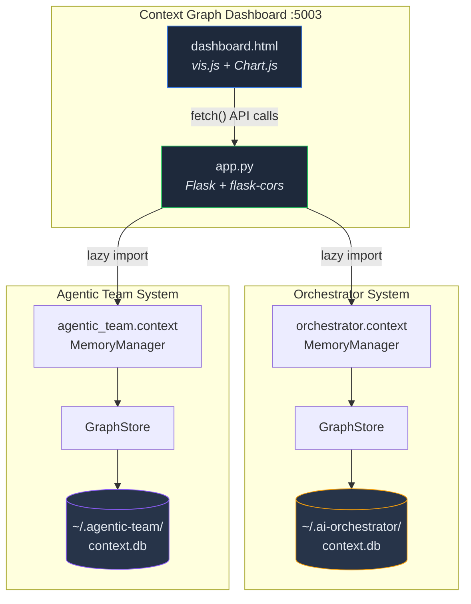
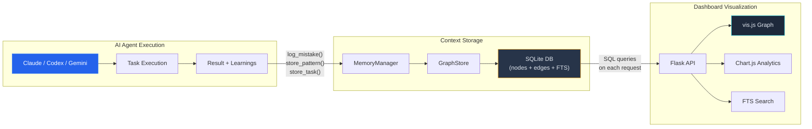
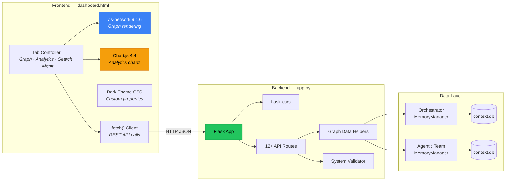
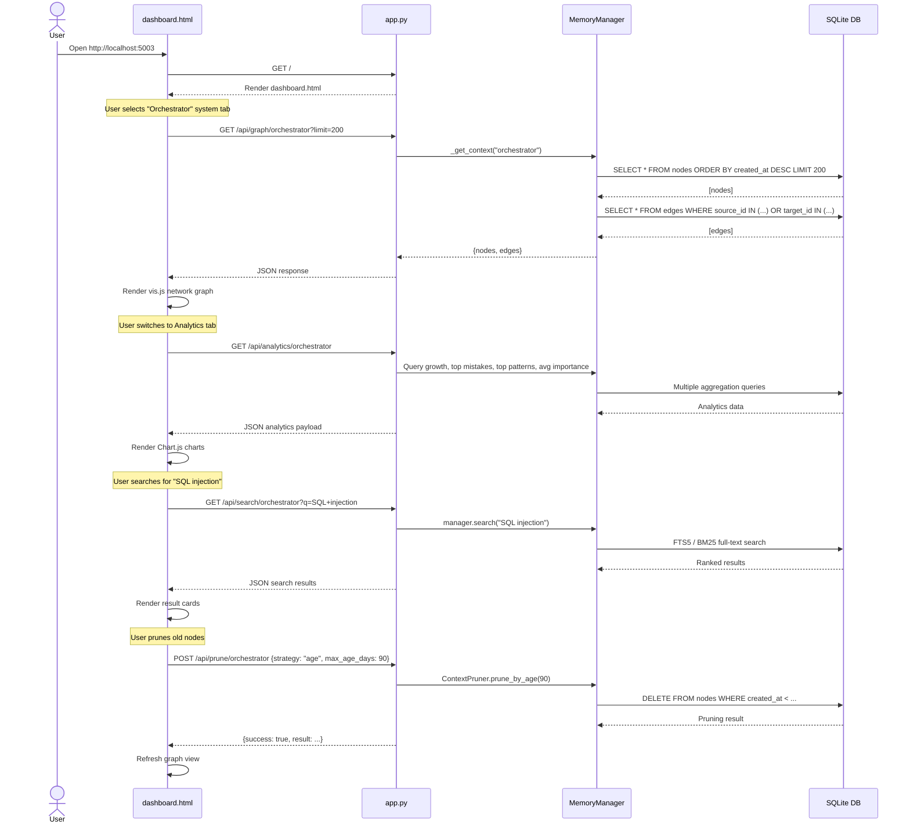

# 🔮 Context Graph Dashboard


A unified visualization and management UI for the **graph-based context memory systems** powering both the **Orchestrator** and **Agentic Team** AI coding platforms. Browse interactive knowledge graphs, run analytics, search across all stored context, and manage graph lifecycle — all from a single dark-themed web dashboard.

---

## Table of Contents

- [Overview](#overview)
- [Screenshots](#screenshots)
- [Architecture](#architecture)
- [Data Flow](#data-flow)
- [Component Architecture](#component-architecture)
- [User Interaction Flow](#user-interaction-flow)
- [Quick Start](#quick-start)
- [Configuration](#configuration)
- [API Reference](#api-reference)
- [Graph Node Types](#graph-node-types)
- [Edge Types](#edge-types)
- [Search Capabilities](#search-capabilities)
- [Pruning Strategies](#pruning-strategies)
- [Export & Import](#export--import)
- [Combined View](#combined-view)
- [Project Filtering](#project-filtering)
- [Security](#security)
- [Seed Data](#seed-data)
- [Integration with AI Agents](#integration-with-ai-agents)
- [Development](#development)
- [Tech Stack](#tech-stack)
- [File Structure](#file-structure)

---

## Overview

The AI Coding Tools platform maintains two **fully independent** context memory systems — one for the Orchestrator and one for the Agentic Team. Each system stores knowledge as a directed graph of typed nodes (conversations, tasks, mistakes, patterns, decisions, code snippets, preferences) connected by typed edges (RELATED_TO, CAUSED_BY, FIXED_BY, etc.) in its own SQLite database.

The **Context Graph Dashboard** sits atop both databases and provides:

| Capability | Description |
|---|---|
| **Graph Explorer** | Interactive vis.js network graph with physics simulation, color-coded node types, and click-to-inspect |
| **Analytics** | Chart.js-powered doughnut charts, growth timelines, top mistakes & patterns bar charts |
| **Search** | BM25 + FTS5 full-text search across all stored context nodes |
| **Management** | Prune stale/duplicate/low-importance nodes, export/import graph JSON, view per-type statistics |
| **Combined View** | Aggregated statistics and merged graph from *both* systems simultaneously |

Data is read **directly from SQLite on every request** — no caching, no polling. As AI agents run tasks and store context, the dashboard reflects the latest state on every page load.

<p align="center">
  
</p>

---

## Screenshots

The dashboard is a single-page application with a dark theme (`#0f172a` base) and four primary tabs:

### 🗺️ Graph Explorer
Interactive network visualization powered by **vis.js**. Nodes are color-coded by type (e.g., blue for Tasks, red for Mistakes, green for Patterns). Click any node to inspect its full detail, connected edges, metadata, and tags. Filter by node type and control the display limit. Physics simulation provides organic force-directed layout.

### 📊 Analytics
Five Chart.js visualizations: **Node type distribution** (doughnut), **Edge type distribution** (doughnut), **Growth over 30 days** (line chart with fill), **Top 10 mistakes by importance** (horizontal bar), and **Top 10 patterns by importance** (horizontal bar). Summary cards show total nodes, total edges, average importance score, and database file size.

### 🔍 Search
Full-text search input with real-time results. Each result shows the node type badge, title, content preview (truncated to 500 chars), importance score, creation date, and relevance score. Supports filtering by node type.

### ⚙️ Management
Per-type statistics table, pruning controls (select strategy → configure thresholds → execute), export button to download the entire graph as JSON, and import button to upload a JSON graph file. Displays real-time system connection status.

---

## Architecture



Key design decisions:
- **Lazy imports** — `orchestrator.context` and `agentic_team.context` are imported inside functions, so the dashboard starts even if one system is unavailable.
- **Zero shared state** — The two context systems have completely independent databases, schemas, and code paths. The dashboard is the only component that reads from both.
- **Read-only by default** — All GET endpoints are read-only. Only `POST /api/prune` and `POST /api/import` mutate data.

---

## Data Flow



1. **Agent runs a task** → the adapter (Claude, Codex, Gemini, etc.) processes the request
2. **Context is stored** → `MemoryManager` methods (`log_mistake`, `store_pattern`, `store_conversation`, etc.) write nodes + edges to the SQLite graph store
3. **Dashboard reads** → on each HTTP request the Flask backend opens a transaction, queries the latest nodes/edges, and returns JSON
4. **User visualizes** → the frontend renders the JSON as an interactive graph, charts, or search results

---

## Component Architecture



---

## User Interaction Flow



---

## Quick Start

### Prerequisites

- Python 3.8+
- Dependencies from project root: `pip install -r requirements.txt`
  - Specifically: `flask>=3.0.0`, `flask-cors>=4.0.0`

### Start the Dashboard

```bash
# Start with defaults (localhost:5003, no debug)
python -m context_dashboard

# Custom host/port
DASHBOARD_HOST=0.0.0.0 DASHBOARD_PORT=8080 python -m context_dashboard

# Development mode with debug
DASHBOARD_DEBUG=true python -m context_dashboard
```

The dashboard starts at **http://localhost:5003** by default.

### Verify It's Running

```bash
curl http://localhost:5003/health
```

Expected response:
```json
{
  "status": "ok",
  "timestamp": "2025-01-15T12:00:00+00:00",
  "systems": {
    "orchestrator": true,
    "agentic_team": true
  }
}
```

> **Note:** If a context system's database doesn't exist yet (no tasks have been run), its status will show `false`. The dashboard still works — it simply reports "Context not available" for that system.

---

## Configuration

### Environment Variables

| Variable | Default | Description |
|---|---|---|
| `ORCHESTRATOR_CONTEXT_DB` | `~/.ai-orchestrator/context.db` | Path to the Orchestrator's SQLite context database |
| `AGENTIC_TEAM_CONTEXT_DB` | `~/.agentic-team/context.db` | Path to the Agentic Team's SQLite context database |

### Port Configuration

The dashboard runs on **port 5003** by default. To change it:

```bash
# Via __main__.py entry point — edit context_dashboard/__main__.py
app.run(host="0.0.0.0", port=5003, debug=False)

# Or run directly with a custom port
python -c "from context_dashboard.app import app; app.run(port=8080)"
```

### CORS

CORS is enabled globally via `flask-cors`, allowing the dashboard to be accessed from any origin. This is useful when embedding the dashboard in development tools or IDE extensions.

---

## API Reference

All endpoints return JSON. The `<system>` path parameter must be either `orchestrator` or `agentic_team`.

### Dashboard

| Method | Path | Description |
|---|---|---|
| `GET` | `/` | Serve the main dashboard HTML page |
| `GET` | `/health` | Health check — reports availability of both context systems |

### Per-System Endpoints

| Method | Path | Query Params | Description |
|---|---|---|---|
| `GET` | `/api/graph/<system>` | `?node_types=task,mistake` `&limit=200` | Graph nodes + edges formatted for vis.js. Filter by comma-separated node types and limit result count |
| `GET` | `/api/stats/<system>` | — | Database statistics: total nodes, edges, counts by type |
| `GET` | `/api/analytics/<system>` | — | Full analytics: growth (30-day), top 10 mistakes, top 10 patterns, avg importance, DB file size |
| `GET` | `/api/search/<system>` | `?q=query` `&node_types=mistake` `&limit=20` | Full-text search across context nodes. Returns ranked results with relevance scores |
| `GET` | `/api/node/<system>/<node_id>` | — | Full detail for a single node including metadata, tags, and all connected edges (inbound + outbound) |
| `POST` | `/api/prune/<system>` | Body: `{"strategy": "age", "max_age_days": 90}` | Trigger graph pruning. See [Pruning Strategies](#pruning-strategies) |
| `GET` | `/api/export/<system>` | — | Download entire graph as a timestamped JSON file |
| `POST` | `/api/import/<system>` | Multipart: `file=<json>` | Import a graph JSON file. Uses `INSERT OR IGNORE` — safe for re-imports |

### Combined Endpoints

| Method | Path | Query Params | Description |
|---|---|---|---|
| `GET` | `/api/combined/stats` | — | Aggregated statistics from **both** systems with merged node/edge counts by type |
| `GET` | `/api/combined/graph` | `?limit=150` | Combined graph from **both** systems. Node IDs prefixed with `orch_` / `at_` to prevent collisions |

### Response Examples

<details>
<summary><strong>GET /api/graph/orchestrator?limit=5</strong></summary>

```json
{
  "nodes": [
    {
      "id": "abc123",
      "node_type": "task",
      "title": "Implement JWT auth",
      "content": "Added JWT authentication to the API...",
      "importance_score": 0.85,
      "created_at": "2025-01-15T10:30:00",
      "tags": "[\"auth\", \"security\"]",
      "metadata": "{\"agent\": \"claude\", \"duration\": 45}"
    }
  ],
  "edges": [
    {
      "id": "edge001",
      "source_id": "abc123",
      "target_id": "def456",
      "edge_type": "RELATED_TO",
      "weight": 1.0,
      "created_at": "2025-01-15T10:30:00"
    }
  ]
}
```
</details>

<details>
<summary><strong>GET /api/analytics/orchestrator</strong></summary>

```json
{
  "available": true,
  "nodes_by_type": {"task": 24, "mistake": 8, "pattern": 12, "decision": 5},
  "edges_by_type": {"RELATED_TO": 18, "CAUSED_BY": 6, "FIXED_BY": 4},
  "total_nodes": 49,
  "total_edges": 28,
  "avg_importance": 0.672,
  "db_size_bytes": 245760,
  "growth": [
    {"date": "2025-01-10", "count": 3},
    {"date": "2025-01-11", "count": 7}
  ],
  "top_mistakes": [
    {"title": "Used string formatting in SQL", "score": 0.95}
  ],
  "top_patterns": [
    {"title": "Repository pattern for DB access", "score": 0.88}
  ]
}
```
</details>

<details>
<summary><strong>POST /api/prune/orchestrator</strong></summary>

Request:
```json
{
  "strategy": "low_importance",
  "importance_threshold": 0.3,
  "min_age_days": 7
}
```

Response:
```json
{
  "success": true,
  "result": {"pruned_nodes": 5, "pruned_edges": 3}
}
```
</details>

---

## Graph Node Types

The context graph uses **7 node types** to categorize stored knowledge:

| Type | Description | Example |
|---|---|---|
| **Conversation** | Past chat sessions with AI agents. Stores messages, agent identity, and outcomes. | "Debug session with Claude about memory leak in worker pool" |
| **Task** | Completed tasks with inputs, outputs, agent used, and success/failure status. | "Implement JWT refresh token rotation — completed by Codex" |
| **Mistake** | Errors encountered with root cause, correction applied, and prevention strategy. | "Used `shell=True` with user input → switched to parameterized subprocess" |
| **Pattern** | Reusable code patterns, architectural approaches, or best practices discovered during work. | "Repository pattern with async context manager for database access" |
| **Decision** | Architectural or design decisions with rationale, alternatives considered, and outcome. | "Chose SQLite over PostgreSQL for context storage — simplicity, zero-config" |
| **CodeSnippet** | Useful code fragments stored for reuse with language, description, and tags. | "Python decorator for retry with exponential backoff" |
| **Preference** | Learned user preferences for coding style, tools, frameworks, and conventions. | "Prefers type hints on all function signatures; uses Black formatting" |

Each node carries:
- `id` — UUID primary key
- `title` — Short summary
- `content` — Full text content
- `metadata` — JSON blob (agent, duration, language, etc.)
- `tags` — JSON array of string labels
- `importance_score` — Float 0.0–1.0 (used for pruning and ranking)
- `created_at` / `updated_at` — ISO 8601 timestamps

---

## Edge Types

The graph supports **12 edge types** that describe relationships between nodes:

| Edge Type | Description | Example Connection |
|---|---|---|
| `RELATED_TO` | General semantic relationship | Task ↔ Pattern |
| `CAUSED_BY` | Causal link (effect → cause) | Mistake → Decision |
| `FIXED_BY` | Resolution link (problem → fix) | Mistake → Task |
| `SIMILAR_TO` | Semantic similarity | Pattern ↔ Pattern |
| `DEPENDS_ON` | Dependency relationship | Task → Task |
| `PRECEDED_BY` | Temporal ordering (newer → older) | Conversation → Conversation |
| `FOLLOWED_BY` | Temporal ordering (older → newer) | Task → Task |
| `LEARNED_FROM` | Knowledge extraction source | Pattern → Mistake |
| `USED_IN` | Usage relationship | CodeSnippet → Task |
| `REFERENCES` | Citation or reference | Decision → CodeSnippet |
| `DERIVED_FROM` | Derivation or evolution source | Pattern → Pattern |
| `EVOLVED_INTO` | Forward evolution | Pattern → Pattern |

Each edge carries:
- `id` — UUID primary key
- `source_id` / `target_id` — Node references
- `edge_type` — One of the 12 types above
- `weight` — Float (default 1.0) for weighted graph algorithms
- `metadata` — JSON blob for additional context
- `created_at` — ISO 8601 timestamp

---

## Search Capabilities

The dashboard exposes search through `GET /api/search/<system>?q=<query>`.

### Search Strategies

| Strategy | Engine | Description |
|---|---|---|
| **BM25** | `MemoryManager.search()` | Probabilistic relevance ranking using term frequency and document length. Primary strategy when the MemoryManager supports it. |
| **FTS5** | `GraphStore.full_text_search()` | SQLite FTS5 full-text index. Fallback when BM25 is unavailable. Supports phrase matching and prefix queries. |
| **Hybrid** | BM25 + Semantic | When semantic embeddings are available, combines BM25 keyword matching with vector similarity using Reciprocal Rank Fusion (RRF). |

### Search Parameters

| Parameter | Type | Default | Description |
|---|---|---|---|
| `q` | string | *required* | Search query text |
| `node_types` | string | all types | Comma-separated filter (e.g., `mistake,pattern`) |
| `limit` | int | 20 | Maximum results to return |

### Search Result Fields

Each result includes: `id`, `node_type`, `title`, `content` (truncated to 500 chars), `importance_score`, `created_at`, `tags`, and `score` (relevance ranking).

---

## Pruning Strategies

Over time, context graphs accumulate stale or low-value nodes. The dashboard provides four pruning strategies via `POST /api/prune/<system>`:

### `age` — Remove Old Nodes

Remove nodes older than a threshold. Useful for keeping the graph focused on recent work.

```json
{
  "strategy": "age",
  "max_age_days": 90
}
```

### `duplicates` — Remove Duplicate Nodes

Identify and remove near-duplicate nodes based on content similarity.

```json
{
  "strategy": "duplicates",
  "similarity_threshold": 0.95
}
```

> **Note:** The `similarity_threshold` parameter is only supported by the Orchestrator's pruner. The Agentic Team's pruner uses a fixed internal threshold.

### `low_importance` — Remove Low-Value Nodes

Remove nodes with an importance score below a threshold, but only if they're older than a minimum age (to protect newly created nodes).

```json
{
  "strategy": "low_importance",
  "importance_threshold": 0.3,
  "min_age_days": 7
}
```

### `all` — Combined Pruning

Run all three strategies in sequence with configurable parameters.

```json
{
  "strategy": "all",
  "max_age_days": 90,
  "importance_threshold": 0.2,
  "remove_duplicates": true
}
```

---

## Export & Import

### Export

`GET /api/export/<system>` downloads the entire context graph as a JSON file.

**Filename format:** `context_<system>_<YYYYMMDD_HHMMSS>.json`

**JSON structure:**
```json
{
  "version": "1.0",
  "system": "orchestrator",
  "exported_at": "2025-01-15T12:00:00+00:00",
  "stats": {
    "nodes": 49,
    "edges": 28
  },
  "nodes": [ ... ],
  "edges": [ ... ]
}
```

### Import

`POST /api/import/<system>` accepts a multipart file upload with field name `file`.

- Uses `INSERT OR IGNORE` — existing nodes/edges are **not** overwritten
- Safe for re-imports and incremental merges
- Returns count of actually imported nodes and edges

```bash
curl -X POST http://localhost:5003/api/import/orchestrator \
  -F "file=@context_orchestrator_20250115_120000.json"
```

Response:
```json
{
  "success": true,
  "imported_nodes": 49,
  "imported_edges": 28
}
```

---

## Combined View

The dashboard provides two endpoints that **aggregate data from both context systems** simultaneously:

### Combined Stats — `/api/combined/stats`

Merges node and edge counts by type across both systems:

```json
{
  "timestamp": "2025-01-15T12:00:00+00:00",
  "systems": {
    "orchestrator": {"available": true, "stats": {}, "graph_stats": {}},
    "agentic_team": {"available": true, "stats": {}, "graph_stats": {}}
  },
  "totals": {
    "nodes": 97,
    "edges": 56,
    "nodes_by_type": {"task": 48, "mistake": 16, "pattern": 24, "decision": 9},
    "edges_by_type": {"RELATED_TO": 36, "CAUSED_BY": 12, "FIXED_BY": 8}
  }
}
```

### Combined Graph — `/api/combined/graph`

Returns nodes and edges from **both** systems in a single response. To prevent ID collisions, all IDs are prefixed:

| System | Prefix | Example |
|---|---|---|
| Orchestrator | `orch_` | `orch_abc123` |
| Agentic Team | `at_` | `at_def456` |

Each node and edge also carries a `_system` field (`"orchestrator"` or `"agentic_team"`) for frontend filtering and color-coding.

---

## Project Filtering

The dashboard supports project-scoped views for multi-project environments:

- **`/api/projects/<system>`** — List all registered projects in a context system
- **Project filter parameter** — All query endpoints accept an optional `project_id` query parameter to scope results
- **Global vs project scope** — Nodes with `project_id=""` are global (universal patterns); nodes with a specific `project_id` belong to that project

### API Endpoints

| Method | Path | Description |
|--------|------|-------------|
| GET | `/api/projects/orchestrator` | List orchestrator projects |
| GET | `/api/projects/agentic_team` | List agentic team projects |
| GET | `/api/graph/<system>?project_id=<id>` | Get graph data filtered by project |
| GET | `/api/search/<system>?q=<query>&project_id=<id>` | Search within a project scope |

---

## Security

The dashboard follows production security best practices:

- **No debug mode in production** — `debug=True` is disabled by default; enable via `DASHBOARD_DEBUG=true` env var
- **Localhost binding** — Binds to `127.0.0.1` by default; override with `DASHBOARD_HOST` env var
- **Query limit cap** — All query endpoints enforce `MAX_QUERY_LIMIT = 10,000` to prevent OOM
- **Error sanitization** — Internal error details are logged server-side only; generic messages returned to clients
- **Singleton connections** — MemoryManagers are lazily initialized singletons to prevent connection leaks

### Environment Variables

| Variable | Default | Description |
|----------|---------|-------------|
| `DASHBOARD_HOST` | `127.0.0.1` | Bind address |
| `DASHBOARD_PORT` | `5003` | Listen port |
| `DASHBOARD_DEBUG` | `false` | Enable Flask debug mode |

---

## Seed Data

The project includes a seed script to populate both context databases with realistic development data for testing and demonstration:

```bash
python scripts/seed_context_graphs.py
```

The seed script creates:
- **Tasks** — Sample completed tasks (JWT auth, API endpoints, etc.)
- **Mistakes** — Common development errors with corrections
- **Patterns** — Reusable code patterns and best practices
- **Decisions** — Architectural decisions with rationale
- **Conversations** — Sample AI agent chat sessions
- **42+ Edges** — Realistic relationships connecting all nodes

The script is **idempotent** — running it multiple times will not create duplicate data. It populates both `~/.ai-orchestrator/context.db` and `~/.agentic-team/context.db`.

---

## Integration with AI Agents

The context dashboard is a **read-only consumer** of data that AI agents produce during normal operation. Here's how data flows from agent work into the dashboard:

### How Agents Store Context

When any AI agent (Claude, Codex, Gemini, Copilot, Ollama) completes a task through either the Orchestrator or Agentic Team, the system's `MemoryManager` automatically stores:

```python
from orchestrator.context import MemoryManager

manager = MemoryManager()

# After a task completes
manager.store_task(
    task_id="task-123",
    description="Implement rate limiting",
    result="Added token bucket rate limiter to API gateway",
    agent="claude",
    success=True
)

# When an error is encountered
manager.log_mistake(
    description="Used string formatting in SQL query",
    correction="Changed to parameterized query with ? placeholders",
    prevention="Always use parameterized queries",
    category="security"
)

# When a useful pattern emerges
manager.store_pattern(
    name="Repository pattern",
    description="Abstract DB access behind repository interface",
    code="class UserRepo:\n    def get(self, id): ...",
    language="python"
)
```

### What Appears in the Dashboard

Once stored, these nodes and their relationships immediately appear in the dashboard:
1. **Graph Explorer** — New nodes appear in the network graph on refresh
2. **Analytics** — Charts update with latest counts and growth data
3. **Search** — New content is indexed and searchable via FTS5/BM25
4. **Management** — Statistics tables reflect the new totals

### MCP Tool Integration

The project's MCP server exposes context tools that AI agents can call directly:

| MCP Tool | Effect on Dashboard |
|---|---|
| `context_store_conversation` | New Conversation node appears |
| `context_store_task` | New Task node appears |
| `context_log_mistake` | New Mistake node appears |
| `context_store_pattern` | New Pattern node appears |
| `context_search` | Queries the same data the dashboard searches |
| `context_get_relevant` | Uses the same BM25/semantic search |
| `context_stats` | Returns the same stats shown in Analytics |

---

## Development

### Adding a New API Endpoint

1. **Define the route** in `app.py`:

```python
@app.route("/api/my-endpoint/<system>")
def api_my_endpoint(system: str):
    err = _validate_system(system)
    if err:
        return err

    manager = _get_context(system)
    if not manager:
        return jsonify({"error": "Context not available"}), 404

    # Your logic here
    return jsonify({"result": "..."})
```

2. **Add frontend integration** in `templates/dashboard.html` — call the endpoint via `fetch()` and render the response.

### Adding a New Visualization

The frontend uses two CDN-loaded libraries:

- **vis-network 9.1.6** — `new vis.Network(container, data, options)` for graph rendering
- **Chart.js 4.4.0** — `new Chart(ctx, config)` for any chart type (bar, line, doughnut, radar, etc.)

Both are loaded from CDN in the HTML `<head>` — no build step required.

### Running in Debug Mode

```bash
# app.py already runs with debug=True when executed directly
python context_dashboard/app.py

# Or explicitly
python -c "from context_dashboard.app import app; app.run(debug=True, port=5003)"
```

Debug mode enables:
- Auto-reload on file changes
- Detailed error pages
- Request logging

### Code Style

The project uses:
- **Pylint** — 10.00/10 score, zero warnings
- **Black** (120-char line length) for formatting
- **isort** for import ordering
- **flake8** for linting
- **15 pre-commit hooks** — all passing
- **Type hints** on all function signatures

---

## Tech Stack

| Layer | Technology | Version | Purpose |
|---|---|---|---|
| **Backend** | Flask | 3.0+ | HTTP server, routing, JSON API |
| **CORS** | flask-cors | 4.0+ | Cross-origin resource sharing |
| **Graph Viz** | vis-network | 9.1.6 | Interactive network graph rendering |
| **Charts** | Chart.js | 4.4.0 | Doughnut, line, and bar charts |
| **Database** | SQLite | 3 | Graph storage (nodes, edges, FTS5 index) |
| **Search** | SQLite FTS5 + BM25 | — | Full-text search with relevance ranking |
| **Frontend** | Vanilla JS + CSS | — | Single-page app, no build tools required |
| **Theme** | CSS Custom Properties | — | Dark theme with `#0f172a` base |

---

## File Structure

```
context_dashboard/
├── __init__.py              # Package initializer
├── __main__.py              # Entry point: python -m context_dashboard (port 5003)
├── app.py                   # Flask backend — 12+ API routes, graph helpers,
│                            #   lazy imports for both context systems (674 lines)
├── templates/
│   └── dashboard.html       # Single-page UI — vis.js network graph, Chart.js
│                            #   analytics, search, management (1114 lines)
└── README.md                # This documentation
```

### Related Files

| Path | Description |
|---|---|
| `orchestrator/context/` | Orchestrator's MemoryManager, GraphStore, pruning, export |
| `agentic_team/context/` | Agentic Team's MemoryManager, GraphStore, pruning, export |
| `mcp_server/` | MCP tools that write to the same context databases |
| `requirements.txt` | Python dependencies (flask, flask-cors, etc.) |

---

<div align="center">
<sub>Part of the <a href="../README.md">AI Coding Tools Orchestrator</a> project</sub>
</div>
