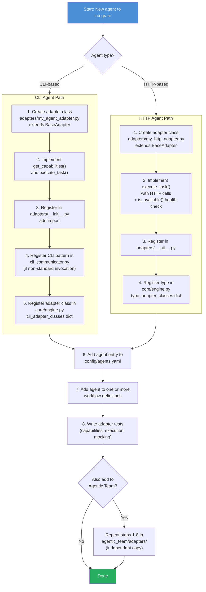
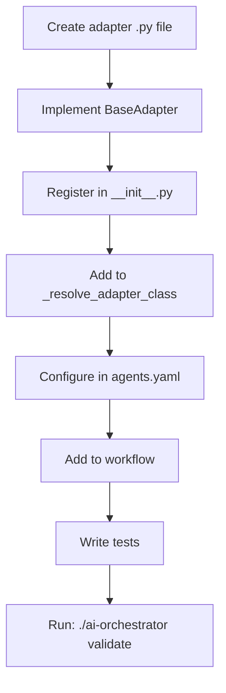

# Adding New AI Agents

Guide for integrating new AI coding assistants into either the Orchestrator or Agentic Team system.

## Architecture

Both systems use an adapter pattern. Each AI agent has an adapter class that inherits from `BaseAdapter` and implements:

```python
from orchestrator.adapters.base import BaseAdapter, AgentCapability, AgentResponse

class MyNewAdapter(BaseAdapter):
    def get_capabilities(self) -> list[AgentCapability]:
        return [AgentCapability.IMPLEMENTATION, AgentCapability.CODE_REVIEW]

    def execute_task(self, task: str, context: dict) -> AgentResponse:
        # Your implementation here
        return AgentResponse(success=True, output="result")
```

### Agent Integration Flowchart

The following diagram shows the complete step-by-step process for adding a new agent to either system:



## Step-by-Step: CLI-Based Agent

For agents that expose a CLI tool (like `claude`, `codex`, `gemini`):

### 1. Create the Adapter

Create `orchestrator/adapters/my_agent_adapter.py`:

```python
from typing import Any, Dict, List
from .base import AgentCapability, AgentResponse, BaseAdapter

class MyAgentAdapter(BaseAdapter):
    def __init__(self, config: Dict[str, Any]):
        super().__init__(config)
        self.command = config.get("command", "my-agent-cli")

    def get_capabilities(self) -> List[AgentCapability]:
        return [AgentCapability.IMPLEMENTATION, AgentCapability.CODE_REVIEW]

    def execute_task(self, task: str, context: Dict[str, Any]) -> AgentResponse:
        prompt = self._build_prompt(task, context)
        return self._run_command_with_prompt(
            prompt=prompt,
            working_dir=context.get("working_dir"),
            use_workspace=True,
        )

    def _build_prompt(self, task: str, context: Dict[str, Any]) -> str:
        parts = [f"Task: {task}"]
        if context.get("feedback"):
            parts.append(f"\nFeedback: {context['feedback']}")
        return "\n".join(parts)
```

### 2. Register in `__init__.py`

Add to `orchestrator/adapters/__init__.py`:

```python
from .my_agent_adapter import MyAgentAdapter
```

### 3. Register CLI Pattern

If the CLI has a unique invocation pattern, add it to `CLICommunicator._build_command_for_tool()` in `cli_communicator.py`:

```python
if self.command_name == "my-agent":
    return [*self.command_parts, "--prompt", prompt]
```

### 4. Register Adapter Class

Add to the `_resolve_adapter_class()` method in `orchestrator/core/engine.py`:

```python
cli_adapter_classes = {
    "codex": CodexAdapter,
    "gemini": GeminiAdapter,
    "claude": ClaudeAdapter,
    "copilot": CopilotAdapter,
    "my-agent": MyAgentAdapter,  # Add here
}
```

### 5. Configure in YAML

Add to `orchestrator/config/agents.yaml`:

```yaml
agents:
  my-agent:
    type: cli
    enabled: true
    command: "my-agent-cli"
    role: "implementation"
    timeout: 3600
    description: "My custom AI agent"
```

### 6. Add to Workflows

```yaml
workflows:
  custom:
    - agent: my-agent
      task: implement
    - agent: gemini
      task: review
```

## Step-by-Step: HTTP-Based Agent

For agents that expose an HTTP API (like Ollama, llama.cpp):

```python
class MyHTTPAdapter(BaseAdapter):
    def __init__(self, config):
        local_config = dict(config)
        local_config.setdefault("offline", True)
        super().__init__(local_config)
        self.endpoint = config.get("endpoint", "http://localhost:8000")
        self.model = config.get("model", "default")

    def execute_task(self, task, context):
        prompt = self._build_local_llm_prompt(task, context)
        payload = {"prompt": prompt, "model": self.model}
        return self._run_http_with_prompt(payload)

    def is_available(self):
        try:
            import httpx
            resp = httpx.get(f"{self.endpoint}/health", timeout=2)
            return resp.status_code == 200
        except Exception:
            return False
```

Configure with:

```yaml
agents:
  my-local-model:
    type: my-http-type
    enabled: true
    endpoint: "http://localhost:8000"
    model: "my-model"
    offline: true
```

## Adding to Agentic Team

The process is identical — just work in `agentic_team/adapters/` instead of `orchestrator/adapters/`. The agentic team has its own independent copy of all adapters.

## Testing Your Adapter

```python
def test_my_adapter_capabilities():
    config = {"name": "my-agent", "enabled": True, "command": "echo"}
    adapter = MyAgentAdapter(config)
    caps = adapter.get_capabilities()
    assert AgentCapability.IMPLEMENTATION in caps

def test_my_adapter_execute(self):
    config = {"name": "my-agent", "enabled": True, "command": "echo"}
    adapter = MyAgentAdapter(config)
    # Mock the CLI communicator
    adapter.cli_communicator = MagicMock()
    adapter.cli_communicator.execute_with_retry.return_value = (True, "output", "")
    resp = adapter.execute_task("test", {"working_dir": "/tmp"})
    assert resp.success
```

## Agent Registration Flow


