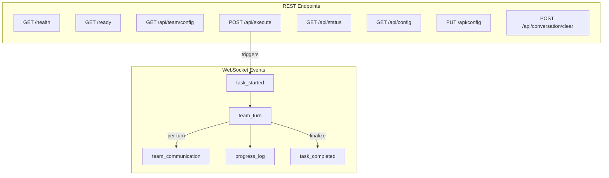
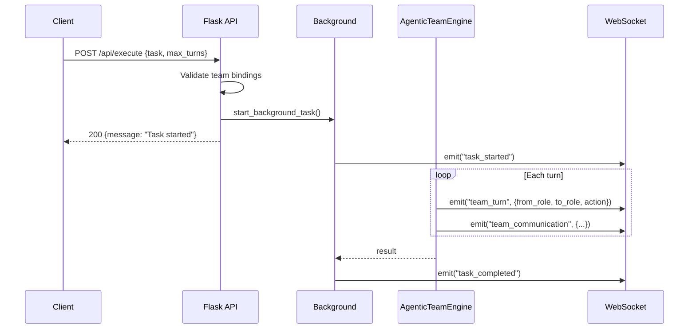

# Agentic Team API Reference

Complete reference for the standalone Agentic Team Flask + SocketIO backend at `agentic_team/ui/app.py`. Default port: `5002`.

## API Overview



## Execution Flow



## Client Identity

Every request and WebSocket connection is associated with a client ID. The backend resolves client identity in this priority order:

1. `client_id` field in the JSON request body
2. `client_id` query parameter
3. `X-Client-Id` request header

If none are provided, the client ID defaults to `"default"`. Client IDs are trimmed and capped at 128 characters. Each client ID maintains an isolated session state.

---

## REST Endpoints

### GET /health

Health probe. Always returns 200 if the server is running.

**Response** `200`

```json
{
  "status": "healthy",
  "timestamp": "2024-01-15T10:30:00.000000"
}
```

---

### GET /ready

Readiness probe. Returns 200 only if the engine has at least one available agent adapter.

**Response** `200`

```json
{
  "status": "ready",
  "agents_count": 3,
  "timestamp": "2024-01-15T10:30:00.000000"
}
```

**Response** `503`

```json
{
  "status": "not ready",
  "reason": "no available agents for agentic team",
  "timestamp": "2024-01-15T10:30:00.000000"
}
```

---

### GET /api/team/config

Return the effective team configuration, validation state, and runtime status.

**Response** `200`

```json
{
  "team": {
    "lead_role": "project_manager",
    "max_turns": 12,
    "roles": {
      "project_manager": {
        "title": "Project Manager (Team Lead)",
        "agent": "claude",
        "responsibilities": "Initiate work, route subtasks dynamically, and decide final readiness."
      },
      "software_architect": {
        "title": "Software Architect",
        "agent": "gemini",
        "responsibilities": "Define architecture, interfaces, and technical constraints."
      },
      "software_developer": {
        "title": "Software Developer",
        "agent": "codex",
        "responsibilities": "Implement required code changes."
      },
      "qa_engineer": {
        "title": "QA Engineer",
        "agent": "gemini",
        "responsibilities": "Validate quality, edge cases, and regressions."
      },
      "devops_engineer": {
        "title": "DevOps Engineer",
        "agent": "claude",
        "responsibilities": "Handle deployment/runtime concerns and operational readiness."
      }
    }
  },
  "agents": ["claude", "codex", "gemini"],
  "validation": {
    "valid": true,
    "available_agents": ["claude", "codex", "gemini"],
    "missing_roles": [],
    "reason": ""
  },
  "runtime_status": {
    "engine": "agentic_team",
    "config_path": "/path/to/agents.yaml",
    "offline_mode": false,
    "available_agents": ["claude", "codex", "gemini"],
    "team_validation": { "...same as validation..." },
    "runtime_settings": {
      "max_message_chars": 5000,
      "repeat_route_limit": 3
    }
  }
}
```

---

### GET /api/config

Return the raw YAML content and parsed configuration object currently loaded by the engine.

**Response** `200`

```json
{
  "path": "/path/to/agents.yaml",
  "content": "agents:\n  codex:\n    type: cli\n    ...",
  "parsed": {
    "agents": { "..." },
    "workflows": { "..." },
    "settings": { "..." },
    "agentic_team": { "..." }
  },
  "last_modified": "2024-01-15T10:30:00.000000"
}
```

**Response** `404`

```json
{
  "error": "Config file not found: /path/to/agents.yaml"
}
```

---

### PUT /api/config

Update the YAML configuration file, reload the engine, and return the new validation state.

**Request Body**

Provide either a parsed config object or raw YAML string:

```json
{
  "config": {
    "agents": { "..." },
    "workflows": { "..." },
    "settings": { "..." },
    "agentic_team": { "..." }
  }
}
```

Or:

```json
{
  "content": "agents:\n  codex:\n    type: cli\n    enabled: true\n    ..."
}
```

**Validation Rules**

- Top-level must be a YAML mapping.
- Required sections: `agents`, `workflows`, `settings` (all must be mappings).
- `agentic_team` is optional but must be a mapping if present.

**Response** `200`

```json
{
  "message": "Configuration updated and agentic team engine reloaded",
  "path": "/path/to/agents.yaml",
  "content": "agents:\n  ...",
  "parsed": { "..." },
  "validation": {
    "valid": true,
    "available_agents": ["claude", "codex", "gemini"],
    "missing_roles": [],
    "reason": ""
  },
  "last_modified": "2024-01-15T10:30:00.000000"
}
```

**Response** `400`

```json
{
  "error": "Missing required section: agents"
}
```

**Response** `500`

```json
{
  "error": "Failed to update config: <exception details>"
}
```

---

### POST /api/execute

Start an asynchronous agentic team execution. The response returns immediately; real-time progress is delivered over WebSocket events.

**Request Body**

```json
{
  "task": "Implement a rate limiter middleware for the Flask API",
  "max_turns": 12,
  "is_followup": false,
  "client_id": "my-session-id"
}
```

| Field | Type | Required | Default | Description |
|---|---|---|---|---|
| `task` | string | Yes | -- | The task to execute |
| `max_turns` | integer | No | 12 | Maximum team communication turns |
| `is_followup` | boolean | No | false | Prepend previous task context |
| `client_id` | string | No | `"default"` | Session identifier |

When `is_followup` is true and the client has a previous task, the engine receives a composite prompt:

```
Previous task: <last_task>
Previous result: <last_output>

Follow-up: <task>
```

**Response** `200`

```json
{
  "message": "Task started",
  "client_id": "my-session-id"
}
```

**Response** `400` -- No task provided

```json
{
  "error": "Task is required"
}
```

**Response** `400` -- No available agents

```json
{
  "error": "No available agents detected. Enable/install at least one agent before running.",
  "validation": {
    "valid": false,
    "available_agents": [],
    "missing_roles": [],
    "reason": "no_available_agents"
  }
}
```

**Response** `400` -- Invalid team bindings

```json
{
  "error": "Team configuration is invalid. Roles mapped to unavailable agents: qa_engineer:copilot",
  "validation": {
    "valid": false,
    "available_agents": ["claude", "codex"],
    "missing_roles": [
      { "role": "qa_engineer", "agent": "copilot" }
    ],
    "reason": "invalid_mappings"
  }
}
```

---

### GET /api/status

Return the current session state snapshot for the calling client.

**Query Parameters**

| Parameter | Description |
|---|---|
| `client_id` | Session identifier (also accepted via `X-Client-Id` header) |

**Response** `200`

```json
{
  "client_id": "my-session-id",
  "task": "Implement a rate limiter...",
  "status": "completed",
  "results": { "...full execute_task result..." },
  "team_turns": [ "...step dicts..." ],
  "team_communications": [ "...communication summaries..." ],
  "team_config": {
    "lead_role": "project_manager",
    "max_turns": 12,
    "roles": { "..." }
  },
  "conversation_history": [
    {
      "role": "user",
      "content": "Implement a rate limiter...",
      "is_followup": false,
      "timestamp": "2024-01-15T10:30:00.000000"
    },
    {
      "role": "assistant",
      "content": "Here is the implementation...",
      "timestamp": "2024-01-15T10:31:15.000000"
    }
  ],
  "last_task": "Implement a rate limiter...",
  "last_output": "Here is the implementation...",
  "logs": [
    {
      "message": "Starting agentic team execution (max turns: 12)",
      "level": "info",
      "timestamp": "2024-01-15T10:30:00.000000"
    }
  ],
  "started_at": "2024-01-15T10:30:00.000000",
  "updated_at": "2024-01-15T10:31:15.000000"
}
```

Session `status` values: `idle`, `running`, `completed`, `failed`, `error`.

---

### POST /api/conversation/clear

Reset the conversation history and session state for the calling client.

**Request Body**

```json
{
  "client_id": "my-session-id"
}
```

**Response** `200`

```json
{
  "message": "Conversation cleared",
  "client_id": "my-session-id"
}
```

---

## WebSocket Interface

Connect using Socket.IO on the default namespace (`/`). Pass `client_id` as a query parameter to join a client-specific room:

```javascript
const socket = io("http://localhost:5002", {
  query: { client_id: "my-session-id" }
});
```

All server-emitted events are scoped to the client's room.

### Event: connected

Emitted immediately after a successful Socket.IO connection.

**Direction:** Server to Client

**Payload:**

```json
{
  "message": "Connected to Agentic Team UI",
  "status": "idle",
  "client_id": "my-session-id"
}
```

---

### Event: task_started

Emitted when an `execute_task()` call begins in the background worker.

**Direction:** Server to Client

**Payload:**

```json
{
  "task": "Implement a rate limiter middleware for the Flask API",
  "max_turns": 12,
  "engine": "agentic_team"
}
```

---

### Event: team_turn

Emitted after each turn completes. Contains the full step record from the engine.

**Direction:** Server to Client

**Payload:**

```json
{
  "event": "team_turn",
  "engine": "agentic_team",
  "timestamp": "2024-01-15T10:30:05.000000",
  "execution_id": "550e8400-e29b-41d4-a716-446655440000",
  "turn": 3,
  "task": "team_message",
  "action": "message",
  "agent": "gemini",
  "from_agent": "gemini",
  "team_role": "software_architect",
  "from_role": "software_architect",
  "to_role": "software_developer",
  "to_agent": "codex",
  "message": "Use a token bucket algorithm with configurable burst size...",
  "success": true,
  "output": "<full raw model output>",
  "error": null,
  "files_modified": [],
  "suggestions": [],
  "communication_type": "inter_role",
  "fallback_from": null
}
```

---

### Event: team_communication

Emitted alongside every `team_turn` event. Contains a simplified routing summary suitable for UI visualization.

**Direction:** Server to Client

**Payload:**

```json
{
  "event": "team_communication",
  "timestamp": "2024-01-15T10:30:05.000000",
  "turn": 3,
  "action": "message",
  "from_role": "software_architect",
  "to_role": "software_developer",
  "from_agent": "gemini",
  "to_agent": "codex",
  "message": "Use a token bucket algorithm with configurable burst size...",
  "success": true
}
```

---

### Event: progress_log

Timestamped log message for general execution progress.

**Direction:** Server to Client

**Payload:**

```json
{
  "message": "Turn 3: software_architect (gemini) -> software_developer (codex) [message]",
  "level": "info",
  "timestamp": "2024-01-15T10:30:05.000000"
}
```

Log levels: `info`, `success`, `error`.

---

### Event: task_completed

Emitted when team execution finishes (regardless of success or failure).

**Direction:** Server to Client

**Payload:**

```json
{
  "success": true,
  "output": "Here is the complete rate limiter implementation...",
  "iterations": [
    {
      "steps": [ "...step dicts..." ],
      "final_output": "Here is the complete rate limiter implementation..."
    }
  ],
  "team_turns": [ "...step dicts..." ],
  "team_communications": [
    {
      "event": "team_communication",
      "timestamp": "...",
      "turn": 1,
      "action": "message",
      "from_role": "project_manager",
      "to_role": "software_architect",
      "from_agent": "claude",
      "to_agent": "gemini",
      "message": "...",
      "success": true
    }
  ],
  "team_config": {
    "lead_role": "project_manager",
    "max_turns": 12,
    "roles": { "..." }
  }
}
```

---

### Event: task_error

Emitted when the background execution raises an unhandled exception.

**Direction:** Server to Client

**Payload:**

```json
{
  "error": "Primary agent 'codex' not found in available adapters"
}
```

---

## Session State Model

Each client ID maintains an isolated session with this structure:

| Field | Type | Description |
|---|---|---|
| `task` | string or null | Current/last submitted task |
| `status` | string | `idle`, `running`, `completed`, `failed`, `error` |
| `results` | object or null | Full `execute_task()` return value |
| `team_turns` | array | Step dicts from the current execution |
| `team_communications` | array | Simplified communication records |
| `team_config` | object or null | Team config from the result |
| `conversation_history` | array | Alternating user/assistant message records |
| `last_task` | string or null | Most recent task string (for follow-ups) |
| `last_output` | string or null | Most recent final output |
| `logs` | array | Timestamped log entries (capped at 500) |
| `started_at` | string or null | ISO-8601 timestamp of last execution start |
| `updated_at` | string | ISO-8601 timestamp of last state mutation |

Sessions are stored in-memory and do not persist across server restarts.

---

## Environment Variables

| Variable | Default | Description |
|---|---|---|
| `AGENTIC_UI_BACKEND_PORT` | `5002` | Server listen port (also accepts `PORT`) |
| `FLASK_SECRET_KEY_AGENTIC` | Random hex | Flask session signing key |
| `CORS_ALLOWED_ORIGINS` | `*` | Comma-separated allowed CORS origins |
| `AGENTIC_TEAM_CONFIG_PATH` | `agentic_team/config/agents.yaml` | Config file path override |
| `FLASK_DEBUG` | `false` | Enable Flask debug mode (`true`, `1`, `yes`) |

---

## Error Handling

All REST endpoints return JSON error bodies. HTTP status codes follow standard conventions:

| Code | Meaning |
|---|---|
| `200` | Success |
| `400` | Client error (missing field, invalid config, unavailable agents) |
| `404` | Resource not found (config file missing) |
| `500` | Internal server error |
| `503` | Service not ready (no available agents) |

WebSocket errors are emitted as `task_error` events. The session status is set to `"error"` and a `progress_log` with level `"error"` is also emitted.
