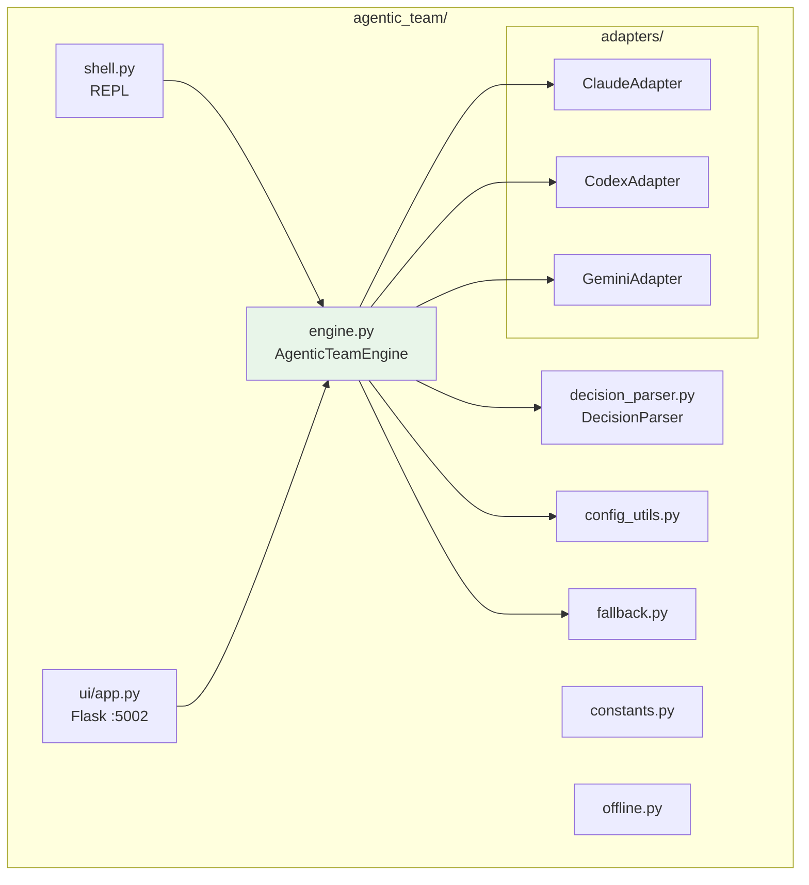
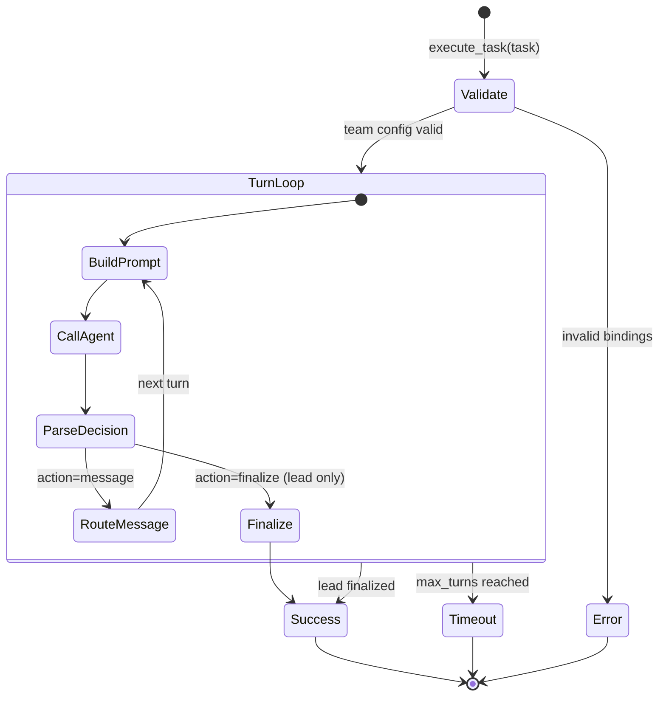

# Agentic Team Architecture

Deep architecture reference for the standalone agentic team engine.

## System Overview



## Execution Lifecycle



## Decision Parsing Pipeline

```mermaid
flowchart TD
    INPUT[LLM Output] --> A{Direct JSON parse?}
    A -->|Success| DONE[Parsed Dict]
    A -->|Fail| B{Fenced code block?}
    B -->|Found JSON in ```| DONE
    B -->|None| C{Streaming scan for '{'?}
    C -->|Found valid JSON| DONE
    C -->|None| D{Key-value lines?}
    D -->|Found action/to_role| DONE
    D -->|None| E[Fallback: raw text as message]
    E --> DONE
```

## Role-Based Communication Model

### Design Principles

The agentic team implements **free inter-role communication**: any role can address any other role on any turn. There are no predefined message routes or workflow graphs. Routing decisions are made by the LLM occupying each role, returned as structured JSON in the model output.

Constraints enforced by the engine:

1. **Lead-gated finalization** -- Only the designated lead role (default: `project_manager`) can issue the `finalize` action. All other roles are restricted to `message`.
2. **Role existence** -- If a routing decision targets a role not present in the team config, the engine silently redirects to the lead.
3. **Repeated route detection** -- Identical route fingerprints (sender, recipient, message prefix) that recur beyond the configured limit trigger automatic escalation to the lead.
4. **Message size** -- Inter-role messages exceeding `max_message_chars` are truncated with a system notice appended.

### Role Specification

Each role is defined in the `agentic_team.roles` section of `agents.yaml` with three fields:

```yaml
software_developer:
  title: "Software Developer"          # Human-readable label for prompts and UI
  agent: "codex"                       # Agent adapter key from top-level `agents` section
  responsibilities: "Implement code."  # Injected into the role prompt
```

Role names are normalized to `snake_case` by `normalize_role()`: lowercased, hyphens and spaces replaced with underscores, consecutive underscores collapsed.

### Default Roles

Defined in `config_utils.default_roles()` and merged with YAML overrides:

| Canonical Key | Title | Default Agent Preference Order |
|---|---|---|
| `project_manager` | Project Manager (Team Lead) | claude, gemini, codex, copilot |
| `software_architect` | Software Architect | gemini, claude, codex, copilot |
| `software_developer` | Software Developer | codex, claude, copilot, gemini |
| `qa_engineer` | QA Engineer | gemini, copilot, claude, codex |
| `devops_engineer` | DevOps Engineer | claude, codex, gemini, copilot |

The preference order is used by `_pick_preferred_agent()` when no explicit agent is configured. It walks the list and returns the first agent that has an available adapter; failing that, the first enabled agent in config; failing that, any available adapter.

### Config Resolution Pipeline

```
agents.yaml
    │
    ▼
resolve_team_config(root_config, pick_preferred_agent)
    │
    ├─ Build default_roles() with preferred agent picks
    ├─ Overlay agentic_team.roles entries from YAML
    │   ├─ normalize_role(key)
    │   ├─ Merge with defaults (YAML wins on conflict)
    │   └─ Backfill missing agent with pick_preferred_agent([])
    ├─ Resolve lead_role (default: project_manager)
    └─ Resolve max_turns (default: 12, minimum: 1)
         │
         ▼
    { lead_role, max_turns, roles: { ... } }
```

### Validation

`validate_team_bindings(team_cfg, available_agents)` checks:

- At least one role is configured.
- The `lead_role` exists in the roles map.
- Every role's `agent` value matches a key in the available adapters set.

Returns a structured payload:

```json
{
  "valid": true,
  "available_agents": ["claude", "codex", "gemini"],
  "missing_roles": [],
  "reason": ""
}
```

Failure reasons: `no_roles_configured`, `invalid_lead_role`, `no_available_agents`, `invalid_mappings`.

## Prompt Construction

Each turn builds a system prompt via `_build_prompt()` containing:

1. **Metadata** -- Current turn number, max turns, lead role identity.
2. **Role context** -- The recipient role's name, title, and responsibilities.
3. **Original task** -- The user's full task string (immutable across turns).
4. **Team roster** -- All role names, titles, and assigned agents.
5. **Transcript window** -- The last 8 steps from the execution transcript, formatted as `turn N | from_role -> to_role [action]: message`.
6. **Incoming message** -- The specific message from the sender role (or `user` on turn 1).
7. **Response format** -- JSON schema for the routing decision.
8. **Finalization rule** -- Contextual instruction: non-lead roles are told they cannot finalize; the lead is told to finalize only when ready.

## Decision Parsing Pipeline

The `DecisionParser` class extracts a structured routing decision from raw LLM output. It applies four strategies in order, stopping at the first success.

### Strategy 1: Direct JSON Parse

Attempt `json.loads()` on the entire output string. If the result is a `dict`, return it immediately.

### Strategy 2: Fenced Code Block Extraction

Regex: `` ```(?:json)?\s*(.*?)``` ``

Iterate over all fenced code blocks in the output. For each block, attempt `json.loads()`. Return the first successful `dict` parse.

### Strategy 3: Streaming Scan

Walk the output character-by-character. At each `{`, attempt `json.JSONDecoder().raw_decode()` from that position. Return the first valid `dict`.

This handles cases where the LLM wraps JSON in prose, e.g., `Here is my decision: {"action": "message", ...} Let me know if...`.

### Strategy 4: Key-Value Line Fallback

If no JSON object is found by any of the above strategies, scan each line for key-value patterns:

| Pattern | Captures |
|---|---|
| `action: <value>` | `action` field |
| `to_role:` / `target_role:` / `next_role: <value>` | `to_role` field |
| `final_response:` / `user_response: <value>` | `final_response` field |

Only the first match per field is kept.

### Decision Normalization

After extraction (JSON or KV), `parse_decision()` normalizes the result:

1. **Action** -- Lowercased and validated. Must be `"message"` or `"finalize"`. Anything else defaults to `"message"`.
2. **to_role** -- Accepts `to_role`, `target_role`, or `next_role` keys. Normalized via `normalize_role()`.
3. **message** -- Falls back to `instruction` or `deliverable` keys if `message` is absent. If still empty, the entire raw output is used as the message.
4. **final_response** -- Accepts `final_response` or `user_response` keys.
5. **Non-lead finalize guard** -- If a non-lead role returns `finalize`, the action is overridden to `message` and `to_role` is set to the lead role. A log entry is emitted.
6. **Default routing** -- If `to_role` is empty after normalization for a `message` action, it defaults to the lead role.

## Finalization Protocol

Finalization is the mechanism by which the team delivers a result to the user.

### Rules

- Only the lead role can finalize. The engine enforces this at two levels:
  1. `DecisionParser.parse_decision()` downgrades non-lead finalize attempts.
  2. `execute_task()` checks `action == "finalize" and current_role == lead_role` before accepting a finalization.
- Upon finalization, the `final_response` field from the decision payload becomes the return value.
- If `final_response` is empty, `response.output` (the full raw model output) is used.
- The execution loop breaks immediately after a successful finalization.
- The result's `termination_reason` is set to `"lead_finalize"`.

### Timeout Without Finalization

If the turn loop exhausts `max_turns` without the lead finalizing:

- `termination_reason` is set to `"max_turns_reached_without_finalize"`.
- `final_output` is populated with the last step's raw output, prefixed with a warning.
- `success` remains `False`.

## Escalation Logic

### Repeated Route Detection

Each turn computes a route fingerprint:

```
"{current_role}->{to_role}:{message_prefix_240_chars_lowercase}"
```

A counter per fingerprint is maintained for the execution. When the counter for any fingerprint reaches `repeat_route_limit` (default 3) and the current role is not the lead:

1. `to_role` is overridden to the lead role.
2. A system notice is appended to the message: `[System] Repetition detected in team routing. Escalating to lead for decision.`
3. The `lead_escalation_count` stat is incremented.

This prevents infinite ping-pong loops between two roles.

### Invalid Role Redirect

If a routing decision targets a role name that does not exist in the team config and is not `"user"`, the engine silently redirects to the lead role.

### Execution Failure Redirect

If a turn's adapter execution returns `success=False`, the action is forced to `message`, `to_role` is set to the lead, and the error is forwarded as the message body. This ensures the lead is always aware of failures and can decide how to proceed.

## Fallback Execution

The `FallbackManager` handles cloud-to-local failover on transient errors.

### Resolution Order

1. **Explicit fallback** -- A role spec can include `fallback: "local-instruct"`.
2. **Configured map** -- The `settings.fallback.map` section maps primary agent names to fallback agent names (e.g., `codex: local-code`).
3. **No fallback** -- If neither is configured, failures are returned as-is.

### Trigger Conditions

Fallback only activates when `settings.fallback.enabled: true` and the failure matches transient patterns:

- Python exceptions: `ConnectionError`, `TimeoutError`, `OSError`, `httpx.RequestError`, or `httpx.HTTPStatusError` with status >= 500.
- Error string inspection: presence of `connection`, `network`, `timed out`, `timeout`, `dns`, `unreachable`, `api error`, `http error`, `503`, `502`, `504`.

Non-transient failures (e.g., invalid prompt, model refusal) are not retried.

### Execution Sequence

```
Primary Adapter
    │
    ├─ Success ─────────────────────► return (primary, response, None)
    │
    ├─ Exception ──► is transient? ──► Yes ──► Fallback Adapter
    │                    │                         │
    │                    No                   ├─ Success ► return (fallback, response, primary)
    │                    │                   └─ Failure ► return (primary, combined_error, None)
    │                    ▼
    │              return (primary, error, None)
    │
    └─ success=False ──► is transient? ──► (same as above)
```

The return tuple is `(agent_used, AgentResponse, fallback_from_agent)`. When `fallback_from_agent` is non-None, the `fallback_count` stat is incremented and the step record includes `fallback_from`.

## Turn Callbacks

`execute_task()` accepts an optional `turn_callback: Callable[[dict], None]`. After each step is appended to the transcript, the callback is invoked with a copy of the step dict.

### Step Schema

```json
{
  "timestamp": "2024-01-15T10:30:00+00:00",
  "execution_id": "uuid",
  "turn": 3,
  "task": "team_message",
  "action": "message",
  "agent": "gemini",
  "from_agent": "gemini",
  "team_role": "software_architect",
  "from_role": "software_architect",
  "to_role": "software_developer",
  "to_agent": "codex",
  "message": "Implement the rate limiter using a token bucket algorithm...",
  "success": true,
  "output": "<full raw model output>",
  "error": null,
  "files_modified": [],
  "suggestions": [],
  "communication_type": "inter_role",
  "fallback_from": null
}
```

`communication_type` values:

| Value | Meaning |
|---|---|
| `to_user` | The step is a finalization delivered to the user |
| `self` | The role routed a message to itself |
| `inter_role` | Standard cross-role communication |

Callback exceptions are caught and logged as warnings; they never halt execution.

## Execution Result Schema

The dict returned by `execute_task()`:

```json
{
  "task": "original user task string",
  "engine": "agentic_team",
  "execution_id": "uuid",
  "started_at": "ISO-8601",
  "completed_at": "ISO-8601",
  "duration_ms": 45200,
  "termination_reason": "lead_finalize",
  "iterations": [
    {
      "steps": [ "...step dicts..." ],
      "final_output": "the lead's finalized response"
    }
  ],
  "final_output": "the lead's finalized response",
  "success": true,
  "offline_mode": false,
  "stats": {
    "turns_executed": 7,
    "fallback_count": 0,
    "lead_escalation_count": 0
  },
  "team": {
    "lead_role": "project_manager",
    "max_turns": 12,
    "roles": { "...role specs..." }
  }
}
```

## Offline Detection

`OfflineDetector` performs a lightweight HTTP HEAD request to a configurable URL (default: `https://httpbin.org/status/200`). Results are cached for `check_interval` seconds (default 60) using monotonic time. Only 2xx responses count as "online".

Override the check URL with the `CONNECTIVITY_CHECK_URL` environment variable.

## Adapter Resolution

`_resolve_adapter_class()` maps agent config to an adapter class using two-tier lookup:

1. **By type** -- If `type: cli`, the `provider`, `adapter`, or agent name is matched against `{codex, gemini, claude, copilot}`. Command aliases like `gemini-cli` and `gh-copilot` are also recognized. For non-CLI types (`ollama`, `llamacpp`, `localai`, `text-generation-webui`, `openai-compatible`), the corresponding adapter class is returned directly.
2. **By name** -- If no `type` is set, the agent name itself is matched against the CLI adapter map.

Agents with `enabled: false` are skipped during initialization. In offline mode, only agents identified as local by `_is_local_agent()` are initialized.

## Optional: MCP Access

The agentic team can be accessed via MCP tools (`agentic_team_execute`, `agentic_team_config`, etc.) through the optional `mcp_server/`. See [`MCP.md`](../MCP.md).
