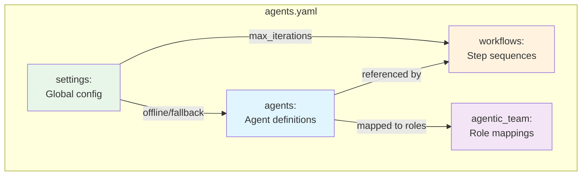
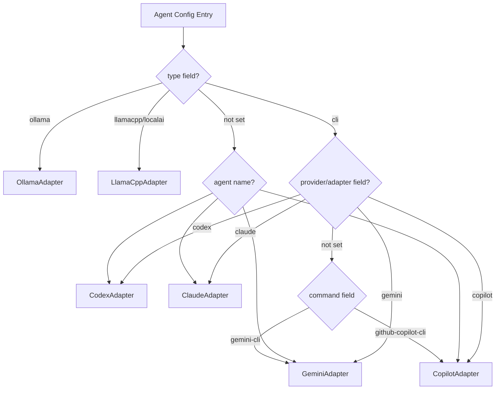

# Configuration Guide

Complete reference for the `agents.yaml` configuration file. Each system has its own independent copy:

- **Orchestrator**: `orchestrator/config/agents.yaml` (override: `AI_ORCHESTRATOR_CONFIG_PATH`)
- **Agentic Team**: `agentic_team/config/agents.yaml` (override: `AGENTIC_TEAM_CONFIG_PATH`)

## Config File Structure



## Adapter Resolution Flow



## Table of Contents

- [File Structure](#file-structure)
- [Agents Section](#agents-section)
- [Workflows Section](#workflows-section)
- [Settings Section](#settings-section)
- [Agentic Team Section](#agentic-team-section)
- [Environment Variable Overrides](#environment-variable-overrides)
- [Pydantic Settings Reference](#pydantic-settings-reference)
- [Validation Rules](#validation-rules)
- [Examples](#examples)

---

## File Structure

The configuration file has four top-level sections:

```yaml
agents:       # Required - Agent definitions
workflows:    # Required - Workflow definitions
settings:     # Required - Global settings
agentic_team: # Optional - Team role assignments
```

The `agents`, `workflows`, and `settings` sections are required for API-based config updates. The `agentic_team` section is optional.

---

## Agents Section

Each key under `agents` is a user-defined agent name. The name is used to reference the agent in workflows, fallback mappings, and the API.

### Agent Fields

| Field          | Type       | Default    | Required | Description |
|----------------|------------|------------|----------|-------------|
| `type`         | `string`   | `"cli"`    | No       | Adapter type (see [Adapter Types](#adapter-types)) |
| `enabled`      | `bool`     | `true`     | No       | Whether the agent is active |
| `command`      | `string`   | --         | CLI only | CLI executable name or path |
| `endpoint`     | `string`   | --         | HTTP only| HTTP endpoint URL |
| `model`        | `string`   | --         | No       | Model identifier (Ollama/llama.cpp) |
| `role`         | `string`   | --         | No       | Semantic role label for display |
| `timeout`      | `int`      | `3600`     | No       | Per-execution timeout in seconds |
| `offline`      | `bool`     | `false`    | No       | Mark as a local-only agent |
| `capabilities` | `list`     | --         | No       | Override default capabilities |
| `description`  | `string`   | --         | No       | Human-readable description |
| `provider`     | `string`   | --         | No       | Explicit adapter provider (for `type: cli`) |
| `adapter`      | `string`   | --         | No       | Explicit adapter class hint (for `type: cli`) |
| `max_tokens`   | `int`      | `4096`     | No       | Max tokens for llama.cpp completions |
| `temperature`  | `float`    | `0.7`      | No       | Sampling temperature for llama.cpp (0.0-2.0) |
| `keep_alive`   | `string`   | `"5m"`     | No       | Ollama model keep-alive duration |
| `model_path`   | `string`   | --         | No       | Path to GGUF model file (llama.cpp) |

### Adapter Types

The `type` field determines which adapter class handles the agent:

| Type Value                | Adapter Class      | Transport | Description |
|---------------------------|--------------------|-----------|-------------|
| `cli`                     | Resolved by name   | Subprocess | Cloud CLI tools |
| `ollama`                  | `OllamaAdapter`    | HTTP      | Ollama model server |
| `llamacpp`                | `LlamaCppAdapter`  | HTTP      | llama.cpp server |
| `localai`                 | `LlamaCppAdapter`  | HTTP      | LocalAI server |
| `text-generation-webui`   | `LlamaCppAdapter`  | HTTP      | oobabooga text-generation-webui |
| `openai-compatible`       | `LlamaCppAdapter`  | HTTP      | Any OpenAI-compatible endpoint |

For `type: cli`, the specific adapter is resolved by (in priority order):
1. The `provider` field
2. The `adapter` field
3. The agent key name (e.g., `codex`, `gemini`)
4. The `command` field (with alias normalization)

### CLI Adapter Mapping

| Name / Command                | Adapter Class      |
|-------------------------------|--------------------|
| `codex`                       | `CodexAdapter`     |
| `gemini`, `gemini-cli`        | `GeminiAdapter`    |
| `claude`                      | `ClaudeAdapter`    |
| `copilot`, `github-copilot-cli`, `gh-copilot` | `CopilotAdapter` |

### Capabilities

The `capabilities` field accepts a list of tags that override the adapter's defaults:

| Tag        | Maps To                      |
|------------|------------------------------|
| `code`     | `AgentCapability.IMPLEMENTATION` |
| `review`   | `AgentCapability.CODE_REVIEW`    |
| `docs`     | `AgentCapability.DOCUMENTATION`  |
| `general`  | `AgentCapability.DOCUMENTATION`  |
| `test`     | `AgentCapability.TESTING`        |
| `refactor` | `AgentCapability.REFACTORING`    |

Currently honored by the Ollama adapter. Other adapters define capabilities in code.

### Cloud Agent Examples

```yaml
agents:
  codex:
    type: cli
    enabled: true
    command: "codex"
    role: "implementation"
    timeout: 3600
    description: "Primary implementation agent for writing initial code"

  gemini:
    type: cli
    enabled: true
    command: "gemini"
    role: "review"
    timeout: 3600
    description: "Reviews code for SOLID principles and best practices"

  claude:
    type: cli
    enabled: true
    command: "claude"
    role: "refinement"
    timeout: 3600
    description: "Implements feedback and refines code quality"

  copilot:
    type: cli
    enabled: false
    command: "copilot"
    role: "suggestions"
    timeout: 3600
    description: "Provides alternative implementation suggestions"
```

### Local Agent Examples

```yaml
agents:
  local-code:
    type: ollama
    enabled: false
    model: "codellama:13b"
    endpoint: "http://localhost:11434"
    offline: true
    timeout: 3600
    capabilities: [code, review]
    description: "Local coding model via Ollama"

  local-instruct:
    type: ollama
    enabled: false
    model: "mistral:7b-instruct"
    endpoint: "http://localhost:11434"
    offline: true
    timeout: 3600
    capabilities: [general, docs]
    description: "Local instruction/reasoning model via Ollama"

  local-large:
    type: llamacpp
    enabled: false
    endpoint: "http://localhost:8080"
    offline: true
    timeout: 3600
    max_tokens: 4096
    temperature: 0.7
    capabilities: [code, review, docs]
    description: "Local llama.cpp/OpenAI-compatible model endpoint"
```

### Availability Detection

Agent availability is checked at orchestrator startup:

- **CLI agents**: `shutil.which(command)` -- checks if the binary is on `PATH`.
- **Ollama agents**: `GET /api/tags` on the configured endpoint.
- **LlamaCpp agents**: Probes `/health`, `/v1/models`, and root path on the configured endpoint.

Unavailable agents are logged and excluded from workflow execution.

---

## Workflows Section

Workflows define ordered sequences of agent steps. Each workflow maps a name to a list of steps.

### Workflow Formats

Two formats are supported:

**List format** (simple, for cloud-only workflows):

```yaml
workflows:
  default:
    - agent: "codex"
      task: "implement"
      description: "Create initial implementation"
    - agent: "gemini"
      task: "review"
      description: "Review for SOLID principles"
    - agent: "claude"
      task: "refine"
      description: "Implement feedback"
```

**Object format** (with metadata, for offline/hybrid workflows):

```yaml
workflows:
  offline-default:
    description: "Local-only workflow for offline development"
    offline: true
    steps:
      - agent: "local-code"
        role: "implementer"
      - agent: "local-instruct"
        role: "reviewer"
```

### Step Fields

| Field         | Type     | Required | Description |
|---------------|----------|----------|-------------|
| `agent`       | `string` | Yes      | Agent name (must match a key in `agents`) |
| `task`        | `string` | No       | Task type: `implement`, `review`, `refine`, `test`, `document` |
| `role`        | `string` | No       | Alternative to `task` using role names (see normalization) |
| `description` | `string` | No       | Human-readable step description |
| `fallback`    | `string` | No       | Per-step fallback agent name |

Either `task` or `role` should be provided. If both are present, `task` takes priority.

### Task/Role Normalization

Role values are automatically normalized to canonical task types:

| Config Value    | Normalized To |
|-----------------|---------------|
| `implement`     | `implement` (no change) |
| `review`        | `review` (no change) |
| `refine`        | `refine` (no change) |
| `test`          | `test` (no change) |
| `document`      | `document` (no change) |
| `implementer`   | `implement` |
| `reviewer`      | `review` |
| `refiner`       | `refine` |
| `writer`        | `document` |
| `tester`        | `test` |

### Task Type Prompt Prefixes

Each task type generates a specific prompt prefix when sent to agents:

| Task       | Prompt Prefix |
|------------|---------------|
| `implement`| "Implement the following: ..." |
| `review`   | "Review the implementation of: ..." |
| `refine`   | "Refine the implementation based on review feedback for: ..." |
| `test`     | "Write tests for: ..." |
| `document` | "Document the implementation of: ..." |

### Workflow Object Fields

| Field         | Type     | Default | Description |
|---------------|----------|---------|-------------|
| `description` | `string` | --      | Workflow description |
| `offline`     | `bool`   | `false` | Marks the workflow as offline-only (informational) |
| `steps`       | `list`   | --      | List of step objects |

### Built-in Workflows

| Name              | Steps | Description |
|-------------------|-------|-------------|
| `default`         | codex (implement) -> gemini (review) -> claude (refine) | Standard development flow |
| `quick`           | codex (implement) | Fast single-agent prototyping |
| `thorough`        | codex -> copilot -> gemini -> claude -> gemini | Maximum quality with dual review |
| `review-only`     | gemini (review) -> claude (refine) | Review and improve existing code |
| `document`        | claude (document) -> gemini (review) | Documentation generation with review |
| `offline-default` | local-code (implement) -> local-instruct (review) | Air-gapped local development |
| `hybrid`          | local-code (implement) -> claude (review, fallback: local-instruct) | Cost-optimized with cloud review |

### Per-Step Fallback

Individual steps can specify a `fallback` agent that overrides the global fallback map:

```yaml
workflows:
  hybrid:
    steps:
      - agent: "local-code"
        role: "implementer"
      - agent: "claude"
        role: "reviewer"
        fallback: "local-instruct"
```

### Workflow Execution Behavior

- Steps execute sequentially within each iteration.
- If an agent is not available, its step is skipped during workflow construction.
- If all steps are skipped, the orchestrator raises a `ValueError`.
- The workflow iterates up to `settings.max_iterations` times.
- Early termination occurs when all steps succeed and review steps produce 3 or fewer suggestions.

---

## Settings Section

Global execution and behavior settings.

### Core Settings

| Field                       | Type     | Default                 | Description |
|-----------------------------|----------|-------------------------|-------------|
| `max_iterations`            | `int`    | `3`                     | Maximum workflow iteration loops per task |
| `output_dir`                | `string` | `"./output"`            | Default output directory for generated files |
| `workspace_dir`             | `string` | `"./workspace"`         | Workspace directory for agent file operations |
| `log_level`                 | `string` | `"INFO"`                | Logging level |
| `log_file`                  | `string` | `"ai-orchestrator.log"` | Log file path |
| `create_reports`            | `bool`   | `true`                  | Whether to create execution reports |
| `reports_dir`               | `string` | `"./reports"`           | Directory for execution reports |
| `min_suggestions_threshold` | `int`    | `3`                     | Review suggestion count that triggers another iteration |
| `colored_output`            | `bool`   | `true`                  | Enable colored console output |

### Offline Settings

```yaml
settings:
  offline:
    enabled: false
    auto_detect: true
```

| Field         | Type   | Default | Description |
|---------------|--------|---------|-------------|
| `enabled`     | `bool` | `false` | Force offline mode (skips all non-local agents) |
| `auto_detect` | `bool` | `true`  | Use `OfflineDetector` to check connectivity |

**Offline mode resolution order** (first match wins):
1. `Orchestrator(force_offline=True)` constructor argument
2. `settings.offline.enabled: true` in config
3. `settings.offline.auto_detect: true` and `OfflineDetector.is_offline()` returns `True`

When offline mode is active, only agents with `offline: true` or types `ollama`, `llamacpp`, `localai`, `text-generation-webui`, `openai-compatible` are initialized.

### Fallback Settings

```yaml
settings:
  fallback:
    enabled: true
    map:
      codex: local-code
      claude: local-instruct
      gemini: local-instruct
```

| Field     | Type     | Default | Description |
|-----------|----------|---------|-------------|
| `enabled` | `bool`   | `false` | Enable fallback routing on transient errors |
| `map`     | `object` | `{}`    | Agent-to-agent fallback mapping |

The `map` section defines which local agent to use when a cloud agent fails with a transient error. Keys are primary agent names; values are fallback agent names.

Additional key-value pairs can be placed directly under `fallback` (outside `enabled` and `map`) as shorthand fallback entries.

**Fallback trigger conditions** (transient errors only):

| Error Type | Triggers Fallback? |
|-----------|-------------------|
| `ConnectionError`, `TimeoutError`, `OSError` | Yes |
| `httpx.RequestError` | Yes |
| `httpx.HTTPStatusError` with status >= 500 | Yes |
| Error message containing: `connection`, `network`, `timed out`, `timeout`, `dns`, `unreachable`, `api error`, `http error`, `503`, `502`, `504` | Yes |
| Non-network errors (syntax error, invalid prompt, etc.) | No |

---

## Agentic Team Section

Optional section for defining role-based agent assignments used by the UI and multi-agent team workflows.

```yaml
agentic_team:
  lead_role: "project_manager"
  max_turns: 12
  roles:
    project_manager:
      title: "Project Manager (Team Lead)"
      agent: "claude"
      responsibilities: "Initiate work, route subtasks dynamically, and decide final readiness."
    software_architect:
      title: "Software Architect"
      agent: "gemini"
      responsibilities: "Define architecture, interfaces, and technical constraints."
    software_developer:
      title: "Software Developer"
      agent: "codex"
      responsibilities: "Implement required code changes."
    qa_engineer:
      title: "QA Engineer"
      agent: "gemini"
      responsibilities: "Validate quality, edge cases, and regressions."
    devops_engineer:
      title: "DevOps Engineer"
      agent: "claude"
      responsibilities: "Handle deployment/runtime concerns and operational readiness."
```

### Top-Level Fields

| Field       | Type     | Required | Description |
|-------------|----------|----------|-------------|
| `lead_role` | `string` | Yes      | Key of the role that acts as team lead (must exist in `roles`) |
| `max_turns` | `int`    | No       | Maximum communication turns before forced stop |
| `roles`     | `object` | Yes      | Role definitions |

### Role Fields

| Field              | Type     | Required | Description |
|--------------------|----------|----------|-------------|
| `title`            | `string` | Yes      | Display title for the role |
| `agent`            | `string` | Yes      | Agent name (must reference an enabled agent in `agents`) |
| `responsibilities` | `string` | Yes      | Description of the role's responsibilities |

**Constraints:**
- The `lead_role` value must match a key in `roles`.
- Each role's `agent` must reference a valid, enabled agent from the `agents` section.
- If a role references a disabled or unavailable agent, execution is blocked.
- Use the UI Config Studio dropdowns to avoid invalid mappings.

---

## Environment Variable Overrides

| Variable                      | Section     | Default | Description |
|-------------------------------|-------------|---------|-------------|
| `AI_ORCHESTRATOR_CONFIG_PATH` | Global      | `orchestrator/config/agents.yaml` | Override config file path |
| `CONNECTIVITY_CHECK_URL`      | Offline     | `https://httpbin.org/status/200` | URL for network connectivity checks |
| `APP_ENV`                     | Pydantic    | `development` | Application environment |
| `APP_DEBUG`                   | Pydantic    | `false` | Debug mode toggle |
| `FLASK_SECRET_KEY`            | Web UI      | Random  | Flask session secret |
| `CORS_ALLOWED_ORIGINS`        | Web UI      | `*`     | Comma-separated CORS origins |
| `UI_BACKEND_PORT` / `PORT`    | Web UI      | `5001`  | Web server port |
| `FLASK_DEBUG`                 | Web UI      | `false` | Flask debug mode |
| `API_KEY_*`                   | Security    | --      | Auto-loaded by SecretManager |
| `SECRET_*`                    | Security    | --      | Auto-loaded by SecretManager |
| `TOKEN_*`                     | Security    | --      | Auto-loaded by SecretManager |
| `PASSWORD_*`                  | Security    | --      | Auto-loaded by SecretManager |

---

## Pydantic Settings Reference

The `ConfigManager` (`infra/config_manager.py`) provides a Pydantic-based settings system that supplements the YAML configuration. These settings are loaded from environment variables and `.env` files.

### WorkflowSettings

| Field                       | Type    | Default     |
|-----------------------------|---------|-------------|
| `default_workflow`          | `str`   | `"default"` |
| `max_iterations`            | `int`   | `3`         |
| `max_retries`               | `int`   | `3`         |
| `retry_delay`               | `float` | `1.0`       |
| `min_suggestions_threshold` | `int`   | `3`         |

### DirectorySettings

All directories are auto-created on initialization.

| Field           | Type   | Default          |
|-----------------|--------|------------------|
| `output_dir`    | `Path` | `./output`       |
| `workspace_dir` | `Path` | `./workspace`    |
| `reports_dir`   | `Path` | `./reports`      |
| `sessions_dir`  | `Path` | `./sessions`     |
| `logs_dir`      | `Path` | `./logs`         |

### PerformanceSettings

| Field                    | Type   | Default |
|--------------------------|--------|---------|
| `enable_caching`         | `bool` | `true`  |
| `cache_ttl`              | `int`  | `3600`  |
| `max_concurrent_agents`  | `int`  | `3`     |
| `request_timeout`        | `int`  | `3600`  |
| `enable_async_execution` | `bool` | `true`  |

### MonitoringSettings

| Field                       | Type   | Default      |
|-----------------------------|--------|--------------|
| `enable_metrics`            | `bool` | `true`       |
| `metrics_port`              | `int`  | `9090`       |
| `metrics_path`              | `str`  | `"/metrics"` |
| `enable_distributed_tracing`| `bool` | `false`      |

### SecuritySettings

| Field                    | Type       | Default |
|--------------------------|------------|---------|
| `enable_rate_limiting`   | `bool`     | `true`  |
| `rate_limit_per_minute`  | `int`      | `60`    |
| `max_task_length`        | `int`      | `10000` |
| `allowed_commands`       | `List[str]`| `["codex", "gemini", "claude", "copilot", "ollama", "llama-server"]` |

### LoggingSettings

| Field           | Type          | Default                      |
|-----------------|---------------|------------------------------|
| `log_level`     | `str`         | `"INFO"` (validated against: DEBUG, INFO, WARNING, ERROR, CRITICAL) |
| `log_file`      | `str or None` | `"logs/ai-orchestrator.log"` |
| `json_logs`     | `bool`        | `false`                      |
| `enable_colors` | `bool`        | `true`                       |

---

## Validation Rules

### At Orchestrator Initialization

- If the config file is missing, hardcoded defaults are used (no error).
- Each agent is resolved to an adapter class; unknown types produce a warning and are skipped.
- Agents that fail `is_available()` are excluded with a warning.
- Workflows referencing unavailable agents have those steps silently skipped.
- A workflow with zero executable steps raises a `ValueError` at execution time.

### At Web UI Config Update (`PUT /api/config`)

- `agents`, `workflows`, and `settings` sections must all be present.
- Each section must be a mapping/object (not a list or scalar).
- `agentic_team`, if present, must be a mapping/object.
- Invalid YAML syntax produces a 400 error.

### At ConfigManager Validation

- `validate()` checks for `agents` and `workflows` sections.
- At least one agent must be enabled (default is `true` when omitted).
- At least one workflow must exist.

---

## Examples

### Minimal Configuration

```yaml
agents:
  codex:
    type: cli
    enabled: true
    command: "codex"

workflows:
  default:
    - agent: "codex"
      task: "implement"

settings:
  max_iterations: 1
```

### Full Offline Configuration

```yaml
agents:
  local-code:
    type: ollama
    enabled: true
    model: "codellama:13b"
    endpoint: "http://localhost:11434"
    offline: true
    timeout: 3600
    capabilities: [code, review]

  local-instruct:
    type: ollama
    enabled: true
    model: "mistral:7b-instruct"
    endpoint: "http://localhost:11434"
    offline: true
    timeout: 3600
    capabilities: [general, docs]

workflows:
  default:
    description: "Local-only workflow"
    offline: true
    steps:
      - agent: "local-code"
        role: "implementer"
      - agent: "local-instruct"
        role: "reviewer"

settings:
  max_iterations: 2
  output_dir: "./output"
  offline:
    enabled: true
```

### Hybrid Cloud/Local with Fallback

```yaml
agents:
  codex:
    type: cli
    enabled: true
    command: "codex"
    role: "implementation"

  claude:
    type: cli
    enabled: true
    command: "claude"
    role: "refinement"

  gemini:
    type: cli
    enabled: true
    command: "gemini"
    role: "review"

  local-code:
    type: ollama
    enabled: true
    model: "codellama:13b"
    endpoint: "http://localhost:11434"
    offline: true

  local-instruct:
    type: ollama
    enabled: true
    model: "mistral:7b-instruct"
    endpoint: "http://localhost:11434"
    offline: true

workflows:
  default:
    - agent: "codex"
      task: "implement"
    - agent: "gemini"
      task: "review"
    - agent: "claude"
      task: "refine"

  hybrid:
    description: "Local drafts, cloud review with fallback"
    steps:
      - agent: "local-code"
        role: "implementer"
      - agent: "claude"
        role: "reviewer"
        fallback: "local-instruct"

settings:
  max_iterations: 3
  output_dir: "./output"
  log_level: "INFO"
  offline:
    enabled: false
    auto_detect: true
  fallback:
    enabled: true
    map:
      codex: local-code
      claude: local-instruct
      gemini: local-instruct
```

### Multi-Backend Local Setup

```yaml
agents:
  ollama-code:
    type: ollama
    enabled: true
    model: "deepseek-coder:6.7b"
    endpoint: "http://localhost:11434"
    offline: true
    capabilities: [code]

  llamacpp-large:
    type: llamacpp
    enabled: true
    endpoint: "http://localhost:8080"
    max_tokens: 8192
    temperature: 0.3
    offline: true
    capabilities: [code, review, docs]

  localai-instruct:
    type: localai
    enabled: true
    endpoint: "http://localhost:8081"
    model: "mistral-instruct"
    offline: true
    capabilities: [general, review]

workflows:
  local-thorough:
    description: "Multi-backend local workflow"
    offline: true
    steps:
      - agent: "ollama-code"
        task: "implement"
      - agent: "localai-instruct"
        task: "review"
      - agent: "llamacpp-large"
        task: "refine"

settings:
  max_iterations: 2
  offline:
    enabled: true
```

### Team Configuration with All Roles

```yaml
agents:
  codex:
    type: cli
    enabled: true
    command: "codex"
  gemini:
    type: cli
    enabled: true
    command: "gemini"
  claude:
    type: cli
    enabled: true
    command: "claude"

workflows:
  default:
    - agent: "codex"
      task: "implement"
    - agent: "gemini"
      task: "review"
    - agent: "claude"
      task: "refine"

settings:
  max_iterations: 3
  output_dir: "./output"
  log_level: "INFO"
  offline:
    enabled: false
    auto_detect: true
  fallback:
    enabled: false

agentic_team:
  lead_role: "project_manager"
  max_turns: 12
  roles:
    project_manager:
      title: "Project Manager (Team Lead)"
      agent: "claude"
      responsibilities: "Initiate work, route subtasks dynamically, and decide final readiness."
    software_architect:
      title: "Software Architect"
      agent: "gemini"
      responsibilities: "Define architecture, interfaces, and technical constraints."
    software_developer:
      title: "Software Developer"
      agent: "codex"
      responsibilities: "Implement required code changes."
    qa_engineer:
      title: "QA Engineer"
      agent: "gemini"
      responsibilities: "Validate quality, edge cases, and regressions."
    devops_engineer:
      title: "DevOps Engineer"
      agent: "claude"
      responsibilities: "Handle deployment/runtime concerns and operational readiness."
```
