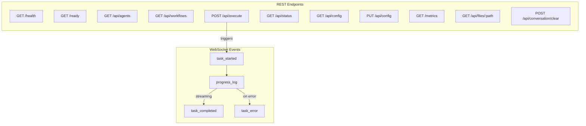
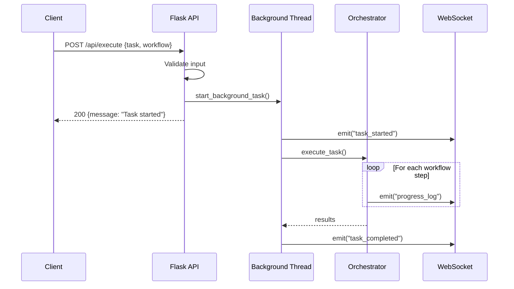

# Orchestrator API Reference

Complete reference for the Flask + SocketIO web backend served by `orchestrator/ui/app.py`.

**Default port**: 5001 (override via `UI_BACKEND_PORT` or `PORT` environment variable).

## API Overview



## Request Flow



## Table of Contents

- [Configuration](#configuration)
- [Health and Readiness Endpoints](#health-and-readiness-endpoints)
- [Agent and Workflow Endpoints](#agent-and-workflow-endpoints)
- [Task Execution](#task-execution)
- [Session and Conversation](#session-and-conversation)
- [Configuration Management](#configuration-management)
- [Local Model Status](#local-model-status)
- [Metrics](#metrics)
- [File Access](#file-access)
- [WebSocket Events](#websocket-events)
- [Client Identity](#client-identity)
- [Error Handling](#error-handling)

---

## Configuration

### Environment Variables

| Variable                      | Default                          | Description |
|-------------------------------|----------------------------------|-------------|
| `AI_ORCHESTRATOR_CONFIG_PATH` | `orchestrator/config/agents.yaml`| Override config file path |
| `FLASK_SECRET_KEY`            | Random (generated at startup)    | Flask session secret key |
| `CORS_ALLOWED_ORIGINS`        | `*`                              | Comma-separated allowed CORS origins |
| `UI_BACKEND_PORT` / `PORT`    | `5001`                           | HTTP listen port |
| `FLASK_DEBUG`                 | `false`                          | Enable Flask debug mode (`true`, `1`, `yes`) |

### Starting the Server

```bash
# Default
python -m orchestrator.ui.app

# Custom port and config
UI_BACKEND_PORT=8080 AI_ORCHESTRATOR_CONFIG_PATH=/path/to/config.yaml python -m orchestrator.ui.app
```

---

## Health and Readiness Endpoints

### `GET /health`

Kubernetes liveness probe. Returns 200 if the process is running.

**Response (200)**:
```json
{
  "status": "healthy",
  "timestamp": "2025-06-15T10:30:00.123456"
}
```

No failure mode -- if this endpoint responds, the process is alive.

---

### `GET /ready`

Kubernetes readiness probe. Verifies the orchestrator is initialized and at least one agent is available.

**Response (200)** -- Ready:
```json
{
  "status": "ready",
  "agents_count": 3,
  "timestamp": "2025-06-15T10:30:00.123456"
}
```

**Response (503)** -- Not ready (orchestrator not initialized):
```json
{
  "status": "not ready",
  "reason": "orchestrator not initialized",
  "timestamp": "2025-06-15T10:30:00.123456"
}
```

**Response (503)** -- Not ready (no agents):
```json
{
  "status": "not ready",
  "reason": "no agents available",
  "timestamp": "2025-06-15T10:30:00.123456"
}
```

---

## Agent and Workflow Endpoints

### `GET /api/agents`

List all available (initialized and reachable) agents with their configuration.

**Response (200)**:
```json
{
  "agents": [
    {
      "name": "codex",
      "enabled": true,
      "role": "implementation",
      "description": "Primary implementation agent for writing initial code",
      "available": true
    },
    {
      "name": "gemini",
      "enabled": true,
      "role": "review",
      "description": "Reviews code for SOLID principles and best practices",
      "available": true
    },
    {
      "name": "claude",
      "enabled": true,
      "role": "refinement",
      "description": "Implements feedback and refines code quality",
      "available": true
    }
  ]
}
```

The `available` field reflects runtime availability (CLI binary found via `shutil.which()` or HTTP endpoint reachable). Agents that are disabled or unavailable are excluded from the list.

---

### `GET /api/workflows`

List all configured workflows with step details.

**Response (200)**:
```json
{
  "workflows": [
    {
      "name": "default",
      "description": "",
      "offline": false,
      "steps": [
        {
          "agent": "codex",
          "task": "implement",
          "description": "Create initial implementation",
          "fallback": null
        },
        {
          "agent": "gemini",
          "task": "review",
          "description": "Review for SOLID principles and best practices",
          "fallback": null
        },
        {
          "agent": "claude",
          "task": "refine",
          "description": "Implement feedback and improvements",
          "fallback": null
        }
      ]
    },
    {
      "name": "offline-default",
      "description": "Local-only workflow for offline development",
      "offline": true,
      "steps": [
        {
          "agent": "local-code",
          "task": "implement",
          "description": "",
          "fallback": null
        },
        {
          "agent": "local-instruct",
          "task": "review",
          "description": "",
          "fallback": null
        }
      ]
    },
    {
      "name": "hybrid",
      "description": "Use local for drafts, cloud for final review",
      "offline": false,
      "steps": [
        {
          "agent": "local-code",
          "task": "implement",
          "description": "",
          "fallback": null
        },
        {
          "agent": "claude",
          "task": "review",
          "description": "",
          "fallback": "local-instruct"
        }
      ]
    }
  ]
}
```

The `task` field is normalized: role aliases (`implementer`, `reviewer`, `refiner`, `writer`, `tester`) are converted to their canonical forms (`implement`, `review`, `refine`, `document`, `test`).

---

## Task Execution

### `POST /api/execute`

Start asynchronous task execution. The request returns immediately; results are delivered via WebSocket events and polling the status endpoint.

**Request body** (JSON):

| Field            | Type     | Required | Default     | Description |
|------------------|----------|----------|-------------|-------------|
| `task`           | `string` | Yes      | --          | Task description |
| `workflow`       | `string` | No       | `"default"` | Workflow name |
| `max_iterations` | `int`    | No       | `3`         | Maximum iteration loops |
| `is_followup`    | `bool`   | No       | `false`     | Treat as follow-up to previous task |
| `client_id`      | `string` | No       | `"default"` | Client session identifier |

**Example request**:
```json
{
  "task": "Implement a REST endpoint for user authentication with JWT tokens",
  "workflow": "default",
  "max_iterations": 3,
  "is_followup": false,
  "client_id": "session_abc123"
}
```

**Follow-up behavior**: When `is_followup` is `true` and the client session has a previous task, the orchestrator prepends context:
```
Previous task: <last_task>
Previous result: <last_output>

Follow-up: <current_task>
```

**Response (200)** -- Task started:
```json
{
  "message": "Task started",
  "session_id": "2025-06-15T10:30:00.123456",
  "is_followup": false,
  "client_id": "session_abc123"
}
```

**Response (400)** -- Missing task:
```json
{
  "error": "Task is required"
}
```

**Execution lifecycle**: The task runs in a background thread. Progress is reported via:
1. `task_started` WebSocket event
2. `progress_log` WebSocket events (real-time log streaming)
3. `task_completed` or `task_error` WebSocket event
4. `GET /api/status` polling endpoint

---

## Session and Conversation

### `GET /api/status`

Get the current execution status and session state for a client.

**Query parameters**:

| Parameter   | Type     | Description |
|-------------|----------|-------------|
| `client_id` | `string` | Client session identifier (also accepted via `X-Client-Id` header) |

**Response (200)**:
```json
{
  "client_id": "session_abc123",
  "task": "Implement a REST API",
  "workflow": "default",
  "status": "completed",
  "results": {
    "task": "Implement a REST API",
    "workflow": "default",
    "iterations": [...],
    "final_output": "...",
    "success": true
  },
  "files": ["src/api.py", "src/auth.py"],
  "conversation_history": [...],
  "last_task": "Implement a REST API",
  "last_output": "...",
  "context": {
    "files": ["src/api.py"],
    "workspace": "./workspace"
  },
  "logs": [
    {
      "message": "Starting task execution with workflow: default",
      "level": "info",
      "timestamp": "2025-06-15T10:30:00.123456"
    }
  ],
  "started_at": "2025-06-15T10:30:00.123456",
  "updated_at": "2025-06-15T10:30:15.654321"
}
```

**Status values**: `idle`, `running`, `completed`, `failed`, `error`.

---

### `GET /api/conversation`

Get conversation history for a client session.

**Query parameters**: Same as `/api/status`.

**Response (200)**:
```json
{
  "history": [
    {
      "role": "user",
      "content": "Implement a REST API with authentication",
      "is_followup": false,
      "timestamp": "2025-06-15T10:30:00.123456"
    },
    {
      "role": "assistant",
      "content": "Here is the implementation...",
      "files": ["src/api.py"],
      "timestamp": "2025-06-15T10:30:15.654321"
    }
  ],
  "can_followup": true,
  "client_id": "session_abc123"
}
```

The `can_followup` field is `true` when the session has a previous task result that can be referenced in a follow-up.

---

### `POST /api/conversation/clear`

Reset a client's session state, clearing conversation history and all stored context.

**Request body** (JSON):
```json
{
  "client_id": "session_abc123"
}
```

**Response (200)**:
```json
{
  "message": "Conversation cleared",
  "client_id": "session_abc123"
}
```

---

## Configuration Management

### `GET /api/config`

Read the current orchestrator configuration file.

**Response (200)**:
```json
{
  "path": "/path/to/orchestrator/config/agents.yaml",
  "content": "agents:\n  codex:\n    type: cli\n    enabled: true\n...",
  "parsed": {
    "agents": { "codex": { "type": "cli", "enabled": true, "...": "..." } },
    "workflows": { "...": "..." },
    "settings": { "...": "..." }
  },
  "last_modified": "2025-06-15T08:00:00.000000"
}
```

**Response (404)** -- Config file not found:
```json
{
  "error": "Config file not found: /path/to/config.yaml"
}
```

---

### `PUT /api/config`

Update the orchestrator configuration. Accepts either a structured JSON object or raw YAML content. After writing, the orchestrator is reloaded with the new configuration.

**Request format 1** -- Structured JSON:
```json
{
  "config": {
    "agents": {
      "codex": { "type": "cli", "enabled": true, "command": "codex", "role": "implementation", "timeout": 3600 }
    },
    "workflows": {
      "default": [
        { "agent": "codex", "task": "implement" }
      ]
    },
    "settings": {
      "max_iterations": 3,
      "output_dir": "./output"
    }
  }
}
```

**Request format 2** -- Raw YAML:
```json
{
  "content": "agents:\n  codex:\n    type: cli\n    enabled: true\nworkflows:\n  default:\n    - agent: codex\n      task: implement\nsettings:\n  max_iterations: 3"
}
```

**Validation rules**:
- Must include `agents`, `workflows`, and `settings` sections.
- Each of those sections must be a mapping/object.
- `agentic_team`, if present, must be a mapping/object.

**Response (200)** -- Updated:
```json
{
  "message": "Configuration updated and orchestrator reloaded",
  "path": "/path/to/config.yaml",
  "content": "agents:\n  codex:\n...",
  "parsed": { "agents": {}, "workflows": {}, "settings": {} },
  "last_modified": "2025-06-15T10:35:00.000000"
}
```

**Response (400)** -- Validation error:
```json
{
  "error": "Missing required section: workflows"
}
```

**Response (500)** -- Write/reload error:
```json
{
  "error": "Failed to update config: <details>"
}
```

---

## Local Model Status

### `GET /api/models/status`

Probe all configured local model backends (Ollama, llama.cpp, LocalAI, etc.) and report their status, available models, and agent readiness.

**Response (200)**:
```json
{
  "summary": {
    "local_agents": 3,
    "enabled_local_agents": 1,
    "online_backends": 1,
    "backends": 2,
    "models": 5
  },
  "backends": [
    {
      "backend_type": "ollama",
      "endpoint": "http://localhost:11434",
      "online": true,
      "models": ["codellama:13b", "mistral:7b-instruct", "llama3:8b"],
      "models_detailed": [
        {
          "name": "codellama:13b",
          "size_bytes": 7365960935,
          "modified_at": "2025-06-10T12:00:00Z",
          "digest": "sha256:abc123..."
        }
      ],
      "model_count": 3,
      "agents": ["local-code", "local-instruct"],
      "enabled_agents": 1,
      "available_agents": 1,
      "probe_error": null
    },
    {
      "backend_type": "openai-compatible",
      "endpoint": "http://localhost:8080",
      "online": false,
      "models": [],
      "models_detailed": [],
      "model_count": 0,
      "agents": ["local-large"],
      "enabled_agents": 0,
      "available_agents": 0,
      "probe_error": "Endpoint is unreachable"
    }
  ],
  "agents": [
    {
      "name": "local-code",
      "type": "ollama",
      "backend_type": "ollama",
      "enabled": true,
      "offline": true,
      "endpoint": "http://localhost:11434",
      "capabilities": ["code", "review"],
      "configured_model": "codellama:13b",
      "configured_model_present": true,
      "endpoint_online": true,
      "available_for_execution": true,
      "model_count": 3,
      "discovered_models": ["codellama:13b", "mistral:7b-instruct", "llama3:8b"],
      "probe_error": null
    }
  ]
}
```

Backend probing:
- **Ollama**: `GET /api/tags` -- Returns model list with size, digest, and modification time.
- **OpenAI-compatible** (llama.cpp, LocalAI, etc.): Probes `/health`, `/v1/models`, and root path. Model listing via `GET /v1/models`.

Results are cached per-request (multiple agents sharing the same endpoint are probed only once).

---

## Metrics

### `GET /metrics`

Prometheus-compatible metrics endpoint. Returns plain text in Prometheus exposition format.

**Response (200)** -- `Content-Type: text/plain; version=0.0.4`:
```
# HELP ai_orchestrator_agents_total Total number of agents
# TYPE ai_orchestrator_agents_total gauge
ai_orchestrator_agents_total 3

# HELP ai_orchestrator_agents_available Number of available agents
# TYPE ai_orchestrator_agents_available gauge
ai_orchestrator_agents_available 3

# HELP ai_orchestrator_session_active Is there an active session
# TYPE ai_orchestrator_session_active gauge
ai_orchestrator_session_active 1

# HELP ai_orchestrator_sessions_total Total number of known client sessions
# TYPE ai_orchestrator_sessions_total gauge
ai_orchestrator_sessions_total 2

# HELP ai_orchestrator_up Service is up
# TYPE ai_orchestrator_up gauge
ai_orchestrator_up 1
```

These are lightweight metrics generated from the web UI's internal state. For detailed Prometheus instrumentation (task duration histograms, agent call counters, etc.), use the `MetricsCollector` class in `orchestrator/observability/metrics.py` directly.

---

## File Access

### `GET /api/files/<path:filename>`

Read a file from the orchestrator's workspace directory.

**Path parameter**: Relative path within the workspace (e.g., `src/main.py`).

**Response (200)**:
```json
{
  "filename": "src/main.py",
  "content": "def main():\n    print('hello')\n",
  "language": "python"
}
```

**Response (403)** -- Path traversal detected:
```json
{
  "error": "Access denied: path traversal detected"
}
```

**Response (404)** -- File not found:
```json
{
  "error": "File not found"
}
```

**Language detection**: Based on file extension mapping:

| Extension | Language |
|-----------|----------|
| `.py`     | python |
| `.js`     | javascript |
| `.ts`     | typescript |
| `.java`   | java |
| `.go`     | go |
| `.rs`     | rust |
| `.cpp`, `.h` | cpp |
| `.c`      | c |
| `.html`   | html |
| `.css`    | css |
| `.json`   | json |
| `.yaml`, `.yml` | yaml |
| `.md`     | markdown |
| `.sh`     | shell |
| `.sql`    | sql |
| Other     | plaintext |

**Security**: The resolved file path is checked against the workspace root (`orchestrator/workspace/`). Any path that resolves outside this directory is rejected with a 403.

---

## WebSocket Events

Connect to the SocketIO server with the client ID as a query parameter:

```javascript
const socket = io("http://localhost:5001", {
  query: { client_id: "my-session-id" }
});
```

### Server --> Client Events

#### `connected`

Emitted immediately after a successful connection.

```json
{
  "message": "Connected to AI Orchestrator",
  "can_followup": false,
  "status": "idle",
  "client_id": "my-session-id"
}
```

#### `task_started`

Emitted when a task begins execution.

```json
{
  "task": "Implement a REST API",
  "workflow": "default",
  "is_followup": false
}
```

#### `progress_log`

Emitted during task execution for each relevant log event. These are filtered to only include logs from `orchestrator`, `workflow`, `adapter`, and `task_manager` loggers.

```json
{
  "message": "Step 1: codex - implement",
  "level": "info",
  "timestamp": "2025-06-15T10:30:05.123456"
}
```

Log levels: `debug`, `info`, `warning`, `error`, `success`.

Progress logs are also persisted in the client's session state (capped at 500 entries) and available via `GET /api/status`.

#### `task_completed`

Emitted when a task finishes (successfully or with partial failure).

```json
{
  "task": "Implement a REST API",
  "success": true,
  "output": "Here is the implementation...",
  "files": ["src/api.py", "src/auth.py"],
  "iterations": [
    {
      "steps": [
        {
          "agent": "codex",
          "task": "implement",
          "success": true,
          "output": "...",
          "error": null,
          "files_modified": ["src/api.py"],
          "suggestions": []
        }
      ],
      "final_output": "..."
    }
  ],
  "can_followup": true
}
```

#### `task_error`

Emitted when task execution fails with an unhandled exception.

```json
{
  "error": "Workflow 'nonexistent' not found"
}
```

### Client --> Server Events

#### `connect`

Clients connect with a query parameter `client_id`. On connection, the server:
1. Joins the client to a SocketIO room named after their `client_id`.
2. Registers the SID-to-client mapping for disconnect cleanup.
3. Emits a `connected` event with current session state.

#### `disconnect`

Handled automatically. The server cleans up the SID-to-client mapping. Session state is preserved for reconnection.

---

## Client Identity

Client sessions are identified by a `client_id` string. It can be provided via:

1. **Request body**: `{"client_id": "..."}`
2. **Query parameter**: `?client_id=...`
3. **Header**: `X-Client-Id: ...`

Resolution priority: body > query parameter > header. If none is provided, the default client ID `"default"` is used.

Client IDs are:
- Trimmed of whitespace.
- Truncated to 128 characters.
- Used as SocketIO room names for event scoping.

All session state (task, status, results, conversation history, logs) is stored per-client in an in-memory dictionary protected by a threading lock. State does not persist across server restarts.

---

## Error Handling

All error responses use a consistent JSON format:

```json
{
  "error": "Human-readable error description"
}
```

### HTTP Status Codes

| Code | Meaning | Typical Causes |
|------|---------|----------------|
| 200  | Success | Normal response |
| 400  | Bad Request | Missing `task` field, invalid YAML, missing config sections |
| 403  | Forbidden | Path traversal attempt on `/api/files/` |
| 404  | Not Found | Config file missing, workspace file not found |
| 500  | Internal Server Error | Config write failure, unhandled exceptions |
| 503  | Service Unavailable | Orchestrator not initialized, no agents available (readiness probe) |

### Static Asset Routes

The following routes serve PWA/favicon assets from `ui/frontend/public/`:

| Route | File | Content-Type |
|-------|------|-------------|
| `/favicon.ico` | `favicon.ico` | `image/x-icon` |
| `/favicon-16x16.png` | `favicon-16x16.png` | `image/png` |
| `/favicon-32x32.png` | `favicon-32x32.png` | `image/png` |
| `/apple-touch-icon.png` | `apple-touch-icon.png` | `image/png` |
| `/android-chrome-192x192.png` | `android-chrome-192x192.png` | `image/png` |
| `/android-chrome-512x512.png` | `android-chrome-512x512.png` | `image/png` |
| `/site.webmanifest` | `site.webmanifest` | `application/manifest+json` |

### `GET /`

Serves the main web UI page via Flask's `render_template("index.html")`.
