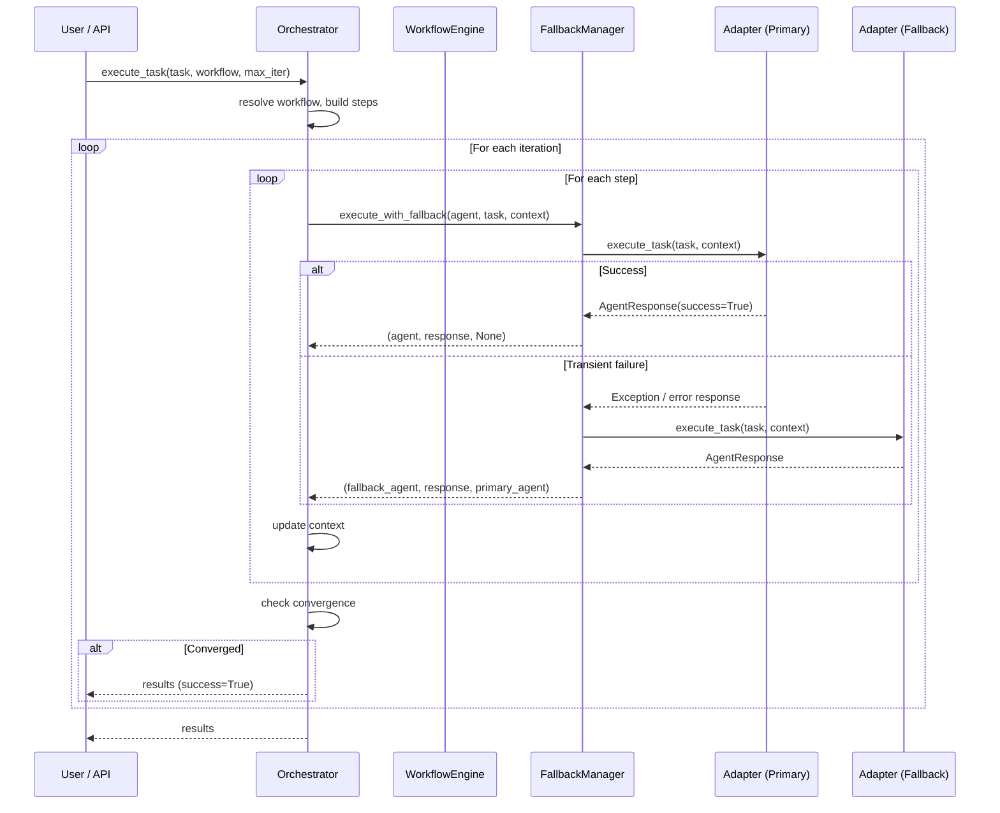

# Orchestrator Architecture

This document describes the internal architecture of the AI Agent Orchestrator -- the system design, component interactions, data flow, and the engineering patterns that enable reliable multi-agent coordination.

## Table of Contents

- [System Overview](#system-overview)
- [Core Components](#core-components)
- [Adapter Pattern](#adapter-pattern)
- [Workflow Engine](#workflow-engine)
- [Fallback and Resilience](#fallback-and-resilience)
- [Observability Stack](#observability-stack)
- [Security Model](#security-model)
- [Infrastructure Layer](#infrastructure-layer)
- [Data Flow](#data-flow)
- [Concurrency Model](#concurrency-model)
- [Extension Points](#extension-points)

---

## System Overview

The orchestrator is a Python package that coordinates multiple AI coding assistants through configurable, iterative workflows. It supports two categories of agents:

1. **Cloud CLI agents** -- external processes invoked via subprocess (`claude`, `codex`, `gemini`, `copilot`).
2. **Local model agents** -- HTTP-based servers running on localhost (Ollama, llama.cpp, LocalAI, text-generation-webui).

The system is designed around three principles:

- **Adapter abstraction**: Every agent implements the same `BaseAdapter` interface, making the orchestrator agent-agnostic.
- **Resilient execution**: Transient failures trigger automatic fallback from cloud agents to local agents, with circuit breakers preventing cascading failures.
- **Observable by default**: Prometheus metrics, structured logging, and health probes are built into the core execution path.

### High-Level Architecture

```
 ┌─────────────────────────────────────────────────────────────┐
 │                        Entry Points                         │
 │   CLI Shell (REPL)    Web UI (Flask+SocketIO)    Python API │
 └──────────────┬──────────────────┬───────────────────┬───────┘
                │                  │                   │
                ▼                  ▼                   ▼
 ┌─────────────────────────────────────────────────────────────┐
 │                      Orchestrator                           │
 │  ┌──────────────┐  ┌───────────────┐  ┌──────────────────┐ │
 │  │WorkflowEngine│  │  TaskManager  │  │ FallbackManager  │ │
 │  └──────┬───────┘  └───────────────┘  └────────┬─────────┘ │
 │         │                                      │           │
 │         ▼                                      ▼           │
 │  ┌──────────────┐                    ┌──────────────────┐  │
 │  │ WorkflowStep │────execute────────>│  Adapter Layer   │  │
 │  │  (per agent) │                    │  (BaseAdapter)   │  │
 │  └──────────────┘                    └────────┬─────────┘  │
 └───────────────────────────────────────────────┼────────────┘
                                                 │
           ┌──────────┬──────────┬───────────────┼──────────┐
           │          │          │               │          │
           ▼          ▼          ▼               ▼          ▼
       ┌───────┐ ┌────────┐ ┌────────┐    ┌─────────┐ ┌────────┐
       │Claude │ │ Codex  │ │Gemini  │    │ Ollama  │ │llama   │
       │  CLI  │ │  CLI   │ │  CLI   │    │  HTTP   │ │.cpp    │
       └───────┘ └────────┘ └────────┘    └─────────┘ └────────┘
        Cloud agents (subprocess)          Local agents (HTTP)
```

---

## Core Components

### Orchestrator (`core/engine.py`)

The `Orchestrator` class is the central coordinator. Its responsibilities:

1. **Load configuration** from `agents.yaml` (or a provided path), falling back to hardcoded defaults if the file is missing.
2. **Resolve offline mode** from the `force_offline` constructor flag, the `settings.offline.enabled` config key, or auto-detection via `OfflineDetector`.
3. **Initialize adapters** by iterating over `agents` config entries, resolving each to a concrete adapter class, and calling `is_available()` to filter out unreachable agents.
4. **Execute tasks** by building `WorkflowStep` objects, then iterating the workflow up to `max_iterations` times.

#### Initialization Sequence

```
Orchestrator.__init__(config_path, force_offline, offline_detector)
  |
  +-- _load_config(config_path)
  |     Path provided?  --> load YAML
  |     Path missing?   --> use _get_default_config()
  |
  +-- _resolve_offline_mode()
  |     force_offline=True?           --> offline
  |     settings.offline.enabled?     --> offline
  |     settings.offline.auto_detect? --> OfflineDetector.is_offline()
  |     Otherwise                     --> online
  |
  +-- _initialize_adapters()
        For each agent in config:
          |-- Skip if not enabled
          |-- Skip if offline mode and agent is not local
          |-- _resolve_adapter_class(name, config)
          |-- Instantiate adapter_class(config)
          |-- adapter.is_available()? --> store in self.adapters
```

#### Adapter Resolution Logic

The `_resolve_adapter_class` method uses a two-tier lookup:

1. **By explicit `type` field**:
   - `ollama` --> `OllamaAdapter`
   - `llamacpp` / `localai` / `text-generation-webui` / `openai-compatible` --> `LlamaCppAdapter`
   - `cli` --> resolve by provider/name (see below)
2. **By agent name** (legacy fallback): `codex` --> `CodexAdapter`, `gemini` --> `GeminiAdapter`, etc.

For `type: cli`, the provider is resolved from (in priority order): the `provider` field, the `adapter` field, the agent key name, or the `command` field (with alias normalization: `gemini-cli` --> `gemini`, `github-copilot-cli` / `gh-copilot` --> `copilot`).

### WorkflowEngine (`core/workflow.py`)

The `WorkflowEngine` holds an ordered list of `WorkflowStep` objects and provides sequential execution with context threading. Each step receives the accumulated context from prior steps.

**WorkflowStep** is a dataclass binding an agent name, task type, adapter reference, and step config. It provides:

- `build_task_description(context)` -- Generates a role-specific prompt prefix (see [Prompt Construction](#prompt-construction)).
- `build_step_context(context)` -- Copies context and injects `role` and `agent` keys.
- `execute(context)` -- Calls the bound adapter directly.
- `execute_with_adapter(adapter, context)` -- Calls a specific adapter (used by fallback).

### TaskManager (`core/task_manager.py`)

Tracks individual task lifecycles with thread-safe ID generation (`threading.Lock` on the counter). Each `Task` object transitions through states:

```
PENDING --> IN_PROGRESS --> COMPLETED
                |
                +--> FAILED
                |
                +--> CANCELLED
```

Key operations:
- `create_task(description, metadata)` -- Atomic ID generation, returns `Task`.
- `get_tasks_by_status(status)` -- Filter by `TaskStatus` enum.
- `get_statistics()` -- Aggregated counts and average duration for completed tasks.
- `cleanup_stale(max_age_seconds)` -- Remove completed/failed tasks older than the threshold.

### Exception Hierarchy (`core/exceptions.py`)

All orchestrator exceptions inherit from `OrchestratorError`, which provides structured `to_dict()` serialization with JSON-safe recursive conversion:

```
OrchestratorError (ORCHESTRATOR_ERROR)
+-- ConfigurationError       (CONFIG_ERROR)
+-- AgentNotFoundError       (AGENT_NOT_FOUND)
+-- AgentExecutionError      (AGENT_EXECUTION_ERROR)
+-- AgentTimeoutError        (AGENT_TIMEOUT)
+-- WorkflowError            (WORKFLOW_ERROR)
+-- ValidationError          (VALIDATION_ERROR)
+-- RateLimitError           (RATE_LIMIT_EXCEEDED)
+-- ResourceError            (RESOURCE_ERROR)
```

Each exception carries:
- `message` (str) -- Human-readable description.
- `error_code` (str) -- Machine-readable code.
- `details` (dict) -- Structured context, always JSON-serializable.

---

## Adapter Pattern

### BaseAdapter

`BaseAdapter` is an abstract base class (`ABC`) that defines the contract every agent adapter must fulfill:

```python
class BaseAdapter(ABC):
    @abstractmethod
    def get_capabilities(self) -> List[AgentCapability]: ...

    @abstractmethod
    def execute_task(self, task: str, context: Dict[str, Any]) -> AgentResponse: ...

    async def execute_task_async(self, task: str, context: Dict) -> AgentResponse: ...
    def is_available(self) -> bool: ...
```

**AgentResponse** is the universal return type:

| Field            | Type           | Description |
|------------------|----------------|-------------|
| `success`        | `bool`         | Whether execution succeeded |
| `output`         | `str`          | Agent output text |
| `error`          | `str or None`  | Error message if failed |
| `files_modified` | `List[str]`    | Files created or modified |
| `suggestions`    | `List[str]`    | Review suggestions extracted from output |
| `metadata`       | `Dict`         | Agent-specific metadata (model, duration, etc.) |

**AgentCapability** enumerates what an agent can do: `IMPLEMENTATION`, `CODE_REVIEW`, `REFACTORING`, `TESTING`, `DOCUMENTATION`, `DEBUGGING`, `ARCHITECTURE`.

### CLI Adapters (Cloud Agents)

Cloud CLI adapters (Claude, Codex, Gemini, Copilot) delegate execution to `CLICommunicator`, which supports four communication methods:

| Method    | Mechanism | Used By |
|-----------|-----------|---------|
| `arg`     | Pass prompt as a CLI argument | Claude, Codex, Gemini, Copilot (primary) |
| `stdin`   | Pipe prompt via stdin with `script` for TTY emulation | Fallback for stdin-preferring tools |
| `file`    | Write prompt to temp file, pass `--input`/`--output` flags | Specialized CLIs |
| `heredoc` | Bash heredoc via subprocess | Last-resort fallback |

The `CLICommunicator` also provides:
- **Workspace tracking**: Snapshots file modification times before/after execution via `execute_in_workspace()` to detect changed files.
- **Retry with method fallback**: On failure, `execute_with_retry()` cycles through alternative communication methods (e.g., `stdin -> arg -> heredoc`). Codex is locked to `arg` mode only.
- **Tool-specific command construction**: `_build_command_for_tool()` handles per-CLI argument formats (`codex exec <prompt>`, `copilot -p <prompt> --allow-all-tools`, etc.).

The `AgentCLIRegistry` stores known CLI communication patterns and is extensible via `register_pattern()`.

### HTTP Adapters (Local Agents)

Local model adapters communicate via HTTP:

- **OllamaAdapter**: `POST /api/generate` with `{model, prompt, stream: false, keep_alive}`. Supports `health_check()` (GET /api/tags), `list_models()`, `pull_model()`, `remove_model()`. Availability is determined by endpoint health, not `shutil.which()`.
- **LlamaCppAdapter**: `POST /v1/completions` (OpenAI-compatible format). Supports configurable `max_tokens` (default 4096), `temperature` (default 0.7, clamped 0.0-2.0), and stop sequences. Health probes check `/health`, `/v1/models`, and the root path.

Both adapters implement native async via `httpx.AsyncClient` and fall back to synchronous execution when no event loop is running.

### Prompt Construction

For local model adapters, `BaseAdapter._build_local_llm_prompt()` constructs role-aware prompts with system-style instructions:

| Role        | System Prefix |
|-------------|---------------|
| `implement` | "You are an expert software engineer. Implement the following task with clean, production-ready code." |
| `review`    | "You are an expert code reviewer. Review the following implementation and provide actionable feedback." |
| `refine`    | "You are refining code based on review feedback." + feedback + implementation |
| `test`      | "Write comprehensive tests for the following task." |
| `document`  | "Write clear documentation for the following implementation." |

Each prompt appends general requirements (clean code, error handling, readability, conciseness) and any previous output or feedback from context.

CLI adapters (e.g., `ClaudeAdapter`) use their own `_build_*_prompt()` methods with role-specific formatting.

---

## Workflow Engine

### Execution Model

```
execute_task(task, workflow_name, max_iterations)
  |
  +-- Resolve workflow config from agents.yaml
  +-- _extract_workflow_steps() -- normalize list vs. dict format
  +-- _build_workflow_steps()   -- skip unavailable agents
  +-- workflow_engine.set_workflow(steps)
  |
  +-- FOR iteration in range(max_iterations):
        |
        +-- _execute_workflow_iteration(steps, context)
        |     |
        |     +-- FOR each step:
        |           +-- step.build_task_description(context)
        |           +-- step.build_step_context(context)
        |           +-- fallback_manager.execute_with_fallback(...)
        |           |     +-- Try primary adapter
        |           |     +-- On transient failure: try fallback adapter
        |           |     +-- Return (agent_used, response, fallback_from)
        |           +-- Update context: previous_output, feedback, implementation, files
        |           +-- Record step result
        |
        +-- _should_stop_iteration()?
        |     +-- All steps succeeded AND review suggestions <= 3 --> STOP
        |
        +-- _update_context() --> increment iteration, append to all_iterations
```

### Context Threading

The context dictionary flows through every step and accumulates state:

| Key                | Set By            | Purpose |
|--------------------|-------------------|---------|
| `task`             | Initial           | Original task description |
| `iteration`        | Engine            | Current iteration index (0-based) |
| `max_iterations`   | Engine            | Iteration limit |
| `working_dir`      | Engine            | Resolved output directory (falls back to project root) |
| `offline_mode`     | Engine            | Whether running offline |
| `previous_output`  | Each step         | Last agent's output |
| `previous_agent`   | Each step         | Last agent's name |
| `feedback`         | Review step       | Review output for refiners |
| `suggestions`      | Review step       | Extracted suggestions list |
| `implementation`   | Implement step    | Implementation output |
| `files`            | Implement step    | List of modified files |
| `all_iterations`   | `_update_context` | History of all iteration results |

### Convergence Detection

`_should_stop_iteration()` returns `True` when:
1. Every step in the current iteration succeeded (`success: True`).
2. No review step produced more than 3 suggestions (configurable via `min_suggestions_threshold`).

If both conditions hold, the task is considered converged and iteration stops early. If all `max_iterations` are exhausted, the task is still marked successful if the final iteration's steps all passed.

### Task Normalization

The engine normalizes workflow task/role values via `_normalize_task_type()`:

| Config Value    | Normalized To |
|-----------------|---------------|
| `implementer`   | `implement`   |
| `reviewer`       | `review`      |
| `refiner`        | `refine`      |
| `writer`         | `document`    |
| `tester`         | `test`        |
| Any other value  | Passed through as-is |

---

## Fallback and Resilience

### FallbackManager (`resilience/fallback.py`)

The FallbackManager sits between the Orchestrator and the adapter layer. For every step execution:

```
execute_with_fallback(primary_agent, adapters, task, context, explicit_fallback)
  |
  +-- Primary agent not in adapters? --> Return error response
  |
  +-- Try primary_adapter.execute_task(task, context)
  |
  +-- On Exception:
  |     +-- Resolve fallback agent (explicit or from map)
  |     +-- should_fallback(exception=exc)?
  |     |     +-- ConnectionError, TimeoutError, OSError, httpx.RequestError --> YES
  |     |     +-- httpx.HTTPStatusError with status >= 500 --> YES
  |     |     +-- Otherwise --> NO (return failure)
  |     +-- Try fallback_adapter.execute_task(task, context)
  |     +-- Both fail? --> Return combined error
  |
  +-- On response.success == False:
  |     +-- should_fallback(error=response.error)?
  |     |     +-- Check for substrings: "connection", "network", "timed out",
  |     |         "timeout", "dns", "unreachable", "api error", "http error",
  |     |         "503", "502", "504"
  |     +-- Try fallback_adapter.execute_task(task, context)
  |
  +-- Return (agent_used, response, fallback_from_agent or None)
```

Fallback resolution priority:
1. Per-step `fallback` field in workflow config.
2. Global `settings.fallback.map` mapping.
3. Inline key-value pairs in the `fallback` config block (outside `enabled` and `map`).

### CircuitBreaker (`resilience/retry.py`)

State machine with three states:

```
     success
CLOSED ──────────> CLOSED (failure_count reset to 0)
  |
  | failure_count >= failure_threshold (default: 5)
  v
OPEN --- (wait recovery_timeout, default: 60s) ---> HALF_OPEN
                                                      |
                                                 success --> CLOSED
                                                 failure --> OPEN
```

When the circuit is OPEN, all calls are rejected immediately with an error message indicating the failure count, recovery timeout, and remaining wait time.

Usage:
```python
breaker = CircuitBreaker(failure_threshold=5, recovery_timeout=60.0)
result = breaker.call(some_function, arg1, arg2)

# Or as a decorator:
@circuit_breaker(failure_threshold=5, recovery_timeout=60.0)
def my_function():
    ...
```

### Retry Decorators

Two retry decorators built on `tenacity`:

- **`retry_on_error(max_attempts, wait_seconds, exponential_backoff, exceptions)`** -- General-purpose retry with configurable backoff (exponential or fixed) and exception type filtering.
- **`retry_agent_execution(max_attempts=3, wait_seconds=2.0)`** -- Specialized for agent calls; retries on `AgentExecutionError`, `AgentTimeoutError`, `ConnectionError`, `TimeoutError` with exponential backoff.

Both decorators log before-sleep warnings and after-attempt info via the module logger.

### Token Bucket Rate Limiter (`resilience/retry.py`)

`RateLimiter` implements a classic token bucket:
- `rate` tokens added per second.
- `capacity` maximum tokens.
- `acquire(tokens)` -- Non-blocking, returns `True` if tokens available.
- `wait(tokens)` -- Blocking, polls at 100ms intervals.

### OfflineDetector (`resilience/offline.py`)

Performs lightweight HTTP HEAD requests to detect network availability:

- Check URL: `CONNECTIVITY_CHECK_URL` env var or `https://httpbin.org/status/200`.
- Timeout: 3 seconds (configurable).
- Cache: Results cached for `check_interval` seconds (default: 60) using `time.monotonic()`.
- Only 2xx responses count as "online".
- `is_offline(force_refresh=False)` -- Returns cached result unless stale or forced.

---

## Observability Stack

### Prometheus Metrics (`observability/metrics.py`)

The `MetricsCollector` uses `prometheus_client` to register metrics on a dedicated `CollectorRegistry`:

| Metric | Type | Labels | Description |
|--------|------|--------|-------------|
| `orchestrator_app_info` | Info | version, name | Application metadata |
| `orchestrator_tasks_total` | Counter | workflow, status | Total tasks executed |
| `orchestrator_tasks_in_progress` | Gauge | -- | Currently running tasks |
| `orchestrator_task_duration_seconds` | Histogram | workflow | Task execution latency |
| `orchestrator_agent_calls_total` | Counter | agent, status | Per-agent call count |
| `orchestrator_agent_duration_seconds` | Histogram | agent | Per-agent latency |
| `orchestrator_agent_errors_total` | Counter | agent, error_type | Agent error count |
| `orchestrator_workflow_iterations` | Summary | workflow | Iterations per workflow |
| `orchestrator_workflow_success_rate` | Gauge | workflow | Workflow success rate |
| `orchestrator_active_agents` | Gauge | -- | Available agents |
| `orchestrator_cache_hits_total` | Counter | -- | Cache hits |
| `orchestrator_cache_misses_total` | Counter | -- | Cache misses |

Histogram bucket configurations:
- Task duration: `[1, 5, 10, 30, 60, 120, 300, 600, 1800, 3600]` seconds.
- Agent duration: `[0.5, 1, 2, 5, 10, 30, 60, 120]` seconds.

The global singleton is accessed via `get_metrics_collector()` (thread-safe, double-checked locking).

Decorators for automatic instrumentation:
- `@track_execution_time(metric_name, labels)` -- Records agent duration histogram.
- `@track_task_execution(workflow)` -- Records task start, completion, and duration.

### Structured Logging (`observability/logging_config.py`)

Built on `structlog` with `Rich` console rendering in development and JSON output in production.

**Processor pipeline:**

1. `merge_contextvars` -- Thread-local context injection via `structlog.contextvars`
2. `add_log_level` / `add_logger_name`
3. `PositionalArgumentsFormatter`
4. `TimeStamper(fmt="iso")`
5. `StackInfoRenderer` / `format_exc_info`
6. `UnicodeDecoder`
7. `ConsoleRenderer` (development, with colors) or `JSONRenderer` (production)

**Utilities:**

| Utility | Type | Purpose |
|---------|------|---------|
| `configure_logging(log_level, log_file, json_logs, enable_colors)` | Function | One-call setup for structlog + stdlib logging |
| `get_logger(name)` | Function | Returns `structlog.stdlib.BoundLogger` |
| `LogContext(**kwargs)` | Context manager | Temporary structured context injection |
| `@log_execution(logger)` | Decorator | Logs function entry, exit, and exceptions |
| `PerformanceLogger(logger, operation)` | Context manager | Logs operation duration |

Third-party log suppression: `urllib3` and `requests` are set to WARNING level.

### Health Checks (`observability/health.py`)

`HealthChecker` runs six built-in checks:

| Check              | Healthy            | Degraded             | Unhealthy |
|--------------------|--------------------|----------------------|-----------|
| `python_version`   | >= 3.8             | --                   | < 3.8 |
| `disk_space`       | > 5 GB free        | 1-5 GB free          | < 1 GB free |
| `memory`           | < 80% used         | 80-90% used          | > 90% used |
| `config_file`      | Valid YAML with agents + workflows | Missing sections | File not found |
| `directories`      | All exist (auto-created) | Some cannot be created | -- |
| `dependencies`     | click, pyyaml, rich, pydantic installed | -- | Missing packages |

Additional methods:
- `check_agent_availability(agent_name, command)` -- Per-agent health check via `shutil.which()`.
- `run_all_checks()` -- Returns dict with overall status, per-check results, and timing.
- `is_ready()` -- True if status is HEALTHY or DEGRADED.
- `is_alive()` -- Always returns True (process is running).

Overall status logic: HEALTHY if all checks pass; UNHEALTHY if any check is unhealthy; DEGRADED otherwise.

---

## Security Model

### Input Validation (`security_module/security.py`)

`InputValidator` provides class-method validators:

| Validator               | Constraints |
|-------------------------|-------------|
| `validate_task`         | Non-empty, max 10,000 chars, no dangerous patterns |
| `validate_workflow_name`| Max 100 chars, `[a-zA-Z0-9_-]` only |
| `validate_agent_name`   | Max 50 chars, `[a-zA-Z0-9_-]` only |
| `validate_file_path`    | Max 4,096 chars, path traversal prevention via `Path.resolve()` + prefix check against `allowed_root` |
| `validate_command`      | Non-empty, optional allowlist enforcement |

Dangerous patterns blocked: `rm -rf`, `del /F`, `del /S`, `format X:`, `> /dev/`, `curl ... | bash`, `wget ... | sh`.

### Rate Limiting

`TokenBucketRateLimiter` implements per-key token bucket rate limiting:
- Default: 60 requests per 60-second window.
- `check_limit(key, tokens)` -- Returns `True` or raises `RateLimitError`.
- `get_wait_time(key, tokens)` -- Returns seconds until the next request is allowed.

### Secrets Management

`SecretManager` auto-loads environment variables matching prefixes: `API_KEY_*`, `SECRET_*`, `TOKEN_*`, `PASSWORD_*`. Provides `mask_secret()` for safe logging (preserves first 4 and last 4 characters of secrets longer than 8 characters).

### Audit Trail

`AuditLogger` writes JSONL to `logs/audit.log` (configurable):
- ISO 8601 UTC timestamps
- Event type, user, action, resource, status
- Free-form details dictionary
- File created/appended with `0o600` permissions (owner-only read/write)

### Web UI Security

- CORS configurable via `CORS_ALLOWED_ORIGINS` environment variable.
- Flask `SECRET_KEY` generated with `os.urandom(32)` by default (override via `FLASK_SECRET_KEY`).
- File serving (`/api/files/<path>`) enforces workspace root containment via `Path.resolve()`.
- WebSocket events scoped to client rooms to prevent cross-session leakage.
- `WebSocketLogHandler` filters by `thread_id` to prevent cross-task log contamination.

---

## Infrastructure Layer

### Caching (`infra/cache.py`)

Two cache implementations:

**InMemoryCache** -- Thread-friendly, TTL-based.
- `get(key)` / `set(key, value, ttl)` / `delete(key)` / `clear()`
- `cleanup_expired()` -- Snapshot-based cleanup avoids `RuntimeError` during dict iteration.
- `get_stats()` -- Returns `{size, hits, misses, hit_rate, total_requests}`.

**FileCache** -- Persistent, SHA-256 key hashing.
- Each entry stored as a JSON file: `{value, ttl, created_at}`.
- Cache directory auto-created on init.

**`@cache_result(ttl, key_prefix, use_args, use_kwargs)` decorator**: Generates cache keys from function name + args/kwargs. Handles `None` return values via a sentinel object to distinguish "not cached" from "cached None". Adds `.cache_clear()` and `.cache_info()` methods to the wrapped function.

**`@memoize`**: Shorthand for `@cache_result(ttl=None)` (no expiration).

Global singleton: `get_cache()` (thread-safe, double-checked locking).

### Async Execution (`infra/async_executor.py`)

**AsyncExecutor** -- Wraps `ThreadPoolExecutor` with structured result collection.
- `execute_parallel(tasks, timeout)` -- Submit all callables, collect results with `{index, success, result, error}`.
- `execute_sequential(tasks, stop_on_error)` -- Run one at a time, optionally halt on first failure.
- Context manager support (`with AsyncExecutor() as executor: ...`) for automatic shutdown.

**TaskQueue** -- Simple FIFO queue with configurable `max_size` (default 100). `enqueue()` returns `False` when full.

**Async helpers:**
- `run_async_task(func, *args, **kwargs)` -- Bridge sync functions to async via `loop.run_in_executor()`.
- `gather_with_concurrency(n, *tasks)` -- Semaphore-bounded `asyncio.gather()` for limiting parallel execution.

### Configuration Management (`infra/config_manager.py`)

Built on Pydantic v2 `BaseSettings` with `.env` file support.

**Settings hierarchy:**

```
AppSettings
+-- app_env              "development" | "production" (alias: APP_ENV)
+-- app_debug            bool (alias: APP_DEBUG)
+-- WorkflowSettings     default_workflow, max_iterations, max_retries, retry_delay, min_suggestions_threshold
+-- DirectorySettings    output_dir, workspace_dir, reports_dir, sessions_dir, logs_dir (auto-created)
+-- PerformanceSettings  enable_caching, cache_ttl, max_concurrent_agents, request_timeout, enable_async_execution
+-- MonitoringSettings   enable_metrics, metrics_port, metrics_path, enable_distributed_tracing
+-- SecuritySettings     enable_rate_limiting, rate_limit_per_minute, max_task_length, allowed_commands
+-- LoggingSettings      log_level (validated), log_file, json_logs, enable_colors
```

**ConfigManager** merges Pydantic settings with YAML config:
- `get_agent_config(name)` / `get_workflow_config(name)` -- Typed access to YAML sections.
- `get_setting(dotted.key)` -- YAML settings with Pydantic attribute fallback.
- `validate()` -- Checks required sections (`agents`, `workflows`), at least one enabled agent, at least one workflow.

Global singletons: `get_config_manager()` / `init_config(config_file, env_file)` (thread-safe).

---

## Data Flow

### Task Execution (End-to-End)



### Web UI Session Flow

```
Browser --ws--> SocketIO connect(?client_id=X)
                   |
                   +-- join_room(X)
                   +-- emit("connected", {status, can_followup})
                   |
Browser --POST /api/execute--> {task, workflow, client_id}
                   |
                   +-- session[X].status = "running"
                   +-- socketio.start_background_task(execute_task_async)
                   |     |
                   |     +-- emit("task_started")
                   |     +-- Attach WebSocketLogHandler to root logger
                   |     +-- orchestrator.execute_task()
                   |     |     +-- emit("progress_log") per log event
                   |     +-- Detach log handler
                   |     +-- session[X].status = "completed"
                   |     +-- emit("task_completed", {output, files, iterations})
                   |
Browser <--ws-- progress_log, task_completed
```

All WebSocket events are scoped to the client's room via `to=client_id`, preventing cross-session log leakage. The `WebSocketLogHandler` filters by owner thread ID so concurrent tasks do not contaminate each other's log streams. Session logs are also persisted in-memory (capped at 500 entries) for polling-based clients.

---

## Concurrency Model

The orchestrator uses a **single-threaded sequential execution model** for workflow steps within a single task. Concurrency exists at the session level:

- **Web UI**: Flask-SocketIO with `async_mode="threading"` -- each task runs in a background thread via `socketio.start_background_task()`.
- **Session isolation**: `session_lock` (`threading.Lock`) protects the `client_sessions` dict. WebSocket log handlers filter by `thread_id` to prevent cross-task leakage.
- **Async executor** (`infra/async_executor.py`): Available for parallel agent execution but not wired into the default workflow engine. Can be used for custom integrations where parallel agent calls are desired.

Thread-safe singletons (all use double-checked locking with `threading.Lock`):
- `get_config_manager()`
- `get_cache()`
- `get_metrics_collector()`
- `TaskManager.create_task()` -- Atomic counter.

---

## Extension Points

### Adding a New Agent Adapter

1. Create `orchestrator/adapters/my_adapter.py` extending `BaseAdapter`.
2. Implement `get_capabilities()` and `execute_task()`. Optionally override `is_available()` and `execute_task_async()`.
3. Register in `orchestrator/adapters/__init__.py`.
4. Add the type mapping in `Orchestrator._resolve_adapter_class()` in `core/engine.py`.
5. If CLI-based, add CLI invocation logic to `CLICommunicator._build_command_for_tool()` and register the pattern in `AgentCLIRegistry.PATTERNS`.
6. Add agent config to `agents.yaml`.

### Adding a New Workflow

Add an entry under `workflows` in `agents.yaml`. No code changes required:

```yaml
workflows:
  my-workflow:
    description: "Custom workflow"
    steps:
      - agent: "codex"
        role: "implementer"
      - agent: "gemini"
        role: "reviewer"
```

### Adding a New Task Type

1. Add the task type case in `WorkflowStep.build_task_description()` in `core/workflow.py`.
2. Add any role alias mapping in `Orchestrator._normalize_task_type()` in `core/engine.py`.
3. Add context-update logic in `Orchestrator._execute_workflow_iteration()` if the new type produces distinct context keys.

### Custom Health Checks

Append a callable to `HealthChecker.checks` that returns a `HealthCheckResult`:

```python
from orchestrator.observability.health import HealthChecker, HealthCheckResult, HealthStatus

checker = HealthChecker()
checker.checks.append(lambda: HealthCheckResult(
    name="my_check",
    status=HealthStatus.HEALTHY,
    message="All good",
))
results = checker.run_all_checks()
```

### Custom Metrics

Access the global `MetricsCollector` and register additional Prometheus metrics on its registry:

```python
from orchestrator.observability.metrics import get_metrics_collector
from prometheus_client import Counter

collector = get_metrics_collector()
my_counter = Counter("my_custom_counter", "Description", registry=collector.registry)
```

## Optional: MCP Access

The orchestrator can be accessed via MCP tools (`orchestrator_execute`, `orchestrator_list_agents`, etc.) through the optional `mcp_server/`. See [`MCP.md`](../MCP.md).
