# Testing Guide

Comprehensive testing guide for both the **Orchestrator** and **Agentic Team** systems.

## Quick Start

```bash
# Run all 294 tests
python -m pytest tests/ --override-ini="addopts=" -q --timeout=15

# Run with coverage
python -m pytest tests/ --override-ini="addopts=" \
  --cov=orchestrator --cov=agentic_team --cov-branch \
  --cov-report=term-missing:skip-covered

# Run only fast tests (skip real CLI invocations)
python -m pytest tests/ --override-ini="addopts=" -m "not slow"

# Run only integration tests with real CLI tools
python -m pytest tests/ --override-ini="addopts=" -m "slow"
```

## Test File Organization

```mermaid
graph TB
    subgraph unit["Unit Tests"]
        t_orch["test_orchestrator.py<br/>14 tests"]
        t_team["test_agentic_team_engine.py<br/>8 tests"]
        t_adapt["test_adapters.py<br/>14 tests"]
        t_exec["test_adapter_execution.py<br/>23 tests"]
        t_cli["test_cli_communicator.py<br/>9 tests"]
        t_sec["test_security.py<br/>16 tests"]
        t_exc["test_exceptions.py<br/>11 tests"]
        t_core["test_core_coverage.py<br/>31 tests"]
    end

    subgraph integration["Integration Tests"]
        t_integ["test_integration.py<br/>9 tests"]
        t_offline["test_offline_features.py<br/>15 tests"]
        t_shell["test_shell.py<br/>16 tests"]
        t_ui["test_ui_backend.py<br/>7 tests"]
        t_aui["test_agentic_ui_backend.py<br/>9 tests"]
        t_mcp["test_mcp_server.py<br/>20 tests"]
    end

    subgraph hardening["Hardening & E2E Tests"]
        t_enter["test_enterprise_hardening.py<br/>34 tests"]
        t_prod["test_production_hardening.py<br/>31 tests"]
        t_e2e["test_functional_e2e.py<br/>47 tests"]
    end

    subgraph targets["System Under Test"]
        orch_pkg["orchestrator/"]
        team_pkg["agentic_team/"]
        mcp_pkg["mcp_server/"]
    end

    t_orch --> orch_pkg
    t_adapt --> orch_pkg
    t_exec --> orch_pkg
    t_cli --> orch_pkg
    t_sec --> orch_pkg
    t_exc --> orch_pkg
    t_core --> orch_pkg
    t_core --> team_pkg
    t_team --> team_pkg
    t_integ --> orch_pkg
    t_offline --> orch_pkg
    t_offline --> team_pkg
    t_shell --> orch_pkg
    t_shell --> team_pkg
    t_ui --> orch_pkg
    t_aui --> team_pkg
    t_mcp --> mcp_pkg
    t_enter --> orch_pkg
    t_prod --> orch_pkg
    t_prod --> team_pkg
    t_e2e --> orch_pkg
    t_e2e --> team_pkg

    style unit fill:#4a90d9,color:#fff
    style integration fill:#e67e22,color:#fff
    style hardening fill:#e74c3c,color:#fff
    style targets fill:#27ae60,color:#fff
```



| File | Focus | Tests |
|------|-------|-------|
| `test_orchestrator.py` | Orchestrator core init, workflows, tasks | 14 |
| `test_agentic_team_engine.py` | Agentic team routing, finalization, callbacks | 8 |
| `test_adapters.py` | Adapter capabilities, prompts, responses | 14 |
| `test_adapter_execution.py` | CLI/HTTP execution, prompts, timeouts | 23 |
| `test_cli_communicator.py` | Command building, retry methods | 9 |
| `test_integration.py` | Full workflow execution, CLI communication | 9 |
| `test_offline_features.py` | Offline mode, fallback, local models | 15 |
| `test_shell.py` | Interactive REPL, session save/load | 16 |
| `test_ui_backend.py` | Orchestrator UI endpoints, sessions | 7 |
| `test_agentic_ui_backend.py` | Agentic team UI endpoints, validation | 9 |
| `test_security.py` | Input validation, rate limiting, audit | 16 |
| `test_exceptions.py` | Exception hierarchy, serialization | 11 |
| `test_core_coverage.py` | Decision parser, workflow steps, adapters | 31 |
| `test_enterprise_hardening.py` | Thread safety, circuit breaker, concurrency | 34 |
| `test_production_hardening.py` | Security fixes, type safety, resource mgmt | 31 |
| `test_functional_e2e.py` | Full E2E flows, UI validation, sessions | 47 |

## Test Markers

```bash
# Available markers (defined in pyproject.toml)
pytest -m slow          # Real CLI tool invocations
pytest -m integration   # Integration tests
pytest -m unit          # Fast unit tests
pytest -m security      # Security-focused tests
pytest -m agentic_team  # Agentic team specific
```

## Writing New Tests

### Orchestrator Tests

```python
from orchestrator.core import Orchestrator
from orchestrator.adapters import AgentResponse, BaseAdapter

class StubAdapter(BaseAdapter):
    def get_capabilities(self): return []
    def execute_task(self, task, context):
        return AgentResponse(success=True, output="done")
    def is_available(self): return True
```

### Agentic Team Tests

```python
from agentic_team import AgenticTeamEngine
from agentic_team.adapters import AgentResponse
import json

# Mock agent that follows JSON routing protocol
def mock_agent(task, context):
    return AgentResponse(success=True, output=json.dumps({
        "action": "finalize",
        "final_response": "All done",
        "message": "delivering"
    }))
```

## Coverage Targets

| Module | Target | Current |
|--------|--------|---------|
| `orchestrator/core/` | >85% | 89% |
| `orchestrator/adapters/` | >80% | 83% |
| `orchestrator/resilience/` | >75% | 81% |
| `agentic_team/engine.py` | >70% | 73% |
| `agentic_team/decision_parser.py` | >90% | 92% |

## MCP Server Tests

```bash
# Run MCP-specific tests (20 tests)
python -m pytest tests/test_mcp_server.py --override-ini="addopts=" -v

# Tests use FastMCP's in-memory Client — no subprocess or network needed
```

The MCP tests mock both engines and verify all 10 tools + 2 resources.

## Test Architecture

```mermaid
graph TD
    subgraph "Test Files (17)"
        TA[test_adapters.py]
        TAE[test_adapter_execution.py]
        TO[test_orchestrator.py]
        TATE[test_agentic_team_engine.py]
        TCC[test_cli_communicator.py]
        TI[test_integration.py]
        TOF[test_offline_features.py]
        TS[test_shell.py]
        TUB[test_ui_backend.py]
        TAUB[test_agentic_ui_backend.py]
        TSC[test_security.py]
        TE[test_exceptions.py]
        TCV[test_core_coverage.py]
        TEH[test_enterprise_hardening.py]
        TPH[test_production_hardening.py]
        TFE[test_functional_e2e.py]
        TM[test_mcp_server.py]
    end

    TA & TAE & TCC --> ADAPT[orchestrator/adapters/]
    TO & TI & TOF --> CORE[orchestrator/core/]
    TATE & TAUB --> AT[agentic_team/]
    TUB --> UI[orchestrator/ui/]
    TM --> MCP[mcp_server/]
    TSC --> SEC[orchestrator/security_module/]
```


