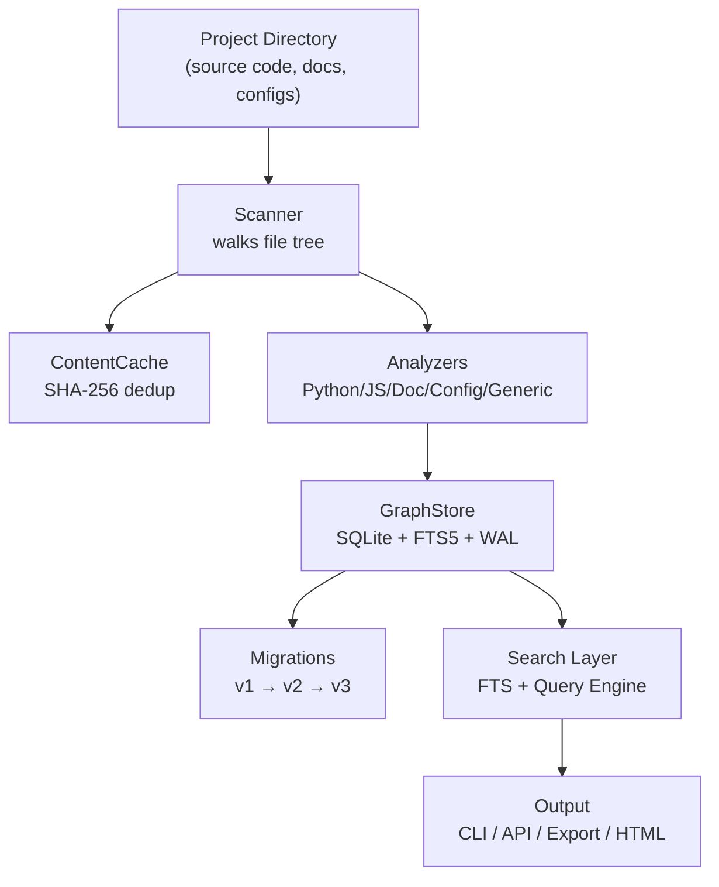
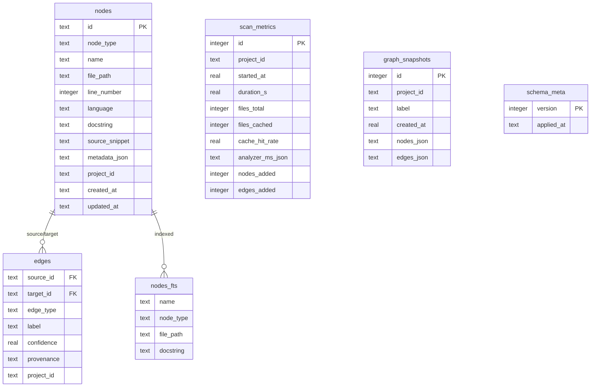
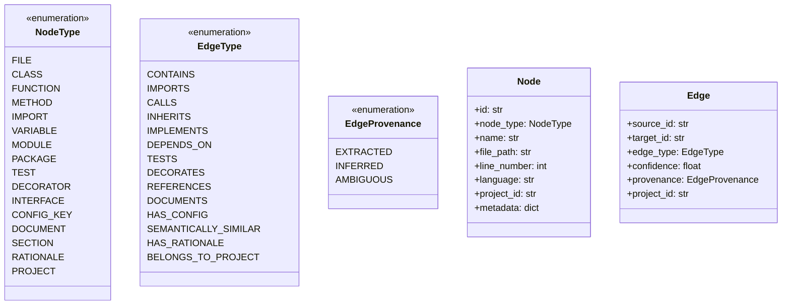
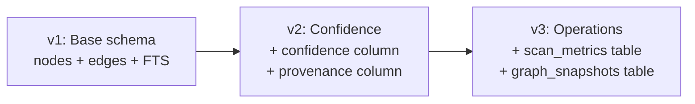
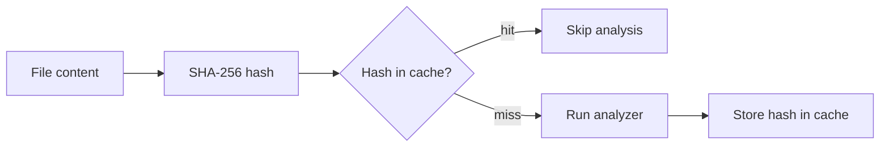
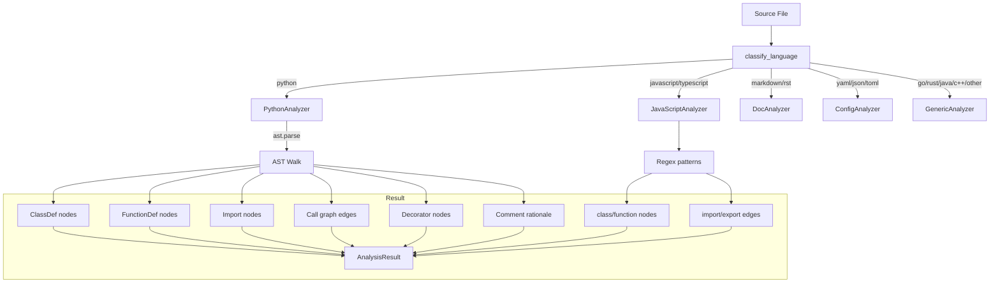
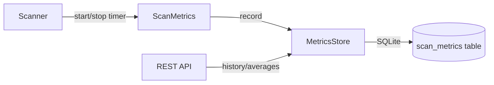
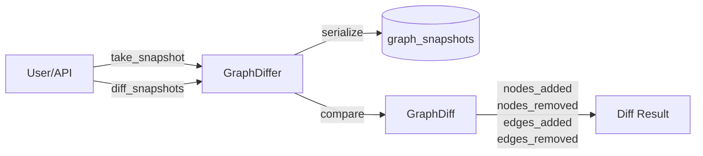
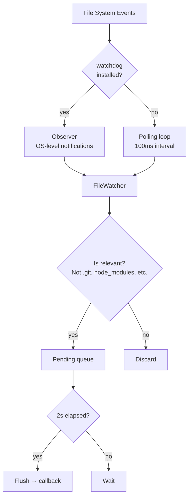
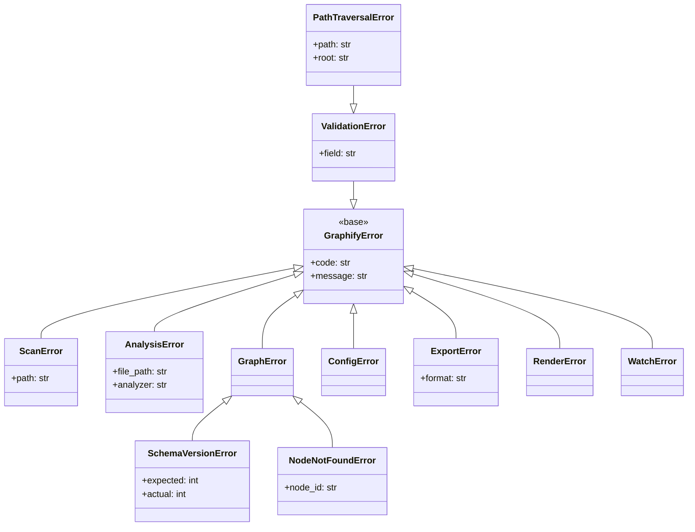

# Graphify — Architecture Reference

> Internal architecture documentation for the Graphify knowledge-graph engine.

---

## System Overview

Graphify is a self-contained subsystem (zero imports from `orchestrator/` or `agentic_team/`)
that transforms any project directory into a queryable SQLite-backed knowledge graph.



---

## Core Components

### 1. Scanner (`core/scanner.py`)

The Scanner orchestrates the scan process:

```mermaid
flowchart TD
    START[scan(path)] --> WALK[os.walk directory tree]
    WALK --> FILTER{.graphifyignore?}
    FILTER -->|excluded| SKIP[Skip file]
    FILTER -->|included| SIZE{> max_file_size?}
    SIZE -->|too large| SKIP
    SIZE -->|ok| HASH[SHA-256 hash]
    HASH --> CACHED{In cache?}
    CACHED -->|yes| COUNT[Increment cache hits]
    CACHED -->|no| LANG[Classify language]
    LANG --> ANALYZE[Run analyzer]
    ANALYZE --> STORE[Store nodes + edges]
    STORE --> UPDATECACHE[Update cache]
    COUNT --> NEXT[Next file]
    UPDATECACHE --> NEXT
    SKIP --> NEXT
    NEXT --> DONE{More files?}
    DONE -->|yes| FILTER
    DONE -->|no| INDEX[Rebuild FTS index]
    INDEX --> SUMMARY[Return ScanSummary]
```

**Key design decisions:**
- Project ID is a SHA-256 prefix of the canonical directory path (deterministic, portable)
- Files are classified by extension into language categories
- Each analyzer returns an `AnalysisResult` with nodes and edges
- Incremental mode: only re-analyzes files whose content hash changed

### 2. GraphStore (`core/graph.py`)

The persistence layer uses SQLite with several hardening features:



**Design patterns:**
- **Thread-local connections** via `threading.local()` — safe for multi-threaded API servers
- **WAL mode** for concurrent reads during writes
- **FTS5 virtual table** for efficient full-text search
- **Context manager** (`with GraphStore() as store:`) for automatic cleanup

### 3. Schema (`core/schema.py`)

Type-safe node and edge definitions:



### 4. Migrations (`core/migrations.py`)

Schema evolution with version tracking:



- Decorator-based migration registry (`@_register(version)`)
- Idempotent: skips already-applied migrations
- `schema_meta` table tracks applied versions with timestamps

### 5. Cache (`core/cache.py`)

Content-addressable cache using SHA-256:



- Per-project cache tables (`cache_{project_id}`)
- Survives process restarts (SQLite-backed)
- Enables incremental scans with O(1) change detection

---

## Analyzer Pipeline



### Python Analyzer (Deep AST)

The Python analyzer is the most sophisticated, using `ast.parse` for:

1. **Classes** — Name, bases, methods, decorators, docstrings
2. **Functions** — Name, args, return type, decorators, docstrings
3. **Imports** — `import x` and `from x import y`
4. **Call graph** — Function/method calls with resolved targets
5. **Rationale comments** — `# NOTE:`, `# HACK:`, `# WHY:`, `# IMPORTANT:`
6. **Type annotations** — Parameter types, return types

---

## Search & Query Architecture

```mermaid
graph TB
    subgraph "Search Layer"
        FTS[FTSEngine<br/>Full-text search via FTS5]
        QE[QueryEngine<br/>Graph traversal + analytics]
    end

    subgraph "FTS Capabilities"
        FS[search(query)]
        FN[search_by_name(name)]
    end

    subgraph "Query Capabilities"
        EX[explain_node(name)]
        FP[find_path(start, end)]
        CD[detect_communities()]
        GN[god_nodes()]
        CH[complexity_hotspots()]
        SG[get_subgraph(node, depth)]
        LB[language_breakdown()]
    end

    FTS --> FS
    FTS --> FN
    QE --> EX
    QE --> FP
    QE --> CD
    QE --> GN
    QE --> CH
    QE --> SG
    QE --> LB
```

---

## Operations Layer

### Metrics Collection



### Diffing & Snapshots



### File Watching



---

## Error Handling



---

## REST API Architecture

```mermaid
graph TB
    CLIENT[HTTP Client] --> CORS[CORS Middleware]
    CORS --> ROUTER[Flask Router]

    ROUTER --> HEALTH[/api/health]
    ROUTER --> PROJ[/api/projects/*]
    ROUTER --> SRCH[/api/search*]
    ROUTER --> GRAPH[/api/classes, dependencies, ...]
    ROUTER --> INTEL[/api/god-nodes, explain, ...]
    ROUTER --> METRICS[/api/metrics/*]
    ROUTER --> SNAP[/api/snapshots/*]
    ROUTER --> EXPORT[/api/export/*]

    subgraph "Error Handling"
        VE[ValidationError → 400]
        GE[GraphifyError → 500]
        NF[404 → Not Found]
        GEN[Exception → 500]
    end

    ROUTER --> VE
    ROUTER --> GE
    ROUTER --> NF
    ROUTER --> GEN
```

---

## Extension Points

### Adding a New Analyzer

1. Create `graphify/analyzers/my_analyzer.py`
2. Subclass `BaseAnalyzer`
3. Implement `analyze(file_path, content, project_id) → AnalysisResult`
4. Register the language mapping in `Scanner._get_analyzer()`

### Adding a New Export Format

1. Add a method to `GraphExporter` in `export/formatters.py`
2. Wire it into `cli.py` export command and `api/server.py`

### Adding a New Migration

1. Add a function in `core/migrations.py` with the `@_register(version)` decorator
2. Bump `SCHEMA_VERSION` in `core/graph.py`

---

## Performance Characteristics

| Operation | Complexity | Notes |
|-----------|-----------|-------|
| Full scan (cold) | O(n × f) | n = files, f = avg file size |
| Incremental scan | O(Δ) | Only changed files |
| FTS search | O(log n) | SQLite FTS5 inverted index |
| BFS path finding | O(V + E) | Bounded by graph size |
| God node analysis | O(n log n) | Sort by degree |
| Community detection | O(V + E) | Connected components |
| Cache lookup | O(1) | SHA-256 hash comparison |

---

## Thread Safety

- **GraphStore**: Thread-local `sqlite3.Connection` objects (each thread gets its own)
- **WAL mode**: Multiple readers, single writer — no reader blocking
- **FileWatcher**: Thread-safe pending queue with `threading.Lock`
- **MetricsStore / GraphDiffer**: Use GraphStore's thread-local connection getter

---

## File Layout

```
graphify/                    # 34 Python files, ~6400 LOC
├── core/                    # Data layer (12 files)
│   ├── graph.py             # SQLite store (700 LOC)
│   ├── scanner.py           # File tree walker
│   ├── schema.py            # Type definitions
│   ├── cache.py             # SHA-256 cache
│   ├── config.py            # Configuration
│   ├── migrations.py        # Schema evolution
│   ├── metrics.py           # Scan performance
│   ├── differ.py            # Snapshots & diffs
│   ├── watcher.py           # File system watch
│   ├── validation.py        # Input safety
│   ├── exceptions.py        # Error hierarchy
│   └── ignore.py            # .graphifyignore
├── analyzers/               # Language parsers (6 files)
├── search/                  # Query engines (2 files)
├── api/                     # REST API (1 file)
├── export/                  # Formatters (1 file)
├── report/                  # Markdown generator (1 file)
└── visualization/           # HTML renderer (1 file)
```
