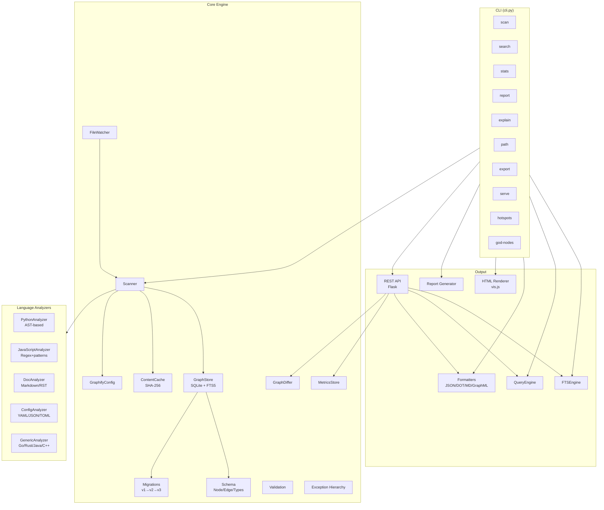
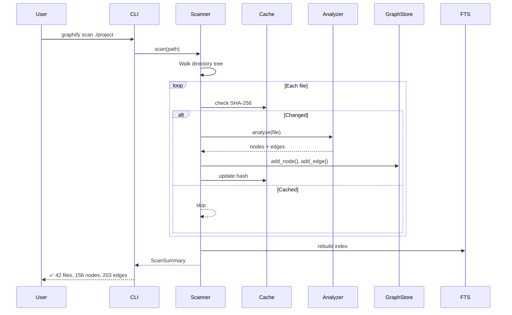
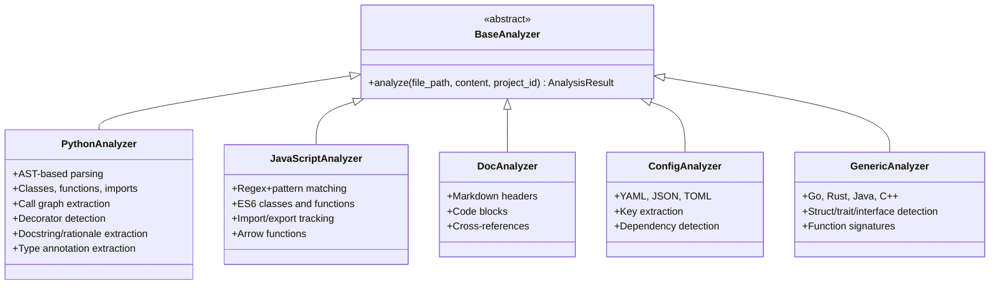
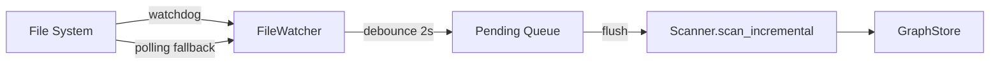
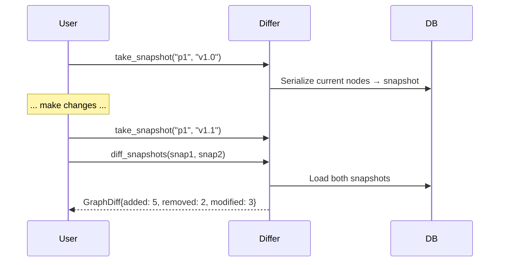
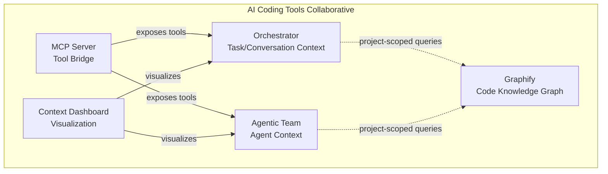

# Graphify — Turn Any Project Into a Queryable Knowledge Graph

**Graphify** is the fifth standalone system in the AI Coding Tools Collaborative. It scans any
project directory and builds a persistent, queryable knowledge graph—classes, functions, imports,
call graphs, design rationale, and cross-file relationships—all stored in a local SQLite database
with full-text search.

```
graphify scan ./my-project          # Build the graph
graphify search "authentication"    # Query it
graphify god-nodes                  # Find central concepts
graphify report                     # Generate Markdown report
graphify serve                      # Launch REST API
```

---

## Table of Contents

- [Features](#features)
- [Architecture](#architecture)
- [Quick Start](#quick-start)
- [CLI Reference](#cli-reference)
- [REST API](#rest-api)
- [Configuration](#configuration)
- [Analyzers](#analyzers)
- [Search & Intelligence](#search--intelligence)
- [File Watching](#file-watching)
- [Diffing & Snapshots](#diffing--snapshots)
- [Metrics](#metrics)
- [Export Formats](#export-formats)
- [Integration with Orchestrator & Agentic Team](#integration-with-orchestrator--agentic-team)
- [Testing](#testing)
- [Security](#security)

---

## Features

| Category | Feature | Status |
|----------|---------|--------|
| **Analysis** | Python AST (classes, functions, imports, calls, decorators, docstrings) | ✅ |
| | JavaScript/TypeScript (classes, functions, imports, exports) | ✅ |
| | Generic text/config/YAML/JSON/TOML | ✅ |
| | Markdown/RST documentation | ✅ |
| | Go, Rust, Java, C++ (regex-based) | ✅ |
| **Graph** | SQLite + FTS5 full-text search | ✅ |
| | WAL mode for concurrent reads | ✅ |
| | Schema migrations (v1 → v2 → v3) | ✅ |
| | Thread-local connections | ✅ |
| | Context manager support | ✅ |
| **Search** | Full-text search (FTS5) | ✅ |
| | Name search | ✅ |
| | Node explanation (neighbors + rationale) | ✅ |
| | Path finding (BFS between nodes) | ✅ |
| | Community detection (connected components) | ✅ |
| | God node analysis (highest-degree concepts) | ✅ |
| | Complexity hotspots | ✅ |
| **Cache** | SHA-256 content-addressable cache | ✅ |
| | Incremental scans (only changed files) | ✅ |
| **Export** | JSON, DOT (Graphviz), Markdown, GraphML | ✅ |
| **Visualization** | Interactive HTML (vis.js) | ✅ |
| **Report** | Markdown report with statistics, god nodes, communities | ✅ |
| **API** | Flask REST API with CORS | ✅ |
| | Error handling + structured JSON errors | ✅ |
| | Metrics, snapshots, diffing endpoints | ✅ |
| **Operations** | File watching (watchdog + polling fallback) | ✅ |
| | Graph snapshots & diffing | ✅ |
| | Scan metrics collection | ✅ |
| | `.graphifyignore` support | ✅ |
| **Security** | Path traversal protection | ✅ |
| | Input validation (FTS injection, bounds) | ✅ |
| | No debug mode in production | ✅ |

---

## Architecture



### Data Flow



---

## Quick Start

```bash
# Install dependencies
pip install -r requirements.txt

# Scan a project
python -m graphify scan /path/to/project

# Search the graph
python -m graphify search "authentication"

# Generate a report
python -m graphify report

# Start the API server
python -m graphify serve
```

---

## CLI Reference

| Command | Description | Key Options |
|---------|-------------|-------------|
| `scan <path>` | Scan a directory and build the graph | `--db`, `--no-cache`, `--incremental` |
| `search <query>` | Full-text search across nodes | `--project-id`, `--limit` |
| `stats` | Show graph statistics | `--project-id` |
| `report` | Generate a Markdown report | `--output`, `--project-id` |
| `explain <name>` | Explain a node's relationships | `--project-id` |
| `path <start> <end>` | Find path between two nodes | `--project-id` |
| `export` | Export graph in various formats | `--format` (json/dot/md/graphml) |
| `serve` | Start REST API server | `--host`, `--port` |
| `hotspots` | Show complexity hotspots | `--top`, `--project-id` |
| `god-nodes` | Find highest-degree nodes | `--top`, `--project-id` |

### Examples

```bash
# Scan with custom database path
graphify scan ./my-project --db ./my-graph.db

# Incremental scan (only changed files)
graphify scan ./my-project --incremental

# Export as GraphML for Gephi
graphify export --format graphml --output graph.graphml

# Find path between two classes
graphify path "UserService" "Database"

# Top 10 complexity hotspots
graphify hotspots --top 10
```

---

## REST API

Start the server with `graphify serve --db .graphify.db --port 5004`.

### Endpoints

| Method | Path | Description |
|--------|------|-------------|
| GET | `/api/health` | Health check |
| GET | `/api/projects` | List all scanned projects |
| GET | `/api/projects/<id>` | Project summary |
| GET | `/api/projects/<id>/stats` | Project statistics |
| GET | `/api/search?q=...` | Full-text search |
| GET | `/api/search/name?name=...` | Name search |
| GET | `/api/files/<path>` | File structure |
| GET | `/api/classes` | Class hierarchy |
| GET | `/api/dependencies` | Import dependencies |
| GET | `/api/tests` | Test files |
| GET | `/api/hotspots` | Complexity hotspots |
| GET | `/api/languages` | Language breakdown |
| GET | `/api/subgraph/<id>` | Node neighborhood |
| GET | `/api/god-nodes` | God node analysis |
| GET | `/api/explain/<name>` | Node explanation |
| GET | `/api/path/<start>/<end>` | Path finding |
| GET | `/api/communities` | Community detection |
| GET | `/api/metrics/<project_id>` | Scan metrics history |
| GET | `/api/snapshots/<project_id>` | List graph snapshots |
| POST | `/api/snapshots/<project_id>/take` | Take a snapshot |
| GET | `/api/diff/<snap_a>/<snap_b>` | Diff two snapshots |
| GET | `/api/export/json` | Export as JSON |
| GET | `/api/export/dot` | Export as DOT |
| GET | `/api/export/markdown` | Export as Markdown |
| GET | `/api/export/graphml` | Export as GraphML |

All endpoints accept `?project_id=...` for project-scoped queries.

See [API_REFERENCE.md](API_REFERENCE.md) for detailed request/response schemas.

---

## Configuration

`GraphifyConfig` controls scan behavior:

| Field | Type | Default | Description |
|-------|------|---------|-------------|
| `max_file_size_kb` | int | 500 | Skip files larger than this |
| `use_cache` | bool | True | Enable SHA-256 caching |
| `include_tests` | bool | True | Include test files in graph |
| `include_docs` | bool | True | Include documentation files |
| `scan_depth` | int | 10 | Max directory recursion depth |

---

## Analyzers



### Language Support

| Language | Analyzer | Method | Depth |
|----------|----------|--------|-------|
| Python | PythonAnalyzer | AST | Classes, functions, imports, calls, decorators, docstrings |
| JavaScript/TypeScript | JavaScriptAnalyzer | Regex | Classes, functions, imports, exports |
| Go | GenericAnalyzer | Regex | Structs, interfaces, functions |
| Rust | GenericAnalyzer | Regex | Structs, traits, impl, functions |
| Java | GenericAnalyzer | Regex | Classes, interfaces, methods |
| C/C++ | GenericAnalyzer | Regex | Classes, structs, functions |
| Markdown/RST | DocAnalyzer | Pattern | Headings, code blocks |
| YAML/JSON/TOML | ConfigAnalyzer | Parser | Keys, dependencies |

---

## Search & Intelligence

### Full-Text Search (FTS5)

SQLite FTS5 indexes node names, types, file paths, and metadata for fast keyword search.

### God Node Analysis

Identifies the highest-degree nodes—the central concepts everything connects through.

### Community Detection

Uses connected-component analysis to discover clusters of related nodes.

### Path Finding

BFS-based shortest path between any two nodes in the graph.

### Node Explanation

Returns a node's neighbors, edge types, and any rationale comments extracted from source.

---

## File Watching



The `FileWatcher` monitors a project directory for changes:

- Uses **watchdog** for efficient OS-level notifications (inotify/FSEvents)
- Falls back to **polling** if watchdog is not installed
- **Debounces** rapid changes (2-second window) to avoid redundant rebuilds
- Filters irrelevant files (`.git/`, `node_modules/`, `__pycache__/`, etc.)

---

## Diffing & Snapshots

Track how a project's graph evolves over time:



---

## Metrics

Every scan records performance metrics:

- **Duration** (wall-clock time)
- **Files scanned** vs **files cached** (cache hit rate)
- **Per-analyzer timing** (Python, JS, etc.)
- **Node/edge counts**
- **Historical trends** via `MetricsStore.history()`

---

## Export Formats

| Format | Extension | Use Case |
|--------|-----------|----------|
| JSON | `.json` | Programmatic access, LLM context |
| DOT | `.dot` | Graphviz visualization |
| Markdown | `.md` | Documentation, code reviews |
| GraphML | `.graphml` | Gephi, yEd, Neo4j import |
| HTML | `.html` | Interactive vis.js browser |

---

## Integration with Orchestrator & Agentic Team

Graphify is a standalone system but complements the context graphs in:

- **Orchestrator** (`orchestrator/context/`) — Project-scoped memory with conversation/task/pattern nodes
- **Agentic Team** (`agentic_team/context/`) — Independent context graph for team agents

Graphify provides **deep code-level analysis** (AST, call graphs, dependencies) that enriches
the higher-level context stored by the orchestrator and agentic team systems.



---

## Testing

```bash
# Run graphify-specific tests
python -m pytest tests/test_graphify.py tests/test_graphify_v2.py tests/test_graphify_v3.py -q

# Run the full suite
python -m pytest tests/ --override-ini="addopts=" -q --timeout=30 -m "not integration and not slow"
```

Test coverage:
- **test_graphify.py** — 74 core tests (scanning, graph ops, search, export)
- **test_graphify_v2.py** — 48 feature tests (cache, ignore, confidence, communities, GraphML)
- **test_graphify_v3.py** — 54 tests (exceptions, validation, migrations, metrics, differ, watcher)
- **Total: 176 graphify-specific tests**

---

## Security

- **Path traversal protection** — All file paths validated against root directory
- **Input sanitization** — FTS queries stripped of injection characters
- **Bounded parameters** — All integer params clamped to safe ranges
- **No debug mode** — Flask runs with `debug=False` by default
- **CORS headers** — Configurable cross-origin access
- **No secrets in graph** — Only code structure stored, no credentials
- **WAL mode** — Safe concurrent database access

---

## Project Structure

```
graphify/
├── __init__.py            # Public API exports
├── __main__.py            # Entry point (python -m graphify)
├── cli.py                 # Click CLI with 10 commands
├── analyzers/
│   ├── base.py            # BaseAnalyzer ABC
│   ├── python_analyzer.py # Python AST analyzer
│   ├── javascript_analyzer.py
│   ├── doc_analyzer.py    # Markdown/RST
│   ├── config_analyzer.py # YAML/JSON/TOML
│   └── generic_analyzer.py # Go/Rust/Java/C++
├── api/
│   └── server.py          # Flask REST API
├── core/
│   ├── cache.py           # SHA-256 content cache
│   ├── config.py          # GraphifyConfig dataclass
│   ├── differ.py          # Graph snapshots & diffing
│   ├── exceptions.py      # Exception hierarchy
│   ├── graph.py           # GraphStore (SQLite + FTS5)
│   ├── ignore.py          # .graphifyignore support
│   ├── metrics.py         # Scan performance metrics
│   ├── migrations.py      # Schema version management
│   ├── scanner.py         # Directory scanner
│   ├── schema.py          # Node/Edge/Type definitions
│   ├── validation.py      # Input validation
│   └── watcher.py         # File system watcher
├── export/
│   └── formatters.py      # JSON/DOT/MD/GraphML export
├── report/
│   └── generator.py       # Markdown report generator
├── search/
│   ├── fts_engine.py      # FTS5 search engine
│   └── query_engine.py    # Graph query engine
└── visualization/
    └── html_renderer.py   # Interactive HTML (vis.js)
```

---

## License

Part of the AI Coding Tools Collaborative project. See the root [LICENSE](../LICENSE) for details.
