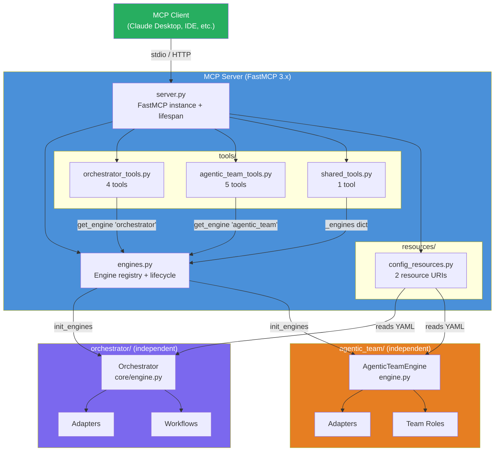
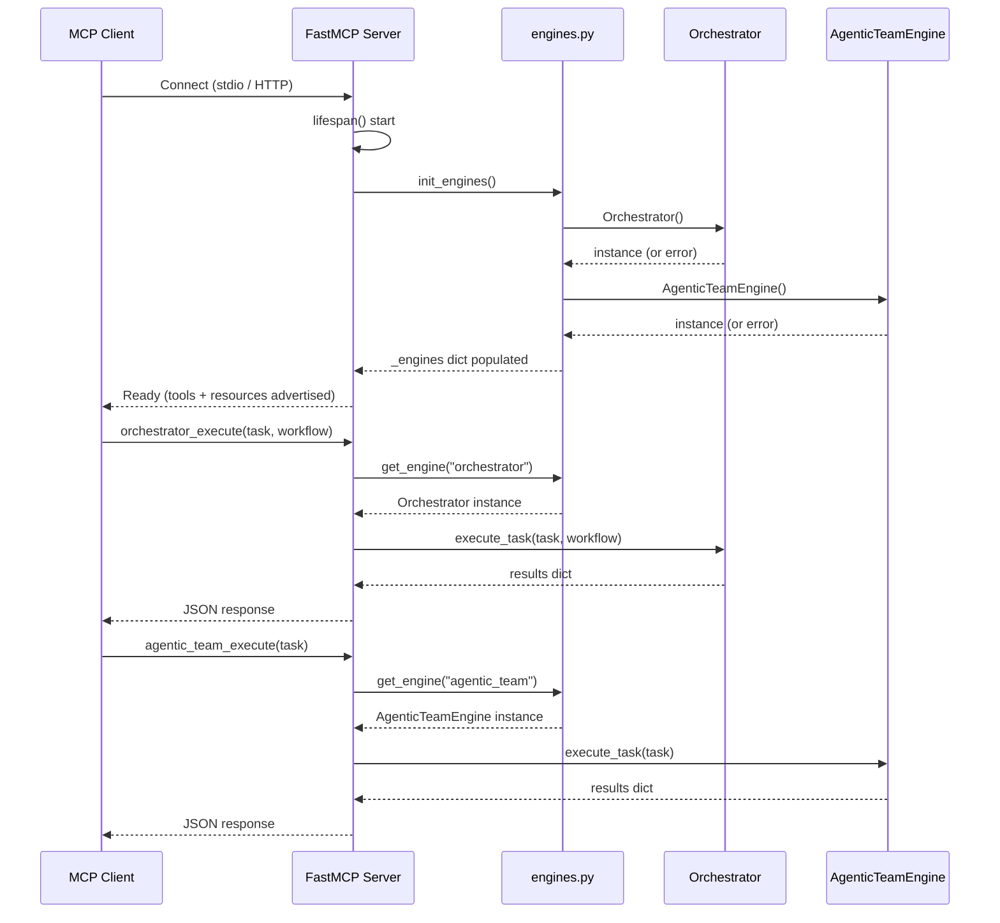
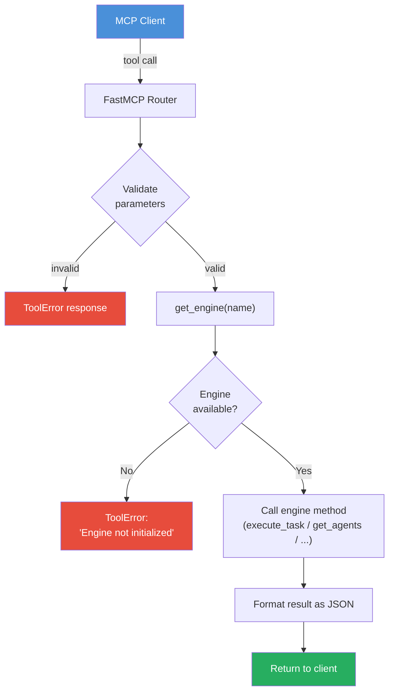

# MCP Server

FastMCP 3.x server exposing both the Orchestrator and Agentic Team as MCP tools.

## Architecture

The MCP server acts as a unified gateway that exposes both independent AI multi-agent systems -- the workflow-based Orchestrator and the role-based Agentic Team -- through the Model Context Protocol. The server itself shares zero code with either system; it imports their public APIs and wraps them as MCP tools and resources.



## Structure

```
mcp_server/
├── server.py                    Server assembly (creates FastMCP, registers tools)
├── engines.py                   Engine registry (init, get, lifecycle)
├── tools/
│   ├── orchestrator_tools.py    orchestrator_execute, list_agents, list_workflows, health
│   ├── agentic_team_tools.py    agentic_team_execute, list_agents, config, validate, health
│   └── shared_tools.py          list_engines
├── resources/
│   └── config_resources.py      config://orchestrator, config://agentic-team
├── __init__.py
└── __main__.py
```

## Quick Start

```bash
# stdio transport (default for Claude Desktop / MCP Inspector)
python -m mcp_server.server

# HTTP transport on a custom port
python -m mcp_server.server --transport http --port 8000

# Launch with MCP Inspector for interactive testing
fastmcp dev mcp_server/server.py:mcp
```

## Server Lifecycle

On startup, the server initializes both engines via `engines.py`. If an engine fails to initialize (missing config, unavailable agents), the server continues with degraded functionality -- tools for that engine return a descriptive error rather than crashing the entire server.



## Tools (10)

| Tool | System | Description |
|------|--------|-------------|
| `orchestrator_execute` | Orchestrator | Run a task through a named workflow (e.g. codex -> gemini -> claude) |
| `orchestrator_list_agents` | Orchestrator | List all available agents with their types and capabilities |
| `orchestrator_list_workflows` | Orchestrator | List all configured workflows with step details |
| `orchestrator_health` | Orchestrator | Run health checks (Python version, disk, memory, config, deps) |
| `agentic_team_execute` | Agentic Team | Run a task with role-based team collaboration (PM gates delivery) |
| `agentic_team_list_agents` | Agentic Team | List agents mapped to team roles |
| `agentic_team_config` | Agentic Team | Get effective team role configuration and validation status |
| `agentic_team_validate` | Agentic Team | Validate that all roles map to available agent adapters |
| `agentic_team_health` | Agentic Team | Health check for the agentic team engine |
| `list_engines` | Both | Show initialization status of both engines |

## Resources (2)

| URI | Content |
|-----|---------|
| `config://orchestrator` | Full contents of `orchestrator/config/agents.yaml` |
| `config://agentic-team` | Full contents of `agentic_team/config/agents.yaml` |

## Tool Execution Flow



## Configuration

The MCP server reads configuration from the same YAML files as the underlying systems:

| System | Config Path | Override Env Var |
|--------|-------------|------------------|
| Orchestrator | `orchestrator/config/agents.yaml` | `AI_ORCHESTRATOR_CONFIG_PATH` |
| Agentic Team | `agentic_team/config/agents.yaml` | `AGENTIC_TEAM_CONFIG_PATH` |

Both config files are also exposed as MCP resources (`config://orchestrator` and `config://agentic-team`) so clients can inspect them programmatically.

## Testing

```bash
# Run MCP-specific tests (20 tests)
python -m pytest tests/test_mcp_server.py --override-ini="addopts=" -v
```

20 tests use FastMCP's in-memory `Client` -- no subprocess or network needed. Tests inject mocks into the `_engines` dict to isolate MCP tool logic from actual engine behavior.

## Detailed Docs

See [`MCP.md`](../MCP.md) in the project root.
