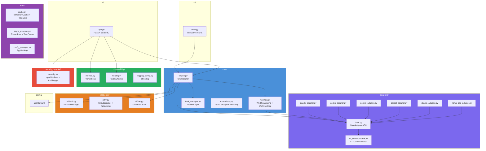
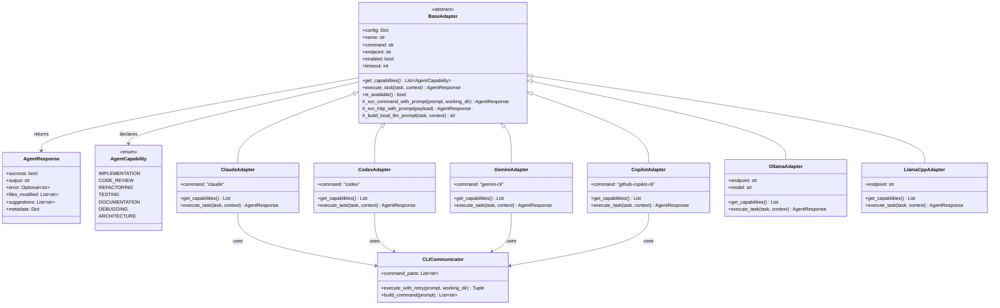
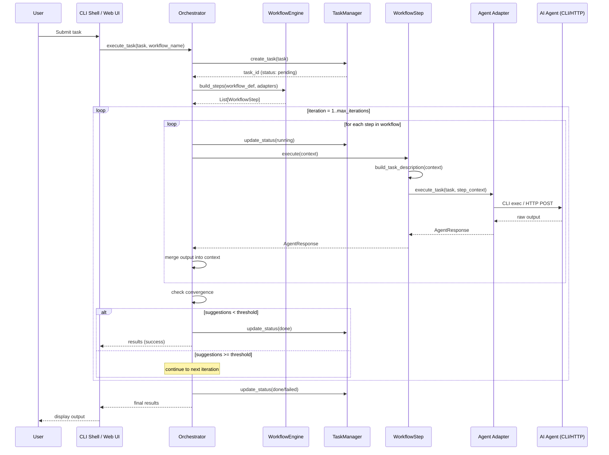
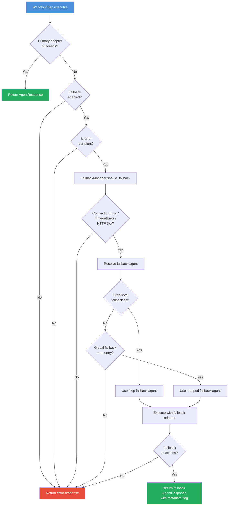
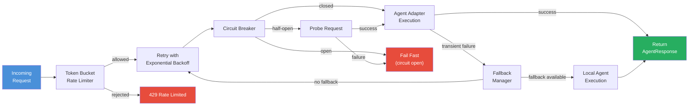

# AI Agent Orchestrator

A production-grade orchestration engine that coordinates multiple AI coding assistants through configurable workflows. The orchestrator manages the full lifecycle of multi-agent task execution -- dispatching work to cloud CLIs (Claude, Codex, Gemini, Copilot) and local model servers (Ollama, llama.cpp), with built-in fallback routing, circuit breakers, Prometheus metrics, and an interactive REPL.

## Table of Contents

- [Architecture Overview](#architecture-overview)
- [Package Structure](#package-structure)
- [Quick Start](#quick-start)
- [Configuration](#configuration)
- [Workflows](#workflows)
- [CLI Shell](#cli-shell)
- [Web UI and API](#web-ui-and-api)
- [Offline and Hybrid Mode](#offline-and-hybrid-mode)
- [Resilience](#resilience)
- [Observability](#observability)
- [Security](#security)
- [Deployment](#deployment)

## Architecture Overview

```
                    +---------------------+
                    |   CLI Shell / UI    |
                    +----------+----------+
                               |
                    +----------v----------+
                    |    Orchestrator      |
                    |    (core/engine.py)  |
                    +----------+----------+
                               |
              +----------------+----------------+
              |                |                |
     +--------v------+ +------v-------+ +------v--------+
     | WorkflowEngine| | TaskManager  | | FallbackManager|
     +--------+------+ +--------------+ +------+--------+
              |                                 |
    +---------+---------+              +--------v--------+
    | PlannerAgent      |              | OfflineDetector |
    | (dynamic routing) |              +-----------------+
    +---------+---------+
              |
    +---------v---------+
    |   WorkflowStep    |
    +---------+---------+
              |
    +---------v---------+
    |   Adapter Layer   |
    |  (BaseAdapter)    |
    +----+----+----+----+
         |    |    |    |
     Claude Codex Gemini Ollama ...
```

### Package Architecture



Each task flows through a **workflow** -- an ordered sequence of agent steps. The `Orchestrator` resolves which adapters are available, builds `WorkflowStep` objects, and iterates until the task converges or `max_iterations` is reached. If a cloud agent fails with a transient error, the `FallbackManager` transparently reroutes to a configured local agent.

## Package Structure

```
orchestrator/
├── __init__.py                  Public API re-exports
├── adapters/                    AI agent adapters
│   ├── base.py                  BaseAdapter ABC, AgentResponse, AgentCapability
│   ├── cli_communicator.py      CLI execution (stdin/arg/file/heredoc), workspace tracking
│   ├── claude_adapter.py        Claude Code CLI adapter
│   ├── codex_adapter.py         OpenAI Codex CLI adapter
│   ├── gemini_adapter.py        Gemini CLI adapter
│   ├── copilot_adapter.py       GitHub Copilot CLI adapter
│   ├── ollama_adapter.py        Ollama HTTP adapter (async + sync)
│   └── llama_cpp_adapter.py     llama.cpp / OpenAI-compatible adapter
├── core/
│   ├── engine.py                Orchestrator class -- main entry point
│   ├── workflow.py              WorkflowEngine, WorkflowStep
│   ├── planner.py               PlannerAgent for dynamic, metrics-based routing
│   ├── task_manager.py          Task lifecycle tracking (pending/running/done/failed)
│   └── exceptions.py            Typed exception hierarchy
├── resilience/
│   ├── fallback.py              Cloud-to-local fallback routing
│   ├── retry.py                 Retry decorators, CircuitBreaker, RateLimiter
│   └── offline.py               Network connectivity detection with caching
├── observability/
│   ├── metrics.py               Prometheus counters/histograms/gauges
│   ├── health.py                Liveness and readiness probes
│   └── logging_config.py        structlog + Rich console logging
├── security_module/
│   └── security.py              InputValidator, TokenBucketRateLimiter, SecretManager, AuditLogger
├── infra/
│   ├── cache.py                 InMemoryCache, FileCache, @cache_result decorator
│   ├── async_executor.py        ThreadPoolExecutor wrapper, TaskQueue, async helpers
│   └── config_manager.py        Pydantic-based AppSettings, ConfigManager
├── cli/
│   └── shell.py                 Interactive REPL with readline, Rich UI, session persistence
├── config/
│   └── agents.yaml              Default agent/workflow/settings configuration
└── ui/
    └── app.py                   Flask + SocketIO web backend
```

### Adapter Class Hierarchy



## Quick Start

### Prerequisites

- Python 3.10+
- At least one AI CLI tool installed (`claude`, `codex`, `gemini`, or `copilot`)
- For local/offline mode: [Ollama](https://ollama.com) or a llama.cpp-compatible server

### Installation

```bash
# From the repository root
pip install -e ".[all]"
```

### Run a task programmatically

```python
from orchestrator import Orchestrator

orch = Orchestrator()                           # loads config/agents.yaml
print(orch.get_available_agents())              # ['codex', 'gemini', 'claude']
print(orch.get_workflows())                     # ['default', 'quick', 'thorough', ...]

results = orch.execute_task(
    task="Implement a REST endpoint for user authentication with JWT",
    workflow_name="default",
    max_iterations=3,
)

print(results["success"])                       # True/False
print(results["final_output"])                  # Last agent output
```

### Launch the interactive shell

```bash
python -m orchestrator.cli.shell
```

### Launch the web UI

```bash
python -m orchestrator.ui.app
# Open http://localhost:5001
```

## Configuration

All configuration lives in `orchestrator/config/agents.yaml`. The file has four top-level sections.

### `agents` -- Agent Definitions

Each key under `agents` is a user-defined agent name. Required and optional fields:

| Field          | Type     | Default  | Description |
|----------------|----------|----------|-------------|
| `type`         | `string` | `"cli"`  | Adapter type: `cli`, `ollama`, `llamacpp`, `localai`, `text-generation-webui`, `openai-compatible` |
| `enabled`      | `bool`   | `true`   | Whether the agent is active |
| `command`      | `string` | --       | CLI executable name (for `type: cli`) |
| `endpoint`     | `string` | --       | HTTP endpoint (for local model types) |
| `model`        | `string` | --       | Model identifier (for Ollama/llama.cpp) |
| `role`         | `string` | --       | Semantic role label (`implementation`, `review`, `refinement`, `suggestions`) |
| `timeout`      | `int`    | `3600`   | Per-execution timeout in seconds |
| `offline`      | `bool`   | `false`  | Mark as a local-only agent |
| `capabilities` | `list`   | --       | Override default capabilities: `code`, `review`, `docs`, `general`, `test`, `refactor` |
| `description`  | `string` | --       | Human-readable description |

### `workflows` -- Workflow Definitions

Workflows are ordered sequences of steps. Two formats are supported:

**List format** (simple):
```yaml
workflows:
  default:
    - agent: "codex"
      task: "implement"
    - agent: "gemini"
      task: "review"
    - agent: "claude"
      task: "refine"
```

**Object format** (with metadata):
```yaml
workflows:
  offline-default:
    description: "Local-only workflow"
    offline: true
    steps:
      - agent: "local-code"
        role: "implementer"
      - agent: "local-instruct"
        role: "reviewer"
```

Valid task/role values: `implement`, `review`, `refine`, `test`, `document`. Role aliases (`implementer`, `reviewer`, `refiner`, `writer`, `tester`) are normalized automatically.

### `settings` -- Global Settings

| Field                       | Type     | Default        | Description |
|-----------------------------|----------|----------------|-------------|
| `max_iterations`            | `int`    | `3`            | Max workflow iteration loops |
| `output_dir`                | `string` | `"./output"`   | Default output directory |
| `workspace_dir`             | `string` | `"./workspace"`| Workspace for agent file operations |
| `log_level`                 | `string` | `"INFO"`       | Logging level |
| `log_file`                  | `string` | --             | Log file path |
| `min_suggestions_threshold` | `int`    | `3`            | Review suggestions count that triggers another iteration |
| `offline.enabled`           | `bool`   | `false`        | Force offline mode |
| `offline.auto_detect`       | `bool`   | `true`         | Auto-detect network availability |
| `fallback.enabled`          | `bool`   | `true`         | Enable cloud-to-local fallback |
| `fallback.map`              | `object` | --             | Agent-to-agent fallback mapping |

### `agentic_team` -- Team Roles

Optional section for role-based agent mapping used by the UI:

```yaml
agentic_team:
  lead_role: "project_manager"
  max_turns: 12
  roles:
    project_manager:
      title: "Project Manager (Team Lead)"
      agent: "claude"
      responsibilities: "Initiate work, route subtasks, decide readiness."
```

See [docs/configuration-guide.md](../docs/configuration-guide.md) for the complete reference.

## Workflows

### Dynamic Planner Agent

The Orchestrator features a **Dynamic Planner Agent** (`orchestrator/core/planner.py`) that acts as an intelligent router and dynamic workflow generator. When a task is executed using the `dynamic` workflow (which is the default when no name is provided or a named workflow is missing), the Planner Agent:
1. **Reads Observability Metrics:** It accesses Prometheus metrics (`orchestrator_agent_calls_total`) to determine the real-time success and failure rates of all available agents.
2. **Evaluates Routing Policy:** Any agent with a success rate below `0.6` is deprioritized, removing it from the pool of candidates.
3. **Generates a Plan:** It uses a healthy LLM adapter (e.g., Claude, Gemini, Codex, or local-instruct) to break the task down into sequential steps (e.g., `implement`, `review`, `refine`) and assign the best available agents to each step.

This metrics-based routing ensures the system automatically adapts to API outages, degraded model performance, or local backend unavailability without manual configuration changes.

### Static YAML Workflows

You can also explicitly define static workflows in `agents.yaml`:

| Name              | Steps                                       | Use Case |
|-------------------|---------------------------------------------|----------|
| `default`         | codex (implement) -> gemini (review) -> claude (refine) | Standard development flow |
| `quick`           | codex (implement)                           | Fast prototyping |
| `thorough`        | codex -> copilot -> gemini -> claude -> gemini | Maximum quality |
| `review-only`     | gemini (review) -> claude (refine)          | Review existing code |
| `document`        | claude (document) -> gemini (review)        | Documentation generation |
| `offline-default` | local-code (implement) -> local-instruct (review) | Air-gapped development |
| `hybrid`          | local-code (implement) -> claude (review, fallback: local-instruct) | Cost-optimized |

### Workflow Execution Sequence



### Iteration Logic

The orchestrator loops over the workflow up to `max_iterations` times. It stops early when:
1. All steps succeed, AND
2. The review step produces fewer than `min_suggestions_threshold` suggestions.

## CLI Shell

The interactive shell provides a REPL with readline history, tab completion, and Rich formatting.

```
orchestrator (default) > Implement a binary search tree in Python
  ✓ codex - implement
  ✓ gemini - review
  ✓ claude - refine
✓ Task completed successfully!

orchestrator (default) > /followup add delete and balance methods
```

### Shell Commands

| Command              | Description |
|----------------------|-------------|
| `/help`              | Show all commands |
| `/agents`            | List available agents |
| `/workflows`         | List available workflows |
| `/switch <agent>`    | Switch to a specific agent |
| `/workflow <name>`   | Change the active workflow |
| `/followup <msg>`    | Continue the previous task with new instructions |
| `/history`           | Show conversation history |
| `/save [filename]`   | Save session to JSON |
| `/load <filename>`   | Load a saved session |
| `/context`           | Show current execution context |
| `/reset`             | Clear conversation state |
| `/info`              | Show system information |
| `/exit`, `/quit`     | Exit the shell |

Session files are stored in `~/.ai-orchestrator/sessions/`.

## Web UI and API

The Flask + SocketIO backend serves a web interface and REST API on port 5001 (configurable via `UI_BACKEND_PORT` or `PORT`).

### Key Endpoints

| Method | Path                  | Description |
|--------|-----------------------|-------------|
| GET    | `/health`             | Kubernetes liveness probe |
| GET    | `/ready`              | Kubernetes readiness probe |
| GET    | `/metrics`            | Prometheus metrics (text format) |
| GET    | `/api/agents`         | List available agents |
| GET    | `/api/workflows`      | List workflows with step details |
| GET    | `/api/config`         | Read current YAML config |
| PUT    | `/api/config`         | Update config and hot-reload orchestrator |
| POST   | `/api/execute`        | Start a task (async, returns immediately) |
| GET    | `/api/status`         | Get session status and logs |
| GET    | `/api/conversation`   | Get conversation history |
| POST   | `/api/conversation/clear` | Reset session |
| GET    | `/api/models/status`  | Probe local model backends |
| GET    | `/api/files/<path>`   | Read workspace files |

### WebSocket Events

| Event            | Direction       | Description |
|------------------|-----------------|-------------|
| `connect`        | Client -> Server| Join session room (pass `?client_id=`) |
| `connected`      | Server -> Client| Confirm connection with session state |
| `task_started`   | Server -> Client| Task execution began |
| `progress_log`   | Server -> Client| Real-time log streaming |
| `task_completed` | Server -> Client| Task finished with results |
| `task_error`     | Server -> Client| Task failed |

See [docs/orchestrator-api-reference.md](../docs/orchestrator-api-reference.md) for the full API specification.

## Offline and Hybrid Mode

### Forcing Offline Mode

```python
orch = Orchestrator(force_offline=True)
```

Or in `agents.yaml`:
```yaml
settings:
  offline:
    enabled: true
```

### Auto-Detection

When `offline.auto_detect` is `true`, the `OfflineDetector` issues a lightweight HTTP HEAD request to a connectivity URL (default: `https://httpbin.org/status/200`) with a 3-second timeout. Results are cached for 60 seconds. Override the URL via:

```bash
export CONNECTIVITY_CHECK_URL=https://your-canary-endpoint/healthz
```

### Fallback Routing

When a cloud agent fails with a transient network/API error (connection refused, DNS failure, HTTP 502/503/504, timeout), the `FallbackManager` routes to the configured local alternative:

```yaml
settings:
  fallback:
    enabled: true
    map:
      codex: local-code
      claude: local-instruct
      gemini: local-instruct
```

Per-step overrides are also supported:
```yaml
workflows:
  hybrid:
    steps:
      - agent: "claude"
        role: "reviewer"
        fallback: "local-instruct"
```

### Fallback Routing Flowchart



## Resilience

### Resilience Pipeline



### Circuit Breaker

The `CircuitBreaker` class prevents cascading failures. After `failure_threshold` consecutive failures (default: 5), the circuit opens for `recovery_timeout` seconds (default: 60). A half-open probe is attempted after the timeout.

```python
from orchestrator.resilience.retry import CircuitBreaker

breaker = CircuitBreaker(failure_threshold=5, recovery_timeout=60.0)
result = breaker.call(some_function, arg1, arg2)
```

### Retry with Backoff

```python
from orchestrator.resilience.retry import retry_agent_execution

@retry_agent_execution(max_attempts=3, wait_seconds=2.0)
def call_agent(task):
    ...
```

Uses exponential backoff with tenacity. Retries on `AgentExecutionError`, `AgentTimeoutError`, `ConnectionError`, and `TimeoutError`.

### Token Bucket Rate Limiter

```python
from orchestrator.resilience.retry import RateLimiter

limiter = RateLimiter(rate=10.0, capacity=20)
if limiter.acquire():
    # proceed
```

## Observability

### Prometheus Metrics

The `MetricsCollector` exposes:

| Metric | Type | Labels | Description |
|--------|------|--------|-------------|
| `orchestrator_tasks_total` | Counter | workflow, status | Total tasks executed |
| `orchestrator_tasks_in_progress` | Gauge | -- | Currently running tasks |
| `orchestrator_task_duration_seconds` | Histogram | workflow | Task execution latency |
| `orchestrator_agent_calls_total` | Counter | agent, status | Per-agent call count |
| `orchestrator_agent_duration_seconds` | Histogram | agent | Per-agent latency |
| `orchestrator_agent_errors_total` | Counter | agent, error_type | Agent error count |
| `orchestrator_workflow_iterations` | Summary | workflow | Iterations per workflow |
| `orchestrator_active_agents` | Gauge | -- | Available agents |
| `orchestrator_cache_hits_total` | Counter | -- | Cache hits |
| `orchestrator_cache_misses_total` | Counter | -- | Cache misses |

Access via `GET /metrics` on the web UI or via the `MetricsCollector` API directly.

### Structured Logging

Logging is configured via `structlog` with Rich console output in development and JSON in production:

```python
from orchestrator.observability.logging_config import configure_logging, get_logger

configure_logging(log_level="INFO", json_logs=False)
logger = get_logger(__name__)
logger.info("task_started", workflow="default", task_id="task_1")
```

### Health Checks

The `HealthChecker` runs six checks: Python version, disk space, memory, config validity, required directories, and package dependencies. Used by `/health` and `/ready` endpoints.

## Security

### Input Validation

`InputValidator` enforces:
- Task description max length (10,000 chars)
- Dangerous command pattern detection (`rm -rf`, `curl | bash`, etc.)
- Workflow/agent name format (`[a-zA-Z0-9_-]`)
- File path traversal prevention

### Rate Limiting

`TokenBucketRateLimiter` provides per-key rate limiting (default: 60 requests per 60-second window).

### Secrets

`SecretManager` loads environment variables matching `API_KEY_*`, `SECRET_*`, `TOKEN_*`, `PASSWORD_*` prefixes and provides masking for log output.

### Audit Logging

`AuditLogger` writes JSON-line events to `logs/audit.log` with timestamps, event types, users, actions, and status codes.

## Deployment

### Environment Variables

| Variable                      | Default            | Description |
|-------------------------------|--------------------|-------------|
| `AI_ORCHESTRATOR_CONFIG_PATH` | `config/agents.yaml` | Override config file path |
| `FLASK_SECRET_KEY`            | (random)           | Flask session secret |
| `CORS_ALLOWED_ORIGINS`        | `*`                | Comma-separated CORS origins |
| `UI_BACKEND_PORT` / `PORT`    | `5001`             | Web UI port |
| `FLASK_DEBUG`                 | `false`            | Enable Flask debug mode |
| `CONNECTIVITY_CHECK_URL`      | `https://httpbin.org/status/200` | Offline detection endpoint |
| `APP_ENV`                     | `development`      | Environment (`development`, `production`) |

### Docker

```dockerfile
FROM python:3.12-slim
WORKDIR /app
COPY . .
RUN pip install -e ".[all]"
EXPOSE 5001
CMD ["python", "-m", "orchestrator.ui.app"]
```

### Kubernetes

The `/health` and `/ready` endpoints are designed for Kubernetes probes:

```yaml
livenessProbe:
  httpGet:
    path: /health
    port: 5001
readinessProbe:
  httpGet:
    path: /ready
    port: 5001
```

### Running with Local Models

1. Install and start Ollama:
   ```bash
   ollama serve
   ollama pull codellama:13b
   ollama pull mistral:7b-instruct
   ```
2. Enable local agents in `agents.yaml`:
   ```yaml
   agents:
     local-code:
       type: ollama
       enabled: true
       model: "codellama:13b"
   ```
3. Run with offline mode or let auto-detection handle it.
