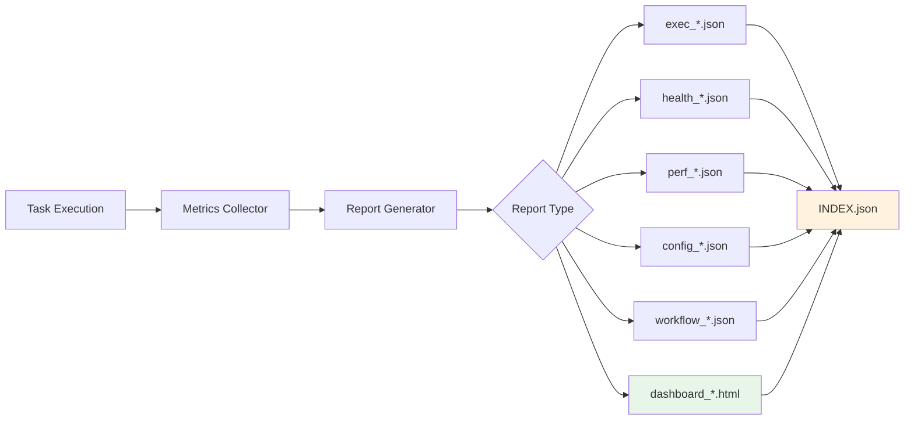
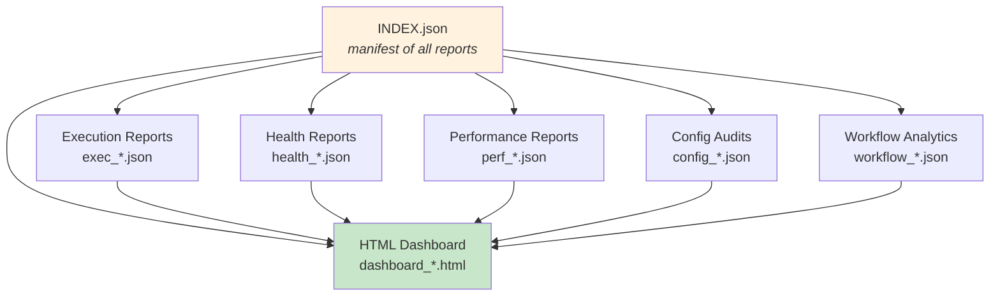

# Reports Directory

Auto-generated execution reports, health checks, performance analytics, and
interactive dashboards produced by the Orchestrator's reporting subsystem.
Reports provide visibility into what agents did, how they performed, and
whether the system is healthy.

## Report Types

| Type | File Pattern | Format | Description |
|------|-------------|--------|-------------|
| Execution Summary | `exec_*.json` | JSON | Per-task execution details — agent, duration, status, output |
| Health Check | `health_*.json` | JSON | System health — agent availability, connectivity, resource usage |
| Performance | `perf_*.json` | JSON | Timing metrics — latency, throughput, token usage per agent |
| Config Audit | `config_*.json` | JSON | Configuration validation — missing keys, deprecated settings |
| Workflow Analytics | `workflow_*.json` | JSON | Multi-step workflow metrics — step durations, bottlenecks |
| Dashboard | `dashboard_*.html` | HTML | Interactive visual dashboard with charts and summaries |
| **INDEX.json** | `INDEX.json` | JSON | **Manifest** listing all reports with metadata and paths |

## Report Generation Flow



## Report Type Relationships



The **HTML dashboard** aggregates data from all JSON report types into a
single interactive view with charts and tables.

## INDEX.json

The manifest file tracks every generated report:

```json
{
  "generated_at": "2026-04-04T03:11:50Z",
  "reports": [
    {
      "type": "execution_summary",
      "file": "exec_20260404_031142.json",
      "generated_at": "2026-04-04T03:11:42Z"
    },
    {
      "type": "health_check",
      "file": "health_20260404_031141.json",
      "generated_at": "2026-04-04T03:11:41Z"
    },
    {
      "type": "dashboard",
      "file": "dashboard_20260404_031141.html",
      "generated_at": "2026-04-04T03:11:41Z"
    }
  ]
}
```

## Viewing Reports

```bash
# Open the HTML dashboard in a browser
open reports/dashboard_*.html

# Pretty-print a JSON report
python -m json.tool reports/health_20260404_031141.json

# List all reports sorted by date
ls -lt reports/

# Query INDEX.json for report paths
python -c "
import json
with open('reports/INDEX.json') as f:
    idx = json.load(f)
for r in idx['reports']:
    print(f\"{r['type']:25s} {r['file']}\")
"
```

## Generating Reports

Reports are created automatically after task execution, or on demand:

```bash
# Generate all report types
./ai-orchestrator --generate-reports

# Generate a specific report type
./ai-orchestrator --report health
./ai-orchestrator --report performance
```

## File Naming Convention

All report files follow the pattern:

```
<type>_<YYYYMMDD>_<HHMMSS>.<ext>
```

This ensures chronological sorting and prevents filename collisions when
multiple reports are generated in quick succession.

## Notes

- Reports accumulate over time. Periodically prune old reports to save disk
  space: `find reports/ -name "*.json" -mtime +30 -delete`
- The HTML dashboard is self-contained — it embeds all CSS and JS inline,
  so it can be opened directly in any browser without a web server.
- `INDEX.json` is regenerated each time reports are produced. It always
  reflects the current set of reports in the directory.
- To clear all reports: `rm -f reports/*.json reports/*.html && touch reports/.gitkeep`
