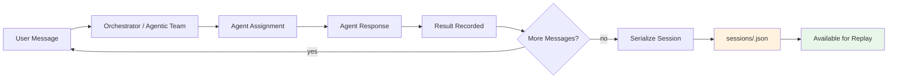
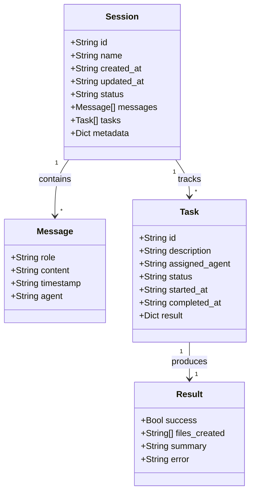

# Sessions Directory

Serialized session state persisted as JSON files. Each file captures the full
conversation history, task assignments, and execution timeline for a single
user session — enabling replay, audit, and continuity across restarts.

## Purpose

Sessions provide **persistent memory** for AI agent interactions. When a user
starts a project (e.g., building an auth system), the orchestrator records
every message, task delegation, and result into a session file. This allows:

- **Resuming work** after a restart or disconnect
- **Auditing** what agents did and why
- **Replaying** a session to reproduce results
- **Analyzing** patterns across multiple sessions

## Current Session Files

```
sessions/
├── agentic-team-demo.json
├── auth-system.json
├── cli-todo-app.json
├── db-refactor.json
├── rest-api-project.json
└── websocket-chat.json
```

Each file is named after the project or task it represents.

## Session Serialization Flow



## Session JSON Schema



## JSON Structure Example

```json
{
  "id": "session-a1b2c3d4",
  "name": "auth-system",
  "created_at": "2026-04-01T10:00:00Z",
  "updated_at": "2026-04-01T11:30:00Z",
  "status": "completed",
  "messages": [
    {
      "role": "user",
      "content": "Build JWT authentication for the API",
      "timestamp": "2026-04-01T10:00:00Z"
    },
    {
      "role": "assistant",
      "content": "I'll implement JWT auth with refresh tokens...",
      "timestamp": "2026-04-01T10:00:05Z",
      "agent": "claude"
    }
  ],
  "tasks": [
    {
      "id": "task-001",
      "description": "Implement JWT authentication module",
      "assigned_agent": "claude",
      "status": "completed",
      "started_at": "2026-04-01T10:00:10Z",
      "completed_at": "2026-04-01T10:15:00Z",
      "result": {
        "success": true,
        "files_created": ["auth.py", "test_auth.py"],
        "summary": "JWT auth with access/refresh token flow"
      }
    }
  ],
  "metadata": {
    "engine": "orchestrator",
    "agents_used": ["claude", "codex"]
  }
}
```

## Restoring a Session

```bash
# List available sessions
ls -lt sessions/*.json

# Pretty-print a session
python -m json.tool sessions/auth-system.json

# Restore via CLI
./ai-orchestrator --restore sessions/auth-system.json

# Restore via agentic team
./ai-agentic-team --restore sessions/agentic-team-demo.json
```

## Notes

- Session files grow with conversation length. Long-running projects may
  produce files of several megabytes.
- Sessions are **append-only** during active use — the file is rewritten
  on each update with the full state.
- Sensitive data (API keys, secrets) should **never** appear in session
  messages. The serializer redacts known secret patterns but cannot catch
  everything.
- To clear all sessions: `rm -f sessions/*.json`
