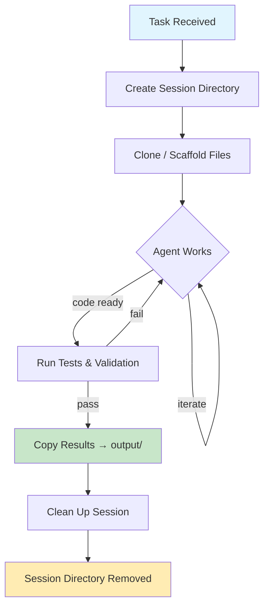
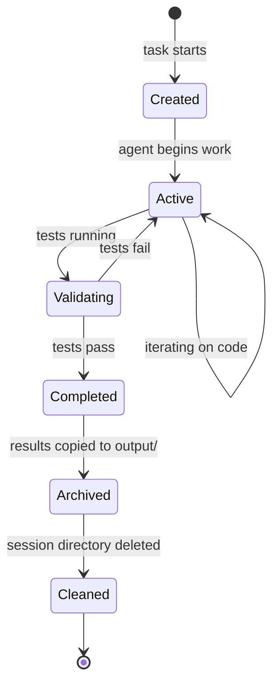

# Workspace Directory

Scratch area where AI coding agents actively work on tasks. Each task session
gets its own isolated subdirectory so agents can clone repositories, write
intermediate files, and iterate without interfering with each other.

## Purpose

The workspace provides a **sandboxed environment** for agents. Unlike `output/`
(which holds final deliverables), workspace contains in-progress work that may
be incomplete, broken, or experimental. Think of it as the agent's desk — messy
while work is happening, cleaned up when the task is done.

## Session Structure

Each task creates a session directory named with a unique ID:

```
workspace/
├── session-a1b2c3d4/
│   ├── repo/               # Cloned repository
│   ├── scratch.py          # Experimental code
│   ├── notes.md            # Agent planning notes
│   └── .agent-state.json   # Internal agent state
├── session-e5f6g7h8/
│   ├── src/
│   ├── tests/
│   └── build.log
└── session-i9j0k1l2/
    └── ...
```

## What Files Appear Here

| Category | Examples | Purpose |
|----------|----------|---------|
| Cloned repos | `repo/`, `src/` | Local copy of target repository |
| Draft code | `*.py`, `*.js`, `*.ts` | Work-in-progress source files |
| Build artifacts | `build.log`, `*.o`, `dist/` | Compilation and bundling output |
| Agent metadata | `.agent-state.json` | Internal bookkeeping for the agent |
| Temp files | `*.tmp`, `*.bak` | Throwaway intermediates |
| Test results | `test-output.xml`, `coverage/` | Test run artifacts |

## Task Lifecycle



## Workspace Lifecycle States



## Cleanup Policy

| Trigger | Action |
|---------|--------|
| Task completes successfully | Final artifacts moved to `output/`, session dir deleted |
| Task fails or is cancelled | Session dir retained for debugging (auto-pruned after 7 days) |
| Manual cleanup | `rm -rf workspace/session-*` |
| Full reset | `rm -rf workspace/* && touch workspace/.gitkeep` |

Sessions are **ephemeral by design**. Do not rely on workspace contents
persisting across restarts or after a task completes.

## Inspecting Active Work

```bash
# List active sessions
ls -lt workspace/

# Watch an agent's progress
tail -f workspace/session-a1b2c3d4/build.log

# Check agent state
cat workspace/session-a1b2c3d4/.agent-state.json | python -m json.tool
```

## Notes

- Each session is **isolated** — agents do not share workspace directories.
- Workspace directories can grow large if agents clone full repositories.
  Monitor disk usage during long-running tasks.
- The workspace is on the **local filesystem only** — it is not synced,
  backed up, or replicated.
- If a session directory is unexpectedly missing, the task likely completed
  and the directory was cleaned up. Check `output/` for results.
